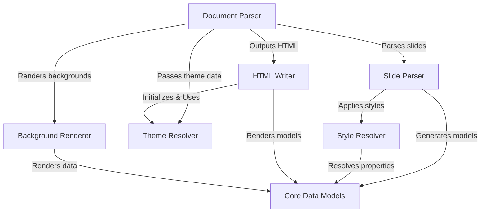
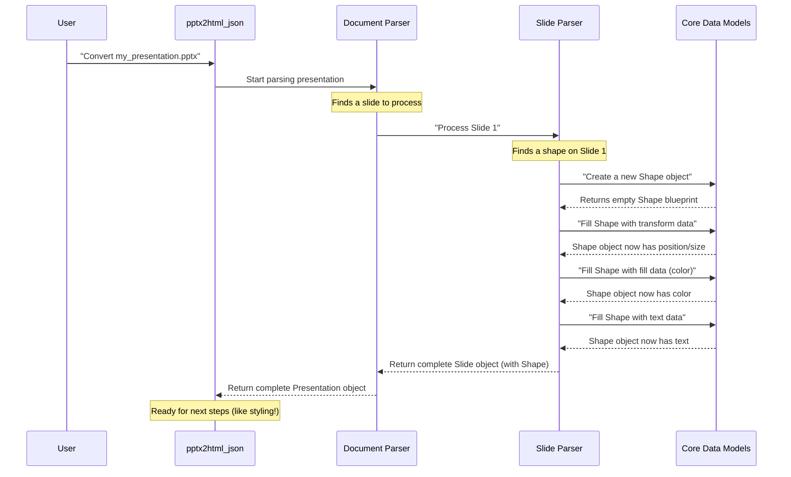
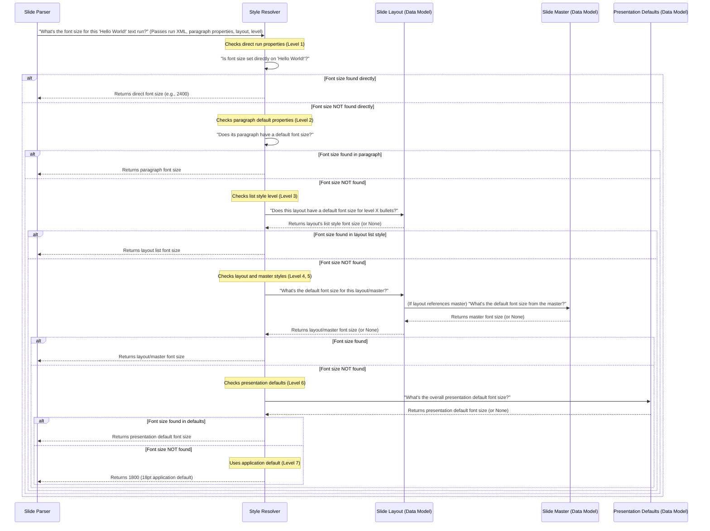
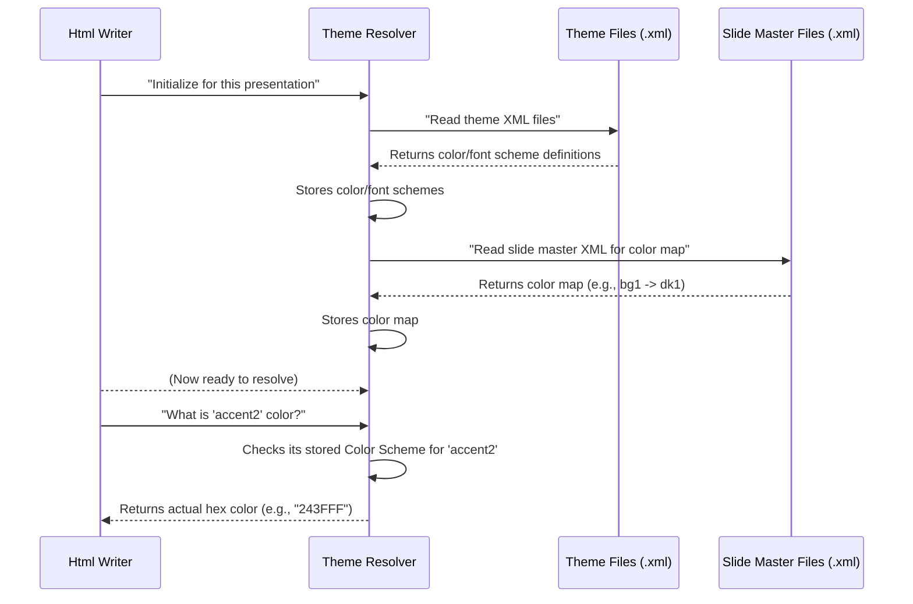
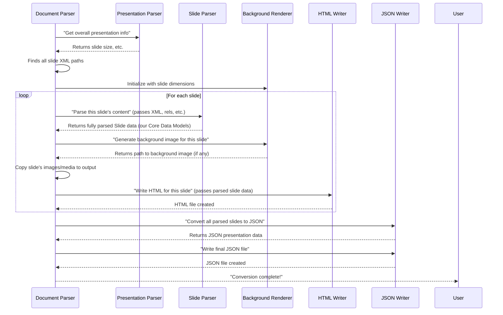
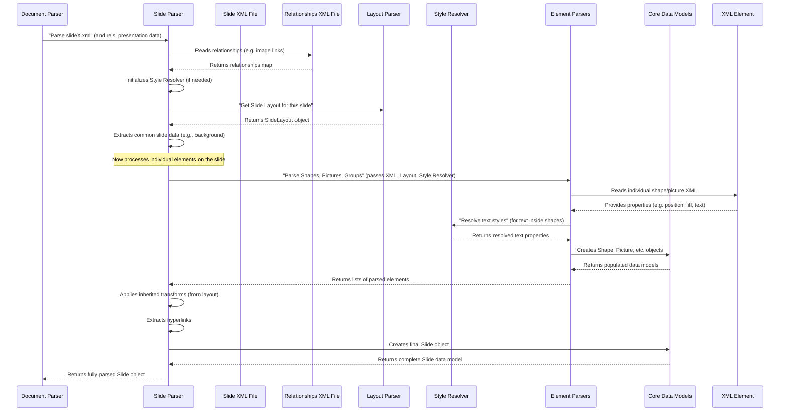
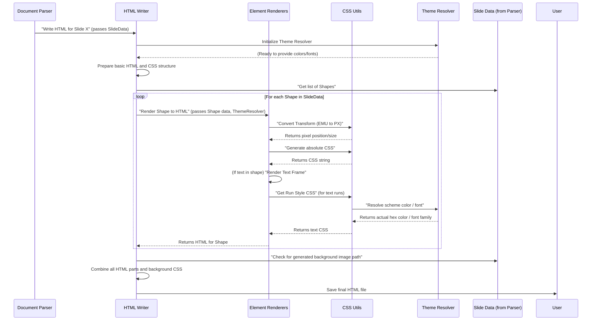
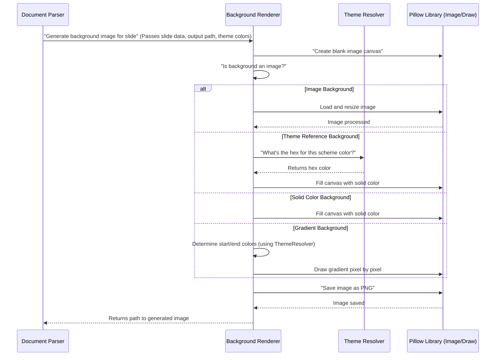

# Tutorial: pptx2html_json

`pptx2html_json` is a powerful project designed to **convert PowerPoint presentations** (PPTX files) into web-friendly formats, specifically **HTML and JSON**. It functions by *unzipping* the PPTX, *parsing* its internal XML structure to extract all slide elements and styles, and then *rendering* these into a structured web output, making your presentations easily viewable on any browser.


## Visual Overview



## Chapters

1. [Core Data Models
](01_core_data_models_.md)
2. [Style Resolver
](02_style_resolver_.md)
3. [Theme Resolver
](03_theme_resolver_.md)
4. [Document Parser
](04_document_parser_.md)
5. [Slide Parser
](05_slide_parser_.md)
6. [HTML Writer
](06_html_writer_.md)
7. [Background Renderer
](07_background_renderer_.md)

---

<sub><sup>Generated by [AI Codebase Knowledge Builder](https://github.com/The-Pocket/Tutorial-Codebase-Knowledge).</sup></sub>

# Chapter 1: Core Data Models

Welcome to the very first chapter of our `pptx2html_json` tutorial! We're going to explore how we take the complex information inside a PowerPoint file and turn it into something simple and organized that our computer program can understand.

### What's the Big Idea?

Imagine you have a big LEGO set. Before you can build anything cool, you need to know what each piece *is*. Is it a square brick? A round plate? A small figure? If you just had a pile of random plastic, it would be impossible to build the spaceship on the box!

PowerPoint files are similar. They're full of "pieces": slides, text boxes, images, shapes, colors, fonts, and more. For our `pptx2html_json` tool to convert a PowerPoint presentation into a nice, structured JSON format (which can then be easily turned into HTML), we first need a clear way to *define* and *store* what each of these pieces *is*.

This is where "Core Data Models" come in. They are like **blueprints** or **definitions** for all the different parts of a PowerPoint slide. They define exactly what information we care about for a text box, an image, or a simple shape.

### Our Goal: Understanding the Building Blocks

Let's take a simple example: How would you describe "a red square with the text 'Hello World!' inside, located at a specific spot on the slide"? In a PowerPoint file, this information is scattered. Our Core Data Models help us gather it all into neat, easy-to-use packages.

By the end of this chapter, you'll understand how we represent these "pieces" of a PowerPoint slide as data in our code.

---

### Diving into the Blueprints: What are Data Models?

In Python, we use something called `dataclasses` to create these blueprints. Think of a `dataclass` as a simple template for holding data. It's like filling out a form: you have fields for "name", "address", "phone number", etc.

Let's look at some of the most fundamental blueprints in our `src/learnx_parser/models/core.py` file.

#### 1. The `Transform` Blueprint: Where is it and How Big?

Almost every visual item on a slide (shapes, pictures, text boxes) has a position, size, and maybe rotation. The `Transform` model captures this:

```python
from dataclasses import dataclass

@dataclass
class Transform:
    x: int = 0  # Horizontal position
    y: int = 0  # Vertical position
    cx: int = 0 # Width
    cy: int = 0 # Height
    rot: int = 0 # Rotation angle
    # ... more fields for advanced transformations
```

This `Transform` blueprint tells us: "Any object that uses this blueprint will have an `x`, `y` (position), `cx`, `cy` (size), and `rot` (rotation) value." The `= 0` part means if we don't specify these, they'll default to zero.

**How to use it:**

```python
# Create a Transform object for something at (100, 50) with size (200, 150)
my_shape_location = Transform(x=100, y=50, cx=200, cy=150)

print(f"Shape is at ({my_shape_location.x}, {my_shape_location.y})")
# Output: Shape is at (100, 50)
```

#### 2. The `Fill` Blueprints: How is it Colored?

Shapes can be filled with a solid color, a gradient (smooth color transition), an image, or a pattern. We have different blueprints for each:

```python
@dataclass
class SolidFill:
    color: str | None = None # Hex color code (e.g., "FF0000" for red)

@dataclass
class GradientStop: # Part of a gradient
    pos: int
    color: str | None = None

@dataclass
class GradientFill: # A fill with multiple color stops
    stops: list[GradientStop] # List of gradient stops
    angle: int | None = None

# ... BlipFill (for image fills), PatternFill (for patterns)

# A special trick: 'Fill' can be ANY of these!
Fill = SolidFill | GradientFill | BlipFill | PatternFill
```

The `Fill = SolidFill | GradientFill | BlipFill | PatternFill` line is super useful! It means that whenever we say something has a `Fill`, it could be *either* a `SolidFill`, *or* a `GradientFill`, *or* a `BlipFill`, *or* a `PatternFill`. This is like saying a "Vehicle" can be a "Car" or a "Truck" or a "Bike."

**How to use it:**

```python
# Create a solid red fill
red_fill = SolidFill(color="FF0000")

# Create a gradient from blue to green
blue_to_green_gradient = GradientFill(
    stops=[
        GradientStop(pos=0, color="0000FF"), # Blue at the start
        GradientStop(pos=100000, color="00FF00") # Green at the end (100000 is 100%)
    ],
    angle=90000 # 90 degrees
)
```

#### 3. Text Blueprints: `RunProperties`, `TextRun`, `Paragraph`, `TextFrame`

Text is often complex, with different parts of the same sentence having different fonts, sizes, or colors.

*   `RunProperties`: Defines how a small piece of text *looks* (bold, italic, font size).
*   `TextRun`: The actual text itself, combined with its `RunProperties`.
*   `ParagraphProperties`: Defines how a whole paragraph *behaves* (alignment, bullet points).
*   `Paragraph`: A collection of `TextRun`s and its `ParagraphProperties`.
*   `TextFrame`: The container for one or more `Paragraph`s, like a text box.

```python
@dataclass
class RunProperties:
    font_size: int | None = None # Like 1800 (for 18pt)
    bold: bool = False
    color: str | None = None

@dataclass
class TextRun:
    text: str # The actual words, e.g., "Hello"
    properties: RunProperties # How "Hello" looks

@dataclass
class Paragraph:
    text_runs: list[TextRun] # List of text pieces in this paragraph
    # ... more paragraph properties

@dataclass
class TextFrame:
    paragraphs: list[Paragraph] # All paragraphs in this text box
    # ... more text frame properties
```

**How to use it:**

```python
# Create properties for "Hello" to be bold and blue
bold_blue_props = RunProperties(bold=True, color="0000FF")
hello_run = TextRun(text="Hello ", properties=bold_blue_props)

# Create properties for "World!" to be just normal text
world_run = TextRun(text="World!")

# Put them into a paragraph
my_paragraph = Paragraph(text_runs=[hello_run, world_run])

# Put the paragraph into a text frame (a text box)
my_text_frame = TextFrame(paragraphs=[my_paragraph])
```

#### 4. The `Shape` Blueprint: Putting it all Together

Now, let's create our "red square with 'Hello World!' inside." We'll use the `Shape` blueprint:

```python
@dataclass
class Shape:
    type: str # e.g., "rectangle", "circle"
    id: str | None = None # Unique ID
    name: str | None = None # Optional name
    transform: Transform # Its position and size
    fill: Fill | None = None # Its color/fill
    line: Any | None = None # Its border (we'll cover 'Line' later)
    text_frame: TextFrame | None = None # Any text inside it
    # ... other shape-specific properties
```

**How to solve our use case:**

```python
# 1. Define where the square is and how big
square_transform = Transform(x=100, y=100, cx=200, cy=200) # At (100,100), 200x200

# 2. Define its red color
red_fill = SolidFill(color="FF0000")

# 3. Define the text "Hello World!" as we did before
bold_blue_props = RunProperties(bold=True, color="0000FF")
hello_run = TextRun(text="Hello ", properties=bold_blue_props)
world_run = TextRun(text="World!")
my_paragraph = Paragraph(text_runs=[hello_run, world_run])
my_text_frame = TextFrame(paragraphs=[my_paragraph])

# 4. Create the Shape!
red_square_with_text = Shape(
    type="rectangle", # It's a rectangle shape
    name="My Red Square",
    transform=square_transform,
    fill=red_fill,
    text_frame=my_text_frame
)

print(f"Shape name: {red_square_with_text.name}")
print(f"Shape fill color: {red_square_with_text.fill.color}") # Accessing fill property
print(f"Shape text: {red_square_with_text.text_frame.paragraphs[0].text_runs[0].text}")
# Output:
# Shape name: My Red Square
# Shape fill color: FF0000
# Shape text: Hello
```

This simple code demonstrates how we build up complex objects using smaller, well-defined data models.

#### Other Important Blueprints:

*   **`Picture`**: For images on a slide. It mostly contains a `Transform` and a `path` to the image file.
*   **`GroupShape`**: Sometimes, multiple shapes are grouped together (e.g., a "company logo" might be text and an image). This blueprint holds a list of other shapes and pictures.
*   **`Slide`**: This is the top-level blueprint for a single slide. It holds a list of all `Shape`s, `Picture`s, `GroupShape`s, etc., that are on that slide. It also contains `CommonSlideData` for background details.
*   **`SlideLayout` and `SlideMaster`**: These are blueprints for the *templates* that slides use. They contain default properties and placeholder information, which are also defined using these core data models. They are crucial for inheriting styles, which we'll discuss in later chapters.
*   **`JsonElement`, `JsonSlide`, `JsonPresentation`**: These are *simplified* versions of our data models. After we've extracted all the complex information from PowerPoint into our `Shape`, `Slide`, etc., objects, we then convert them into these even simpler JSON-friendly models. These are designed purely for the final output, making it easy to generate HTML.

---

### How `pptx2html_json` Uses These Models (Under the Hood)

You might be wondering: "Okay, I see these blueprints, but how does the program actually *fill them* with data from a PowerPoint file?"

The process is like this:

1.  **Reading the File:** When you tell `pptx2html_json` to process a PowerPoint file, it starts by opening and reading the raw data.
2.  **Parsing and Extracting:** Specialized parts of the code (like the [Document Parser](04_document_parser_.md) and [Slide Parser](05_slide_parser_.md)) go through the PowerPoint file's internal structure. They find a shape, then its position, then its color, then its text.
3.  **Filling the Blueprints:** As they find this information, they create instances of our `Transform`, `SolidFill`, `TextFrame`, and `Shape` blueprints and fill them with the extracted data.

Here's a simplified sequence of how our tool might process a single shape:



The core data models defined in `src/learnx_parser/models/core.py` (and some related ones in `src/learnx_parser/models/presentation.py`) are simply passive containers for this information. They don't *do* anything themselves; they just *hold* the data in a structured way.

For example, when the [Slide Parser](05_slide_parser_.md) needs to represent a shape, it internally knows to create a `Shape` object and populate its fields:

```python
# From src/learnx_parser/models/core.py (a snippet of the Shape definition)
@dataclass
class Shape:
    type: str # e.g., "rectangle"
    id: str | None = None
    name: str | None = None
    transform: Transform # This is a Transform object
    fill: Fill | None = None # This is a SolidFill, GradientFill, etc.
    text_frame: TextFrame | None = None # This is a TextFrame object
    # ... many more fields
```

You can see how `Shape` itself contains other core data models like `Transform`, `Fill`, and `TextFrame`. It's like building a big LEGO model out of smaller, specialized LEGO bricks!

---

### Conclusion

In this chapter, we've learned that "Core Data Models" are the essential blueprints for representing all the different pieces of a PowerPoint slide in our `pptx2html_json` project. They help us take messy, complex PowerPoint data and store it in simple, organized Python objects using `dataclasses`. This clear structure is fundamental to everything else we do.

We saw how basic elements like `Transform` (position/size) and `Fill` (color) are defined, and how more complex elements like `TextFrame` and `Shape` are built from these smaller parts.

Now that we have a clear way to *represent* all the information from a PowerPoint slide, the next challenge is to figure out what colors, fonts, and sizes apply to these elements. This is where the [Style Resolver](02_style_resolver_.md) comes in.

---

<sub><sup>Generated by [AI Codebase Knowledge Builder](https://github.com/The-Pocket/Tutorial-Codebase-Knowledge).</sup></sub> <sub><sup>**References**: [[1]](https://github.com/YatinKare/pptx2html_json/blob/db4ee366badcc9de5d34b0873d8a97a1ec6b617e/src/learnx_parser/models/core.py), [[2]](https://github.com/YatinKare/pptx2html_json/blob/db4ee366badcc9de5d34b0873d8a97a1ec6b617e/src/learnx_parser/models/presentation.py)</sup></sub>

# Chapter 2: Style Resolver

Welcome back! In [Chapter 1: Core Data Models](01_core_data_models_.md), we learned how `pptx2html_json` uses "blueprints" called data models to organize all the information from a PowerPoint file. We now have neat `Shape`, `Paragraph`, and `TextRun` objects that hold pieces of data.

But here's a common challenge: PowerPoint lets you set styles in many places. You might have a default font size for the whole presentation, a different one for a specific slide master, yet another for a slide layout, and then you can change the size of a single word directly on the slide! When something has styles coming from so many directions, how do we know what its *final* appearance should be? What color is it? What font size? Is it bold? Does it have a bullet point?

### What's the Big Idea? Solving the Style Puzzle

Imagine you're trying to figure out what a new puppy's name is.
*   First, you ask the puppy's new owner (the *most specific* source).
*   If they haven't named it yet, you might check if the previous owner gave it a temporary name (a *less specific* default).
*   If not, maybe there's a common default name for puppies from that breeder (even *less specific*).

PowerPoint styles work similarly, but with many more layers! A piece of text inherits its look (like font size, color, or whether it's a bullet point) from a complex hierarchy.

Our `pptx2html_json` tool needs a "rulebook" to decide which style wins. This is precisely what the **Style Resolver** does. It's like a detective that looks at all the possible style influences and, using a strict set of rules, figures out the *one true style* for every piece of text or element.

**Our Goal:** By the end of this chapter, you'll understand how the Style Resolver takes potentially conflicting style information from a PowerPoint file and produces the correct, final style for text elements.

---

### The Style Hierarchy: PowerPoint's Rulebook

PowerPoint has a very specific order for applying styles. Think of it as a set of rules, where more specific rules always override more general ones. The Style Resolver follows these rules diligently:

| Priority | Style Source (Most Specific to Most General) | What it Means                                             | Example                                                                     |
| :------- | :------------------------------------------- | :--------------------------------------------------------- | :-------------------------------------------------------------------------- |
| **1st**  | **Direct Element**                           | Styles applied *directly* to a specific word or sentence.  | Making a single word "bold" on a slide. This always wins.                 |
| **2nd**  | **Paragraph Defaults**                       | Styles applied to an entire paragraph.                     | Setting a paragraph to be centered.                                         |
| **3rd**  | **List Style Level**                         | If it's a bullet point, styles for that specific level.    | The first-level bullet uses a circle, but the second-level uses a square. |
| **4th**  | **Slide Layout**                             | Styles defined by the *template* used for that specific slide (e.g., "Title and Content"). | The default font size for a "Title" placeholder on *this* layout.         |
| **5th**  | **Slide Master**                             | Styles defined by the overall master template that the layout uses. | The corporate font for all headings, defined once in the master.          |
| **6th**  | **Presentation Defaults (Theme)**            | Overall default styles for the entire PowerPoint file.     | If nothing else is specified, all text is 18pt Arial.                     |
| **7th**  | **Application Default**                      | A fallback value (e.g., 18pt font size) if no other rule applies. | If the file says nothing about font size, PowerPoint uses its own default. |

The Style Resolver's job is to go through this list, starting from the most specific (1st) and moving down. The *first* style it finds for a particular property (like font size) is the one it uses, and it stops looking for that property.

---

### How to Use the Style Resolver: Our Detective at Work

Let's trace how the Style Resolver helps us figure out the font size of a `TextRun` (a small piece of text, like a single word).

In [Chapter 1](01_core_data_models_.md), we saw that `TextRun` has `properties` of type `RunProperties`. The `StyleResolver` is what fills in these properties correctly.

The main functions that use the `StyleResolver` are in `src/learnx_parser/parsers/slide/text.py`. When `pptx2html_json` is processing a slide, specifically when it's extracting text, it calls the Style Resolver.

Here's how it's used to determine properties for a `TextRun`:

```python
# From src/learnx_parser/parsers/slide/text.py (simplified)
def extract_run_properties(
    parser_instance,
    run_element, # The XML for the text run
    slide_layout_obj, # Our SlideLayout data model
    ph_type, # Placeholder type (e.g., "title", "body")
    paragraph_level, # Bullet level (e.g., 0 for first level)
    paragraph_properties_element, # XML for paragraph properties
    resolved_paragraph_properties, # Already resolved ParagraphProperties
    style_resolver, # The StyleResolver instance!
) -> RunProperties:

    if style_resolver:
        # Ask the Style Resolver to figure out the final properties!
        run_properties = style_resolver.resolve_run_properties(
            run_element,
            resolved_paragraph_properties,
            slide_layout_obj,
            paragraph_level
        )
        return run_properties
    # ... (old logic if no style_resolver, not shown)
```
In this snippet, `extract_run_properties` (which is part of the [Slide Parser](05_slide_parser_.md)) doesn't try to figure out the style itself. Instead, it gathers all the necessary information (the XML for the `TextRun`, the `SlideLayout` object, the `paragraph_level`, etc.) and hands it over to the `style_resolver`. The `style_resolver` then does all the hard work and returns a fully resolved `RunProperties` object.

Similarly, for a whole `Paragraph`'s properties:

```python
# From src/learnx_parser/parsers/slide/text.py (simplified)
def extract_paragraph_properties(
    parser_instance,
    paragraph_element, # The XML for the paragraph
    slide_layout_obj, # Our SlideLayout data model
    ph_type, # Placeholder type
    style_resolver, # The StyleResolver instance!
) -> Paragraph:

    paragraph_object = Paragraph()
    current_level = None # Determined from XML
    # ... logic to get current_level from paragraph_element ...

    if style_resolver:
        # Let the Style Resolver determine bullet type, alignment, etc.
        paragraph_object.properties = style_resolver.resolve_paragraph_properties(
            paragraph_element,
            slide_layout_obj,
            ph_type,
            current_level
        )
        # Any properties *directly* on the paragraph element still override
        if paragraph_element.find(".//a:pPr", namespaces=parser_instance.nsmap) is not None:
             # Example: Check for direct alignment
            direct_align = paragraph_element.find(".//a:pPr", namespaces=parser_instance.nsmap).get("algn")
            if direct_align:
                paragraph_object.properties.align = direct_align
    # ... rest of the function
    return paragraph_object
```
Here, `extract_paragraph_properties` asks the `style_resolver` to resolve the `ParagraphProperties` (like bullet type or default alignment). It then applies any *direct* overrides found in the paragraph's XML (which corresponds to the "Direct Element" rule in our hierarchy table).

---

### Under the Hood: How the Detective Works Step-by-Step

Let's imagine our program is processing a text box. It finds a paragraph, and within that paragraph, it finds a `TextRun` saying "Hello World!". The program needs to know the exact font size for "Hello World!".

Here's a simplified sequence of how `pptx2html_json` would use the Style Resolver:



This diagram shows how the Style Resolver systematically checks each level, from most specific to most general, until it finds a value for the property it's looking for.

### Delving into the Code: `StyleResolver` Class

The core logic for resolving styles lives in the `StyleResolver` class, found in `src/learnx_parser/services/style_resolver.py`.

It's initialized with the global defaults it might need:

```python
# From src/learnx_parser/services/style_resolver.py (simplified)
class StyleResolver:
    def __init__(
        self,
        slide_master, # Our SlideMaster data model object
        presentation_defaults # Our PresentationDefaults data model object
    ):
        self.slide_master = slide_master
        self.presentation_defaults = presentation_defaults
```
The `slide_master` and `presentation_defaults` objects are instances of our [Core Data Models](01_core_data_models_.md) and contain all the pre-parsed information from those higher-level PowerPoint structures.

Let's look at a *very simplified* example of how `resolve_run_properties` might determine the `font_size`. This highlights the layered checking:

```python
# From src/learnx_parser/services/style_resolver.py (simplified snippet)
def resolve_run_properties(
    self,
    run_element, # XML element for the text run
    paragraph_properties, # Resolved ParagraphProperties
    slide_layout, # SlideLayout data model
    list_level # Paragraph level (0-based)
) -> RunProperties:

    resolved_run_props = RunProperties()

    # Level 7: Application Default (Lowest priority)
    resolved_run_props.font_size = 1800 # Default to 18pt

    # Level 6: Presentation Default
    if (self.presentation_defaults and
        self.presentation_defaults.default_run_properties and
        self.presentation_defaults.default_run_properties.font_size is not None):
        resolved_run_props.font_size = self.presentation_defaults.default_run_properties.font_size

    # Level 5 & 4: Layout/Master Style (simplified)
    # The actual code has more complex logic here involving placeholder types
    if slide_layout and slide_layout.title_style and slide_layout.title_style.default_run_properties:
        if slide_layout.title_style.default_run_properties.font_size is not None:
            resolved_run_props.font_size = slide_layout.title_style.default_run_properties.font_size
    # ... more checks for body_style, other_style for layout and master

    # Level 3: List Style Level
    if slide_layout and slide_layout.list_styles and list_level is not None:
        if list_level in slide_layout.list_styles:
            level_style = slide_layout.list_styles[list_level]
            if (level_style and level_style.default_run_properties and
                level_style.default_run_properties.font_size is not None):
                resolved_run_props.font_size = level_style.default_run_properties.font_size

    # Level 2: Paragraph-Level Default
    if (paragraph_properties and
        paragraph_properties.default_run_properties and
        paragraph_properties.default_run_properties.font_size is not None):
        resolved_run_props.font_size = paragraph_properties.default_run_properties.font_size

    # Level 1: Direct Run Properties (Highest priority)
    # Check the XML for a direct font size override
    if run_element is not None and run_element.get("sz") is not None:
        resolved_run_props.font_size = int(run_element.get("sz")) # This value wins!

    return resolved_run_props
```
As you can see, the code starts with the lowest priority default (application default) and then systematically overrides it if a more specific style is found. This ensures that the final `font_size` (and other properties) is always the correct one, following PowerPoint's complex inheritance rules.

The `resolve_paragraph_properties` method works in a similar fashion for paragraph-level attributes like `bullet_type`:

```python
# From src/learnx_parser/services/style_resolver.py (simplified snippet)
def resolve_paragraph_properties(
    self,
    p_element, # XML element for the paragraph
    slide_layout, # SlideLayout data model
    ph_type, # Placeholder type
    p_level # Paragraph level
) -> ParagraphProperties:

    resolved_props = ParagraphProperties()

    # Check for specific "no bullet" override (Highest priority for bullets)
    if p_element is not None:
        nsmap = getattr(p_element, 'nsmap', {})
        p_pr_element = p_element.find(".//a:pPr", namespaces=nsmap)
        if p_pr_element is not None:
            if p_pr_element.find(".//a:buNone", namespaces=nsmap) is not None:
                resolved_props.bullet_type = "none" # Explicitly no bullet wins!
                return resolved_props # No need to check further for bullet type

    # Check paragraph's direct bullet definition (e.g., <a:buChar>)
    if p_element is not None:
        # ... logic to check for buChar, buAutoNum, buBlip ...
        # If found, populate resolved_props.bullet_type and related fields
        # return resolved_props # and return immediately

    # Check slide layout's list styles for this level
    if slide_layout and slide_layout.list_styles and p_level is not None:
        if p_level in slide_layout.list_styles:
            layout_style = slide_layout.list_styles[p_level]
            if layout_style and layout_style.bullet_type:
                resolved_props.bullet_type = layout_style.bullet_type
                # ... also copy bullet_char, font_face etc. from layout_style

    # Check slide master's list styles for this level
    if (slide_layout and slide_layout.slide_master and
        slide_layout.slide_master.list_styles and p_level is not None):
        if p_level in slide_layout.slide_master.list_styles:
            master_style = slide_layout.slide_master.list_styles[p_level]
            if master_style and master_style.bullet_type:
                resolved_props.bullet_type = master_style.bullet_type
                # ... also copy bullet_char, font_face etc. from master_style

    # Check presentation defaults for this level
    if (self.presentation_defaults and
        self.presentation_defaults.list_styles and p_level is not None):
        if p_level in self.presentation_defaults.list_styles:
            default_style = self.presentation_defaults.list_styles[p_level]
            if default_style and default_style.bullet_type:
                resolved_props.bullet_type = default_style.bullet_type
                # ... also copy bullet_char, font_face etc. from default_style

    # If no bullet found and it's a list item, default to a character bullet
    if p_level is not None and resolved_props.bullet_type is None:
        resolved_props.bullet_type = "char"
        resolved_props.bullet_char = "•" # Common default bullet

    return resolved_props
```
This simplified example shows how the `StyleResolver` uses the hierarchical approach to determine the final bullet type for a paragraph. Notice how finding a `buNone` (no bullet) XML tag on the paragraph itself immediately stops the search for other bullet styles, as it's the most specific override.

---

### Conclusion

In this chapter, we explored the crucial role of the **Style Resolver** in `pptx2html_json`. We learned that PowerPoint's styling is a multi-layered system, and the Style Resolver acts as the "rulebook" or "detective" to determine the final, correct appearance of text elements. It systematically checks styles from the most specific (direct application) to the most general (presentation defaults), ensuring accuracy.

Now that we understand how styles are *resolved*, the next step is to understand *what* those styles actually mean. For example, what color is "Accent 1" or what font is "Major Theme Font"? This is where the [Theme Resolver](03_theme_resolver_.md) comes in.

[Chapter 3: Theme Resolver](03_theme_resolver_.md)

---

<sub><sup>Generated by [AI Codebase Knowledge Builder](https://github.com/The-Pocket/Tutorial-Codebase-Knowledge).</sup></sub> <sub><sup>**References**: [[1]](https://github.com/YatinKare/pptx2html_json/blob/db4ee366badcc9de5d34b0873d8a97a1ec6b617e/src/learnx_parser/parsers/slide/text.py), [[2]](https://github.com/YatinKare/pptx2html_json/blob/db4ee366badcc9de5d34b0873d8a97a1ec6b617e/src/learnx_parser/services/style_resolver.py)</sup></sub>

# Chapter 3: Theme Resolver

Welcome back! In [Chapter 2: Style Resolver](02_style_resolver_.md), we learned how `pptx2html_json` acts like a detective, figuring out the *final* appearance of text (like font size or bold style) by applying PowerPoint's specific style hierarchy. It tells us that a piece of text is "18pt" or "blue."

But wait, what if the PowerPoint file says "Use `Accent 1` color" or "Use `Major Theme Font`"? The Style Resolver tells us that the text *wants* to be `Accent 1` color, but it doesn't tell us what `Accent 1` actually *is* in terms of a real color code like `#FF0000` (red), or what "Major Theme Font" means in terms of a font family like "Calibri" or "Arial."

### What's the Big Idea? Unlocking Theme Secrets

Imagine you're trying to bake a cake, and the recipe says "add a dash of 'Sky Blue' food coloring" or "use 'Grandma's Favorite' flour." You know *what* to add, but you don't know the *exact amount* of blue or the *specific type* of flour!

PowerPoint presentations are full of these "theme" references. Instead of always saying `#FF0000` for red, they might say `accent1`. Or instead of "Calibri," they might say `minor font`. This is because a user can change the *entire theme* of a presentation (e.g., from "Office Theme" to "Facet Theme"), and all those `Accent 1` colors and `Major Theme Font`s will automatically update to new, different values.

Our `pptx2html_json` tool needs to know what these "theme" names *actually mean* in the specific presentation it's converting. This is precisely what the **Theme Resolver** does. It's like a special dictionary or an interpreter that reads the PowerPoint's theme information and translates `Accent 1` into its actual hex code, or `Major Theme Font` into its actual font family.

**Our Goal:** By the end of this chapter, you'll understand how the Theme Resolver finds the real colors and fonts that make up a PowerPoint presentation's design.

---

### The Theme's Building Blocks

A PowerPoint theme is defined by a few core components:

| Theme Component | What it Defines                                         | Example                                                                     |
| :-------------- | :------------------------------------------------------ | :-------------------------------------------------------------------------- |
| **Color Scheme** | A set of named colors (like `accent1`, `bg1`, `tx1`) and their specific hex values. | `accent1` could be `#4472C4` (a shade of blue), `tx1` could be `#000000` (black). |
| **Font Scheme** | A set of named fonts (`major font`, `minor font`) and their specific font family names. | `major font` could be "Calibri Light", `minor font` could be "Calibri". |
| **Background Fill Styles** | Pre-defined ways backgrounds look, often referencing colors from the Color Scheme. | "Background Style 1" might be a solid fill using `bg1` color. |
| **Color Transformations** | Ways to modify a color (e.g., `tint`, `shade`, `luminance modulation`). | Make `accent1` 20% lighter (`tint` by 20%).                                |
| **Color Map (from Slide Master)** | A special mapping that can change what a theme color name actually *points to*. | `bg1` might normally map to `dk1` (dark 1), but the slide master could map it to `lt1` (light 1) instead. This is rare but important. |

The `ThemeResolver` reads all this information from special XML files inside the PowerPoint presentation.

---

### How to Use the Theme Resolver: Getting the Real Values

The `ThemeResolver` is usually initialized once, right after the PowerPoint file is unpacked. This happens in the `HtmlWriter` (which you can read about in [Chapter 6: HTML Writer](06_html_writer_.md)) because the HTML output needs to know the true colors and fonts.

```python
# From src/learnx_parser/writers/html_writer.py (simplified)
from learnx_parser.writers.theme_resolver import ThemeResolver

class HtmlWriter:
    def __init__(self, output_directory="./output", pptx_unpacked_path=None):
        # ... other initializations ...
        self.theme_resolver = None
        if pptx_unpacked_path:
            try:
                # This is where the ThemeResolver gets created!
                self.theme_resolver = ThemeResolver(pptx_unpacked_path)
                
                # It also loads a special 'color map' from the slide master
                # which can change what theme colors mean.
                master_path = os.path.join(pptx_unpacked_path, "ppt", "slideMasters", "slideMaster1.xml")
                if os.path.exists(master_path):
                    self.theme_resolver.load_slide_master_color_map(master_path)
            except Exception as e:
                print(f"Warning: Could not initialize theme resolver: {e}")
                self.theme_resolver = None
```
Once `self.theme_resolver` is set up, other parts of the program can ask it for real colors and fonts.

**Example Use Case: Getting "Accent 2" Color and "Major" Font**

Imagine a shape needs to be `Accent 2` color, and its text needs `Major Theme Font`.

```python
# Assuming you have a theme_resolver instance
# For example, in BackgroundRenderer or ElementRenderers
# (simplified for illustration)

# 1. Get the actual hex code for "accent2"
accent2_hex_color = theme_resolver.resolve_scheme_color("accent2")
print(f"Accent 2 is: #{accent2_hex_color}")
# Output (might be different based on theme): Accent 2 is: #243FFF

# 2. Get the actual font family for "major" font
major_font_family = theme_resolver.get_font_family("major")
print(f"Major Theme Font is: {major_font_family}")
# Output (might be different based on theme): Major Theme Font is: Calibri Light
```
This is how `pptx2html_json` gets the concrete values needed to generate accurate HTML and CSS. The `BackgroundRenderer` (from `src/learnx_parser/services/background_renderer.py`) also uses the Theme Resolver to get actual colors for slide backgrounds:

```python
# From src/learnx_parser/services/background_renderer.py (simplified snippet)
class BackgroundRenderer:
    # ... __init__ and other methods ...

    def _render_background_reference(
        self, 
        draw: ImageDraw.ImageDraw, 
        bg_ref: BackgroundReference,
        theme_colors: dict | None = None # This dict comes from ThemeResolver!
    ) -> bool:
        """Render background from theme reference."""
        if bg_ref.scheme_color and theme_colors:
            # Here, 'theme_colors' already contains the resolved hex values
            # obtained from the ThemeResolver.
            color = theme_colors.get(bg_ref.scheme_color, "#000000")
            # ... use color to draw ...
            return True
        return False

    def _resolve_color(
        self, 
        color: str | None, 
        scheme_color: str | None, 
        theme_colors: dict | None # This is the ThemeResolver's output
    ) -> str | None:
        """Resolve color from direct color or scheme color."""
        if color:
            return color if color.startswith("#") else f"#{color}"
        
        if scheme_color and theme_colors:
            # Here, the BackgroundRenderer looks up the scheme_color in the
            # dictionary provided by the ThemeResolver.
            theme_color = theme_colors.get(scheme_color)
            if theme_color:
                return theme_color if theme_color.startswith("#") else f"#{theme_color}"
        # ... rest of the function ...
```
The `HtmlWriter`'s `_get_slide_background_color` also relies on the `theme_resolver` to get actual hex codes for background colors that are defined as `scheme_color` values.

---

### Under the Hood: How the Interpreter Works Step-by-Step

When `pptx2html_json` converts a presentation, the `ThemeResolver`'s job starts early to gather all the theme information.

Here's a simplified sequence of how the `ThemeResolver` gets ready and then helps translate a theme color:



The `ThemeResolver` is mainly in `src/learnx_parser/writers/theme_resolver.py`.

1.  **Loading the Theme (`_load_theme`):**
    The `ThemeResolver` first looks for XML files in the `ppt/theme/` folder within the unpacked PowerPoint directory. It prioritizes common theme files like `theme12.xml` (often associated with the "Galaxy" theme).

    ```python
    # From src/learnx_parser/writers/theme_resolver.py (simplified)
    class ThemeResolver:
        def __init__(self, pptx_unpacked_path: str):
            self.pptx_unpacked_path = pptx_unpacked_path
            self.color_scheme = ThemeColorScheme()
            self.font_scheme = ThemeFontScheme()
            # ... other initializations ...
            self._load_theme() # This is called during initialization

        def _load_theme(self):
            theme_dir = os.path.join(self.pptx_unpacked_path, "ppt", "theme")
            if not os.path.exists(theme_dir):
                return

            # Try to find common theme files
            theme_files = ["theme12.xml", "theme21.xml", "theme33.xml"]
            for filename in theme_files:
                theme_path = os.path.join(theme_dir, filename)
                if os.path.exists(theme_path):
                    self._parse_theme_file(theme_path) # Parses the found theme file
                    break # Use the first one found
    ```
    The `_parse_theme_file` then reads the XML to find `<a:clrScheme>` (color scheme), `<a:fontScheme>` (font scheme), and `<a:bgFillStyleLst>` (background fill styles).

2.  **Parsing Color Scheme (`_parse_color_scheme`):**
    Inside the theme XML, there's a section listing actual hex values for each theme color name:

    ```xml
    <!-- Simplified example from a theme XML -->
    <a:clrScheme name="Office">
        <a:dk1>
            <a:srgbClr val="000000"/> <!-- dk1 is black -->
        </a:dk1>
        <a:lt1>
            <a:srgbClr val="FFFFFF"/> <!-- lt1 is white -->
        </a:lt1>
        <a:accent1>
            <a:srgbClr val="4472C4"/> <!-- accent1 is a blue -->
        </a:accent1>
        <!-- ... more colors ... -->
    </a:clrScheme>
    ```
    The `_parse_color_scheme` method reads these values and stores them in the `ThemeColorScheme` object:

    ```python
    # From src/learnx_parser/writers/theme_resolver.py (simplified)
    class ThemeColorScheme:
        def __init__(self, name: str = ""):
            self.name = name
            # Default colors are set here, overridden by theme file
            self.colors = {
                "dk1": "000000",
                "lt1": "FFFFFF",
                "accent1": "FF0000",
                # ... etc.
            }
        def set_color(self, color_name: str, color_value: str):
            self.colors[color_name] = color_value

    class ThemeResolver:
        # ... other methods ...
        def _parse_color_scheme(self, color_scheme_elem, ns: dict[str, str]):
            # Finds <a:dk1>, <a:lt1>, <a:accent1> elements
            # and calls self.color_scheme.set_color to store their hex values.
            for color_name in ["dk1", "lt1", "accent1", ...]:
                color_elem = color_scheme_elem.find(f"a:{color_name}", ns)
                if color_elem is not None:
                    color_value = self._extract_color_value(color_elem, ns)
                    if color_value:
                        self.color_scheme.set_color(color_name, color_value)
    ```

3.  **Parsing Font Scheme (`_parse_font_scheme`):**
    Similarly, the font scheme defines major and minor fonts:

    ```xml
    <!-- Simplified example from a theme XML -->
    <a:fontScheme name="Office">
        <a:majorFont>
            <a:latin typeface="Calibri Light"/>
        </a:majorFont>
        <a:minorFont>
            <a:latin typeface="Calibri"/>
        </a:minorFont>
    </a:fontScheme>
    ```
    The `_parse_font_scheme` method reads these and stores them in `ThemeFontScheme`.

    ```python
    # From src/learnx_parser/writers/theme_resolver.py (simplified)
    class ThemeFontScheme:
        def __init__(self, name: str = ""):
            self.major_font = "Calibri"
            self.minor_font = "Calibri"
        def set_major_font(self, font_name: str):
            self.major_font = font_name
        def set_minor_font(self, font_name: str):
            self.minor_font = font_name

    class ThemeResolver:
        # ... other methods ...
        def _parse_font_scheme(self, font_scheme_elem, ns: dict[str, str]):
            # Finds <a:majorFont> and <a:minorFont> elements
            # and calls self.font_scheme.set_major_font / set_minor_font
            major_font_elem = font_scheme_elem.find("a:majorFont", ns)
            if major_font_elem is not None:
                latin_elem = major_font_elem.find("a:latin", ns)
                if latin_elem:
                    self.font_scheme.set_major_font(latin_elem.get("typeface"))
            # ... similar logic for minor font ...
    ```

4.  **Loading Slide Master Color Map (`load_slide_master_color_map`):**
    This is a subtle but important part. Sometimes, a slide master (a template for layouts) can *remap* the standard theme colors. For example, it might say "whenever `bg1` (background 1) is requested, actually use `dk1` (dark 1) from the theme."

    ```xml
    <!-- Simplified example from a slide master XML -->
    <p:clrMap bg1="dk1" tx1="lt1"/>
    ```
    This `clrMap` means that `bg1` should resolve to `dk1`'s value, and `tx1` should resolve to `lt1`'s value. The `ThemeResolver` loads this:

    ```python
    # From src/learnx_parser/writers/theme_resolver.py (simplified)
    class ThemeResolver:
        # ... other methods ...
        def load_slide_master_color_map(self, slide_master_path: str):
            # Reads the clrMap from the slide master XML
            # and stores it in self.color_map (e.g., {"bg1": "dk1", "tx1": "lt1"})
            # This map is used later during scheme color resolution.
            # Example: self.color_map["bg1"] would give "dk1"
            pass # (actual XML parsing omitted for brevity)
    ```

5.  **Resolving a Scheme Color (`resolve_scheme_color`):**
    When a component like the `HtmlWriter` or `BackgroundRenderer` needs the actual hex code for `bg1` or `accent2`, it calls `resolve_scheme_color`. This method first checks the `color_map` from the slide master, then looks up the actual hex value in the `color_scheme`, and finally applies any `ColorTransformations` (like tint or shade).

    ```python
    # From src/learnx_parser/writers/theme_resolver.py (simplified)
    class ThemeResolver:
        # ... other methods ...
        def resolve_scheme_color(
            self, scheme_color: str, transforms: list[ColorTransform] = None
        ) -> str:
            # 1. Check the color_map for any remapping (e.g., bg1 -> dk1)
            mapped_color = self.color_map.get(scheme_color, scheme_color)
            
            # 2. Get the base hex color from the stored color_scheme
            base_color = self.color_scheme.get_color(mapped_color)

            # 3. Apply any transformations (tint, shade, etc.)
            if transforms:
                result_color = base_color
                for transform in transforms:
                    result_color = transform.apply_to_color(result_color)
                return result_color

            return base_color
    ```
    The `ColorTransform` class itself knows how to apply things like `tint` (making a color lighter by blending with white) or `shade` (making a color darker by blending with black).

    ```python
    # From src/learnx_parser/writers/theme_resolver.py (simplified)
    class ColorTransform:
        def __init__(self, transform_type: str, value: int):
            self.transform_type = transform_type # e.g., "tint"
            self.value = value # Percentage * 1000 (e.g., 20000 for 20%)

        def apply_to_color(self, color: str) -> str:
            # Convert hex to RGB (e.g., "FF0000" -> (255, 0, 0))
            r, g, b = int(color[0:2], 16), int(color[2:4], 16), int(color[4:6], 16)
            
            factor = self.value / 100000.0 # Convert to decimal (e.g., 0.2 for 20%)

            if self.transform_type == "tint":
                # Blend with white (255, 255, 255)
                r = int(r + (255 - r) * factor)
                g = int(g + (255 - g) * factor)
                b = int(b + (255 - b) * factor)
            elif self.transform_type == "shade":
                # Blend with black (0, 0, 0)
                r = int(r * (1 - factor))
                g = int(g * (1 - factor))
                b = int(b * (1 - factor))
            # ... more transformation types ...

            # Clamp values and convert back to hex (e.g., (255, 0, 0) -> "FF0000")
            return f"{max(0, min(255, r)):02X}{max(0, min(255, g)):02X}{max(0, min(255, b)):02X}"
    ```

The `ThemeResolver` is the key to getting the precise, final visual properties that are defined at the presentation's core theme level. Without it, our converted HTML would use generic defaults instead of the specific colors and fonts chosen by the presentation's designer!

---

### Conclusion

In this chapter, we explored the vital role of the **Theme Resolver** in `pptx2html_json`. We learned that it acts as the "interpreter" for a PowerPoint presentation's theme, translating abstract names like `Accent 1` or `Major Theme Font` into concrete hex color codes and font family names. It does this by parsing theme XML files, understanding color and font schemes, and even handling special remappings defined in slide masters. This ensures that our generated HTML accurately reflects the presentation's intended visual design.

Now that we know how to resolve the fundamental colors and fonts, the next step is to understand how we actually read and extract all the information from the entire PowerPoint document. This is where the [Document Parser](04_document_parser_.md) comes in.

[Chapter 4: Document Parser](04_document_parser_.md)

---

<sub><sup>Generated by [AI Codebase Knowledge Builder](https://github.com/The-Pocket/Tutorial-Codebase-Knowledge).</sup></sub> <sub><sup>**References**: [[1]](https://github.com/YatinKare/pptx2html_json/blob/db4ee366badcc9de5d34b0873d8a97a1ec6b617e/src/learnx_parser/services/background_renderer.py), [[2]](https://github.com/YatinKare/pptx2html_json/blob/db4ee366badcc9de5d34b0873d8a97a1ec6b617e/src/learnx_parser/writers/html_writer.py), [[3]](https://github.com/YatinKare/pptx2html_json/blob/db4ee366badcc9de5d34b0873d8a97a1ec6b617e/src/learnx_parser/writers/theme_resolver.py)</sup></sub>

# Chapter 4: Document Parser

Welcome back! In [Chapter 3: Theme Resolver](03_theme_resolver_.md), we learned how `pptx2html_json` cleverly translates abstract theme colors (like `Accent 1`) and fonts (like `Major Theme Font`) into their actual, precise values (like `#4472C4` or "Calibri Light"). We also know from [Chapter 1: Core Data Models](01_core_data_models_.md) that we have blueprints for every piece of a slide, and from [Chapter 2: Style Resolver](02_style_resolver_.md) how we figure out the final look of text.

But here's the big question: How does all of this connect? How do we actually go from a single `.pptx` file to a complete set of HTML files and a structured JSON output? Who's in charge of making sure everything happens in the right order, calling all the right "helpers," and finally stitching it all together?

### What's the Big Idea? The Grand Orchestrator

Imagine you're the director of a play. You don't act in the play yourself, nor do you design the costumes, write the script, or set the lights. Instead, you're the one who reads the *entire* script, assigns roles, tells the costume designer when to start, tells the actors when to rehearse, and ensures that all these different parts come together perfectly for the final performance.

A PowerPoint file is like a complex play. It's not just one file; it's actually a special kind of zipped folder containing many internal files (XML, images, etc.). Our `pptx2html_json` tool has many specialized "actors" and "designers" (like the [Style Resolver](02_style_resolver_.md), [Theme Resolver](03_theme_resolver_.md), and [Slide Parser](05_slide_parser_.md)).

The **Document Parser** is the **Director**. It's the central command center that oversees the entire conversion process. It doesn't do the detailed parsing of each shape or text itself, but it knows *what* needs to be done, *when* it needs to be done, and *who* should do it.

**Our Goal:** By the end of this chapter, you'll understand how the Document Parser takes a PowerPoint file, unpacks it, and orchestrates all the different components of `pptx2html_json` to produce the final HTML and JSON output.

---

### How to Use the Document Parser: Starting the Show

You usually interact with the Document Parser through a very simple function: `parse_pptx`. This function lives at the very top level of our `pptx2html_json` library (in `src/learnx_parser/__init__.py`). It's the main entry point for starting a conversion.

Here's how you'd typically use it:

```python
from learnx_parser import parse_pptx
import os

# 1. Define the path to your PowerPoint file
my_pptx_file = "my_presentation.pptx"

# 2. Define where you want the output (HTML files, JSON, images) to go
output_folder = "./converted_slides"

# Make sure the output folder exists
os.makedirs(output_folder, exist_ok=True)

# 3. Call the parse_pptx function!
parse_pptx(my_pptx_file, output_folder)

print(f"Conversion complete! Check '{output_folder}' for results.")
```

**What happens next?**
When you call `parse_pptx`, the Document Parser springs into action:

1.  It creates a **temporary workspace** on your computer.
2.  It **unpacks** your `my_presentation.pptx` file into that temporary workspace, exposing all the internal XML files and images.
3.  It then takes over, orchestrating the parsing and writing, as we'll see next.
4.  Once finished, it **cleans up** the temporary workspace.

You just provide the input file and the output folder, and the Document Parser handles all the complex steps behind the scenes!

---

### Under the Hood: The Director's Playbook

Let's look at the `DocumentParser` class itself, located in `src/learnx_parser/services/document_parser.py`. This is where the main orchestration logic lives.

#### Step 1: Setting up the Stage (Initialization)

When `parse_pptx` is called, it first creates an instance of `DocumentParser`. The `__init__` method of `DocumentParser` prepares all the other "helpers" it will need.

```python
# From src/learnx_parser/services/document_parser.py (simplified)
class DocumentParser:
    def __init__(self, pptx_unpacked_path, output_dir="./output"):
        self.pptx_unpacked_path = pptx_unpacked_path # The temporary unpacked folder
        self.output_dir = output_dir # Where final HTML/JSON goes

        # Initialize the PresentationParser (reads overall presentation info)
        self.presentation_parser = PresentationParser(...)

        # Initialize the HtmlWriter (will generate HTML)
        self.html_writer = HtmlWriter(output_directory=self.output_dir, ...)

        # Initialize the JsonWriter (will generate JSON)
        self.json_writer = JsonWriter(output_directory=self.output_dir)

        # BackgroundRenderer will be initialized later, as its dimensions depend
        # on the slide size read by PresentationParser.
        self.background_renderer = None # Set to None initially
```

Here, the `DocumentParser` sets up its "team": a `PresentationParser` to understand the whole presentation structure, an `HtmlWriter` to write HTML, and a `JsonWriter` to write JSON.

#### Step 2: Finding All the Scenes (Slides)

Before it can process each slide, the `DocumentParser` needs to know *which* slides exist and where their data is stored inside the unpacked PowerPoint files. The `_get_slide_paths_and_rels` method handles this:

```python
# From src/learnx_parser/services/document_parser.py (simplified)
class DocumentParser:
    # ... __init__ and other methods ...

    def _get_slide_paths_and_rels(self):
        # Asks the PresentationParser for the order of slides
        slide_r_ids = self.presentation_parser.get_slide_order()

        # Reads the main presentation's relationship file to find
        # the actual XML file paths for each slide ID.
        # This is where paths like "ppt/slides/slide1.xml" are discovered.

        # It also finds the corresponding relationship files for each slide,
        # which are needed by the Slide Parser.

        slide_paths = [] # List of (slide_xml_path, slide_relationships_path)
        # ... complex logic to resolve all paths ...
        return slide_paths
```
This method doesn't parse the slides, it just finds their "addresses" (file paths) within the unpacked PowerPoint directory. It's like the director getting the list of all scenes and knowing which script file belongs to which scene.

#### Step 3: Directing Each Scene (Orchestration)

The heart of the `DocumentParser` is the `parse_presentation` method. This is where the director's main work happens:



Here's how the `parse_presentation` method (simplified) drives this process:

```python
# From src/learnx_parser/services/document_parser.py (simplified)
class DocumentParser:
    # ... __init__ and other methods ...

    def parse_presentation(self):
        # 1. Get overall presentation details (like slide dimensions)
        presentation = self.presentation_parser.parse()
        slide_width, slide_height = self.presentation_parser.get_slide_size()

        # 2. Initialize the BackgroundRenderer (now that we know slide size)
        self.background_renderer = BackgroundRenderer(
            slide_width=1280, slide_height=720 # Fixed size for rendering
        )

        # 3. Find all the slide files (XML and relationships)
        slide_paths = self._get_slide_paths_and_rels()

        all_parsed_slides = [] # To collect data for JSON output later

        # 4. Loop through each slide to process it
        for i, (slide_xml_path, slide_rels_path) in enumerate(slide_paths):
            current_slide_number = i + 1

            # 4a. Ask the Slide Parser to do the detailed work for this slide
            current_slide_parser = SlideParser(
                slide_xml_path,
                slide_rels_path,
                self.pptx_unpacked_path,
                slide_width,
                slide_height,
                presentation=presentation, # Pass presentation data
            )
            parsed_slide_data = current_slide_parser.parse_slide(
                slide_number=current_slide_number
            )
            all_parsed_slides.append(parsed_slide_data) # Collect for JSON

            # 4b. Generate the slide's background image if needed
            background_image_path = self._generate_background_for_slide(
                parsed_slide_data, current_slide_number
            )
            if background_image_path:
                parsed_slide_data.generated_background_path = background_image_path

            # 4c. Copy any images (pictures) from the slide to the output folder
            self._copy_media_for_slide(parsed_slide_data, current_slide_number)

            # 4d. Tell the HTML Writer to create the HTML file for this slide
            self.html_writer.write_slide_html(parsed_slide_data, current_slide_number)

        # 5. After all slides are processed, tell the JSON Writer to create the full JSON output
        json_presentation = self.json_writer.transform_to_json_presentation(
            all_parsed_slides, "some-id", "Some Presentation Name"
        )
        self.json_writer.write_presentation_json(json_presentation)

        print(f"Successfully parsed {len(slide_paths)} slides.")
```

As you can see, the `DocumentParser` acts like a conductor, pointing to each section of the orchestra (or each component of `pptx2html_json`) and telling it when to play its part.

*   It tells `PresentationParser` to get the big picture.
*   It tells the `SlideParser` to break down each individual slide.
*   It then tells `BackgroundRenderer` to draw the backgrounds, and `_copy_media_for_slide` to copy images.
*   Finally, it tells the `HtmlWriter` and `JsonWriter` to publish the results.

It's the central hub that manages the flow of data from the raw PowerPoint files to the final, beautiful HTML and JSON output!

---

### Conclusion

In this chapter, we discovered the pivotal role of the **Document Parser** in `pptx2html_json`. We learned that it acts as the "director" or "orchestrator" of the entire conversion process, starting from unpacking the `.pptx` file and systematically calling various specialized components like the [Presentation Parser](internal - not a chapter), [Slide Parser](05_slide_parser_.md), [Background Renderer](07_background_renderer_.md), [HTML Writer](06_html_writer_.md), and `JsonWriter` to achieve the final output. It ensures that all steps are performed in the correct sequence, handling media copying and background generation along the way.

Now that we understand the overall flow, the next logical step is to delve into how an individual slide is actually processed. This is where the [Slide Parser](05_slide_parser_.md) comes in.

[Chapter 5: Slide Parser](05_slide_parser_.md)

---

<sub><sup>Generated by [AI Codebase Knowledge Builder](https://github.com/The-Pocket/Tutorial-Codebase-Knowledge).</sup></sub> <sub><sup>**References**: [[1]](https://github.com/YatinKare/pptx2html_json/blob/db4ee366badcc9de5d34b0873d8a97a1ec6b617e/src/learnx_parser/__init__.py), [[2]](https://github.com/YatinKare/pptx2html_json/blob/db4ee366badcc9de5d34b0873d8a97a1ec6b617e/src/learnx_parser/services/document_parser.py)</sup></sub>

# Chapter 5: Slide Parser

Welcome back! In [Chapter 4: Document Parser](04_document_parser_.md), we learned how the `Document Parser` acts as the grand orchestrator, taking an entire PowerPoint file, unpacking it, and then directing various specialized components to process it. It knows *which* slides exist and generally *when* to process them.

But now, we need to zoom in. Imagine the `Document Parser` has handed over a single slide's raw data and said, "Here, make sense of this!" A single PowerPoint slide, even a simple one, isn't just one big blob of information. It's a complex collection of many individual items: text boxes, pictures, geometric shapes (like squares or circles), and sometimes even groups of these items. Each of these items has its own position, size, colors, and specific content.

### What's the Big Idea? Dissecting a Single Slide

Think about a single LEGO model you've just poured out of the box. It's a pile of plastic pieces. Before you can build anything, you need to identify each piece: "This is a red 2x4 brick," "This is a minifigure head," "This is a blue flat plate." You also need to know its purpose and where it fits.

A PowerPoint slide's internal XML (which is what `pptx2html_json` works with after unpacking the `.pptx` file) is similar to that pile of LEGOs. It's just raw text full of tags and attributes. The **Slide Parser** is the component responsible for **dissecting a single slide's XML**. It's like the expert LEGO builder who systematically picks up each piece, identifies it (is it a shape? a picture? a text box?), figures out its properties (position, size, color), and then organizes it into our neat [Core Data Models](01_core_data_models_.md).

**Our Goal:** By the end of this chapter, you'll understand how the Slide Parser takes the raw XML of one slide and transforms it into a structured `Slide` object, filled with all its individual elements and their resolved properties.

---

### How to Use the Slide Parser (Behind the Scenes)

You, as the user, won't directly "use" the `Slide Parser`. Its work is internal and managed by the [Document Parser](04_document_parser_.md). The `Document Parser` creates a new `SlideParser` instance for *each slide* it needs to process.

Here's a conceptual look at what the `Document Parser` passes to the `Slide Parser` and what it expects back:

**Input (from Document Parser):**
*   The raw XML file for a single slide (e.g., `slide1.xml`).
*   The raw XML file for the slide's "relationships" (e.g., `slide1.xml.rels` which links to images, layouts, etc.).
*   Information about the overall presentation (like slide width/height, and the pre-parsed [Slide Layouts](01_core_data_models_.md) and [Slide Masters](01_core_data_models_.md)).
*   A `StyleResolver` instance (from [Chapter 2: Style Resolver](02_style_resolver_.md)) to help figure out text styles.

**Output (to Document Parser):**
*   A fully populated `Slide` object (from our [Core Data Models](01_core_data_models_.md)). This object contains lists of `Shape`, `Picture`, `GroupShape`, and `GraphicFrame` objects, each with its `Transform` (position/size), `Fill` (color), `TextFrame` (text content), and other properties.

This means that by the time the `Slide Parser` is done, all the messy XML data for one slide has been neatly organized into Python objects that are easy for other parts of `pptx2html_json` to work with.

---

### Under the Hood: The Dissector's Workflow

Let's trace how the `Slide Parser` goes about its task. It follows a systematic approach to ensure every element on the slide is found, parsed, and correctly represented.



#### The `SlideParser` Class: Your Guide

The main logic for the `Slide Parser` lives in `src/learnx_parser/parsers/slide/base.py` within the `SlideParser` class.

Here's how it's initialized:

```python
# From src/learnx_parser/parsers/slide/base.py (simplified)
class SlideParser:
    def __init__(
        self,
        slide_xml_path: str,
        slide_rels_path: str,
        pptx_unpacked_path: str,
        slide_width: int,
        slide_height: int,
        presentation=None,
        style_resolver=None, # Already resolved StyleResolver can be passed
    ):
        self.slide_xml_path = slide_xml_path
        self.slide_rels_path = slide_rels_path
        self.pptx_unpacked_path = pptx_unpacked_path
        self.slide_width = slide_width
        self.slide_height = slide_height

        # Parse the raw XML for the slide
        self.tree = etree.parse(self.slide_xml_path)
        self.root = self.tree.getroot()
        self.nsmap = self.root.nsmap # XML namespaces

        self.rels = self._parse_rels() # Handles relationships to images, etc.

        # Setup the StyleResolver, often passed in or created here
        if style_resolver:
            self.style_resolver = style_resolver
        elif presentation:
            # Logic to create StyleResolver from presentation data
            # (requires SlideLayout and SlideMaster details)
            self.style_resolver = StyleResolver(
                slide_master=self._get_slide_layout_obj().slide_master, # Simplified
                presentation_defaults=presentation.presentation_defaults
            )
        else:
            self.style_resolver = None
```
This `__init__` method sets up the parser with all the necessary paths and helper tools, including the `StyleResolver` from [Chapter 2: Style Resolver](02_style_resolver_.md). It immediately parses the main slide XML and its relationship file (`_parse_rels`).

#### Resolving Relationships (`_parse_rels` and `_resolve_relationship`)

PowerPoint files use "relationships" to link different parts together. For example, an image on a slide isn't directly embedded in the slide's XML; instead, the XML refers to an `r:id` (relationship ID), and a separate `.rels` file tells you where that `r:id` actually points (e.g., to `media/image1.jpeg`).

The `_parse_rels` method reads this `.rels` file to create a map of `r:id`s to actual file paths. The `_resolve_relationship` method then uses this map to give the full, absolute path to any linked file (like an image).

```python
# From src/learnx_parser/parsers/slide/base.py (simplified)
import os
from lxml import etree # For parsing XML

class SlideParser:
    # ... __init__ and other methods ...

    def _parse_rels(self):
        relationships = {}
        if self.slide_rels_path and os.path.exists(self.slide_rels_path):
            relationships_tree = etree.parse(self.slide_rels_path)
            for relationship in relationships_tree.findall(
                "{http://schemas.openxmlformats.org/package/2006/relationships}Relationship"
            ):
                relationships[relationship.get("Id")] = relationship.get("Target")
        return relationships

    def _resolve_relationship(self, r_embed: str) -> str | None:
        if r_embed in self.rels:
            relative_path = self.rels[r_embed]
            # Convert "../media/image1.jpeg" to "path/to/unpacked_pptx/ppt/media/image1.jpeg"
            absolute_path = os.path.join(self.pptx_unpacked_path, "ppt", relative_path[3:])
            if os.path.exists(absolute_path):
                return absolute_path
        return None
```
These methods are crucial for `Slide Parser` to find linked media (like images for pictures or bullet points) or the correct `slideLayout` XML.

#### Getting the Slide Layout (`_get_slide_layout_obj`)

Every slide in PowerPoint is based on a "slide layout" (like "Title Slide" or "Title and Content"). This layout defines default positions, sizes, and styles for placeholders. The `SlideParser` needs to know which layout it's using to correctly understand placeholders and inherit styles. It delegates this to a `LayoutParser`.

```python
# From src/learnx_parser/parsers/slide/base.py (simplified)
from learnx_parser.parsers.layout import LayoutParser
from learnx_parser.models.core import SlideLayout

class SlideParser:
    # ... methods ...
    def _get_slide_layout_obj(self) -> SlideLayout | None:
        if self.presentation and self.presentation.slide_layouts:
            # Preferred: Use pre-parsed layout from the overall presentation object
            # (more efficient as layouts are parsed once)
            for rel_id, target in self.rels.items():
                if "slideLayout" in target:
                    layout_filename = os.path.basename(target)
                    if layout_filename in self.presentation.slide_layouts:
                        return self.presentation.slide_layouts[layout_filename]

        # Fallback: Parse the layout directly if not pre-parsed
        slide_layout_path = None
        for rel_id, target in self.rels.items():
            if "slideLayout" in target:
                slide_layout_path = self._resolve_relationship(rel_id) # Simplified, usually relative path
                break

        if slide_layout_path and os.path.exists(slide_layout_path):
            layout_parser = LayoutParser(slide_layout_path, self.pptx_unpacked_path)
            return layout_parser.parse_layout()
        return None
```
This method retrieves the `SlideLayout` object (from [Core Data Models](01_core_data_models_.md)) which contains information about the layout's placeholders and style defaults.

#### Extracting Common Slide Data (`_extract_common_slide_data`)

This method is responsible for figuring out the slide's background. Backgrounds can be solid colors, gradients, or even images. The parser looks for specific XML tags to determine the background type and its properties.

```python
# From src/learnx_parser/parsers/slide/base.py (simplified)
from learnx_parser.models.core import CommonSlideData, GradientFill, GradientStop, BackgroundReference

class SlideParser:
    # ... methods ...
    def _extract_common_slide_data(self, slide_layout_obj: SlideLayout | None = None) -> CommonSlideData:
        common_slide_data = CommonSlideData(cx=self.slide_width, cy=self.slide_height)
        common_slide_element = self.root.find(".//p:cSld", namespaces=self.nsmap)

        if common_slide_element is not None:
            background_element = common_slide_element.find(".//p:bg", namespaces=self.nsmap)
            if background_element is not None:
                # Check for background reference (e.g., uses a theme background style)
                bg_ref_element = background_element.find(".//p:bgRef", namespaces=self.nsmap)
                if bg_ref_element is not None:
                    # Extracts index and scheme color for background reference
                    common_slide_data.background_reference = BackgroundReference(
                        idx=int(bg_ref_element.get("idx", "0")),
                        scheme_color=bg_ref_element.find(".//a:schemeClr", self.nsmap).get("val")
                    )
                else:
                    # Check for solid fill, gradient fill, or image fill backgrounds
                    bg_pr_element = background_element.find(".//p:bgPr", namespaces=self.nsmap)
                    if bg_pr_element is not None:
                        # Simplified: checks for <a:solidFill> or <a:gradFill> or <a:blipFill>
                        # and populates common_slide_data.background_color, .background_gradient_fill, or .background_image_path
                        solid_fill = bg_pr_element.find(".//a:solidFill", self.nsmap)
                        if solid_fill is not None:
                            srgb_color = solid_fill.find(".//a:srgbClr", self.nsmap)
                            if srgb_color is not None:
                                common_slide_data.background_color = srgb_color.get("val")
                        # ... similar logic for gradient fill and image fill ...

        # If no background is defined on the slide, inherit from the slide layout
        if not common_slide_data.has_background() and slide_layout_obj:
            common_slide_data.inherit_background_from_layout(slide_layout_obj) # Simplified call

        return common_slide_data
```
This is where the parser determines the slide's visual background, handling various types and applying inheritance rules from the layout if the slide itself doesn't specify one.

#### Parsing Individual Elements (`_parse_slide_elements`)

This is the core of the dissection process! The `SlideParser` iterates through all the main visual elements on the slide (shapes, pictures, groups, graphic frames). For each type, it calls a *specialized* parsing function.

These specialized parsing functions are located in `src/learnx_parser/parsers/slide/shapes.py` and `src/learnx_parser/parsers/slide/elements.py`.

```python
# From src/learnx_parser/parsers/slide/shapes.py (simplified)
from learnx_parser.parsers.slide.elements import (
    parse_graphic_frame_element,
    parse_group_shape_element,
    parse_picture_element,
    parse_shape_element,
)

def parse_shape_tree(parser_instance, shape_tree_root, slide_layout_obj, style_resolver):
    shapes = []
    pictures = []
    group_shapes = []
    graphic_frames = []

    for element in shape_tree_root:
        # Check the XML tag to determine element type
        if element.tag == "{http://schemas.openxmlformats.org/presentationml/2006/main}sp":
            # It's a general shape (e.g., rectangle, text box)
            shape = parse_shape_element(parser_instance, element, slide_layout_obj, style_resolver)
            shapes.append(shape)
        elif element.tag == "{http://schemas.openxmlformats.org/presentationml/2006/main}pic":
            # It's an image/picture
            picture = parse_picture_element(parser_instance, element)
            pictures.append(picture)
        elif element.tag == "{http://schemas.openxmlformats.org/presentationml/2006/main}grpSp":
            # It's a group of shapes/pictures
            group_shape = parse_group_shape_element(parser_instance, element, slide_layout_obj, style_resolver)
            # Recursively parse children within the group!
            child_shapes, child_pictures, _, _ = parse_shape_tree(
                parser_instance, element, slide_layout_obj, style_resolver
            )
            group_shape.children = (child_shapes, child_pictures, [], []) # Simplified
            group_shapes.append(group_shape)
        elif element.tag == "{http://schemas.openxmlformats.org/presentationml/2006/main}graphicFrame":
            # It's a graphic frame (often used for charts or embedded objects)
            graphic_frame = parse_graphic_frame_element(parser_instance, element)
            graphic_frames.append(graphic_frame)

    return shapes, pictures, group_shapes, graphic_frames
```
This `parse_shape_tree` function acts as a dispatcher. When it finds a `<p:sp>` tag (for a shape), it hands it off to `parse_shape_element`. When it finds a `<p:pic>` (for a picture), it calls `parse_picture_element`, and so on. Notice how it even handles nested `group_shapes` by calling itself recursively!

#### Dissecting a Single Shape (`parse_shape_element`)

Let's look at one of the specialized functions, `parse_shape_element`, to see how it "dissects" a single shape.

```python
# From src/learnx_parser/parsers/slide/elements.py (simplified)
from learnx_parser.models.core import Shape
from learnx_parser.parsers.slide.properties import (
    extract_fill_properties, extract_line_properties, extract_transform
)
from learnx_parser.parsers.slide.text import extract_text_frame_properties # Import here

def parse_shape_element(parser_instance, shape_element, slide_layout_obj, style_resolver) -> Shape:
    # 1. Extract ID, Name, and Placeholder info (like 'title' or 'body')
    shape_id = shape_element.find(".//p:cNvPr", parser_instance.nsmap).get("id")
    shape_name = shape_element.find(".//p:cNvPr", parser_instance.nsmap).get("name")
    ph_type = shape_element.find(".//p:ph", parser_instance.nsmap).get("type") # Simplified

    # 2. Extract Transform (position, size, rotation)
    transform = extract_transform(parser_instance, shape_element)

    # 3. Extract Fill (color, gradient, etc.) and Line (border) properties
    shape_props_element = shape_element.find(".//p:spPr", parser_instance.nsmap)
    fill = extract_fill_properties(parser_instance, shape_props_element)
    line = extract_line_properties(parser_instance, shape_props_element)

    # 4. Extract Text Frame (if the shape contains text)
    text_frame = None
    text_body_element = shape_element.find(".//p:txBody", parser_instance.nsmap)
    if text_body_element is not None:
        text_frame = extract_text_frame_properties(
            parser_instance, shape_element, slide_layout_obj, ph_type, style_resolver
        )

    # 5. Create and return the Shape data model object
    return Shape(
        type="shape", # It's a generic shape
        id=shape_id,
        name=shape_name,
        ph_type=ph_type,
        transform=transform,
        fill=fill,
        line=line,
        text_frame=text_frame,
        # ... other shape-specific properties ...
    )
```
As you can see, `parse_shape_element` doesn't do *all* the detailed work itself. Instead, it calls other smaller, focused helper functions (like `extract_transform`, `extract_fill_properties`, and `extract_text_frame_properties`). This modular approach keeps the code organized and easier to manage.

Notice how `extract_text_frame_properties` (from `src/learnx_parser/parsers/slide/text.py`) is called, and it in turn relies on the `style_resolver` (from [Chapter 2: Style Resolver](02_style_resolver_.md)) to figure out the precise look of text within the shape.

#### The Final `parse_slide` Method

After all the individual elements are parsed, the main `parse_slide` method in `src/learnx_parser/parsers/slide/base.py` brings it all together:

```python
# From src/learnx_parser/parsers/slide/base.py (simplified)
from learnx_parser.models.core import Slide

class SlideParser:
    # ... methods ...
    def parse_slide(self, slide_number: int) -> Slide:
        # 1. Get the slide layout object (determines placeholders and default styles)
        slide_layout_obj = self._get_slide_layout_obj()

        # 2. Parse all elements (shapes, pictures, groups, graphic frames)
        shapes, pictures, group_shapes, graphic_frames = self._parse_slide_elements(
            slide_layout_obj
        )

        # 3. Apply inherited transforms from the layout to placeholders
        self._apply_inherited_transforms(shapes, pictures, slide_layout_obj)

        # 4. Extract common slide data (like background properties)
        common_slide_data = self._extract_common_slide_data(slide_layout_obj)

        # 5. Extract any hyperlinks on the slide
        hyperlinks = self.extract_hyperlinks() # Simplified

        # 6. Create the final Slide object using all collected data
        return Slide(
            slide_number=slide_number,
            common_slide_data=common_slide_data,
            shapes=shapes,
            pictures=pictures,
            group_shapes=group_shapes,
            graphic_frames=graphic_frames,
            hyperlinks=hyperlinks,
            slide_layout=slide_layout_obj,
        )
```
This method orchestrates the various parsing steps, ensuring that all aspects of the slide's content and appearance are captured and organized into a single, comprehensive `Slide` object.

---

### Conclusion

In this chapter, we dissected the crucial role of the **Slide Parser** in `pptx2html_json`. We learned that it acts as the "dissector" of a single slide's raw XML, systematically identifying and extracting properties for all its individual elements like shapes, pictures, and text frames. It relies on internal relationships to find linked media, utilizes the [Style Resolver](02_style_resolver_.md) for text styling, and organizes all this information into our structured [Core Data Models](01_core_data_models_.md) for a complete `Slide` object.

Now that we have successfully parsed an entire slide into our data models, the next exciting step is to take these structured objects and turn them into something visible on a webpage. This is where the [HTML Writer](06_html_writer_.md) comes in.

[Chapter 6: HTML Writer](06_html_writer_.md)

---

<sub><sup>Generated by [AI Codebase Knowledge Builder](https://github.com/The-Pocket/Tutorial-Codebase-Knowledge).</sup></sub> <sub><sup>**References**: [[1]](https://github.com/YatinKare/pptx2html_json/blob/db4ee366badcc9de5d34b0873d8a97a1ec6b617e/src/learnx_parser/parsers/slide/base.py), [[2]](https://github.com/YatinKare/pptx2html_json/blob/db4ee366badcc9de5d34b0873d8a97a1ec6b617e/src/learnx_parser/parsers/slide/elements.py), [[3]](https://github.com/YatinKare/pptx2html_json/blob/db4ee366badcc9de5d34b0873d8a97a1ec6b617e/src/learnx_parser/parsers/slide/shapes.py), [[4]](https://github.com/YatinKare/pptx2html_json/blob/db4ee366badcc9de5d34b0873d8a97a1ec6b617e/src/learnx_parser/parsers/slide/text.py)</sup></sub>

# Chapter 6: HTML Writer

Welcome back! In [Chapter 5: Slide Parser](05_slide_parser_.md), we learned how `pptx2html_json` acts like a meticulous dissector, taking the messy raw XML of a single PowerPoint slide and transforming it into neat, organized Python objects. By the end of that stage, we have a complete `Slide` object, filled with `Shape`, `Picture`, and `TextFrame` objects, all containing their properties (like position, size, color, and text content) in a structured way.

But these structured Python objects are still just data inside our computer. How do we make them *visible*? How do we take that digital blueprint and build the actual house, something you can open in a web browser?

### What's the Big Idea? Building the Web Page

Imagine you have a detailed blueprint for a magnificent building. It shows where every wall, window, door, and piece of furniture goes, along with their sizes and colors. Now, you need a construction crew and a supervisor who can take that blueprint and turn it into a real, tangible building.

PowerPoint slides are designed for a specific canvas (like 16:9 ratio, 1280x720 pixels). They place elements with pixel-perfect precision. When we convert this to a web page, we need to make sure everything looks as close as possible to the original, even though web browsers use a different system (HTML and CSS). We need to:
1.  **Translate coordinates:** PowerPoint uses "EMUs" (English Metric Units) for sizes and positions. Web browsers use "pixels" (px). We need to convert!
2.  **Apply styles:** The colors, fonts, and borders determined by the [Style Resolver](02_style_resolver_.md) and [Theme Resolver](03_theme_resolver_.md) need to be written as CSS.
3.  **Structure the page:** Create the basic HTML framework (`<html>`, `<head>`, `<body>`) and place each element (shapes, pictures, text) correctly.

This is precisely what the **HTML Writer** does. It's the **construction crew supervisor** that takes all the prepared data models (the blueprints) and "builds" the actual HTML files, laying out every piece onto a web-friendly canvas. It's the final stage where the content is "spewed onto a webpage."

**Our Goal:** By the end of this chapter, you'll understand how the HTML Writer takes a parsed `Slide` object and turns it into a complete, visually accurate HTML file that can be viewed in any web browser.

---

### How to Use the HTML Writer (Behind the Scenes)

Just like the [Slide Parser](05_slide_parser_.md), you won't directly call the `HTML Writer` yourself. It's an internal component orchestrated by the [Document Parser](04_document_parser_.md). The `Document Parser` tells the `HTML Writer` when it's time to generate the HTML for a specific slide.

Here's how the `Document Parser` internally uses the `HTML Writer`:

```python
# From src/learnx_parser/services/document_parser.py (simplified for illustration)
from learnx_parser.writers.html_writer import HtmlWriter
# ... other imports ...

class DocumentParser:
    def __init__(self, pptx_unpacked_path, output_dir="./output"):
        # ... other initializations ...
        # HTML Writer is prepared during DocumentParser setup
        self.html_writer = HtmlWriter(output_directory=output_dir, pptx_unpacked_path=pptx_unpacked_path)

    def parse_presentation(self):
        # ... logic to get slide_paths and parsed_slide_data (Slide objects) ...

        for i, (slide_xml_path, slide_rels_path) in enumerate(slide_paths):
            current_slide_number = i + 1
            # parsed_slide_data is the Slide object created by SlideParser
            parsed_slide_data = self._get_parsed_slide_data(current_slide_number) # Simplified

            # The DocumentParser tells the HTML Writer to create the HTML for this slide!
            self.html_writer.write_slide_html(parsed_slide_data, current_slide_number)
            print(f"Generated HTML for slide {current_slide_number}")
```

The `write_slide_html` method is the entry point for generating a single slide's HTML. You give it the `Slide` object (our blueprint) and a slide number (for naming the output file), and it handles everything to produce the `.html` file.

---

### Under the Hood: The Web Architect's Process

Let's look at the `HtmlWriter` class, found in `src/learnx_parser/writers/html_writer.py`.

#### Step 1: Setting Up the Tools (Initialization)

When `HtmlWriter` is created, it prepares the necessary tools, including the [Theme Resolver](03_theme_resolver_.md), which is crucial for getting actual color and font values:

```python
# From src/learnx_parser/writers/html_writer.py (simplified)
import os
from learnx_parser.writers.theme_resolver import ThemeResolver

class HtmlWriter:
    def __init__(self, output_directory="./output", pptx_unpacked_path=None):
        self.output_directory = output_directory
        self.pptx_unpacked_path = pptx_unpacked_path

        # This will hold information about how elements should be positioned
        self.positioning_config = None # Initialized later in real code

        # Initialize Theme Resolver (vital for colors and fonts)
        self.theme_resolver = None
        if pptx_unpacked_path:
            try:
                self.theme_resolver = ThemeResolver(pptx_unpacked_path)
                # It also loads special color mappings from slide masters
                self.theme_resolver.load_slide_master_color_map(
                    os.path.join(pptx_unpacked_path, "ppt", "slideMasters", "slideMaster1.xml") # Simplified
                )
            except Exception as e:
                print(f"Warning: Could not initialize theme resolver: {e}")
                self.theme_resolver = None
```
The `HtmlWriter` stores the output path and the path to the unpacked PowerPoint, and crucially, it creates a `ThemeResolver` instance. This `ThemeResolver` will be used constantly to translate theme-based colors and fonts into their actual CSS-friendly values.

#### Step 2: Drawing the Canvas (HTML Structure and Base CSS)

The `_write_slide_absolute` method is responsible for creating the fundamental HTML structure for a single slide. It uses `htpy`, a Python library that helps write HTML in a Pythonic way. It also embeds a `<style>` block directly into the HTML for global styles and responsive behavior.

```python
# From src/learnx_parser/writers/html_writer.py (simplified)
from htpy import body, div, head, html, style, title
from markupsafe import Markup

class HtmlWriter:
    # ... __init__ and other methods ...

    def _write_slide_absolute(self, slide, slide_number: int):
        slide_width = 1280 # Fixed width for the virtual canvas
        slide_height = 720 # Fixed height for the virtual canvas

        # Generate CSS for the background (more on this in Chapter 7!)
        background_css = self._get_background_css(slide)

        # Basic CSS for the page and main content area (inspired by HTML5Point)
        css_content = f"""
        body {{ margin: 0; padding: 0; overflow: hidden; }}
        #resizer {{
            width: {slide_width}px; height: {slide_height}px;
            position: absolute; left: 50%; top: 50%;
            margin-left: -{slide_width // 2}px; margin-top: -{slide_height // 2}px;
            transform-origin: 0 0; /* Important for scaling */
            {background_css} /* Slide background */
        }}
        .shape, .image {{ position: absolute; box-sizing: border-box; }}
        /* Responsive scaling CSS using 'transform: scale()' */
        @media all {{ #resizer {{ transform: scale(min(calc(100vw / {slide_width}), calc(100vh / {slide_height}))); }} }}
        """

        # Render all the actual slide content (shapes, pictures, text)
        slide_content_html = self._render_slide_content_absolute(slide)

        # Assemble the full HTML document
        html_doc = html[
            head[title[f"Slide {slide_number}"], style[Markup(css_content)]],
            body[div(id="player")[div(id="resizer")[Markup(slide_content_html)]]],
        ]

        # Save the HTML to a file
        output_folder = os.path.join(self.output_directory, f"slide{slide_number}")
        os.makedirs(output_folder, exist_ok=True)
        with open(os.path.join(output_folder, f"slide{slide_number}.html"), "w", encoding="utf-8") as f:
            f.write(str(html_doc))
```
This method generates the boilerplate HTML and CSS that wraps around the actual slide elements. The `#resizer` div is a clever trick: it defines a fixed-size "canvas" (like the PowerPoint slide itself) and then uses `transform: scale()` in CSS to make the entire slide scale up or down responsively to fit the browser window, while keeping all elements perfectly in place relative to each other.

#### Step 3: Placing Each Element (Content Rendering)

The `_render_slide_content_absolute` method is the core loop that iterates through all the parsed elements of a `Slide` object and delegates their rendering to specialized helper functions.

```python
# From src/learnx_parser/writers/html_writer.py (simplified)
from learnx_parser.writers.element_renderers import (
    render_graphic_frame_html, render_group_shape_html,
    render_picture_html, render_shape_html
)

class HtmlWriter:
    # ... methods ...
    def _render_slide_content_absolute(self, slide) -> str:
        html_parts = []
        slide_bg_color = self._get_slide_background_color(slide) # Used for text contrast

        # Render Shapes (rectangles, text boxes, etc.)
        for shape in slide.shapes:
            shape_html = render_shape_html(
                shape,
                theme_resolver=self.theme_resolver,
                slide_background_color=slide_bg_color,
            )
            html_parts.append(shape_html)

        # Render Pictures (images)
        for picture in slide.pictures:
            picture_html = render_picture_html(picture)
            html_parts.append(picture_html)

        # Render Group Shapes (collections of shapes/pictures)
        for group_shape in slide.group_shapes:
            group_html = render_group_shape_html(
                group_shape,
                theme_resolver=self.theme_resolver,
                slide_background_color=slide_bg_color,
            )
            html_parts.append(group_html)

        # Render Graphic Frames (charts, embedded objects)
        for graphic_frame in slide.graphic_frames:
            frame_html = render_graphic_frame_html(graphic_frame)
            html_parts.append(frame_html)

        return "".join(html_parts)
```
This method doesn't know *how* to render a shape or a picture itself. Instead, it calls functions like `render_shape_html` or `render_picture_html` from `src/learnx_parser/writers/element_renderers.py`. This modular design keeps the code clean and manageable.

#### Step 4: Converting Coordinates and Applying Styles (`css_utils.py` and `element_renderers.py`)

This is where the detailed translation work happens. The `element_renderers.py` functions use helper utilities from `src/learnx_parser/writers/css_utils.py` to convert PowerPoint's internal values into standard CSS.

**Coordinate Conversion (EMU to Pixels):**
PowerPoint uses a unit called EMU (English Metric Unit). There are 914,400 EMUs in an inch, and typically 96 pixels in an inch for web displays. The `CoordinateConverter` class handles this.

```python
# From src/learnx_parser/writers/css_utils.py (simplified)
class CoordinateConverter:
    EMU_TO_PIXEL = 1 / 9525 # The conversion factor

    @staticmethod
    def emu_to_px(emu: int) -> int:
        """Converts EMU to pixels with proper rounding."""
        return round(emu * CoordinateConverter.EMU_TO_PIXEL)

    @staticmethod
    def generate_absolute_css(position: dict, z_index: int = 1) -> str:
        """Generates CSS for absolute positioning (left, top, width, height, z-index)."""
        # position dict contains x, y, width, height in pixels
        return f"position: absolute; left: {position['x']}px; top: {position['y']}px; width: {position['width']}px; height: {position['height']}px; z-index: {z_index};"
```
So, when a `Shape` object has a `Transform` (from [Chapter 1: Core Data Models](01_core_data_models_.md)) with `x`, `y`, `cx`, `cy` values in EMUs, these are converted to pixels for the `left`, `top`, `width`, and `height` CSS properties.

**Rendering a Shape Example:**
Let's look at how `render_shape_html` (from `src/learnx_parser/writers/element_renderers.py`) takes a `Shape` object and turns it into HTML:

```python
# From src/learnx_parser/writers/element_renderers.py (simplified)
from htpy import div
from markupsafe import Markup
from learnx_parser.writers.css_utils import (
    CoordinateConverter, get_shape_style_css, get_text_frame_alignment_css
)

def render_shape_html(element, parent_x=0, parent_y=0, z_index=1, theme_resolver=None, slide_background_color=None) -> str:
    style_attributes = []

    # 1. Get position and size in pixels, and generate absolute CSS
    position = CoordinateConverter.extract_position(element.transform)
    if position:
        positioning_css = CoordinateConverter.generate_absolute_css(position, z_index)
        style_attributes.append(positioning_css)

    # 2. Add shape-specific styles (background color, border)
    style_attributes.append(get_shape_style_css(element))

    # 3. Add CSS for rotation/flipping
    # style_attributes.append(get_transform_css(element.transform)) # (omitted for brevity)

    # 4. Add flexbox CSS for text frame alignment (vertical/horizontal)
    if element.text_frame:
        text_frame_alignment_css = get_text_frame_alignment_css(element.text_frame)
        if text_frame_alignment_css:
            style_attributes.append(text_frame_alignment_css)

    # 5. Render any text inside the shape
    content_html = ""
    if element.text_frame:
        content_html = render_text_frame_html(
            element.text_frame,
            theme_resolver=theme_resolver,
            placeholder_type=element.ph_type,
            slide_background_color=slide_background_color,
        )

    # Join all styles and create the HTML <div> for the shape
    style_string = " ".join(filter(None, style_attributes))
    shape_div = div(class_="shape", style=style_string)[Markup(content_html)]

    return str(shape_div)
```
As you can see, `render_shape_html` intelligently uses `CoordinateConverter` for position, calls `get_shape_style_css` for fill/line properties, and if the shape contains text, it calls `render_text_frame_html`.

**Rendering Text (Text Frame, Paragraphs, Text Runs):**
Text is the most complex part. The `render_text_frame_html` function iterates through paragraphs and then text runs, applying all the resolved styles. It also correctly handles bullet points and nesting (`<ul>`, `<ol>`, `<li>` tags).

```python
# From src/learnx_parser/writers/element_renderers.py (simplified)
from htpy import span # For individual text runs
from learnx_parser.writers.css_utils import get_run_style_css, get_paragraph_style_css

def render_text_frame_html(text_frame, theme_resolver=None, placeholder_type=None, slide_background_color=None) -> str:
    if not text_frame or not text_frame.paragraphs: return ""

    html_elements = []
    # Simplified logic for demonstration.
    # The actual code handles complex nested lists using a 'list_stack'.
    for para in text_frame.paragraphs:
        paragraph_css = get_paragraph_style_css(para)
        paragraph_html_content = ""
        for run in para.text_runs:
            run_style = get_run_style_css(
                run,
                theme_resolver=theme_resolver,
                placeholder_type=placeholder_type,
                slide_background_color=slide_background_color,
            )
            if run_style:
                run_span = span(style=run_style)[run.text]
                paragraph_html_content += str(run_span)
            else:
                paragraph_html_content += run.text

        if paragraph_html_content:
            if paragraph_css:
                html_elements.append(f'<p style="{paragraph_css}">{paragraph_html_content}</p>')
            else:
                html_elements.append(f"<p>{paragraph_html_content}</p>")

    return "".join(html_elements)

# From src/learnx_parser/writers/css_utils.py (simplified)
def get_run_style_css(run, theme_resolver=None, placeholder_type=None, slide_background_color=None) -> str:
    styles = []
    if run.properties:
        # Font family: Uses theme_resolver to get actual font names
        if run.properties.font_face:
            styles.append(f"font-family: '{run.properties.font_face}';")
        elif theme_resolver and run.properties.font_ref:
            styles.append(theme_resolver.get_font_css(run.properties.font_ref))

        # Font size: Convert from PowerPoint units to pixels
        if run.properties.font_size:
            font_size_px = (run.properties.font_size / 100) * 1.333
            styles.append(f"font-size: {font_size_px:.2f}px;")

        if run.properties.bold: styles.append("font-weight: bold;")
        if run.properties.color: styles.append(f"color: #{run.properties.color};")
        elif theme_resolver and slide_background_color:
            # Get contrasting color if no direct color is set
            styles.append(f"color: #{theme_resolver.get_contrasting_text_color(slide_background_color)};")
    return " ".join(styles)
```
This demonstrates how `get_run_style_css` retrieves the font properties (size, bold, color) for each `TextRun`. Notice its interaction with the `theme_resolver` to get the actual font families and contrasting text colors based on the slide's background (a feature for better readability!).

#### Step 5: Handling the Background

The `_get_background_css` method is special because it works closely with the output of the [Background Renderer](07_background_renderer_.md).

```python
# From src/learnx_parser/writers/html_writer.py (simplified)
class HtmlWriter:
    # ... methods ...
    def _get_background_css(self, slide) -> str:
        # If Background Renderer has already generated a background image for this slide, use it!
        if slide.generated_background_path:
            # Path would look like 'media/background_1.png'
            return f"background-image: url('{slide.generated_background_path}'); background-size: cover; background-position: center; background-repeat: no-repeat;"

        # Fallback to older CSS-based background generation if no generated image
        if slide.common_slide_data.background_color:
            return f"background-color: #{slide.common_slide_data.background_color};"
        if slide.common_slide_data.background_gradient_fill:
            # Calls css_utils.get_gradient_css to generate complex gradient string
            return get_gradient_css(slide.common_slide_data.background_gradient_fill)

        return ""
```
This method prioritizes using a pre-generated background image (a key goal of the project, discussed in [Chapter 7: Background Renderer](07_background_renderer_.md)). If a dedicated image isn't available, it falls back to creating CSS for solid colors or gradients based on the `Slide`'s `common_slide_data`.

The overall sequence for the HTML Writer looks something like this:



The HTML Writer, with its helpers, ensures that all the intricate details parsed from the PowerPoint file are accurately translated and presented on a web page, making the conversion a success!

---

### Conclusion

In this chapter, we explored the critical role of the **HTML Writer** in `pptx2html_json`. We learned that it acts as the "construction supervisor," taking the structured `Slide` objects (the blueprints) and translating them into tangible HTML files. We saw how it establishes the basic HTML structure, embeds essential CSS for responsive and absolute positioning, and delegates the rendering of individual elements (shapes, pictures, text) to specialized helper functions in `element_renderers.py`. Crucially, it relies on `css_utils.py` for converting PowerPoint's internal units to web-friendly pixels and on the [Theme Resolver](03_theme_resolver_.md) for obtaining real colors and fonts.

Now that we understand how the elements are laid out and styled, the next chapter will delve into a specialized part of rendering: the slide background. This is where the [Background Renderer](07_background_renderer_.md) comes in.

[Chapter 7: Background Renderer](07_background_renderer_.md)

---

<sub><sup>Generated by [AI Codebase Knowledge Builder](https://github.com/The-Pocket/Tutorial-Codebase-Knowledge).</sup></sub> <sub><sup>**References**: [[1]](https://github.com/YatinKare/pptx2html_json/blob/db4ee366badcc9de5d34b0873d8a97a1ec6b617e/src/learnx_parser/writers/css_utils.py), [[2]](https://github.com/YatinKare/pptx2html_json/blob/db4ee366badcc9de5d34b0873d8a97a1ec6b617e/src/learnx_parser/writers/element_renderers.py), [[3]](https://github.com/YatinKare/pptx2html_json/blob/db4ee366badcc9de5d34b0873d8a97a1ec6b617e/src/learnx_parser/writers/html_writer.py)</sup></sub>

# Chapter 7: Background Renderer

Welcome back! In [Chapter 6: HTML Writer](06_html_writer_.md), we saw how `pptx2html_json` takes all the neatly parsed information about a slide (its shapes, text, pictures) and turns it into an HTML file, applying styles and arranging everything perfectly on a web page.

But what about the slide's **background**? PowerPoint backgrounds can be simple solid colors, but they can also be fancy gradients (colors smoothly fading into each other), complex patterns, or even full-slide images. Trying to make a web browser perfectly recreate those exact gradients and theme-dependent color effects using only CSS can be a real headache, sometimes even an impossible "fucking nightmare" (as the project description puts it!).

### What's the Big Idea? When CSS Fails, Images Win!

Imagine you have a beautiful, complex wallpaper design. Instead of giving a painter a list of instructions like "paint a light blue, then blend it into dark blue at this angle, then add a subtle texture," what's easier? Just giving them a *picture* of the finished wallpaper and saying, "Print this out really big and put it on the wall!"

That's exactly what the **Background Renderer** does. It's a dedicated little tool that steps in when PowerPoint's backgrounds are too tricky for standard web CSS. It takes any complex PowerPoint background – whether it's a solid color, an intricate gradient, or a background that refers to the presentation's "theme colors" (like `Accent 1` or `Background 2`) – and turns it into a simple, single PNG image.

**Why an image?** Because a web browser can easily display an image as a background (`background-image: url('my-background.png');`). This means we don't have to worry about different browsers displaying gradients slightly differently, or trying to perfectly replicate complex theme effects. We generate the background once, perfectly, as an image, and then simply use that image. Simple!

**Our Goal:** By the end of this chapter, you'll understand why and how the Background Renderer creates these background images, ensuring that your converted slides look exactly like the original PowerPoint presentation.

---

### How to Use the Background Renderer (Behind the Scenes)

You, as the user, won't directly interact with the `Background Renderer`. It's a helper component that the [Document Parser](04_document_parser_.md) calls when processing each slide.

The `Document Parser` ([Chapter 4: Document Parser](04_document_parser_.md)) is responsible for orchestrating the entire conversion. When it's working on a specific slide, it will check if that slide has any background properties (solid color, gradient, theme reference). If it does, the `Document Parser` will tell the `Background Renderer` to create an image for it.

Here's a simplified look at how the `Document Parser` uses the `BackgroundRenderer`:

```python
# From src/learnx_parser/services/document_parser.py (simplified)
from learnx_parser.services.background_renderer import BackgroundRenderer
# ... other imports ...

class DocumentParser:
    def __init__(self, pptx_unpacked_path, output_dir="./output"):
        # ... other initializations ...
        # The BackgroundRenderer is initialized with the standard slide dimensions.
        self.background_renderer = BackgroundRenderer(slide_width=1280, slide_height=720)
        # ...

    def parse_presentation(self):
        # ... logic to get parsed_slide_data (our Slide objects) ...

        for i, (slide_xml_path, slide_rels_path) in enumerate(slide_paths):
            current_slide_number = i + 1
            parsed_slide_data = self._get_parsed_slide_data(current_slide_number) # Simplified

            # The Document Parser tells the Background Renderer to do its job!
            background_image_path = self._generate_background_for_slide(
                parsed_slide_data, current_slide_number
            )

            # If an image was generated, store its path on the slide object
            if background_image_path:
                parsed_slide_data.generated_background_path = background_image_path

            # ... then the HTML Writer uses this path to link the image ...
```

The `_generate_background_for_slide` method in `DocumentParser` is the key part. It checks the `slide.common_slide_data` (which holds background info, as we saw in [Chapter 5: Slide Parser](05_slide_parser_.md)) and then calls the `BackgroundRenderer`'s main method: `generate_background_image`.

The `generate_background_image` method needs a few things:
*   `common_slide_data`: This is the structured data about the slide's background (color, gradient, or reference).
*   `output_path`: Where the generated PNG image should be saved (e.g., `output/slide1/media/background_1.png`).
*   `theme_colors`: A dictionary of actual hex codes for theme colors (like `{"accent1": "4472C4"}`). This is provided by the [Theme Resolver](03_theme_resolver_.md).

If the `BackgroundRenderer` successfully creates an image, it returns the path to that image. This path is then used by the [HTML Writer](06_html_writer_.md) to set the `background-image` CSS property for the slide.

---

### Under the Hood: The Background Artist at Work

Let's look at how the `BackgroundRenderer` (located in `src/learnx_parser/services/background_renderer.py`) performs its magic.



#### Step 1: Setting up the Canvas (`__init__`)

First, the `BackgroundRenderer` prepares its canvas, which is always the standard slide size (1280x720 pixels).

```python
# From src/learnx_parser/services/background_renderer.py (simplified)
class BackgroundRenderer:
    def __init__(self, slide_width: int = 1280, slide_height: int = 720):
        """Initialize background renderer with slide dimensions."""
        self.slide_width = slide_width
        self.slide_height = slide_height
```
This simply tells the renderer what size to make the background images.

#### Step 2: The Main Drawing Order (`generate_background_image`)

This is the central function that receives the slide's background data and orchestrates the drawing process. It uses the `PIL` (Pillow) library to create and manipulate images.

```python
# From src/learnx_parser/services/background_renderer.py (simplified)
from PIL import Image, ImageDraw

class BackgroundRenderer:
    # ... __init__ method ...

    def generate_background_image(
        self,
        common_slide_data: CommonSlideData, # Our Slide's background data model
        output_path: str,
        theme_colors: dict | None = None # Resolved theme colors from ThemeResolver
    ) -> str | None:
        """Generate background image from slide background properties."""

        # Make sure the folder for the image exists
        os.makedirs(os.path.dirname(output_path), exist_ok=True)

        # Create a brand new, blank image (like a blank canvas)
        image = Image.new("RGB", (self.slide_width, self.slide_height), "white")
        draw = ImageDraw.Draw(image) # A tool to draw on the image

        background_generated = False

        # Check background types in order of priority:
        # 1. Direct Image Background (if the PowerPoint uses a literal image as background)
        if common_slide_data.background_image_path:
            background_generated = self._render_image_background(
                image, common_slide_data.background_image_path
            )
        # 2. Theme Background Reference (e.g., uses "Background Style 1" from the theme)
        elif common_slide_data.background_reference:
            background_generated = self._render_background_reference(
                draw, common_slide_data.background_reference, theme_colors
            )
        # 3. Solid Color Background
        elif common_slide_data.background_color:
            background_generated = self._render_solid_background(
                draw, common_slide_data.background_color
            )
        # 4. Gradient Background
        elif common_slide_data.background_gradient_fill:
            background_generated = self._render_gradient_background(
                draw, common_slide_data.background_gradient_fill, theme_colors
            )

        # If any background was successfully drawn, save the image
        if background_generated:
            image.save(output_path, "PNG")
            return output_path

        return None
```
This method first creates a blank white image. Then, it checks the `common_slide_data` to see what kind of background the slide has (image, theme reference, solid color, or gradient) and calls the appropriate helper function to draw it. If drawing is successful, it saves the final image as a PNG.

#### Step 3: Drawing Different Background Types

The `BackgroundRenderer` has specialized methods for each type of background:

1.  **`_render_image_background` (for images as backgrounds):**
    If the slide background is a direct image, this method loads it, resizes it to fit the slide (like `background-size: cover` in CSS), and pastes it onto the canvas.

    ```python
    # From src/learnx_parser/services/background_renderer.py (simplified)
    class BackgroundRenderer:
        # ... methods ...
        def _render_image_background(self, canvas_image: Image.Image, image_path: str) -> bool:
            """Render image background from file."""
            try:
                background_image = Image.open(image_path)
                # ... resizing and centering logic ...
                canvas_image.paste(background_image, (x_offset, y_offset))
                return True
            except Exception as e:
                print(f"Error rendering image background from {image_path}: {e}")
                return False
    ```
    This ensures that any embedded background images are faithfully reproduced.

2.  **`_render_background_reference` (for theme-based backgrounds):**
    PowerPoint often uses "background styles" that refer to theme colors (e.g., `Accent 1`). This method takes the theme color name (`scheme_color`) and looks up its actual hex value in the `theme_colors` dictionary provided by the [Theme Resolver](03_theme_resolver_.md). Once it has the hex color, it simply fills the entire image with that solid color.

    ```python
    # From src/learnx_parser/services/background_renderer.py (simplified)
    class BackgroundRenderer:
        # ... methods ...
        def _render_background_reference(
            self, draw: ImageDraw.ImageDraw, bg_ref: BackgroundReference, theme_colors: dict | None = None
        ) -> bool:
            """Render background from theme reference."""
            if bg_ref.scheme_color and theme_colors:
                # Get the actual hex color from the theme_colors dictionary
                color = theme_colors.get(bg_ref.scheme_color, "#000000")
                # Fill the entire image with this solid color
                self._fill_solid_color(draw, color[1:]) # Pass color without '#'
                return True
            return False
    ```

3.  **`_render_solid_background` (for plain solid colors):**
    This is the simplest case. It just tells the `_fill_solid_color` helper to draw a rectangle the size of the slide, filled with the specified color.

    ```python
    # From src/learnx_parser/services/background_renderer.py (simplified)
    class BackgroundRenderer:
        # ... methods ...
        def _render_solid_background(self, draw: ImageDraw.ImageDraw, color: str) -> bool:
            """Render solid color background."""
            self._fill_solid_color(draw, color)
            return True

        def _fill_solid_color(self, draw: ImageDraw.ImageDraw, hex_color: str):
            """Fill image with solid color."""
            draw.rectangle([(0, 0), (self.slide_width, self.slide_height)], fill=f"#{hex_color}")
    ```

4.  **`_render_gradient_background` (for smooth color transitions):**
    This is where it gets a bit more complex. Gradients involve multiple "color stops" and an "angle." The method first makes sure it has actual hex colors for the start and end of the gradient (using `_resolve_color` which also taps into `theme_colors`). Then, it hands off to `_fill_gradient`.

    ```python
    # From src/learnx_parser/services/background_renderer.py (simplified)
    class BackgroundRenderer:
        # ... methods ...
        def _render_gradient_background(
            self, draw: ImageDraw.ImageDraw, gradient: GradientFill, theme_colors: dict | None = None
        ) -> bool:
            """Render gradient background."""
            if not gradient.stops or len(gradient.stops) < 2: return False

            # Get the actual start and end colors, resolving theme colors if needed
            start_color = self._resolve_color(gradient.stops[0].color, gradient.stops[0].scheme_color, theme_colors)
            end_color = self._resolve_color(gradient.stops[-1].color, gradient.stops[-1].scheme_color, theme_colors)

            if start_color and end_color:
                self._fill_gradient(draw, start_color, end_color, gradient.angle)
                return True
            return False
    ```

5.  **`_fill_gradient` (The Pixel Artist):**
    This is the most intricate part. It converts the start and end colors from hex to RGB, calculates the gradient direction based on the angle, and then literally draws the gradient **pixel by pixel**. For each pixel on the image, it calculates its position along the gradient line and blends the start and end colors proportionally to create the smooth transition. This is how we guarantee the gradient looks *exactly* like it does in PowerPoint, regardless of browser inconsistencies.

    ```python
    # From src/learnx_parser/services/background_renderer.py (simplified concept)
    class BackgroundRenderer:
        # ... methods ...
        def _fill_gradient(
            self, draw: ImageDraw.ImageDraw, start_color: str, end_color: str, angle: int | None = None
        ):
            """Fill image with gradient supporting arbitrary angles."""
            start_rgb = self._hex_to_rgb(start_color)
            end_rgb = self._hex_to_rgb(end_color)
            if not start_rgb or not end_rgb: return

            # (Complex math here to determine angle, gradient length, and direction)
            # ...

            for y in range(self.slide_height):
                for x in range(self.slide_width):
                    # Calculate how far along the gradient line this pixel (x,y) is.
                    # This gives us a ratio (0.0 to 1.0)
                    ratio = self._calculate_gradient_ratio_for_pixel(x, y, angle, ...) # Simplified

                    # Interpolate (mix) the start and end colors based on the ratio
                    r = int(start_rgb[0] * (1 - ratio) + end_rgb[0] * ratio)
                    g = int(start_rgb[1] * (1 - ratio) + end_rgb[1] * ratio)
                    b = int(start_rgb[2] * (1 - ratio) + end_rgb[2] * ratio)

                    # Draw the pixel with the calculated color
                    draw.point([(x, y)], fill=f"#{r:02x}{g:02x}{b:02x}")
    ```
    The `_fill_gradient` method is the core "artist" that paints each pixel of the background image to create the perfect gradient. It's much more reliable than relying on browser-specific CSS gradient implementations for complex cases.

By generating a high-quality PNG image for each slide's background, the `pptx2html_json` project achieves a very high level of visual fidelity. The HTML writer then simply uses this image, making the whole conversion process simpler and more robust!

---

### Conclusion

In this chapter, we explored the crucial role of the **Background Renderer** in `pptx2html_json`. We learned that this "dedicated little bastard" takes on the challenging task of converting complex PowerPoint backgrounds – including solid colors, intricate gradients, and theme-dependent styles – into simple, single PNG images. This approach bypasses the "fucking nightmare" of trying to perfectly replicate these styles with CSS, ensuring that the final HTML output maintains the exact visual fidelity of the original PowerPoint presentation. We saw how the [Document Parser](04_document_parser_.md) orchestrates its use, and how the renderer utilizes the Pillow library and information from the [Theme Resolver](03_theme_resolver_.md) to draw each background type pixel by pixel.

This marks the end of our `pptx2html_json` tutorial series! You've learned about the core data models, how styles and themes are resolved, how the document and individual slides are parsed, how HTML is written, and finally, how complex backgrounds are accurately rendered. You now have a solid understanding of how `pptx2html_json` transforms your PowerPoint presentations into structured JSON and beautiful HTML.

---

<sub><sup>Generated by [AI Codebase Knowledge Builder](https://github.com/The-Pocket/Tutorial-Codebase-Knowledge).</sup></sub> <sub><sup>**References**: [[1]](https://github.com/YatinKare/pptx2html_json/blob/db4ee366badcc9de5d34b0873d8a97a1ec6b617e/src/learnx_parser/services/background_renderer.py), [[2]](https://github.com/YatinKare/pptx2html_json/blob/db4ee366badcc9de5d34b0873d8a97a1ec6b617e/src/learnx_parser/services/document_parser.py), [[3]](https://github.com/YatinKare/pptx2html_json/blob/db4ee366badcc9de5d34b0873d8a97a1ec6b617e/src/learnx_parser/writers/html_writer.py)</sup></sub>
