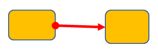

[Home](index.php) | [WordprocessingML (docx)](anatomyofOOXML.php) | [SpreadsheetML (xlsx)](anatomyofOOXML-xlsx.php) | [PresentationML (pptx)](anatomyofOOXML-pptx.php) | [DrawingML](drwOverview.php)

* [Overview](drwOverview.php)
* Pictures
  + [Overview](drwPic.php)
  + Image Properties
    - [Image Data](drwPic-ImageData.php)
    - [Tile or Stretch Image to Fill](drwPic-tile.php)
    - [Effects](drwPic-effects.php)
  + [Non-Visual Properties](drwPic-nvPicPr.php)
  + [Shape Properties](drwSp-SpPr.php)
* Shapes
  + [Overview](drwShape.php)
  + [Non-Visual Properties](drwSp-nvSpPr.php)
  + [Visual Properties](drwSp-SpPr.php)
    - [Size of Bounding Box](drwSp-size.php)
    - [Location of Bounding Box](drwSp-location.php)
    - Geometry
      * [Preset](drwSp-prstGeom.php)
      * [Custom](drwSp-custGeom.php)
    - [Shape Fill](drwSp-shapeFill.php)
      * [Solid Fill](drwSp-SolidFill.php)
      * [Picture Fill](drwSp-PictFill.php)
      * [Gradient Fill](drwSp-GradFill.php)
      * [Pattern Fill](drwSp-PattFill.php)
      * [Group Fill](drwSp-grpFill.php)
    - [Effects](drwSp-effects.php)
    - [Outline Style](drwSp-outline.php)
    - [2D Transforms](drwSp-rotate.php)
    - 3-D
      * [Shape Properties](drwSp-3dProps.php)
      * [Scene Properties](drwSp-3dScene.php)
  + [Styles](drwSp-styles.php)
  + [Text](drwSp-text.php)
    - [Text Body Properties](drwSp-text-bodyPr.php)
      * [Positioning and Insets](drwSp-text-bodyPr-inset.php)
      * [Fit, Wrap, Warp and 3D](drwSp-text-bodyPr-fit.php)
      * [Columns, Vertical Text and Rotation](drwSp-text-bodyPr-columns.php)
    - [Paragraphs](drwSp-text-paragraph.php)
      * [Paragraph Properties](drwSp-text-paraProps.php)
        + [Bullets and Numbering](drwSp-text-paraProps-numbering.php)
        + [Spacing, Indent and Margins](drwSp-text-paraProps-margins.php)
        + [Alignment, Tabs, Other](drwSp-text-paraProps-align.php)
      * [Run Properties](drwSp-text-runProps.php)
    - [List Properties](drwSp-text-lstPr.php)
* [Connectors](drwCxnSp.php)
  + [Non-Visual Properties](drwSp-nvCxnSpPr.php)
* [Text](drwSp-textbox.php)
* Charts
* Diagrams
* [Tables](drwTable.php)
  + [Defining Structure](drwTableGrid.php)
  + [Rows, Cells, Cell Content](drwTableRowAndCell.php)
  + Cell Properties
    - [Alignment, Margins, Direction](drwTableCellProperties-alignment.php)
    - [Borders and Fill](drwTableCellProperties-bordersFills.php)
  + [Table Styles and Properties](drwTableStyles.php)
* Placement within Docs
  + [Overview](drwPicInWord.php)
  + [Inline Objects](drwPicInline.php)
  + [Floating Objects](drwPicFloating.php)
    - [Positioning](drwPicFloating-position.php)
    - [Text Wrapping](drwPicFloating-textWrap.php)
* Placement within Spreadsheets
  + [Overview](drwPicInSpread.php)
  + [Absolute Anchoring](drwPicInSpread-absolute.php)
  + [One Cell Anchoring](drwPicInSpread-oneCell.php)
  + [Two Cell Anchoring](drwPicInSpread-twoCell.php)
* [Placement within Presentations](drwPicInPresentation.php)

# DrawingML Connectors

Overview

A connector is just a special type of shape that is used to connect two shapes (<xdr:sp> or <p:sp>) within a spreadsheet or presentation document.

Connection shapes within spreadsheets are specified with a <xdr:cxnSp> element in the spreadsheetML drawing namespace - xmlns:xdr="http://schemas.openxmlformats.org/drawingml/2006/speadsheetDrawing". Similarly, connection shapes within presentations are specified with a <p:cxnSp> element as defined within the main presentationML namespace - xmlns:p="http://schemas.openxmlformats.org/presentationml/2006/main".

As with any shape, a connector is inserted into the package for the document using the placement method as discussed at [Placement within Spreadsheets](drwPicInSpread.php) and Placement within Presentations. In short, spreadsheets put shapes within a separate drawing part. Presentations put shapes inline with the other content for the slide, and the shapes are contained within a <p:spTree> or <p:grpSp> element. However, unlike other shapes, connectors do not have a defined position; rather, their position is defined by the shapes they connect. Once a connection is specified, it is left to the generating application to determine the exact path the connector takes.

For each of the document types, although the placement within the document varies by document type, the actual details of the connection shape itself are the same in most respects. Word processing documents implement shapes differently both with respect to placement with the document and to details of the shape. See [Shapes - Overview](drwShape.php) for more on shapes within wordprocessingML documents.

There are three basic components of a connection shape, corresponding to the three child elements. Note that unlike other shapes, connection shapes can have no text, so there is no child <txBody> element.

1. <nvCxnSpPr> - non-visual properties for a connection shape. See [Connectors - Non-Visual Properties](drwSp-nvCxnSpPr.php).
2. <spPr> - shape properties. See [Shapes - Shape Properties](drwSp-SpPr.php).
3. <style> - shape styles. See [Shapes - Styles](drwSp-styles.php).

The type and style of the connector are determined mostly by two things -- (1) the specified geometry of the shape, and (2) the outline of the shape. The geometry is specified as part of the shape properties within <spPr>--e.g., <a:prstGeom prst="bentConnector2">. See [Shapes - Preset Geometry](drwSp-prstGeom.php) for a complete list of the possible connector shape types. The outline of the shape is also specified as part of the shape properties within the <a:ln> element. The outline determines such characteristics as the size or weight of the connector, the color, and the styles of the ends. See [Shapes - Outline](drwSp-outline.php) for details of the outline properties.

Below is an example of a connector shape (in red) between two shapes within a presentation document.

<p:cxnSp>

  

<p:nvCxnSpPr>

<p:cNvPr id="9" name="Straight Arrow Connector 8"/>

<p:cNvCxnSpPr>

<a:stCxn id="4" idx="3"/>

<a:endCxn id="5" idx="1"/>

</p:cNvCxnSpPr/>

<p:nvPr/>

</p:nvCxnSpPr>

  

<p:spPr>

<a:xfrm>

<a:off x="2514600" y="3086100"/>

<a:ext cx="1143000" cy="38100"/>

</a:xfrm>

<a:prstGeom prst="StraightConnector1">

<a:avLst/>

</a:prstGeom>

<a:ln w="57150">

<a:solidFill>

<a:srgbClr val="FF0000"/>

</a:solidFill>

<a:headEnd type="oval" w="med" len="med"/>

<a:tailEnd type="triangle" w="med" len="med"/>

</a:ln>

</p:spPr>

  

<p:style>

<a:lnRef idx="1">

<a:schemeClr val="accent1"/>

</a:lnRef>

<a:fillRef idx="0">

<a:schemeClr val="accent1"/>

</a:fillRef>

<a:effectRef idx="0">

<a:schemeClr val="accent1"/>

</a:effectRef>

<a:fontRef idx="minor">

<a:schemeClr val="tx1"/>

</a:fontRef>

</p:style>

</p:cxnSp>

  

[About this site](aboutThisSite.php) | [Contact us](contactUs.php)
  
Copyright © 2023. All Rights Reserved.