[Home](index.php) | [WordprocessingML (docx)](anatomyofOOXML.php) | [SpreadsheetML (xlsx)](anatomyofOOXML-xlsx.php) | [PresentationML (pptx)](anatomyofOOXML-pptx.php) | [DrawingML](drwOverview.php)

* [Overview](drwOverview.php)
* Pictures
  + [Overview](drwPic.php)
  + Image Properties
    - [Image Data](drwPic-ImageData.php)
    - [Tile or Stretch Image to Fill](drwPic-tile.php)
    - [Effects](drwPic-effects.php)
  + [Non-Visual Properties](drwPic-nvPicPr.php)
  + [Shape Properties](drwSp-SpPr.php)
* Shapes
  + [Overview](drwShape.php)
  + [Non-Visual Properties](drwSp-nvSpPr.php)
  + [Visual Properties](drwSp-SpPr.php)
    - [Size of Bounding Box](drwSp-size.php)
    - [Location of Bounding Box](drwSp-location.php)
    - Geometry
      * [Preset](drwSp-prstGeom.php)
      * [Custom](drwSp-custGeom.php)
    - [Shape Fill](drwSp-shapeFill.php)
      * [Solid Fill](drwSp-SolidFill.php)
      * [Picture Fill](drwSp-PictFill.php)
      * [Gradient Fill](drwSp-GradFill.php)
      * [Pattern Fill](drwSp-PattFill.php)
      * [Group Fill](drwSp-grpFill.php)
    - [Effects](drwSp-effects.php)
    - [Outline Style](drwSp-outline.php)
    - [2D Transforms](drwSp-rotate.php)
    - 3-D
      * [Shape Properties](drwSp-3dProps.php)
      * [Scene Properties](drwSp-3dScene.php)
  + [Styles](drwSp-styles.php)
  + [Text](drwSp-text.php)
    - [Text Body Properties](drwSp-text-bodyPr.php)
      * [Positioning and Insets](drwSp-text-bodyPr-inset.php)
      * [Fit, Wrap, Warp and 3D](drwSp-text-bodyPr-fit.php)
      * [Columns, Vertical Text and Rotation](drwSp-text-bodyPr-columns.php)
    - [Paragraphs](drwSp-text-paragraph.php)
      * [Paragraph Properties](drwSp-text-paraProps.php)
        + [Bullets and Numbering](drwSp-text-paraProps-numbering.php)
        + [Spacing, Indent and Margins](drwSp-text-paraProps-margins.php)
        + [Alignment, Tabs, Other](drwSp-text-paraProps-align.php)
      * [Run Properties](drwSp-text-runProps.php)
    - [List Properties](drwSp-text-lstPr.php)
* [Connectors](drwCxnSp.php)
  + [Non-Visual Properties](drwSp-nvCxnSpPr.php)
* [Text](drwSp-textbox.php)
* Charts
* Diagrams
* [Tables](drwTable.php)
  + [Defining Structure](drwTableGrid.php)
  + [Rows, Cells, Cell Content](drwTableRowAndCell.php)
  + Cell Properties
    - [Alignment, Margins, Direction](drwTableCellProperties-alignment.php)
    - [Borders and Fill](drwTableCellProperties-bordersFills.php)
  + [Table Styles and Properties](drwTableStyles.php)
* Placement within Docs
  + [Overview](drwPicInWord.php)
  + [Inline Objects](drwPicInline.php)
  + [Floating Objects](drwPicFloating.php)
    - [Positioning](drwPicFloating-position.php)
    - [Text Wrapping](drwPicFloating-textWrap.php)
* Placement within Spreadsheets
  + [Overview](drwPicInSpread.php)
  + [Absolute Anchoring](drwPicInSpread-absolute.php)
  + [One Cell Anchoring](drwPicInSpread-oneCell.php)
  + [Two Cell Anchoring](drwPicInSpread-twoCell.php)
* [Placement within Presentations](drwPicInPresentation.php)

# DrawingML Pictures

Effects

A number of effects can be applied to a picture. They are specified as child elements of the <a:blip> element, which is itself a child of the <pic:blipFill> element within the <pic:pic> element.

<pic:pic xmlns:pic="http://schemas.openxmlformats.org/drawingml/2006/picture">

<pic:nvPicPr>

<pic:cNvPr id="0" name="Blue hills.jpg"/>

<pic:cNvPicPr/>

</pic:nvPicPr>

<pic:blipFill>

<a:blip r:embed="rId4" cstate="print">

<a:duotone>

<a:prsClr val="black"/>

<a:schemeClr val="accent3">

<a:tint val="45000"/>

<a:satMode val="400000">

</a:schemeClr>

<a:duotone>

</a:blip>

<a:stretch>

<a:fillRect/>

</a:stretch/>

</pic:blipFill>

<pic:spPr>

<a:xfrm>

<a:off x="0" y="0"/>

<a:ext cx="2438400" cy="1828800"/>

</a:xfrm>

<a:prstGeom rst="rect>

<a:avLst/>

</a:prstGeom>

</pic:spPr>

</pic:pic>

Reference: ECMA-376, 3rd Edition (June, 2011), Fundamentals and Markup Language Reference § 20.1.8.13.

Following are some of the more common effects.

## Alpha Inversion:

This effect inverts alpha (opacity) values by subtracting from 100%. The effect is specified with the <a:alphaInv> element. A color is specified as a child element. Colors can be specified in a number of different ways -- either as a preset color (<a:prstClr>), using hue, saturation and luminance (<a:hslClr>), scheme colors (<a:schemeClr>), system colors (<a:sysClr>), or as RGB percentages or hex numbers (<a:scrgbClr> or <a:srgbClr>).

<a:blip r:embed="rId4" cstate="print">

<a:alphaInv>

<a:srgbClr val="97E4FE"/>

</a:alphaInv>

</a:blip>

Reference: ECMA-376, 3rd Edition (June, 2011), Fundamentals and Markup Language Reference § 20.1.8.4.

Word 2007 Example:

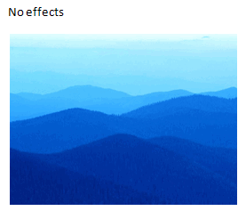
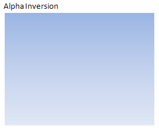
  

## Alpha Replace:

This effect specifies a new fixed opacity value. The effect is specified with the <a:alphaRepl> element. The a attribute specifies the new opacity value as a percentage.

<a:blip r:embed="rId4" cstate="print">

<a:alphaRepl a="25000"/>

</a:blip>

Reference: ECMA-376, 3rd Edition (June, 2011), Fundamentals and Markup Language Reference § 20.1.8.8.

Word 2007 Example:

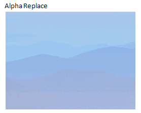
  

## Alpha Modulate Fixed Effect:

This effect specifies a fixed percentage multiplier to the opacity value. The effect is specified with the <a:alphaModFix> element. The amt attribute specifies the percentage multiplier.

<a:blip r:embed="rId4" cstate="print">

<a:alphaModFix a="15000"/>

</a:blip>

Reference: ECMA-376, 3rd Edition (June, 2011), Fundamentals and Markup Language Reference § 20.1.8.6.

Word 2007 Example:

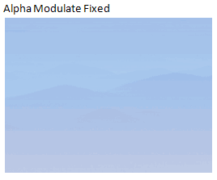
  

## Black/White Effect (biLevel):

This effect changes the color to black if the luminance of the input is less than the specified threshold value. Otherwise the color is changed to white. The effect is specified with the <a:biLevel> element, with the thresh attribute specifying the threshold value for luminance.

<a:blip r:embed="rId4" cstate="print">

<a:biLevel thresh="75%"/>

</a:blip>

Reference: ECMA-376, 3rd Edition (June, 2011), Fundamentals and Markup Language Reference § 20.1.8.11.

Word 2007 Example:

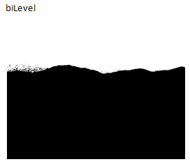
  

## Blur:

This effect specifies a blur with the <a:blur> element. The grow attribute specifies whether the bounds of the object should be grown as a result of the blurring. Values are true or false. The rad attribute specifies the radius of the blur. in EMUs.

<a:blip r:embed="rId4" cstate="print">

<a:blur rad="20"/>

</a:blip>

Reference: ECMA-376, 3rd Edition (June, 2011), Fundamentals and Markup Language Reference § 20.1.8.15.

Word 2007 Example:

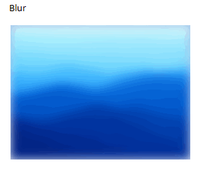
  

## Color Change:

This effect specifies a color change with the <a:clrChange> element. Instances of the color specified by the <a:clrFrom> element are replaced with instances of the color specified by the <a:clrTo> element. Colors can be specified using one of the following color options: as a preset color (<a:prstClr>), using hue, saturation and luminance (<a:hslClr>), scheme colors (<a:schemeClr>), system colors (<a:sysClr>), or as RGB percentages or hex numbers (<a:scrgbClr> or <a:srgbClr>).

<a:blip r:embed="rId4" cstate="print">

<a:clrChange>

<a:clrFrom>

<a:srgbClr val="97E4FE"/>

</a:clrFrom>

<a:clrTo>

<a:srgbClr val="FF3399"/>

</a:clrTo>

</a:clrChange>

</a:blip>

Reference: ECMA-376, 3rd Edition (June, 2011), Fundamentals and Markup Language Reference § 20.1.8.16.

Word 2007 Example:

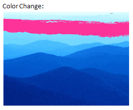
  

## Solid Color Replacement:

This effect specifies a solid color replacement value. All effect colors are changed to a fixed color. Alpha values are unaffected. The effect is specified with the <a:clrRepl> element. The replacement color can be specified using one of a number of different child elements: as a preset color (<a:prstClr>), using hue, saturation and luminance (<a:hslClr>), scheme colors (<a:schemeClr>), system colors (<a:sysClr>), or as RGB percentages or hex numbers (<a:scrgbClr> or <a:srgbClr>).

<a:blip r:embed="rId4" cstate="print">

<a:clrRepl>

<a:srgbClr val="FF3399"/>

</a:clrRepl>

</a:blip>

Reference: ECMA-376, 3rd Edition (June, 2011), Fundamentals and Markup Language Reference § 20.1.8.18.

Word 2007 Example:

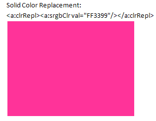
  

## Duotone (combines two colors for each pixel):

The effect is specified with the <a:duotone> element. The colors to be combined are specified using child elements. The colors can be specified in a number of different ways -- either as a preset color (<a:prstClr>), using hue, saturation and luminance (<a:hslClr>), scheme colors (<a:schemeClr>), system colors (<a:sysClr>), or as RGB percentages or hex numbers (<a:scrgbClr> or <a:srgbClr>).

<a:blip r:embed="rId4" cstate="print">

<a:duotone>

<a:prstClr val="black"/>

<a:schemeClr val="accent3">

<a:tint val="45000"/>

<a:satMod val="400000"/>

</a:schemeClr>

</a:duotone>

</a:blip>

Reference: ECMA-376, 3rd Edition (June, 2011), Fundamentals and Markup Language Reference § 20.1.8.23.

Word 2007 Example:

  

## Gray Scale:

This effect converts all color values to a shade of gray, corresponding to their luminance. Opacity is unaffected. The effect is specified with the <a:grayscl> element.

<a:blip r:embed="rId4" cstate="print">

<a:grayscl/>

</a:blip>

Reference: ECMA-376, 3rd Edition (June, 2011), Fundamentals and Markup Language Reference § 20.1.8.34.

Word 2007 Example:

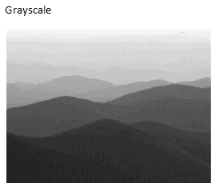
  

## Luminance:

This effect specifies a luminance effect. The effect is specified with the <a:lum> element. Brightness shifts all colors closer to white or black, and contrast scales all colors to be either closer or further apart. The bright attribute specifies the percent to change the brightness, and the contrast attribute specifies the percent to change the contrast.

<a:blip r:embed="rId4" cstate="print">

<a:lum bright="65%" contrast="30%"/>

</a:blip>

Reference: ECMA-376, 3rd Edition (June, 2011), Fundamentals and Markup Language Reference § 20.1.8.42.

Word 2007 Example:

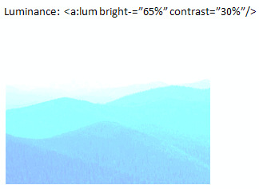
  

## Tint:

This effect specifies a tint effect. The effect is specified with the <a:tint> element. It shifts the color values towards/away fron hue by the specified amount. The amt attribute specifies by how much the color value is shifted, and the hue attribute specifies the hue towards which to tint. The range is from 0 to 360 degrees, in 60000ths of a degree.

<a:blip r:embed="rId4" cstate="print">

<a:tint amt="50%" hue="3000000"/>

</a:blip>

Reference: ECMA-376, 3rd Edition (June, 2011), Fundamentals and Markup Language Reference § 20.1.8.60.

Word 2007 Example:

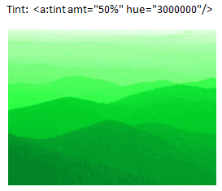

  

[About this site](aboutThisSite.php) | [Contact us](contactUs.php)
  
Copyright © 2023. All Rights Reserved.