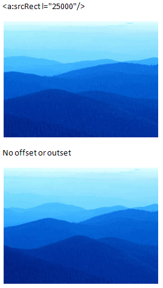
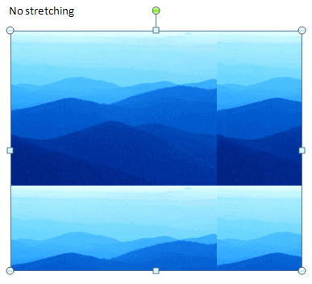
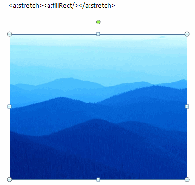
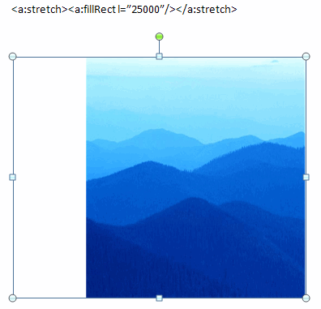
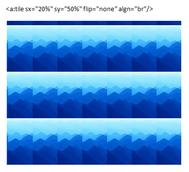

[Home](index.php) | [WordprocessingML (docx)](anatomyofOOXML.php) | [SpreadsheetML (xlsx)](anatomyofOOXML-xlsx.php) | [PresentationML (pptx)](anatomyofOOXML-pptx.php) | [DrawingML](drwOverview.php)

* [Overview](drwOverview.php)
* Pictures
  + [Overview](drwPic.php)
  + Image Properties
    - [Image Data](drwPic-ImageData.php)
    - [Tile or Stretch Image to Fill](drwPic-tile.php)
    - [Effects](drwPic-effects.php)
  + [Non-Visual Properties](drwPic-nvPicPr.php)
  + [Shape Properties](drwSp-SpPr.php)
* Shapes
  + [Overview](drwShape.php)
  + [Non-Visual Properties](drwSp-nvSpPr.php)
  + [Visual Properties](drwSp-SpPr.php)
    - [Size of Bounding Box](drwSp-size.php)
    - [Location of Bounding Box](drwSp-location.php)
    - Geometry
      * [Preset](drwSp-prstGeom.php)
      * [Custom](drwSp-custGeom.php)
    - [Shape Fill](drwSp-shapeFill.php)
      * [Solid Fill](drwSp-SolidFill.php)
      * [Picture Fill](drwSp-PictFill.php)
      * [Gradient Fill](drwSp-GradFill.php)
      * [Pattern Fill](drwSp-PattFill.php)
      * [Group Fill](drwSp-grpFill.php)
    - [Effects](drwSp-effects.php)
    - [Outline Style](drwSp-outline.php)
    - [2D Transforms](drwSp-rotate.php)
    - 3-D
      * [Shape Properties](drwSp-3dProps.php)
      * [Scene Properties](drwSp-3dScene.php)
  + [Styles](drwSp-styles.php)
  + [Text](drwSp-text.php)
    - [Text Body Properties](drwSp-text-bodyPr.php)
      * [Positioning and Insets](drwSp-text-bodyPr-inset.php)
      * [Fit, Wrap, Warp and 3D](drwSp-text-bodyPr-fit.php)
      * [Columns, Vertical Text and Rotation](drwSp-text-bodyPr-columns.php)
    - [Paragraphs](drwSp-text-paragraph.php)
      * [Paragraph Properties](drwSp-text-paraProps.php)
        + [Bullets and Numbering](drwSp-text-paraProps-numbering.php)
        + [Spacing, Indent and Margins](drwSp-text-paraProps-margins.php)
        + [Alignment, Tabs, Other](drwSp-text-paraProps-align.php)
      * [Run Properties](drwSp-text-runProps.php)
    - [List Properties](drwSp-text-lstPr.php)
* [Connectors](drwCxnSp.php)
  + [Non-Visual Properties](drwSp-nvCxnSpPr.php)
* [Text](drwSp-textbox.php)
* Charts
* Diagrams
* [Tables](drwTable.php)
  + [Defining Structure](drwTableGrid.php)
  + [Rows, Cells, Cell Content](drwTableRowAndCell.php)
  + Cell Properties
    - [Alignment, Margins, Direction](drwTableCellProperties-alignment.php)
    - [Borders and Fill](drwTableCellProperties-bordersFills.php)
  + [Table Styles and Properties](drwTableStyles.php)
* Placement within Docs
  + [Overview](drwPicInWord.php)
  + [Inline Objects](drwPicInline.php)
  + [Floating Objects](drwPicFloating.php)
    - [Positioning](drwPicFloating-position.php)
    - [Text Wrapping](drwPicFloating-textWrap.php)
* Placement within Spreadsheets
  + [Overview](drwPicInSpread.php)
  + [Absolute Anchoring](drwPicInSpread-absolute.php)
  + [One Cell Anchoring](drwPicInSpread-oneCell.php)
  + [Two Cell Anchoring](drwPicInSpread-twoCell.php)
* [Placement within Presentations](drwPicInPresentation.php)

# DrawingML Pictures

Image Properties - Tile, Stretch, or Display Portion of Image

## Displaying a Portion of the Image (Cropping)

The <a:srcRect> element within the <pic:blipFill> element specifies the portion of the blip or image that is used for the fill. If no attributes are specified, this indicates that the image has not been cropped. Otherwise, the b (bottom), l (left), r (right), and t (top) attributes specify the cropping for the rectangle. Each edge of the image is defined by a percentage offset from the edge of the bounding box. A positive percentage specifies an inset and a negative percentage specifies an outset. So, for example, a left offset of 25% specifies that the left edge of the image is located to the right of the bounding box's left edge by 25% of the bounding box's width.

<pic:blipFill>

<a:blip r:embed="rId4" cstate="print"/>

<a:srcRect l="25000"/>

</pic:blipFill>

Word 2007 Example:

Reference: ECMA-376, 3rd Edition (June, 2011), Fundamentals and Markup Language Reference § 20.1.8.55.

## Stretching the Image

An image can be stretched to fill the target rectangle with a <a:stretch> element within the <pic:blipFill> element. The <a:stretch> contains a <a:fillRect> element that specifies a fill rectangle. Each edge of the fill rectangle is defined by a perentage offset from the corresponding edge of the picture's bounding box. A positive percentage specifies an inset and a negative percentage specifies an outset.

<pic:blipFill>

<a:blip r:embed="rId4" cstate="print"/>

<a:stretch>

<a:fillRect l="25000"/>

</a:stretch/>

</pic:blipFill>

Reference: ECMA-376, 3rd Edition (June, 2011), Fundamentals and Markup Language Reference § 20.1.8.56. and § 20.1.8.30.

The <a:fillRect> element has the same attributes as the <a:srcRect> element above.

Below are examples without stretching, with stretching but without offset or outset, and stretching with inset. Stretching an image is in relation to the image's bounding box. In the examples, the bounding box (cx="3438400" cy="2828800") is larger than the image (cx="2438400" cy="1828800"). The first sample has no stretching.

The second has stretching, with no offset or inset.

The third has stretching, with a 25% inset in the left.

## Tiling the Image

Tiling of an image to fill the bounding box is specified with the <a:tile> element within the <pic:blipFill> element. The <a:tile> element defines a tile or rectangle within the bounding box, and the rectangle is tiled across the bounding box to fill the entire area.

<pic:blipFill>

<a:blip r:embed="rId4" cstate="print"/>

<a:tile sx="20%" sy="50%" flip="none" algn="br"/>

</pic:blipFill>

Reference: ECMA-376, 3rd Edition (June, 2011), Fundamentals and Markup Language Reference § 20.1.8.58.

The <a:tile> element has the following attributes.

| Attribute | Description |
| --- | --- |
| algn | Specifies where to align the first tile. Alignment happens after the scaling but before any offset. Possible values are b (bottom), bl (bottom left), br (bottom right), ctr (center), l (left), r (right), t (top), tl (top left), and tr (top right) |
| flip | Specifies the direction(s) in which the image should be flipped. Possible values are:none, x (horizontal), xy (horizontal and vertical), and y (vertical) |
| sx | Specifies the amount to horizontally scale. Values are as percentages. |
| sy | Specifies the amount to vertically scale. Values are as percentages. |
| tx | Specifies additional horizontal offset after alignment. Values are as percentages. |
| ty | Specifies additional vertical offset after alignment. Values are as percentages. |

  

Word 2007 Example:

Below is an example of tiling. The first tile is in the bottom right corner. The image is not flipped in either direction, but the image is scaled to 20% horizontally and 50% vertically.

  

[About this site](aboutThisSite.php) | [Contact us](contactUs.php)
  
Copyright © 2023. All Rights Reserved.