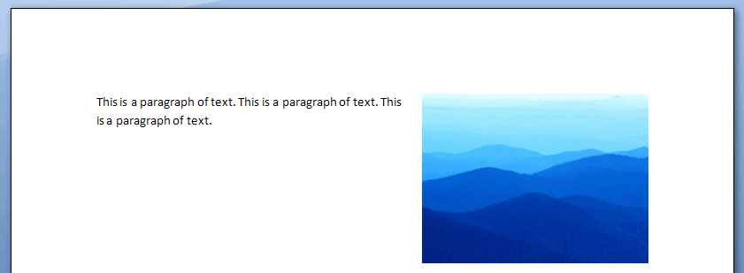
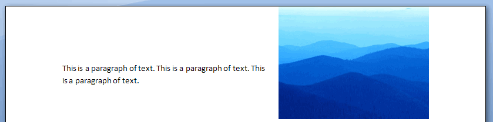
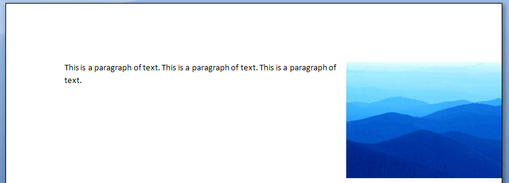
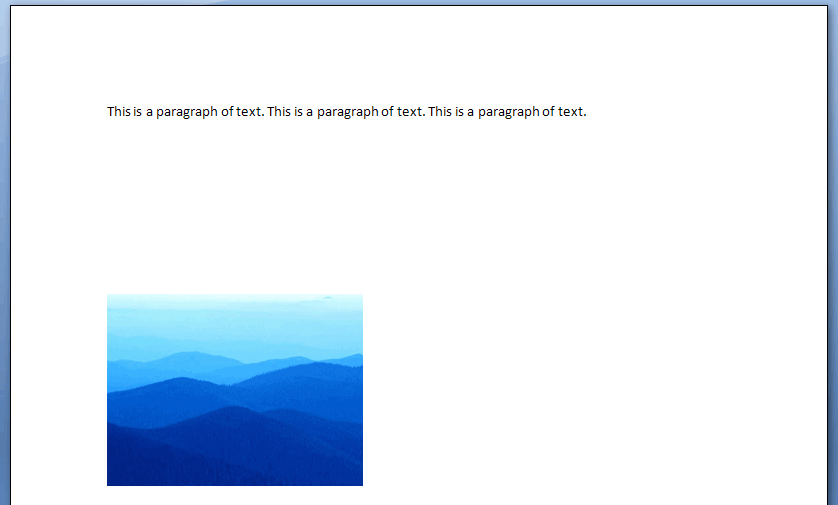

[Home](index.php) | [WordprocessingML (docx)](anatomyofOOXML.php) | [SpreadsheetML (xlsx)](anatomyofOOXML-xlsx.php) | [PresentationML (pptx)](anatomyofOOXML-pptx.php) | [DrawingML](drwOverview.php)

* [Overview](drwOverview.php)
* Pictures
  + [Overview](drwPic.php)
  + Image Properties
    - [Image Data](drwPic-ImageData.php)
    - [Tile or Stretch Image to Fill](drwPic-tile.php)
    - [Effects](drwPic-effects.php)
  + [Non-Visual Properties](drwPic-nvPicPr.php)
  + [Shape Properties](drwSp-SpPr.php)
* Shapes
  + [Overview](drwShape.php)
  + [Non-Visual Properties](drwSp-nvSpPr.php)
  + [Visual Properties](drwSp-SpPr.php)
    - [Size of Bounding Box](drwSp-size.php)
    - [Location of Bounding Box](drwSp-location.php)
    - Geometry
      * [Preset](drwSp-prstGeom.php)
      * [Custom](drwSp-custGeom.php)
    - [Shape Fill](drwSp-shapeFill.php)
      * [Solid Fill](drwSp-SolidFill.php)
      * [Picture Fill](drwSp-PictFill.php)
      * [Gradient Fill](drwSp-GradFill.php)
      * [Pattern Fill](drwSp-PattFill.php)
      * [Group Fill](drwSp-grpFill.php)
    - [Effects](drwSp-effects.php)
    - [Outline Style](drwSp-outline.php)
    - [2D Transforms](drwSp-rotate.php)
    - 3-D
      * [Shape Properties](drwSp-3dProps.php)
      * [Scene Properties](drwSp-3dScene.php)
  + [Styles](drwSp-styles.php)
  + [Text](drwSp-text.php)
    - [Text Body Properties](drwSp-text-bodyPr.php)
      * [Positioning and Insets](drwSp-text-bodyPr-inset.php)
      * [Fit, Wrap, Warp and 3D](drwSp-text-bodyPr-fit.php)
      * [Columns, Vertical Text and Rotation](drwSp-text-bodyPr-columns.php)
    - [Paragraphs](drwSp-text-paragraph.php)
      * [Paragraph Properties](drwSp-text-paraProps.php)
        + [Bullets and Numbering](drwSp-text-paraProps-numbering.php)
        + [Spacing, Indent and Margins](drwSp-text-paraProps-margins.php)
        + [Alignment, Tabs, Other](drwSp-text-paraProps-align.php)
      * [Run Properties](drwSp-text-runProps.php)
    - [List Properties](drwSp-text-lstPr.php)
* [Connectors](drwCxnSp.php)
  + [Non-Visual Properties](drwSp-nvCxnSpPr.php)
* [Text](drwSp-textbox.php)
* Charts
* Diagrams
* [Tables](drwTable.php)
  + [Defining Structure](drwTableGrid.php)
  + [Rows, Cells, Cell Content](drwTableRowAndCell.php)
  + Cell Properties
    - [Alignment, Margins, Direction](drwTableCellProperties-alignment.php)
    - [Borders and Fill](drwTableCellProperties-bordersFills.php)
  + [Table Styles and Properties](drwTableStyles.php)
* Placement within Docs
  + [Overview](drwPicInWord.php)
  + [Inline Objects](drwPicInline.php)
  + [Floating Objects](drwPicFloating.php)
    - [Positioning](drwPicFloating-position.php)
    - [Text Wrapping](drwPicFloating-textWrap.php)
* Placement within Spreadsheets
  + [Overview](drwPicInSpread.php)
  + [Absolute Anchoring](drwPicInSpread-absolute.php)
  + [One Cell Anchoring](drwPicInSpread-oneCell.php)
  + [Two Cell Anchoring](drwPicInSpread-twoCell.php)
* [Placement within Presentations](drwPicInPresentation.php)

# DrawingML Object Positioning

Positioning within a Word Processing Document - Floating Pictures - Positioning

Floating objects are anchored within the text but can be absolutely positioned in the document relative to the page. They are inserted into a <w:drawing> element with a <wp:anchor> element. The child elements determine the placement.

## Positioning with <wp:simplePos>

There are two methods for controlling placement using the <wp:anchor> element. First, the object can be positioned relative to the top-left edge of the page using the child <wp:simplePos x="0" y="0"/> element, which has two attributes x and y. These attributes specify the coordinates on the x and y axes, respectively. Possible values are either in EMUs or as a number immediately followed by a unit identifier. It is important to remember also that to use the <wp:simplePos> element for positioning, the simplePos attribute on the <wp:anchor> tag must be set to true. Otherwise, the second method for positioning is used. Whether used or not, the <wp:simplePos> element should be included in the XML.

Reference: ECMA-376, 3rd Edition (June, 2011), Fundamentals and Markup Language Reference § 20.4.2.13.

<w:drawing>

<wp:anchor distT="0" distB="0" distL="0" distL="114300" distR="114300" simplePos="1" relativeHeight="251658240" behindDoc="0" locked="0" layoutInCell="1" allowOverlap="1">

<wp:simplePos x="1847850" y="914400"/>

. . .

</wp:anchor

</w:drawing>

Note: Microsoft Word seems to not fully support positioning with <wp:simplePos>.

## Positioning with <wp:positionH> and <wp:positionV>

If the simplePos attribute of <wp:anchor> is false, then the object is positioned using the <wp:positionH> and <wp:positionV> child elements, corresponding to horizontal and vertical positioning, respectively.

Each of these positioning elements has two important components: (1) the positioning base, or the part of the document from which the positioning is to be calculated, and (2) the positioning relative to that base.

Reference: ECMA-376, 3rd Edition (June, 2011), Fundamentals and Markup Language Reference § 20.4.2.10 and § 20.4.2.11.

### Positioning Relative to What?

The first component of positioning with <wp:positionH> and <wp:positionV> is given by the relativeFrom attribute of both <wp:positionH> and <wp:positionV>. For horizontal positioning, the possible values are:

* character - relative to the position of the anchor in the run content
* column - relative to extents of the column which contains the anchor
* insideMargin - relative to the left margin on odd pages, right on even pages
* leftMargin - relative to the left margin
* margin - relative to the page margins
* outsideMargin - relative to the right margin on odd pages, left on even pages
* page - relative to the edge of the page
* rightMargin - relative to the right margin

For vertical positioning, the possible values are:

* bottomMargin - relative to the bottom margin
* insideMargin - relative to the inside margin of the current page
* line - relative to the line containing the anchor character
* margin - relative to the page margins
* outsideMargin - relative to the outside margin of the current page
* page - relative to the edge of the page
* paragraph - relative to the paragraph containing the anchor
* topMargin - relative to the top margin

Below are examples of vertical positioning with alignment at the top. The first example is alignment relative to the margin.

<wp:positionV relativeFrom="margin">

<wp:align>top</wp:align>

</wp:positionV>

The second example is alignment relative to the page.

<wp:positionV relativeFrom="page">

<wp:align>top</wp:align>

</wp:positionV>

The second component of positioning with <wp:positionH> and <wp:positionV> is given by a child element of those two elements: either an align element to specify relative alignment (e.g., center, left, right, top, bottom, etc.) or a <wp:posOffset> element to specify absolute position offset.

### Positioning Using <wp:align>

The actual position relative to the base as given in the relativeFrom attribute is specified within an <wp:align> element. For horizontal positioning, the possible values are:

* center - the object should be centered relative to the value of relativeFrom
* inside - the object should be inside of the value of relativeFrom
* left - the object should be left aligned to the value of relativeFrom
* outside - the object should be outside of the value of relativeFrom
* right - the object should be right aligned to the value of relativeFrom

Below is an example of horizontal positioning right relative to the right margin.

<wp:positionH relativeFrom="rightMargin">

<wp:align>right</wp:align>

</wp:positionH>

For vertical positioning, the possible values are:

* bottom - the object should be at the bottom relative to the value of relativeFrom
* center - the object should be centered relative to the value of relativeFrom
* inside - the object should be inside of the value of relativeFrom
* outside - the object should be outside of the value of relativeFrom
* top - the object should be at the top relative to the value of relativeFrom

Below is an example of vertical positioning at the inside relative to the bottom margin.

<wp:positionV relativeFrom="bottomMargin">

<wp:align>inside</wp:align>

</wp:positionV>

### Positioning Using <wp:posOffset>

Absolute measurement can be specified with the <wp:posOffset> element. Measurement is given in EMUs and is calculated relative to the top left edge of the positioning base as given in the relativeFrom attribute. Below is absolute placement relative to the page.

Note: Microsoft Word positioning with <wp:posOffset> seems unreliable.

<wp:positionH relativeFrom="page">

<wp:posOffset>914400</wp:posOffset>

</wp:positionH>

<wp:positionV relativeFrom="page">

<wp:posOffset>2743200</wp:posOffset>

</wp:positionV>

Reference: ECMA-376, 3rd Edition (June, 2011), Fundamentals and Markup Language Reference § 20.4.2.12.

  

[About this site](aboutThisSite.php) | [Contact us](contactUs.php)
  
Copyright © 2023. All Rights Reserved.