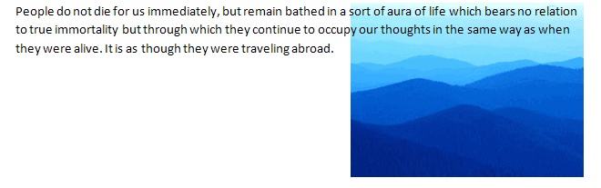
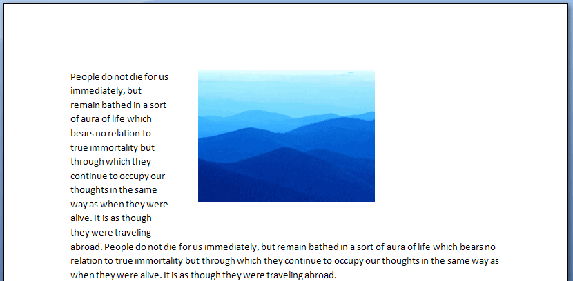
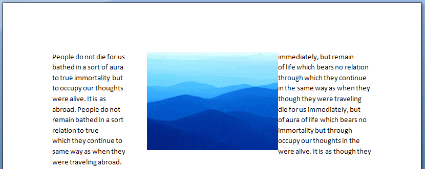
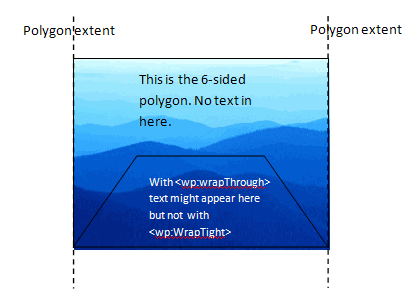
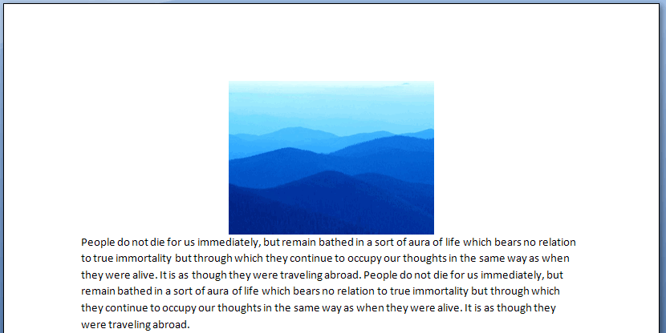

[Home](index.php) | [WordprocessingML (docx)](anatomyofOOXML.php) | [SpreadsheetML (xlsx)](anatomyofOOXML-xlsx.php) | [PresentationML (pptx)](anatomyofOOXML-pptx.php) | [DrawingML](drwOverview.php)

* [Overview](drwOverview.php)
* Pictures
  + [Overview](drwPic.php)
  + Image Properties
    - [Image Data](drwPic-ImageData.php)
    - [Tile or Stretch Image to Fill](drwPic-tile.php)
    - [Effects](drwPic-effects.php)
  + [Non-Visual Properties](drwPic-nvPicPr.php)
  + [Shape Properties](drwSp-SpPr.php)
* Shapes
  + [Overview](drwShape.php)
  + [Non-Visual Properties](drwSp-nvSpPr.php)
  + [Visual Properties](drwSp-SpPr.php)
    - [Size of Bounding Box](drwSp-size.php)
    - [Location of Bounding Box](drwSp-location.php)
    - Geometry
      * [Preset](drwSp-prstGeom.php)
      * [Custom](drwSp-custGeom.php)
    - [Shape Fill](drwSp-shapeFill.php)
      * [Solid Fill](drwSp-SolidFill.php)
      * [Picture Fill](drwSp-PictFill.php)
      * [Gradient Fill](drwSp-GradFill.php)
      * [Pattern Fill](drwSp-PattFill.php)
      * [Group Fill](drwSp-grpFill.php)
    - [Effects](drwSp-effects.php)
    - [Outline Style](drwSp-outline.php)
    - [2D Transforms](drwSp-rotate.php)
    - 3-D
      * [Shape Properties](drwSp-3dProps.php)
      * [Scene Properties](drwSp-3dScene.php)
  + [Styles](drwSp-styles.php)
  + [Text](drwSp-text.php)
    - [Text Body Properties](drwSp-text-bodyPr.php)
      * [Positioning and Insets](drwSp-text-bodyPr-inset.php)
      * [Fit, Wrap, Warp and 3D](drwSp-text-bodyPr-fit.php)
      * [Columns, Vertical Text and Rotation](drwSp-text-bodyPr-columns.php)
    - [Paragraphs](drwSp-text-paragraph.php)
      * [Paragraph Properties](drwSp-text-paraProps.php)
        + [Bullets and Numbering](drwSp-text-paraProps-numbering.php)
        + [Spacing, Indent and Margins](drwSp-text-paraProps-margins.php)
        + [Alignment, Tabs, Other](drwSp-text-paraProps-align.php)
      * [Run Properties](drwSp-text-runProps.php)
    - [List Properties](drwSp-text-lstPr.php)
* [Connectors](drwCxnSp.php)
  + [Non-Visual Properties](drwSp-nvCxnSpPr.php)
* [Text](drwSp-textbox.php)
* Charts
* Diagrams
* [Tables](drwTable.php)
  + [Defining Structure](drwTableGrid.php)
  + [Rows, Cells, Cell Content](drwTableRowAndCell.php)
  + Cell Properties
    - [Alignment, Margins, Direction](drwTableCellProperties-alignment.php)
    - [Borders and Fill](drwTableCellProperties-bordersFills.php)
  + [Table Styles and Properties](drwTableStyles.php)
* Placement within Docs
  + [Overview](drwPicInWord.php)
  + [Inline Objects](drwPicInline.php)
  + [Floating Objects](drwPicFloating.php)
    - [Positioning](drwPicFloating-position.php)
    - [Text Wrapping](drwPicFloating-textWrap.php)
* Placement within Spreadsheets
  + [Overview](drwPicInSpread.php)
  + [Absolute Anchoring](drwPicInSpread-absolute.php)
  + [One Cell Anchoring](drwPicInSpread-oneCell.php)
  + [Two Cell Anchoring](drwPicInSpread-twoCell.php)
* [Placement within Presentations](drwPicInPresentation.php)

# DrawingML Object Positioning

Positioning within a Word Processing Document - Floating Pictures - Text Wrapping

Text wrapping around an anchored object (<wp:anchor>) is specified with one of five text wrapping-related
child elements. (Note that for inline objects <wp:inline>), the object simply becomes part of the line or
the run's content, so there is no sense of wrapping.) The five possible child elements are:

* <wrapNone>
* <wrapSquare>
* <wrapThrough>
* <wrapTight>
* <wrapTopAndBottom>

## <wrapNone>

To specify that no text wrapping should be performed, an empty <wp:wrapNone/> element is placed within <wp:anchor>. Text is then displayed in front of or behind the picture based upon the value of the behindDoc attribute of <wp:anchor> element. If behindDoc is true, then the text is in front. If behindDoc is false, then the text is behind.

<w:drawing>

<wp:anchor distT="0" distB="0" distL="0" distL="114300" distR="114300" simplePos="0" relativeHeight="251658240" behindDoc="1" locked="0" layoutInCell="1" allowOverlap="1">

<wp:simplePos x="3219450" y="1504950"/>

<wp:positionH relativeFrom="margin">

<wp:align>right</wp:align>

</wp:positionH>

<wp:positionV relativeFrom="margin">

<wp:align>top</wp:align>

</wp:positionV>

<wp:extent cx="2438400" cy="1828800"/>

<wp:effectExtent l="19050" t="0" r="0" b="0"/>

<wp:wrapNone/>

. . .

</wp:anchor>

</w:drawing>

Reference: ECMA-376, 3rd Edition (June, 2011), Fundamentals and Markup Language Reference § 20.4.2.15.

## <wrapSquare>

To specify text wrapping around a virtual rectangle surrounding the object, the <wp:wrapSquare> element is
placed within <wp:anchor>. The virtual rectangle is specified either by the <wp:effectExtent> element of the parent <wp:anchor> or, if present, a child <wp:effectExtent> element.

The distance of text from each side of the object is specified in attributes on the <wp:wrapSquare> element: distB (distance from the bottom of the object), distL (distance from the left edge of the object), distR (distance from the right edge of the object), and distT (distance from the top of the object). The values are given in EMUs. A wrapText attribute may also be used to specify which side(s) of the object the text should wrap around. Possible values are:

* bothSides
* largest (text wraps around the largest side; if the object is centered, then text wraps around the side on which text is first encountered)
* left
* right

<w:drawing>

<wp:anchor distT="0" distB="0" distL="0" distL="114300" distR="114300" simplePos="0" relativeHeight="251658240" behindDoc="1" locked="0" layoutInCell="1" allowOverlap="1">

<wp:simplePos x="3219450" y="1504950"/>

<wp:positionH relativeFrom="margin">

<wp:align>center</wp:align>

</wp:positionH>

<wp:positionV relativeFrom="margin">

<wp:align>top</wp:align>

</wp:positionV>

<wp:extent cx="2438400" cy="1828800"/>

<wp:effectExtent l="19050" t="0" r="0" b="0"/>

<wp:wrapSquare wrapText="left" distT="360000" distB="360000" distL="360000" distR="0"/>

. . .

</wp:anchor>

</w:drawing>

Below is another example, with wrapping on both sides, but no distance between text and object on the right side.

<wp:wrapSquare wrapText="bothSides" distT="360000" distB="360000" distL="360000" distR="0"/>

Reference: ECMA-376, 3rd Edition (June, 2011), Fundamentals and Markup Language Reference § 20.4.2.17.

## <wrapThrough>

With <wrapThrough>, a polygon shape can be specified around or within the object, and text will wrap around that polygon instead of around the object. The polygon is specified with a <wrapPolygon> child element of <wrapThrough>. The <wp:wrapPolygon> element itself is defined by first specifying a starting point (and ending point) using the child element <wp:start> (with accompanying x and y attributes specifying the x and y coordinates, relative to the upper-left corner of the object). Two or more <wp:lineTo> elements (with the same x and y attributes) are also specified as child elements to define points of the polygon. The x and y attributes can be in either EMUs or as a number immediately followed by a unit identifier (e.g., 2in). The <wp:wrapThrough> element may also have the distL (distance from the left edge of the object) and distR (distance from the right edge of the object) attributes, like <wp:wrapSquare> above, as well as the wrapText attribute. (Note that the coordinate system of DrawingML uses two-dimensional coordinates, with the origin (0,0) in the upper left-hand corner. The x-axis grows positively as one moves left to right, and the y-axis grows positively as one moves from top to bottom.)

Below is a sample that defines a rectangle polygon for the object in inches.

<w:drawing>

<wp:anchor distT="0" distB="0" distL="0" distL="0" distR="0" simplePos="0" relativeHeight="251658240" behindDoc="1" locked="0" layoutInCell="1" allowOverlap="1">

<wp:simplePos x="3219450" y="1504950"/>

<wp:positionH relativeFrom="margin">

<wp:align>center</wp:align>

</wp:positionH>

<wp:positionV relativeFrom="margin">

<wp:align>center</wp:align>

</wp:positionV>

<wp:extent cx="2438400" cy="1828800"/>

<wp:effectExtent l="0" t="0" r="0" b="0"/>

<wp:wrapThrough wrapText="bothSides">

<wp:wrapPolygon>

<wp:start>x="0in" y="0in"/>

<wp:lineTo>x="0in" y="-1in"/>

<wp:lineTo>x="1in" y="-1in"/>

<wp:lineTo>x="1in" y="0in"/>

<wp:lineTo>x="0in" y="0in"/>

</wp:wrapPolygon>

</wp:wrapThrough>

</wp:anchor>

</w:drawing>

Note: Microsoft Word does not seem to not fully support this wrap capability.

Reference: ECMA-376, 3rd Edition (June, 2011), Fundamentals and Markup Language Reference § 20.4.2.18.

## <wrapTight>

The <wp:wrapTopAndBottom> is very similar to the <wp:wrapThrough>. A polygon is specified, and text wraps around that polygon. However, <wp:wrapTight> does not allow text anywhere within the maximum and minimum extents of the polygon. The graphic below depicts the difference.

Note: Microsoft Word does not seem to not fully support this wrap capability.

Reference: ECMA-376, 3rd Edition (June, 2011), Fundamentals and Markup Language Reference § 20.4.2.19.

## <wrapTopAndBottom>

This wrap specifies that text should wrap around the top and bottom of the object, but not the sides. It can have distB (distance from the bottom of the object) and distT (distance from the top of the object) attributes to specify the distance of text from the bottom and top of the object. It can also have a child <wp:effectExtent> element to add to the object's extent to account for effects.

<w:drawing>

<wp:anchor distT="0" distB="0" distL="0" distL="0" distR="0" simplePos="0" relativeHeight="251658240" behindDoc="1" locked="0" layoutInCell="1" allowOverlap="1">

<wp:simplePos x="3219450" y="1504950"/>

<wp:positionH relativeFrom="margin">

<wp:align>center</wp:align>

</wp:positionH>

<wp:positionV relativeFrom="margin">

<wp:align>top</wp:align>

</wp:positionV>

<wp:extent cx="2438400" cy="1828800"/>

<wp:effectExtent l="0" t="0" r="0" b="0"/>

<wp:wrapTopAndBottom"/>

. . .

</wp:anchor>

</w:drawing>

Reference: ECMA-376, 3rd Edition (June, 2011), Fundamentals and Markup Language Reference § 20.4.2.20.

  

[About this site](aboutThisSite.php) | [Contact us](contactUs.php)
  
Copyright © 2023. All Rights Reserved.