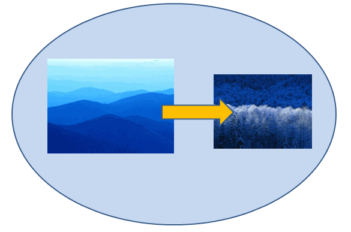

[Home](index.php) | [WordprocessingML (docx)](anatomyofOOXML.php) | [SpreadsheetML (xlsx)](anatomyofOOXML-xlsx.php) | [PresentationML (pptx)](anatomyofOOXML-pptx.php) | [DrawingML](drwOverview.php)

* [Overview](drwOverview.php)
* Pictures
  + [Overview](drwPic.php)
  + Image Properties
    - [Image Data](drwPic-ImageData.php)
    - [Tile or Stretch Image to Fill](drwPic-tile.php)
    - [Effects](drwPic-effects.php)
  + [Non-Visual Properties](drwPic-nvPicPr.php)
  + [Shape Properties](drwSp-SpPr.php)
* Shapes
  + [Overview](drwShape.php)
  + [Non-Visual Properties](drwSp-nvSpPr.php)
  + [Visual Properties](drwSp-SpPr.php)
    - [Size of Bounding Box](drwSp-size.php)
    - [Location of Bounding Box](drwSp-location.php)
    - Geometry
      * [Preset](drwSp-prstGeom.php)
      * [Custom](drwSp-custGeom.php)
    - [Shape Fill](drwSp-shapeFill.php)
      * [Solid Fill](drwSp-SolidFill.php)
      * [Picture Fill](drwSp-PictFill.php)
      * [Gradient Fill](drwSp-GradFill.php)
      * [Pattern Fill](drwSp-PattFill.php)
      * [Group Fill](drwSp-grpFill.php)
    - [Effects](drwSp-effects.php)
    - [Outline Style](drwSp-outline.php)
    - [2D Transforms](drwSp-rotate.php)
    - 3-D
      * [Shape Properties](drwSp-3dProps.php)
      * [Scene Properties](drwSp-3dScene.php)
  + [Styles](drwSp-styles.php)
  + [Text](drwSp-text.php)
    - [Text Body Properties](drwSp-text-bodyPr.php)
      * [Positioning and Insets](drwSp-text-bodyPr-inset.php)
      * [Fit, Wrap, Warp and 3D](drwSp-text-bodyPr-fit.php)
      * [Columns, Vertical Text and Rotation](drwSp-text-bodyPr-columns.php)
    - [Paragraphs](drwSp-text-paragraph.php)
      * [Paragraph Properties](drwSp-text-paraProps.php)
        + [Bullets and Numbering](drwSp-text-paraProps-numbering.php)
        + [Spacing, Indent and Margins](drwSp-text-paraProps-margins.php)
        + [Alignment, Tabs, Other](drwSp-text-paraProps-align.php)
      * [Run Properties](drwSp-text-runProps.php)
    - [List Properties](drwSp-text-lstPr.php)
* [Connectors](drwCxnSp.php)
  + [Non-Visual Properties](drwSp-nvCxnSpPr.php)
* [Text](drwSp-textbox.php)
* Charts
* Diagrams
* [Tables](drwTable.php)
  + [Defining Structure](drwTableGrid.php)
  + [Rows, Cells, Cell Content](drwTableRowAndCell.php)
  + Cell Properties
    - [Alignment, Margins, Direction](drwTableCellProperties-alignment.php)
    - [Borders and Fill](drwTableCellProperties-bordersFills.php)
  + [Table Styles and Properties](drwTableStyles.php)
* Placement within Docs
  + [Overview](drwPicInWord.php)
  + [Inline Objects](drwPicInline.php)
  + [Floating Objects](drwPicFloating.php)
    - [Positioning](drwPicFloating-position.php)
    - [Text Wrapping](drwPicFloating-textWrap.php)
* Placement within Spreadsheets
  + [Overview](drwPicInSpread.php)
  + [Absolute Anchoring](drwPicInSpread-absolute.php)
  + [One Cell Anchoring](drwPicInSpread-oneCell.php)
  + [Two Cell Anchoring](drwPicInSpread-twoCell.php)
* [Placement within Presentations](drwPicInPresentation.php)

# DrawingML Object Placement

Placement within a Presentation Document

Presentations are organized into slides or <p:sld> elements. Pictures, shapes, tables, and text on a given slide are specified inline in the part for that slide (e.g., slide1.xml, slide2.xml, etc.). The <p:sld> element contains a <p:cSld> element which acts as a container for common slide data such as pictures, shapes, and tables. (The <p:sld> element can also contain information regarding timing and transition. This information is not covered here.) All shapes, pictures and other content are further nested within a shape tree or <p:spTree> element.

Note: The high-level elements used to place shapes, pictures, and tables into slides in presentations are within the main presentationML namespace xmlns:p="http://schemas.openxmlformats.org/presentationml/2006/main".

The shape tree contains non-visual properties of a group shape, visual properties that are common to all shapes (which can be overridden by the properties in individual shapes), and then one or more shapes, pictures, connection shapes, group shapes, and/or graphic frames (i.e., containers for tables and graphics generated from an external source). So all shapes and other content for a slide are contained within the <p:spTree> element. Each shape and picture is positioned on the slide within the properties for that particular shape or picture. For example, for a shape, the positioning is within the <a:xfrm>, which is in the <p:spPr> element containing the shape properties. See [Shapes - Bounding Box Location](drwSp-location.php).

The order of the shapes and other content within the <p:spTree> element is important, as the order determines the z-order of the objects on the slide. The first object listed has the lowest z-order (and is thus on the bottom of the object stack) and the last has the highest order (and is on the top of the stack of objects). The z-order is important when objects overlap, and it also determines the tab or navigation order, with objects being navigated in ascending z-order. Below is an example of a stack of four objects on a slide, with the oval shape first, followed by a picture, followed by another picture, followed by an arrow shape.

<p:sld . . .>

<p:cSld>

<p:nvGrpSpPr>

. . .

<p:nvGrpSpPr>

<p:grpSpPr>

. . .

<p:grpSpPr>

  

<p:sp>

<p:nvSpPr>

<p:cNvPr id="4" name="Oval 3"/>

. . .

</p:nvSpPr>

. . .

<p:sp>

  

<p:pic>

<p:nvPicPr>

<p:cNvPr id="5" name="Picture 4" descr="Blue hills.jpg"/>

. . .

</p:nvPicPr>

. . .

<p:pic>

  

<p:pic>

<p:nvPicPr>

<p:cNvPr id="8" name="Picture 7" descr="Winter.jpg"/>

. . .

</p:nvPicPr>

. . .

<p:pic>

  

<p:sp>

<p:nvSpPr>

<p:cNvPr id="9" name="Right Arrow 8"/>

. . .

</p:nvSpPr>

. . .

<p:sp>

<p:cSld>

. . .

</p:sld>

If we reverse the order of the last two objects, placing the arrow shape before the picture of winter, we get the following, with the picture of winter over the arrow:

<p:sld . . .>

<p:cSld>

<p:nvGrpSpPr>

. . .

<p:nvGrpSpPr>

<p:grpSpPr>

. . .

<p:grpSpPr>

  

<p:sp>

<p:nvSpPr>

<p:cNvPr id="4" name="Oval 3"/>

. . .

</p:nvSpPr>

. . .

<p:sp>

  

<p:pic>

<p:nvPicPr>

<p:cNvPr id="5" name="Picture 4" descr="Blue hills.jpg"/>

. . .

</p:nvPicPr>

. . .

<p:pic>

  

<p:sp>

<p:nvSpPr>

<p:cNvPr id="9" name="Right Arrow 8"/>

. . .

</p:nvSpPr>

. . .

<p:sp>

  

<p:pic>

<p:nvPicPr>

<p:cNvPr id="8" name="Picture 7" descr="Winter.jpg"/>

. . .

</p:nvPicPr>

. . .

<p:pic>

<p:cSld>

. . .

</p:sld>

  

[About this site](aboutThisSite.php) | [Contact us](contactUs.php)
  
Copyright © 2023. All Rights Reserved.