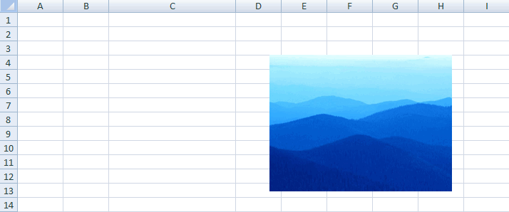

[Home](index.php) | [WordprocessingML (docx)](anatomyofOOXML.php) | [SpreadsheetML (xlsx)](anatomyofOOXML-xlsx.php) | [PresentationML (pptx)](anatomyofOOXML-pptx.php) | [DrawingML](drwOverview.php)

* [Overview](drwOverview.php)
* Pictures
  + [Overview](drwPic.php)
  + Image Properties
    - [Image Data](drwPic-ImageData.php)
    - [Tile or Stretch Image to Fill](drwPic-tile.php)
    - [Effects](drwPic-effects.php)
  + [Non-Visual Properties](drwPic-nvPicPr.php)
  + [Shape Properties](drwSp-SpPr.php)
* Shapes
  + [Overview](drwShape.php)
  + [Non-Visual Properties](drwSp-nvSpPr.php)
  + [Visual Properties](drwSp-SpPr.php)
    - [Size of Bounding Box](drwSp-size.php)
    - [Location of Bounding Box](drwSp-location.php)
    - Geometry
      * [Preset](drwSp-prstGeom.php)
      * [Custom](drwSp-custGeom.php)
    - [Shape Fill](drwSp-shapeFill.php)
      * [Solid Fill](drwSp-SolidFill.php)
      * [Picture Fill](drwSp-PictFill.php)
      * [Gradient Fill](drwSp-GradFill.php)
      * [Pattern Fill](drwSp-PattFill.php)
      * [Group Fill](drwSp-grpFill.php)
    - [Effects](drwSp-effects.php)
    - [Outline Style](drwSp-outline.php)
    - [2D Transforms](drwSp-rotate.php)
    - 3-D
      * [Shape Properties](drwSp-3dProps.php)
      * [Scene Properties](drwSp-3dScene.php)
  + [Styles](drwSp-styles.php)
  + [Text](drwSp-text.php)
    - [Text Body Properties](drwSp-text-bodyPr.php)
      * [Positioning and Insets](drwSp-text-bodyPr-inset.php)
      * [Fit, Wrap, Warp and 3D](drwSp-text-bodyPr-fit.php)
      * [Columns, Vertical Text and Rotation](drwSp-text-bodyPr-columns.php)
    - [Paragraphs](drwSp-text-paragraph.php)
      * [Paragraph Properties](drwSp-text-paraProps.php)
        + [Bullets and Numbering](drwSp-text-paraProps-numbering.php)
        + [Spacing, Indent and Margins](drwSp-text-paraProps-margins.php)
        + [Alignment, Tabs, Other](drwSp-text-paraProps-align.php)
      * [Run Properties](drwSp-text-runProps.php)
    - [List Properties](drwSp-text-lstPr.php)
* [Connectors](drwCxnSp.php)
  + [Non-Visual Properties](drwSp-nvCxnSpPr.php)
* [Text](drwSp-textbox.php)
* Charts
* Diagrams
* [Tables](drwTable.php)
  + [Defining Structure](drwTableGrid.php)
  + [Rows, Cells, Cell Content](drwTableRowAndCell.php)
  + Cell Properties
    - [Alignment, Margins, Direction](drwTableCellProperties-alignment.php)
    - [Borders and Fill](drwTableCellProperties-bordersFills.php)
  + [Table Styles and Properties](drwTableStyles.php)
* Placement within Docs
  + [Overview](drwPicInWord.php)
  + [Inline Objects](drwPicInline.php)
  + [Floating Objects](drwPicFloating.php)
    - [Positioning](drwPicFloating-position.php)
    - [Text Wrapping](drwPicFloating-textWrap.php)
* Placement within Spreadsheets
  + [Overview](drwPicInSpread.php)
  + [Absolute Anchoring](drwPicInSpread-absolute.php)
  + [One Cell Anchoring](drwPicInSpread-oneCell.php)
  + [Two Cell Anchoring](drwPicInSpread-twoCell.php)
* [Placement within Presentations](drwPicInPresentation.php)

# DrawingML Pictures

Positioning within a Spreadsheet Document - One Cell Anchoring

An object can be anchored to a single cell in a spreadsheet using the <xdr:oneCellAnchor> element. The object moves with the anchor cell. The position of the anchor is specified with the child element <xdr:from>. The <xdr:from> element is defined by first specifying the column and row for the anchor; the origin is at the top left corner of the cell. The column is given with <xdr:col> element and the row with a <xdr:row> element. The contents of each of these elements is a xero-based index for the column and row.

From the top left corner of the cell any offset from the column and row may be specified. That is, the anchor does not have to be exactly at the upper left corner of the cell, but can instead fall within the cell. Any offset from the edge upper left corner of the cell is defined by specifying an offset from the column (<xdr:colOff>) and row (<xdr:rowOff>); both are in either EMUs or as a number immediately followed by a unit identifier (e.g., 2in). Keep in mind the drawingML coordinate system. The origin is at the top left; the x axis increases left to right and the y axis increases top to bottom. So a complete specification for an anchor contains both a <xdr:col> and <xdr:colOff>, and a <xdr:row> and <xdr:rowOff>. Below is an example of a starting anchor at the fourth column and fourth row, with a half-inch offset from the column and none from the row.

<xdr:wsDr . . .>

<xdr:oneCellAnchor>

<xdr:from>

<xdr:col>3</xdr:col>

<xdr:colOff>457200</xdr:colOff>

<xdr:row>3</xdr:row>

<xdr:rowOff>0</xdr:rowOff>

</xdr:from>

<xdr:ext cx="2438400" cy="1828800"/>

<xdr:pic>

. . .

</xdr:pic>

<xdr:clientData/>

</xdr:oneCellAnchor>

</xdr:wsDr>

Reference: ECMA-376, 3rd Edition (June, 2011), Fundamentals and Markup Language Reference § 20.5.2.24.

Word 2007 Example:

Below is an example of how the picture follows the anchor when the cells are resized. The underlying XML is the same.

Below are the possible child elements of <xdr:oneCellAnchor>. There are no attributes (compare with <xdr:twoCellAnchor>).

### Elements:

| Element | Description |
| --- | --- |
| clientData | An empty element which specifies (via attributes) certain properties related to printing and selection of the drawing object. The fLocksWithSheet attribute (either true or false) determines whether to disable selection when the sheet is protected, and fPrintsWithSheet attribute (either true or false) determines whether the object is printed when the sheet is printed. Reference: ECMA-376, 3rd Edition (June, 2011), Fundamentals and Markup Language Reference § 20.5.2.3. |
| contentPart | Specifies a reference to XML content in a format not defined by the ECMA-376 specification, such as MathML or SVG content. Reference: ECMA-376, 3rd Edition (June, 2011), Fundamentals and Markup Language Reference § 20.5.2.12. |
| cxnSp | Specifies the properties for a connection shape, such as a line, which connects two other shapes. Not discussed here. Reference: ECMA-376, 3rd Edition (June, 2011), Fundamentals and Markup Language Reference § 20.5.2.13. |
| ext | Specifies the length and width of the object as it is displayed (including any scaling) in EMUs. The element is an empty element with two attributes: the cx attribute giving the length and the cy attribute giving the width. E.g., <xdr:ext cx="2438400" cy="1828800"/>. Reference: ECMA-376, 3rd Edition (June, 2011), Fundamentals and Markup Language Reference § 20.5.2.14. |
| from | Specifies the starting anchor by specifying the column and row of the cell containing the anchor, and any offset from the upper left corner of the cell. The child elements are <xdr:col>, <xdr:colOff>, <xdr:row>, and <xdr:rowOff>. The column and row values are based on a zero-based index for the column and row. The offsets are given in either EMUs or as a number immediately followed by a unit identifier (e.g., 2in). The x axis increases left to right and the y axis increases top to bottom. Reference: ECMA-376, 3rd Edition (June, 2011), Fundamentals and Markup Language Reference § 20.5.2.15. |
| graphicFrame | Specifies a graphical object frame for a spreadsheet that contains a graphical object (e.g., chart, diagram or table). Not discussed here. Reference: ECMA-376, 3rd Edition (June, 2011), Fundamentals and Markup Language Reference § 20.5.2.16. |
| grpSp | Specifies a group shape. Not discussed here. Reference: ECMA-376, 3rd Edition (June, 2011), Fundamentals and Markup Language Reference § 20.5.2.17. |
| pic | Specifies the existence of a picture within a spreadsheet. See [Drawing - Pictures - Overview](drwPic.php). Reference: ECMA-376, 3rd Edition (June, 2011), Fundamentals and Markup Language Reference § 20.5.2.25. |
| sp | Specifies a shape. Not discussed here. Reference: ECMA-376, 3rd Edition (June, 2011), Fundamentals and Markup Language Reference § 20.5.2.29. |

  

[About this site](aboutThisSite.php) | [Contact us](contactUs.php)
  
Copyright © 2023. All Rights Reserved.