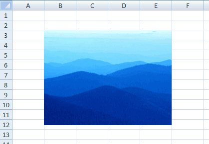
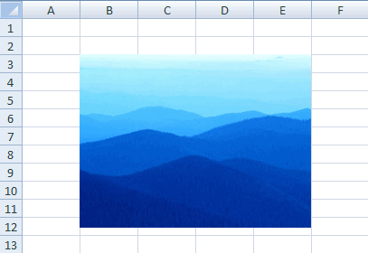
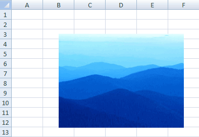
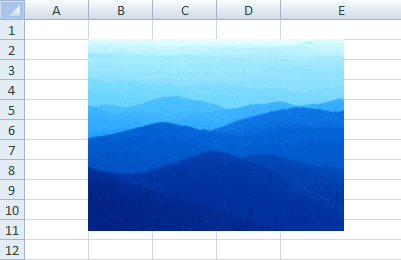

[Home](index.php) | [WordprocessingML (docx)](anatomyofOOXML.php) | [SpreadsheetML (xlsx)](anatomyofOOXML-xlsx.php) | [PresentationML (pptx)](anatomyofOOXML-pptx.php) | [DrawingML](drwOverview.php)

* [Overview](drwOverview.php)
* Pictures
  + [Overview](drwPic.php)
  + Image Properties
    - [Image Data](drwPic-ImageData.php)
    - [Tile or Stretch Image to Fill](drwPic-tile.php)
    - [Effects](drwPic-effects.php)
  + [Non-Visual Properties](drwPic-nvPicPr.php)
  + [Shape Properties](drwSp-SpPr.php)
* Shapes
  + [Overview](drwShape.php)
  + [Non-Visual Properties](drwSp-nvSpPr.php)
  + [Visual Properties](drwSp-SpPr.php)
    - [Size of Bounding Box](drwSp-size.php)
    - [Location of Bounding Box](drwSp-location.php)
    - Geometry
      * [Preset](drwSp-prstGeom.php)
      * [Custom](drwSp-custGeom.php)
    - [Shape Fill](drwSp-shapeFill.php)
      * [Solid Fill](drwSp-SolidFill.php)
      * [Picture Fill](drwSp-PictFill.php)
      * [Gradient Fill](drwSp-GradFill.php)
      * [Pattern Fill](drwSp-PattFill.php)
      * [Group Fill](drwSp-grpFill.php)
    - [Effects](drwSp-effects.php)
    - [Outline Style](drwSp-outline.php)
    - [2D Transforms](drwSp-rotate.php)
    - 3-D
      * [Shape Properties](drwSp-3dProps.php)
      * [Scene Properties](drwSp-3dScene.php)
  + [Styles](drwSp-styles.php)
  + [Text](drwSp-text.php)
    - [Text Body Properties](drwSp-text-bodyPr.php)
      * [Positioning and Insets](drwSp-text-bodyPr-inset.php)
      * [Fit, Wrap, Warp and 3D](drwSp-text-bodyPr-fit.php)
      * [Columns, Vertical Text and Rotation](drwSp-text-bodyPr-columns.php)
    - [Paragraphs](drwSp-text-paragraph.php)
      * [Paragraph Properties](drwSp-text-paraProps.php)
        + [Bullets and Numbering](drwSp-text-paraProps-numbering.php)
        + [Spacing, Indent and Margins](drwSp-text-paraProps-margins.php)
        + [Alignment, Tabs, Other](drwSp-text-paraProps-align.php)
      * [Run Properties](drwSp-text-runProps.php)
    - [List Properties](drwSp-text-lstPr.php)
* [Connectors](drwCxnSp.php)
  + [Non-Visual Properties](drwSp-nvCxnSpPr.php)
* [Text](drwSp-textbox.php)
* Charts
* Diagrams
* [Tables](drwTable.php)
  + [Defining Structure](drwTableGrid.php)
  + [Rows, Cells, Cell Content](drwTableRowAndCell.php)
  + Cell Properties
    - [Alignment, Margins, Direction](drwTableCellProperties-alignment.php)
    - [Borders and Fill](drwTableCellProperties-bordersFills.php)
  + [Table Styles and Properties](drwTableStyles.php)
* Placement within Docs
  + [Overview](drwPicInWord.php)
  + [Inline Objects](drwPicInline.php)
  + [Floating Objects](drwPicFloating.php)
    - [Positioning](drwPicFloating-position.php)
    - [Text Wrapping](drwPicFloating-textWrap.php)
* Placement within Spreadsheets
  + [Overview](drwPicInSpread.php)
  + [Absolute Anchoring](drwPicInSpread-absolute.php)
  + [One Cell Anchoring](drwPicInSpread-oneCell.php)
  + [Two Cell Anchoring](drwPicInSpread-twoCell.php)
* [Placement within Presentations](drwPicInPresentation.php)

# DrawingML Object Positioning

Positioning within a Spreadsheet Document - Two-Cell Anchoring

An object can be anchored to two cells in a spreadsheet using the <xdr:twoCellAnchor> element. The top and left sides (the starting anchor) are anchored with a child element <xdr:from> and the bottom and right sides (ending anchor) are anchored with a child <xdr:to> element. The picture will (or will not) then be moved and/or resized when the cells between the starting and ending anchors are moved or resized, based upon the value of the editAs attribute on <xdr:twoCellAnchor>.

<xdr:wsDr . . .>

<xdr:twoCellAnchor editAs="absolute">

<xdr:from>

<xdr:col>1</xdr:col>

<xdr:colOff>0</xdr:colOff>

<xdr:row>2</xdr:row>

<xdr:rowOff>0</xdr:rowOff>

</xdr:from>

<xdr:to>

<xdr:col>5</xdr:col>

<xdr:colOff>0</xdr:colOff>

<xdr:row>11</xdr:row>

<xdr:rowOff>114300</xdr:rowOff>

</xdr:to>

<xdr:pic>

. . .

</xdr:pic>

<xdr:clientData/>

</xdr:twoCellAnchor>

</xdr:wsDr>

Reference: ECMA-376, 3rd Edition (June, 2011), Fundamentals and Markup Language Reference § 20.5.2.33.

Word 2007 Example:

Below is an example of a picture that is anchored at two cells.

Below are the child elements and attribute of <xdr:twoCellAnchor>

### Attributes:

| Attribute | Description |
| --- | --- |
| editAs | Specifies how the object should be moved and/or resized when the rows and columns between the start and end anchors are resized, or when additional rows or columns are added. Possible values are   * absolute - do not move or resize with the underlying rows/columns. The current start and end positions are maintained; if additional rows or columns are added, the object anchors are moved as needed to maintain the same position. * oneCell - move with the cells but do not resize. If additional rows or columns are added, the object anchors are moved as needed to maintain the same position. * twoCell - move and resize with the anchor cells.   Below is an example of a resizing of column E with editAs="absolute". Note that the image is not resized.  Spreadsheet Picture - Two Anchors - editAs absolute  Below is an example of a resizing of column E with editAs="twoCell". Note that the image IS resized.  Spreadsheet Picture - Two Anchors - editAs absolute |

Below are the possible child elements of <xdr:twoCellAnchor>.

### Elements:

| Element | Description |
| --- | --- |
| clientData | An empty element which specifies (via attributes) certain properties related to printing and selection of the drawing object. The fLocksWithSheet attribute (either true or false) determines whether to disable selection when the sheet is protected, and fPrintsWithSheet attribute (either true or false) determines whether the object is printed when the sheet is printed. Reference: ECMA-376, 3rd Edition (June, 2011), Fundamentals and Markup Language Reference § 20.5.2.3. |
| contentPart | Specifies a reference to XML content in a format not defined by the ECMA-376 specification, such as MathML or SVG content. Reference: ECMA-376, 3rd Edition (June, 2011), Fundamentals and Markup Language Reference § 20.5.2.12. |
| cxnSp | Specifies the properties for a connection shape, such as a line, which connects two other shapes. Not discussed here. Reference: ECMA-376, 3rd Edition (June, 2011), Fundamentals and Markup Language Reference § 20.5.2.13. |
| from | Specifies the starting anchor. See below for more on defining the anchors. Reference: ECMA-376, 3rd Edition (June, 2011), Fundamentals and Markup Language Reference § 20.5.2.15. |
| graphicFrame | Specifies a graphical object frame for a spreadsheet that contains a graphical object (e.g., chart, diagram or table). Not discussed here. Reference: ECMA-376, 3rd Edition (June, 2011), Fundamentals and Markup Language Reference § 20.5.2.16. |
| grpSp | Specifies a group shape. Not discussed here. Reference: ECMA-376, 3rd Edition (June, 2011), Fundamentals and Markup Language Reference § 20.5.2.17. |
| pic | Specifies the existence of a picture within a spreadsheet. See [Drawing - Pictures - Overview](drwPic.php). Reference: ECMA-376, 3rd Edition (June, 2011), Fundamentals and Markup Language Reference § 20.5.2.25. |
| sp | Specifies a shape. Not discussed here. Reference: ECMA-376, 3rd Edition (June, 2011), Fundamentals and Markup Language Reference § 20.5.2.29. |
| to | Specifies the ending anchor. See below for more on defining the anchors. Reference: ECMA-376, 3rd Edition (June, 2011), Fundamentals and Markup Language Reference § 20.5.2.32. |

## Defining the starting and ending anchors

### Starting anchor (<xdr:from>)

The starting anchor determines where the top and left sides of the object are and is specified with the <xdr:from> element. The anchor is specified by listing a column and a row for the starting point, and these are specified with <xdr:col> and a <xdr:row> elements. The contents of each of these elements is a zero-based index for the column and row. However, the starting anchor does not have to be exactly at the intersection of the column and row. It can fall within a cell, and that is defined by specifying an offset from the column (<xdr:colOff>) and row (<xdr:rowOff>); both are in either EMUs or as a number immediately followed by a unit identifier (e.g., 2in). Keep in mind the drawingML coordinate system. The origin is at the top left; the x axis increases left to right and the y axis increases top to bottom. So a complete specification for a starting anchor contains both a <xdr:col> and <xdr:colOff>, and a <xdr:row> and <xdr:rowOff>. Below is an example of a starting anchor at the second column and third row, with no offsets.

<xdr:twoCellAnchor editAs="absolute">

<xdr:from>

<xdr:col>1</xdr:col>

<xdr:colOff>0</xdr:colOff>

<xdr:row>2</xdr:row>

<xdr:rowOff>0</xdr:rowOff>

</xdr:from>

. . .

</xdr:twoCellAnchor>

Below is an example of a starting anchor at the second column and third row, with offsets from both the column and row.

<xdr:twoCellAnchor editAs="absolute">

<xdr:from>

<xdr:col>1</xdr:col>

<xdr:colOff>314325</xdr:colOff>

<xdr:row>2</xdr:row>

<xdr:rowOff>95250</xdr:rowOff>

</xdr:from>

. . .

</xdr:twoCellAnchor>

### Ending anchor (<xdr:to>)

The ending anchor defines the bottom and right sides and is specified with a <xdr:to> element. <xdr:to> element is defined just as the <xdr:from> element--with <xdr:col> and <xdr:colOff>, and a <xdr:row> and <xdr:rowOff> elements. Note that if the editAs of <xdr:twoCellAnchor> is absolute and the anchoring column or row is adjusted, then the values for the column and row elements will change. However, if the attribute value is twoCell, then the values for the column and row elements won't change, but the object size will. Below is an example of an ending anchor at the fifth column and eleventh row, with offsets for both.

<xdr:twoCellAnchor editAs="absolute">

. . .

<xdr:to>

<xdr:col>4</xdr:col>

<xdr:colOff>609600</xdr:colOff>

<xdr:row>10</xdr:row>

<xdr:rowOff>114300</xdr:rowOff>

</xdr:to>

. . .

</xdr:twoCellAnchor>

  

[About this site](aboutThisSite.php) | [Contact us](contactUs.php)
  
Copyright © 2023. All Rights Reserved.