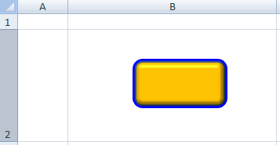
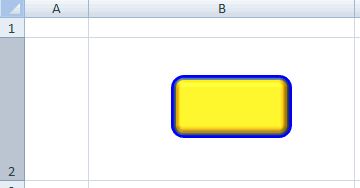
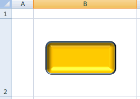
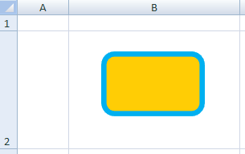
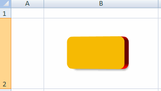

[Home](index.php) | [WordprocessingML (docx)](anatomyofOOXML.php) | [SpreadsheetML (xlsx)](anatomyofOOXML-xlsx.php) | [PresentationML (pptx)](anatomyofOOXML-pptx.php) | [DrawingML](drwOverview.php)

* [Overview](drwOverview.php)
* Pictures
  + [Overview](drwPic.php)
  + Image Properties
    - [Image Data](drwPic-ImageData.php)
    - [Tile or Stretch Image to Fill](drwPic-tile.php)
    - [Effects](drwPic-effects.php)
  + [Non-Visual Properties](drwPic-nvPicPr.php)
  + [Shape Properties](drwSp-SpPr.php)
* Shapes
  + [Overview](drwShape.php)
  + [Non-Visual Properties](drwSp-nvSpPr.php)
  + [Visual Properties](drwSp-SpPr.php)
    - [Size of Bounding Box](drwSp-size.php)
    - [Location of Bounding Box](drwSp-location.php)
    - Geometry
      * [Preset](drwSp-prstGeom.php)
      * [Custom](drwSp-custGeom.php)
    - [Shape Fill](drwSp-shapeFill.php)
      * [Solid Fill](drwSp-SolidFill.php)
      * [Picture Fill](drwSp-PictFill.php)
      * [Gradient Fill](drwSp-GradFill.php)
      * [Pattern Fill](drwSp-PattFill.php)
      * [Group Fill](drwSp-grpFill.php)
    - [Effects](drwSp-effects.php)
    - [Outline Style](drwSp-outline.php)
    - [2D Transforms](drwSp-rotate.php)
    - 3-D
      * [Shape Properties](drwSp-3dProps.php)
      * [Scene Properties](drwSp-3dScene.php)
  + [Styles](drwSp-styles.php)
  + [Text](drwSp-text.php)
    - [Text Body Properties](drwSp-text-bodyPr.php)
      * [Positioning and Insets](drwSp-text-bodyPr-inset.php)
      * [Fit, Wrap, Warp and 3D](drwSp-text-bodyPr-fit.php)
      * [Columns, Vertical Text and Rotation](drwSp-text-bodyPr-columns.php)
    - [Paragraphs](drwSp-text-paragraph.php)
      * [Paragraph Properties](drwSp-text-paraProps.php)
        + [Bullets and Numbering](drwSp-text-paraProps-numbering.php)
        + [Spacing, Indent and Margins](drwSp-text-paraProps-margins.php)
        + [Alignment, Tabs, Other](drwSp-text-paraProps-align.php)
      * [Run Properties](drwSp-text-runProps.php)
    - [List Properties](drwSp-text-lstPr.php)
* [Connectors](drwCxnSp.php)
  + [Non-Visual Properties](drwSp-nvCxnSpPr.php)
* [Text](drwSp-textbox.php)
* Charts
* Diagrams
* [Tables](drwTable.php)
  + [Defining Structure](drwTableGrid.php)
  + [Rows, Cells, Cell Content](drwTableRowAndCell.php)
  + Cell Properties
    - [Alignment, Margins, Direction](drwTableCellProperties-alignment.php)
    - [Borders and Fill](drwTableCellProperties-bordersFills.php)
  + [Table Styles and Properties](drwTableStyles.php)
* Placement within Docs
  + [Overview](drwPicInWord.php)
  + [Inline Objects](drwPicInline.php)
  + [Floating Objects](drwPicFloating.php)
    - [Positioning](drwPicFloating-position.php)
    - [Text Wrapping](drwPicFloating-textWrap.php)
* Placement within Spreadsheets
  + [Overview](drwPicInSpread.php)
  + [Absolute Anchoring](drwPicInSpread-absolute.php)
  + [One Cell Anchoring](drwPicInSpread-oneCell.php)
  + [Two Cell Anchoring](drwPicInSpread-twoCell.php)
* [Placement within Presentations](drwPicInPresentation.php)

# DrawingML Shapes

3D Shape Properties

3D properties are specified within a container <a:sp3d> element, which is within the <a:spPr> (shape properties) element. There are three possible 3D properties--[top and bottom bevels](#bevel), a [contour](#contour), and an [extrusion](#extrusion)--and they are specified either as a child element or as a combination of child element and attribute of <a:sp3d>. Below is a shape with a top bevel and a blur contour.

<xdr:sp macro="" textlink="">

. . .

<xdr:spPr>

<a:xfrm>

. . .

</a:xfrm>

<a:prstGeom>

. . .

</a:prstGeom>

<a:solidFill>

. . .

</a:solidFill>

<a:scene3d>

. . .

</a:scene3d>

<a:sp3d contourW="40000" prstMaterial="metal">

<a:bevelT w="165100" prst="coolSlant"/>

<a:contourClr>

<a:prstClr val="blue"/>

</a:contourClr>

</a:sp3d>

</xdr:spPr>

. . .

</xdr:sp>

In addition to the attributes related to contour and extrusion, there are two attributes which affect the 3D properties of a shape. They are prstMaterial and z. The prstMaterial attribute specifies a preset material type, which is a combination of lighting characteristics which are intended to mimic the material. Possible values are:

* clear
* dkEdge
* flat
* legacyMatte
* legacyMetal
* legacyPlastic
* legacyWireframe
* matte
* metal
* plastic
* powder
* softEdge
* softMetal
translucentPowder
- warmMatte

Below is the same shape shown above, except that the prstMaterial attribute has been set to powder rather than metal.

The z attribute defines the z coordinate for the 3D shape. It is a simple coordinate specified either in EMUs or as a number immediately followed by a unit identifier.

## Bevels

Bottom and top bevels are specified with <a:bevelB> and <a:bevelT>, respectively. Both bevel elements are empty elements with three attributes which define the charateristics of the bevel. The prst attribute specifies the preset bevel type which defines the look of the bevel. Possible values are:

* angle
* artDeco
* circle
* convex
* coolSlant
* cross
* divot
* hardEdge
* relaxedInset
* riblet
* slope
* softRound

The h attribute specifies the height (in EMUs) of the bevel or how far above the shape it is applied. The w attribute specifies the width of the bevel, or how far into the shape it is applied. Below is a sample shape with top and bottom bevels. The bottom bevel is a coolSlant type and has a width of 13 points and a height of 10 points. The top bevel is a softRound type and has a width of 12 points and a height of 10 points.

<a:bevelT w="152400" h="127000" prst="softRound"/>

<a:bevelB w="165100" h="127000" prst="coolSlant"/>

## Contours

A contour is a solid filled line that surrounds the outer edge of the shape. The color of the contour is specified as a child element <a:contourClr> of the <a:sp3d> element. The color is specified as a child element of <a:contourClr> using one of the following color options: as a preset color (<a:prstClr>), using hue, saturation and luminance (<a:hslClr>), scheme colors (<a:schemeClr>), system colors (<a:sysClr>), or as RGB percentages or hex numbers (<a:scrgbClr> or <a:srgbClr>). Note that these elements corresponding to color specification methods can also have child elements which transform the base color. So, for example, a scheme or theme color may be specified as accent6, but a luminance modulation can also be applied to that base color. Colors are not covered in detail here.

The width of the contour is specified (in EMUs) with contourW attribute on the <a:sp3d> element. Below is a shape with a 5-point contour in light blue. Note that the same effect could be achieved by setting the outline shape property. See [Shape Outlines](drwSp-outline.php).

<a:sp3d contourW="63500">

<a:contourClr>

<a:srgbClr val="00B0F0"/>

</a:contourClr>

</a:sp3d>

## Extrusion

An extrusion is an artificial height applied to the shape. The color of the extrusion is specified as a child element <a:extrusionClr> of the <a:sp3d> element. The color is specified as a child element of <a:extrusionClr>, using the same color elements as the contour color. See above. The height of the extrusion is specified (in EMUs) with extrusionH attribute on the <a:sp3d> element. Below is a shape with a 20-point, red extrusion.

<a:sp3d extrusionH="254000">

<a:extrusionClr>

<a:srgbClr val="FF0000"/>

</a:extrusionClr>

</a:sp3d>

  

[About this site](aboutThisSite.php) | [Contact us](contactUs.php)
  
Copyright © 2023. All Rights Reserved.