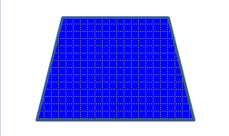

[Home](index.php) | [WordprocessingML (docx)](anatomyofOOXML.php) | [SpreadsheetML (xlsx)](anatomyofOOXML-xlsx.php) | [PresentationML (pptx)](anatomyofOOXML-pptx.php) | [DrawingML](drwOverview.php)

* [Overview](drwOverview.php)
* Pictures
  + [Overview](drwPic.php)
  + Image Properties
    - [Image Data](drwPic-ImageData.php)
    - [Tile or Stretch Image to Fill](drwPic-tile.php)
    - [Effects](drwPic-effects.php)
  + [Non-Visual Properties](drwPic-nvPicPr.php)
  + [Shape Properties](drwSp-SpPr.php)
* Shapes
  + [Overview](drwShape.php)
  + [Non-Visual Properties](drwSp-nvSpPr.php)
  + [Visual Properties](drwSp-SpPr.php)
    - [Size of Bounding Box](drwSp-size.php)
    - [Location of Bounding Box](drwSp-location.php)
    - Geometry
      * [Preset](drwSp-prstGeom.php)
      * [Custom](drwSp-custGeom.php)
    - [Shape Fill](drwSp-shapeFill.php)
      * [Solid Fill](drwSp-SolidFill.php)
      * [Picture Fill](drwSp-PictFill.php)
      * [Gradient Fill](drwSp-GradFill.php)
      * [Pattern Fill](drwSp-PattFill.php)
      * [Group Fill](drwSp-grpFill.php)
    - [Effects](drwSp-effects.php)
    - [Outline Style](drwSp-outline.php)
    - [2D Transforms](drwSp-rotate.php)
    - 3-D
      * [Shape Properties](drwSp-3dProps.php)
      * [Scene Properties](drwSp-3dScene.php)
  + [Styles](drwSp-styles.php)
  + [Text](drwSp-text.php)
    - [Text Body Properties](drwSp-text-bodyPr.php)
      * [Positioning and Insets](drwSp-text-bodyPr-inset.php)
      * [Fit, Wrap, Warp and 3D](drwSp-text-bodyPr-fit.php)
      * [Columns, Vertical Text and Rotation](drwSp-text-bodyPr-columns.php)
    - [Paragraphs](drwSp-text-paragraph.php)
      * [Paragraph Properties](drwSp-text-paraProps.php)
        + [Bullets and Numbering](drwSp-text-paraProps-numbering.php)
        + [Spacing, Indent and Margins](drwSp-text-paraProps-margins.php)
        + [Alignment, Tabs, Other](drwSp-text-paraProps-align.php)
      * [Run Properties](drwSp-text-runProps.php)
    - [List Properties](drwSp-text-lstPr.php)
* [Connectors](drwCxnSp.php)
  + [Non-Visual Properties](drwSp-nvCxnSpPr.php)
* [Text](drwSp-textbox.php)
* Charts
* Diagrams
* [Tables](drwTable.php)
  + [Defining Structure](drwTableGrid.php)
  + [Rows, Cells, Cell Content](drwTableRowAndCell.php)
  + Cell Properties
    - [Alignment, Margins, Direction](drwTableCellProperties-alignment.php)
    - [Borders and Fill](drwTableCellProperties-bordersFills.php)
  + [Table Styles and Properties](drwTableStyles.php)
* Placement within Docs
  + [Overview](drwPicInWord.php)
  + [Inline Objects](drwPicInline.php)
  + [Floating Objects](drwPicFloating.php)
    - [Positioning](drwPicFloating-position.php)
    - [Text Wrapping](drwPicFloating-textWrap.php)
* Placement within Spreadsheets
  + [Overview](drwPicInSpread.php)
  + [Absolute Anchoring](drwPicInSpread-absolute.php)
  + [One Cell Anchoring](drwPicInSpread-oneCell.php)
  + [Two Cell Anchoring](drwPicInSpread-twoCell.php)
* [Placement within Presentations](drwPicInPresentation.php)

# DrawingML Shapes

Pattern Fill

A pattern fill specifies a repeated pattern to be used to fill the object. It is specified with the <a:pattFill> element. There are three basic properties to a pattern: (1) the actual pattern to be used, specified by the prst attribute, (2) the foreground color, specified as a child element <a:fgClr>, and (3) the background color, specified as a child element <a:bgClr>.

<a:pattFill prst="dotGrid">

<a:fgClr>

<a:prstClr val="gray"/>

</a:fgClr>

<a:bgClr>

<a:prstClr val="blue"/>

</a:bgClr>

</a:pattFill>

### Elements:

A <a:pattFill> has the following elements.

| Element | Description |
| --- | --- |
| bgClr | Specifies the background color of the pattern fill. Colors can be specified using one of the following color options: as a preset color (<a:prstClr>), using hue, saturation and luminance (<a:hslClr>), scheme colors (<a:schemeClr>), system colors (<a:sysClr>), or as RGB percentages or hex numbers (<a:scrgbClr> or <a:srgbClr>). Note that these elements corresponding to color specification methods can also have child elements which transform the base color. So, for example, in the sample below, a scheme or theme color is specified as accent6, but a luminance modulation is applied to that base color. Colors are not covered in detail here.  <a:schemeClr val="accent6">  <a:lumMod val="75000"/>  </a:schemeClr> |
| fgClr | Specifies the foreground color of the pattern fill. See bgClr above for discussion of color. |

<pattFill> can have the following attributes.

| Attribute | Description |
| --- | --- |
| prst | Specifies one of a set of preset patterns to fill the object. Possible values are:   * cross * dashDnDiag (dashed downward diagonal) * dashHorz * dashUpDiag * dashVert * diagBrick * diagCross * divot * dkDnDiag (dark downward diagonal) * dkHorz * dkUpDiag * dkVert * dnDiag * dotDmnd (dotted diamond) * dotGrid * horz * horzBrick * lgCheck (large checker board) * lgConfetti * lgGrid * ltDnDiag (light downward diagonal) * ltHorz * ltUpDiag * ltVert * narHor (narrow horizontal)z * narVert * openDmnd (open diamond) * pct 5 (5%) * pct 10 (10%) * pct 20 (20%) * pct 25 (25%) * pct 30 (30%) * pct 40 (40%) * pct 50 (50%) * pct 60 (60%) * pct 70 (70%) * pct 75 (75%) * pct 80 (80%) * pct 90 (90%) * plaid * shingle * smCheck (small checker board) * smConfetti * smGrid * solidDmnd * sphere * trellis * upDiag * vert * wave * wdDnDiag (wide downward diagonal) * wdUpDiag * weave * zigZag |

  

[About this site](aboutThisSite.php) | [Contact us](contactUs.php)
  
Copyright © 2023. All Rights Reserved.