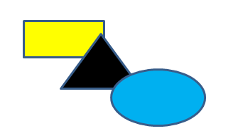

[Home](index.php) | [WordprocessingML (docx)](anatomyofOOXML.php) | [SpreadsheetML (xlsx)](anatomyofOOXML-xlsx.php) | [PresentationML (pptx)](anatomyofOOXML-pptx.php) | [DrawingML](drwOverview.php)

* [Overview](drwOverview.php)
* Pictures
  + [Overview](drwPic.php)
  + Image Properties
    - [Image Data](drwPic-ImageData.php)
    - [Tile or Stretch Image to Fill](drwPic-tile.php)
    - [Effects](drwPic-effects.php)
  + [Non-Visual Properties](drwPic-nvPicPr.php)
  + [Shape Properties](drwSp-SpPr.php)
* Shapes
  + [Overview](drwShape.php)
  + [Non-Visual Properties](drwSp-nvSpPr.php)
  + [Visual Properties](drwSp-SpPr.php)
    - [Size of Bounding Box](drwSp-size.php)
    - [Location of Bounding Box](drwSp-location.php)
    - Geometry
      * [Preset](drwSp-prstGeom.php)
      * [Custom](drwSp-custGeom.php)
    - [Shape Fill](drwSp-shapeFill.php)
      * [Solid Fill](drwSp-SolidFill.php)
      * [Picture Fill](drwSp-PictFill.php)
      * [Gradient Fill](drwSp-GradFill.php)
      * [Pattern Fill](drwSp-PattFill.php)
      * [Group Fill](drwSp-grpFill.php)
    - [Effects](drwSp-effects.php)
    - [Outline Style](drwSp-outline.php)
    - [2D Transforms](drwSp-rotate.php)
    - 3-D
      * [Shape Properties](drwSp-3dProps.php)
      * [Scene Properties](drwSp-3dScene.php)
  + [Styles](drwSp-styles.php)
  + [Text](drwSp-text.php)
    - [Text Body Properties](drwSp-text-bodyPr.php)
      * [Positioning and Insets](drwSp-text-bodyPr-inset.php)
      * [Fit, Wrap, Warp and 3D](drwSp-text-bodyPr-fit.php)
      * [Columns, Vertical Text and Rotation](drwSp-text-bodyPr-columns.php)
    - [Paragraphs](drwSp-text-paragraph.php)
      * [Paragraph Properties](drwSp-text-paraProps.php)
        + [Bullets and Numbering](drwSp-text-paraProps-numbering.php)
        + [Spacing, Indent and Margins](drwSp-text-paraProps-margins.php)
        + [Alignment, Tabs, Other](drwSp-text-paraProps-align.php)
      * [Run Properties](drwSp-text-runProps.php)
    - [List Properties](drwSp-text-lstPr.php)
* [Connectors](drwCxnSp.php)
  + [Non-Visual Properties](drwSp-nvCxnSpPr.php)
* [Text](drwSp-textbox.php)
* Charts
* Diagrams
* [Tables](drwTable.php)
  + [Defining Structure](drwTableGrid.php)
  + [Rows, Cells, Cell Content](drwTableRowAndCell.php)
  + Cell Properties
    - [Alignment, Margins, Direction](drwTableCellProperties-alignment.php)
    - [Borders and Fill](drwTableCellProperties-bordersFills.php)
  + [Table Styles and Properties](drwTableStyles.php)
* Placement within Docs
  + [Overview](drwPicInWord.php)
  + [Inline Objects](drwPicInline.php)
  + [Floating Objects](drwPicFloating.php)
    - [Positioning](drwPicFloating-position.php)
    - [Text Wrapping](drwPicFloating-textWrap.php)
* Placement within Spreadsheets
  + [Overview](drwPicInSpread.php)
  + [Absolute Anchoring](drwPicInSpread-absolute.php)
  + [One Cell Anchoring](drwPicInSpread-oneCell.php)
  + [Two Cell Anchoring](drwPicInSpread-twoCell.php)
* [Placement within Presentations](drwPicInPresentation.php)

# DrawingML Shapes

Group Fill

A set of shapes can be grouped together with a <xdr:grpSp> (or <p:grpSp>) element. That group of shapes has a set of properties (within a <grpSpPr>), and one of the properties can be a fill. The individual shapes within the shape group can specify their own fill types or they can use the fill type of the group by specifying <a:grpFill/> for their fill. Below is an example of three shapes grouped together within a spreadsheet. The group fill is specified as a solid fill of black. The triangle uses the group fill, as specified with the <a:grpFill/> element for the triangle shape's fill within its <spPr>. The rectangle and oval both specify their own solid fills.

<xdr:grpSp>

. . .

<xdr:grpSpPr>

. . .

<a:solidFill>

<a:prstClr val="black"/>

<a:solidFill>

</xdr:grpSpPr>

  

<xdr:sp macro="" textlink="">

<xdr:nvSpPr>

<xdr:cNvPr id="2" name="Rectangle 1"/>

<xdr:cNvSpPr/>

</xdr:nvSpPr>

<xdr:spPr>

. . .

<a:solidFill>

<a:srgbClr val="FFFF00"/>

</a:solidFill>

</xdr:spPr>

</xdr:sp>

  

<xdr:sp macro="" textlink="">

<xdr:nvSpPr>

<xdr:cNvPr id="3" name="Isoceles Triangle 2"/>

<xdr:cNvSpPr/>

</xdr:nvSpPr>

<xdr:spPr>

. . .

<a:grpFill/>

</xdr:spPr>

</xdr:sp>

  

<xdr:sp macro="" textlink="">

<xdr:nvSpPr>

<xdr:cNvPr id="4" name="Oval 3"/>

<xdr:cNvSpPr/>

</xdr:nvSpPr>

<xdr:spPr>

. . .

<a:solidFill>

<a:srgbClr val="00B0F0"/>

</a:solidFill>

</xdr:spPr>

</xdr:sp>

</xdr:grpSp>

  

[About this site](aboutThisSite.php) | [Contact us](contactUs.php)
  
Copyright © 2023. All Rights Reserved.