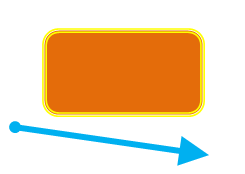
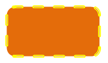
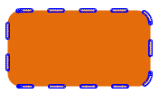

[Home](index.php) | [WordprocessingML (docx)](anatomyofOOXML.php) | [SpreadsheetML (xlsx)](anatomyofOOXML-xlsx.php) | [PresentationML (pptx)](anatomyofOOXML-pptx.php) | [DrawingML](drwOverview.php)

* [Overview](drwOverview.php)
* Pictures
  + [Overview](drwPic.php)
  + Image Properties
    - [Image Data](drwPic-ImageData.php)
    - [Tile or Stretch Image to Fill](drwPic-tile.php)
    - [Effects](drwPic-effects.php)
  + [Non-Visual Properties](drwPic-nvPicPr.php)
  + [Shape Properties](drwSp-SpPr.php)
* Shapes
  + [Overview](drwShape.php)
  + [Non-Visual Properties](drwSp-nvSpPr.php)
  + [Visual Properties](drwSp-SpPr.php)
    - [Size of Bounding Box](drwSp-size.php)
    - [Location of Bounding Box](drwSp-location.php)
    - Geometry
      * [Preset](drwSp-prstGeom.php)
      * [Custom](drwSp-custGeom.php)
    - [Shape Fill](drwSp-shapeFill.php)
      * [Solid Fill](drwSp-SolidFill.php)
      * [Picture Fill](drwSp-PictFill.php)
      * [Gradient Fill](drwSp-GradFill.php)
      * [Pattern Fill](drwSp-PattFill.php)
      * [Group Fill](drwSp-grpFill.php)
    - [Effects](drwSp-effects.php)
    - [Outline Style](drwSp-outline.php)
    - [2D Transforms](drwSp-rotate.php)
    - 3-D
      * [Shape Properties](drwSp-3dProps.php)
      * [Scene Properties](drwSp-3dScene.php)
  + [Styles](drwSp-styles.php)
  + [Text](drwSp-text.php)
    - [Text Body Properties](drwSp-text-bodyPr.php)
      * [Positioning and Insets](drwSp-text-bodyPr-inset.php)
      * [Fit, Wrap, Warp and 3D](drwSp-text-bodyPr-fit.php)
      * [Columns, Vertical Text and Rotation](drwSp-text-bodyPr-columns.php)
    - [Paragraphs](drwSp-text-paragraph.php)
      * [Paragraph Properties](drwSp-text-paraProps.php)
        + [Bullets and Numbering](drwSp-text-paraProps-numbering.php)
        + [Spacing, Indent and Margins](drwSp-text-paraProps-margins.php)
        + [Alignment, Tabs, Other](drwSp-text-paraProps-align.php)
      * [Run Properties](drwSp-text-runProps.php)
    - [List Properties](drwSp-text-lstPr.php)
* [Connectors](drwCxnSp.php)
  + [Non-Visual Properties](drwSp-nvCxnSpPr.php)
* [Text](drwSp-textbox.php)
* Charts
* Diagrams
* [Tables](drwTable.php)
  + [Defining Structure](drwTableGrid.php)
  + [Rows, Cells, Cell Content](drwTableRowAndCell.php)
  + Cell Properties
    - [Alignment, Margins, Direction](drwTableCellProperties-alignment.php)
    - [Borders and Fill](drwTableCellProperties-bordersFills.php)
  + [Table Styles and Properties](drwTableStyles.php)
* Placement within Docs
  + [Overview](drwPicInWord.php)
  + [Inline Objects](drwPicInline.php)
  + [Floating Objects](drwPicFloating.php)
    - [Positioning](drwPicFloating-position.php)
    - [Text Wrapping](drwPicFloating-textWrap.php)
* Placement within Spreadsheets
  + [Overview](drwPicInSpread.php)
  + [Absolute Anchoring](drwPicInSpread-absolute.php)
  + [One Cell Anchoring](drwPicInSpread-oneCell.php)
  + [Two Cell Anchoring](drwPicInSpread-twoCell.php)
* [Placement within Presentations](drwPicInPresentation.php)

# DrawingML Shapes

Outline

The style of the shape's outline is specified with the <a:ln> element. The properties that are determined by this element include such things as the size or weight of the outline, the color, the fill type, and the connector ends. (The style of joints where lines connect is also determined by this element but is not covered here.)

Below is an example of two shapes (a rounded rectangle and a line), each with different outline properties.

<xdr:sp macro="" textlink="">

. . .

<xdr:spPr>

<a:xfrm>

<a:off x="1066800" y="514350"/>

<a:ext cx="1504950" cy="800100"/>

</a:xfrm>

<a:prstGeom prst="roundRect">

<a:avLst/>

</a:prstGeom>

<a:solidFill>

<a:schemeClr val="accent6">

<a:lumMod val="75000"/>

</a:schemeClr>

</a:solidFill>

<a:ln w="50800" cap="rnd" cmpd="dbl">

<a:solidFill>

<a:srgbClr val="FFFF00"/>

</a:solidFill>

</a:ln>

</xdr:spPr>

. . .

</xdr:sp>

  

<xdr:cxnSp macro="">

. . .

<xdr:spPr>

<a:xfrm>

<a:off x="790575" y="1438275"/>

<a:ext cx="1847850" cy="266700"/>

</a:xfrm>

<a:prstGeom prst="line">

<a:avLst/>

</a:prstGeom>

<a:ln w="57150" cap="rnd">

<a:solidFill>

<a:srgbClr val="00B0F0"/>

</a:solidFill>

<a:round/>

<a:headEnd type="oval" w="sm" len="sm"/>

<a:tailEnd type="triangle" w="lg" len="lg"/>

</a:ln>

</xdr:spPr>

</xdr:cxnSp>

## Weight or Size of the Outline

The weight of the line is specified by the w attribute of the <a:ln> element. Values are in EMUs. 1pt = 12700 EMUs. If the attribute is omitted, then a value of 0 is assumed. The line in the example above has a width of 4.5 points, or w="57150".

## Single or Compound Line

The line type for the outline is specified by the cmpd attribute of the <a:ln> element. Possible values are dbl (double lines), sng (single line), thickThin (double lines; one thick, one thin), thinThick (double lines; one thin, one thick), tri (three lines; thin, thick, thin). The default if the attribute is omitted is sng. The rectangle above has a double line: cmpd="dbl".

## Dash Pattern

A preset dashed line pattern can be specified with an empty <a:prstDash> element within <a:ln>. The style of the dash is specified by the val attribute of the <a:prstDash> element. Possible values are:

* dash
* dashDot
* dot
* lgDash (large dash)
* lgDashDot
* lgDashDotDot
* solid
* sysDash (system dash)
* sysDashDot
* sysDashDotDot
* sysDot

If we add a dash to the rectangle above, we get the following:

<a:ln w="50800" cap="rnd" cmpd="dbl">

<a:solidFill>

<a:srgbClr val="FFFF00"/>

</a:solidFill>

<a:prstDash val="dash"/>

</a:ln>

It is also possible to specify a custom dash pattern with a <a:custDash> element. This element contains a list of dash stop elements (<a:ds>) that are building blocks for the dash scheme. Each of the <a:ds> elements has a d attribute representing the length (as a percentage) of the dash relative to the line width and an sp attribute representing the space relative to the line width (also as a percentage).

## Fill Type

The type of fill for the line is specified by a child element of the <a:ln> element. The possible fill types include most of the fill types that are available for the shape itself: [solid](dwrSp-SolidFill.php) (<a:solidFill>), [pattern](dwrSp-PattFill.php) (<a:pattFill>), [gradient](dwrSp-GradFill.php) (<a:gradFill>), or [none](drwSp-shapeFill.php) (<a:noFill>). (There is no picture or group fill.) They are specified with the same child elements as they are with the shape fills, so they are not covered here in detail. Instead, consult the corresponding shape fills at the links above. Below is a sample pattern fill for the outline of the rectangle above.

<a:ln w="50800" cap="rnd" cmpd="dbl">

<a:pattFill>

<a:fgClr>

<a:prstClr val="gray"/>

</a:fgClr>

<a:bgClr>

<a:prstClr val="blue"/>

</a:bgClr>

</a:pattFill>

<a:prstDash val="dash"/>

</a:ln>

## Line Head and End Styles

"Decorations" can be added to the head and end of lines using the <a:headEnd> and <a:tailEnd> elements. Each of these elements is an empty element, with three attributes that specify the characteristics of the head or end.

The len attribute specifies the length of the head or end in relation to the line width. Possible values are lg(large), med(medium), and sm(small).

The type attribute specifies the decoration. possible values are arrow, diamond, none, oval, stealth, and triangle.

The w attribute specifies the width of the line head or end in relation to the line width. Possible values are the same as the values for the len attribute.

Below is an example of of a line with a stealth arrow head, of medium size and large length, and a diamond tail with a small width and a large length.

<a:headEnd type="stealth" w="med" len="lg"/>

<a:tailEnd type="diamond" w="sm" len="lg"/>

  

[About this site](aboutThisSite.php) | [Contact us](contactUs.php)
  
Copyright © 2023. All Rights Reserved.