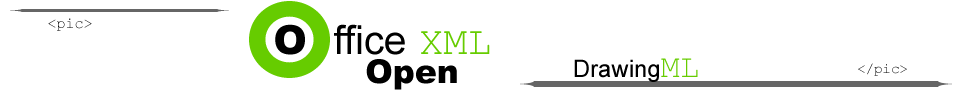

[Home](index.php) | [WordprocessingML (docx)](anatomyofOOXML.php) | [SpreadsheetML (xlsx)](anatomyofOOXML-xlsx.php) | [PresentationML (pptx)](anatomyofOOXML-pptx.php) | [DrawingML](drwOverview.php)

* [Overview](drwOverview.php)
* Pictures
  + [Overview](drwPic.php)
  + Image Properties
    - [Image Data](drwPic-ImageData.php)
    - [Tile or Stretch Image to Fill](drwPic-tile.php)
    - [Effects](drwPic-effects.php)
  + [Non-Visual Properties](drwPic-nvPicPr.php)
  + [Shape Properties](drwSp-SpPr.php)
* Shapes
  + [Overview](drwShape.php)
  + [Non-Visual Properties](drwSp-nvSpPr.php)
  + [Visual Properties](drwSp-SpPr.php)
    - [Size of Bounding Box](drwSp-size.php)
    - [Location of Bounding Box](drwSp-location.php)
    - Geometry
      * [Preset](drwSp-prstGeom.php)
      * [Custom](drwSp-custGeom.php)
    - [Shape Fill](drwSp-shapeFill.php)
      * [Solid Fill](drwSp-SolidFill.php)
      * [Picture Fill](drwSp-PictFill.php)
      * [Gradient Fill](drwSp-GradFill.php)
      * [Pattern Fill](drwSp-PattFill.php)
      * [Group Fill](drwSp-grpFill.php)
    - [Effects](drwSp-effects.php)
    - [Outline Style](drwSp-outline.php)
    - [2D Transforms](drwSp-rotate.php)
    - 3-D
      * [Shape Properties](drwSp-3dProps.php)
      * [Scene Properties](drwSp-3dScene.php)
  + [Styles](drwSp-styles.php)
  + [Text](drwSp-text.php)
    - [Text Body Properties](drwSp-text-bodyPr.php)
      * [Positioning and Insets](drwSp-text-bodyPr-inset.php)
      * [Fit, Wrap, Warp and 3D](drwSp-text-bodyPr-fit.php)
      * [Columns, Vertical Text and Rotation](drwSp-text-bodyPr-columns.php)
    - [Paragraphs](drwSp-text-paragraph.php)
      * [Paragraph Properties](drwSp-text-paraProps.php)
        + [Bullets and Numbering](drwSp-text-paraProps-numbering.php)
        + [Spacing, Indent and Margins](drwSp-text-paraProps-margins.php)
        + [Alignment, Tabs, Other](drwSp-text-paraProps-align.php)
      * [Run Properties](drwSp-text-runProps.php)
    - [List Properties](drwSp-text-lstPr.php)
* [Connectors](drwCxnSp.php)
  + [Non-Visual Properties](drwSp-nvCxnSpPr.php)
* [Text](drwSp-textbox.php)
* Charts
* Diagrams
* [Tables](drwTable.php)
  + [Defining Structure](drwTableGrid.php)
  + [Rows, Cells, Cell Content](drwTableRowAndCell.php)
  + Cell Properties
    - [Alignment, Margins, Direction](drwTableCellProperties-alignment.php)
    - [Borders and Fill](drwTableCellProperties-bordersFills.php)
  + [Table Styles and Properties](drwTableStyles.php)
* Placement within Docs
  + [Overview](drwPicInWord.php)
  + [Inline Objects](drwPicInline.php)
  + [Floating Objects](drwPicFloating.php)
    - [Positioning](drwPicFloating-position.php)
    - [Text Wrapping](drwPicFloating-textWrap.php)
* Placement within Spreadsheets
  + [Overview](drwPicInSpread.php)
  + [Absolute Anchoring](drwPicInSpread-absolute.php)
  + [One Cell Anchoring](drwPicInSpread-oneCell.php)
  + [Two Cell Anchoring](drwPicInSpread-twoCell.php)
* [Placement within Presentations](drwPicInPresentation.php)

# DrawingML Shapes

Preset Geometry

The geometry or form of a shape can be either preset or custom. A set of preset geometric shapes are specified in the ECMA specification which any application should be able to render. A preset form is specified with a <a:prstGeom> element. The actual shape is specified with an attribute prst on that element. The possible values are specified below. Note that the preset geometry can be adjusted by specifying a list of shape adjustment values within a <a:avLst>, which is a child element of <a:prstGeom>. Shape adjustment values are not covered here. Note also that any preset geometrical shape can be alternately specified as a custom geometry. The alternate custom drawingML for each preset shape is found in the DrawingMLGeometries Appendix D to the ECMA specification, in an xml file called presetShapeDefinitions.xml

Below is a sample of a preset trapezoid geometrical shape.

<xdr:sp macro="" textlink="">

. . .

<xdr:spPr>

<a:xfrm>

<a:off x="1171575" y="485775"/>

<a:ext cx="1171575" cy="647700"/>

</a:xfrm>

<a:prstGeom prst="trapezoid">

<a:avLst/>

</a:prstGeom>

<a:solidFill>

<a:schemeClr val="accent6"/>

<a:lumMod val="75000"/>

</a:schemeClr>

</a:solidFill>

</xdr:spPr>

. . .

</xdr:sp>

The possible values for prst (i.e., the pre-defined shapes) are listed below. For examples of the shapes, see ECMA-376, 3rd Edition (June, 2011), Fundamentals and Markup Language Reference § 20.1.10.54.

* accentBorderCallout1
* accentBorderCallout2
* accentBorderCallout3
* accentCallout1
* accentCallout2
* accentCallout3
* actionButtonBackPrevious
* actionButtonBeginning
* actionButtonBlank
* actionButtonDocument
* actionButtonEnd
* actionButtonForwardNext
* actionButtonHelp
* actionButtonHome
* actionButtonInformation
* actionButtonMovie
* actionButtonReturn
* actionButtonSound
* arc
* bentArrow
* bentConnector2
* bentConnector3
* bentConnector4
* bentConnector5
* bentUpArrow
* bevel
* blockArc
* borderCallout1
* borderCallout2
* borderCallout3
* bracePair
* bracketPair
* callout1
* callout2
* callout3
* can
* chartPlus
* chartStar
* chartX
* chevron
* chord
* circularArrow
* cloud
* cloudCallout
* corner
* cornerTabs
* cube
* curvedConnector2
* curvedConnector3
* curvedConnector4
* curvedConnector5
* curvedDownArrow
* curvedLeftArrow
* curvedRightArrow
* curvedUpArrow
* decagon
* diagStripe
* diamond
* dodecagon
* donut
* doubleWave
* downArrow
* downArrowCallout
* ellipse
* ellipseRibbon
* ellipseRibbon2
* flowChartAlternateProcess
* flowChartCollate
* flowChartConnector
* flowChartDecision
* flowChartDelay
* flowChartDisplay
* flowChartDocument
* flowChartExtract
* flowChartInputOutput
* flowChartInternalStorage
* flowChartMagneticDisk
* flowChartMagneticDrum
* flowChartMagneticTape
* flowChartManualInput
* flowChartManualOperation
* flowChartMerge
* flowChartMultidocument
* flowChartOfflineStorage
* flowChartOffpageConnector
* flowChartOnlineStorage
* flowChartOr
* flowChartPredefinedProcess
* flowChartPreparation
* flowChartProcess
* flowChartPunchedCard
* flowChartPunchedTape
* flowChartSort
* flowChartSummingJunction
* flowChartTerminator
* folderCorner
* frame
* funnel
* gear6
* gear9
* halfFrame
* heart
* heptagon
* hexagon
* homePlate
* horizontalScroll
* irregularSeal1
* irregularSeal2
* leftArrow
* leftArrowCallout
* leftBrace
* leftBracket
* leftCircularArrow
* leftRightArrow
* leftRightArrowCallout
* leftRightCircularArrow
* leftRightRibbon
* irregularSeal1
* leftRightUpArrow
* leftUpArrow
* lightningBolt
* line
* lineInv
* mathDivide
* mathEqual
* mathMinus
* mathMultiply
* mathNotEqual
* mathPlus
* moon
* nonIsoscelesTrapezoid
* noSmoking
* notchedRightArrow
* octagon
* parallelogram
* pentagon
* pie
* pieWedge
* plaque
* plaqueTabs
* plus
* quadArrow
* quadArrowCallout
* rect
* ribbon
* ribbon2
* rightArrow
* rightArrowCallout
* rightBrace
* rightBracket
* round1Rect
* round2DiagRect
* round2SameRect
* roundRect
* rtTriangle
* smileyFace
* snip1Rect
* snip2DiagRect
* snip2SameRect
* snipRoundRect
* squareTabs
* star10
* star12
* star16
* star24
* star32
* star4
* star5
* star6
* star7
* star8
* straightConnector1
* stripedRightArrow
* sun
* swooshArrow
* teardrop
* trapezoid
* triangle
* upArrow
* upArrowCallout
* upDownArrow
* upDownArrowCallout
* uturnArrow
* verticalScroll
* wave
* wedgeEllipseCallout
* wedgeRectCallout
* wedgeRoundRectCallout

  

[About this site](aboutThisSite.php) | [Contact us](contactUs.php)
  
Copyright © 2023. All Rights Reserved.