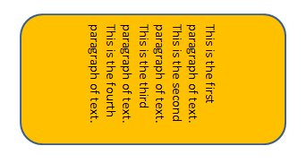
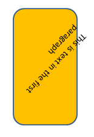

[Home](index.php) | [WordprocessingML (docx)](anatomyofOOXML.php) | [SpreadsheetML (xlsx)](anatomyofOOXML-xlsx.php) | [PresentationML (pptx)](anatomyofOOXML-pptx.php) | [DrawingML](drwOverview.php)

* [Overview](drwOverview.php)
* Pictures
  + [Overview](drwPic.php)
  + Image Properties
    - [Image Data](drwPic-ImageData.php)
    - [Tile or Stretch Image to Fill](drwPic-tile.php)
    - [Effects](drwPic-effects.php)
  + [Non-Visual Properties](drwPic-nvPicPr.php)
  + [Shape Properties](drwSp-SpPr.php)
* Shapes
  + [Overview](drwShape.php)
  + [Non-Visual Properties](drwSp-nvSpPr.php)
  + [Visual Properties](drwSp-SpPr.php)
    - [Size of Bounding Box](drwSp-size.php)
    - [Location of Bounding Box](drwSp-location.php)
    - Geometry
      * [Preset](drwSp-prstGeom.php)
      * [Custom](drwSp-custGeom.php)
    - [Shape Fill](drwSp-shapeFill.php)
      * [Solid Fill](drwSp-SolidFill.php)
      * [Picture Fill](drwSp-PictFill.php)
      * [Gradient Fill](drwSp-GradFill.php)
      * [Pattern Fill](drwSp-PattFill.php)
      * [Group Fill](drwSp-grpFill.php)
    - [Effects](drwSp-effects.php)
    - [Outline Style](drwSp-outline.php)
    - [2D Transforms](drwSp-rotate.php)
    - 3-D
      * [Shape Properties](drwSp-3dProps.php)
      * [Scene Properties](drwSp-3dScene.php)
  + [Styles](drwSp-styles.php)
  + [Text](drwSp-text.php)
    - [Text Body Properties](drwSp-text-bodyPr.php)
      * [Positioning and Insets](drwSp-text-bodyPr-inset.php)
      * [Fit, Wrap, Warp and 3D](drwSp-text-bodyPr-fit.php)
      * [Columns, Vertical Text and Rotation](drwSp-text-bodyPr-columns.php)
    - [Paragraphs](drwSp-text-paragraph.php)
      * [Paragraph Properties](drwSp-text-paraProps.php)
        + [Bullets and Numbering](drwSp-text-paraProps-numbering.php)
        + [Spacing, Indent and Margins](drwSp-text-paraProps-margins.php)
        + [Alignment, Tabs, Other](drwSp-text-paraProps-align.php)
      * [Run Properties](drwSp-text-runProps.php)
    - [List Properties](drwSp-text-lstPr.php)
* [Connectors](drwCxnSp.php)
  + [Non-Visual Properties](drwSp-nvCxnSpPr.php)
* [Text](drwSp-textbox.php)
* Charts
* Diagrams
* [Tables](drwTable.php)
  + [Defining Structure](drwTableGrid.php)
  + [Rows, Cells, Cell Content](drwTableRowAndCell.php)
  + Cell Properties
    - [Alignment, Margins, Direction](drwTableCellProperties-alignment.php)
    - [Borders and Fill](drwTableCellProperties-bordersFills.php)
  + [Table Styles and Properties](drwTableStyles.php)
* Placement within Docs
  + [Overview](drwPicInWord.php)
  + [Inline Objects](drwPicInline.php)
  + [Floating Objects](drwPicFloating.php)
    - [Positioning](drwPicFloating-position.php)
    - [Text Wrapping](drwPicFloating-textWrap.php)
* Placement within Spreadsheets
  + [Overview](drwPicInSpread.php)
  + [Absolute Anchoring](drwPicInSpread-absolute.php)
  + [One Cell Anchoring](drwPicInSpread-oneCell.php)
  + [Two Cell Anchoring](drwPicInSpread-twoCell.php)
* [Placement within Presentations](drwPicInPresentation.php)

# DrawingML Shapes

Text - Body Properties - Columns, Vertical Text and Rotation

## Columns:

Columns for text within a shape may be specified by adding a numCols attribute on <a:bodyPr>. The value indicates the number of columns. When columns are applied, the width of the bounding box is divided by the number of columns. The columns are then treated as overflow containers--when the previous colun is filled, text flows to the next column. When all columns have been filled, the overflow properties are used. See text fit at [Shapes - Text - Fit, Wrap, Warp and 3D](drwSp-text-bodyPr-fit.php).

Below is an example of a shape with three columns (<a:bodyPr anchor="ctr" numCols="3"/>).

To change the column order to a right-to-left order, add the rtlCol attribute (<a:bodyPr anchor="ctr" numCols="3" rtlCol="1" />). A value of false is assumed if this attribute is omitted.

The space between columns can be specified with the spcCol attribute. The value is in EMUs. Below is the same shape as above, but with a half an inch of space between columns (<a:bodyPr anchor="ctr" numCols="3" rtlCol="1" spcCol="457200"/>).

## Vertical Text:

Text within a shape may be displayed vertically by specifying the vert attribute on <a:bodyPr>. Possible values for this attribute are:

* eaVert (East Asian vertical)
* horz (horizontal--the default)
* mongolianVert (some fonts are displayed as if rotated 90 degrees while others--mostly East Asian--are displayed vertically; text flows top down, left to right)
* vert (vertical)
* vert270 (each line is 270 degrees rotated clockwise, so it goes bottom to top and each line is to the right of the previous)
* wordArtVert ("one letter on top of another")
* wordArtVertRtl (vertical WordArt should be shown from right to left rather than left to right)

Below is a shape with text displayed vertically (<a:bodyPr anchor="ctr" vert="vert"/>).

## Text Rotation:

Text within the bounding box of a shape can be rotated independently of the shape by specifying a rotation with the rot attribute on <a:bodyPr>. Values are in 60,000ths of a degree. Below is a sample shape and text, first with no rotation and then with a 45 degree rotation (<a:bodyPr anchor="ctr" rot="2700000"/>).

To show the shape and text rotating independently, below is a sample shape with a 90 degree rotation and the text with a 45 degree rotation.

<p:spPr>

<a:xfrm rot="5400000"/>

. . .

</a:xfrm>

. . .

</p:spPr>

. . .

<p:txBody>

<a:bodyPr rtlCol="0" anchor="ctr" rot="2700000"/>

. . .

</p:txBody>

To prevent text from rotating when a shape is rotated, the text can be rotated with a negative value in the same amount as the shape rotation. Below is a shape rotated 45 degrees and the text rotated -45 degrees. The shape appears to remain fixed.

<p:spPr>

<a:xfrm rot="2700000"/>

. . .

</a:xfrm>

. . .

</p:spPr>

. . .

<p:txBody>

<a:bodyPr rtlCol="0" anchor="ctr" rot="-2700000"/>

. . .

</p:txBody>

Note that a similar result can be achieved using the upright attribute discussed below.

## Text Upright:

Text can be specified to remain upright using the upright attribute on <a:bodyPr>. This will keep the text upright regardless of the transform applied to it or to the accompanying shape. Values are either true or false; false is the default value. Below is a the same shape as above (a 45 degree rotation has been applied), but the text is specified to remain upright.

<p:spPr>

<a:xfrm rot="2700000"/>

. . .

</a:xfrm>

. . .

</p:spPr>

. . .

<p:txBody>

<a:bodyPr rtlCol="0" anchor="ctr" upright="1"/>

. . .

</p:txBody>

  

[About this site](aboutThisSite.php) | [Contact us](contactUs.php)
  
Copyright © 2023. All Rights Reserved.