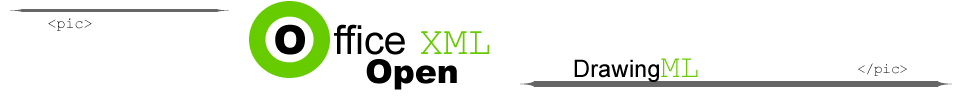

[Home](index.php) | [WordprocessingML (docx)](anatomyofOOXML.php) | [SpreadsheetML (xlsx)](anatomyofOOXML-xlsx.php) | [PresentationML (pptx)](anatomyofOOXML-pptx.php) | [DrawingML](drwOverview.php)

* [Overview](drwOverview.php)
* Pictures
  + [Overview](drwPic.php)
  + Image Properties
    - [Image Data](drwPic-ImageData.php)
    - [Tile or Stretch Image to Fill](drwPic-tile.php)
    - [Effects](drwPic-effects.php)
  + [Non-Visual Properties](drwPic-nvPicPr.php)
  + [Shape Properties](drwSp-SpPr.php)
* Shapes
  + [Overview](drwShape.php)
  + [Non-Visual Properties](drwSp-nvSpPr.php)
  + [Visual Properties](drwSp-SpPr.php)
    - [Size of Bounding Box](drwSp-size.php)
    - [Location of Bounding Box](drwSp-location.php)
    - Geometry
      * [Preset](drwSp-prstGeom.php)
      * [Custom](drwSp-custGeom.php)
    - [Shape Fill](drwSp-shapeFill.php)
      * [Solid Fill](drwSp-SolidFill.php)
      * [Picture Fill](drwSp-PictFill.php)
      * [Gradient Fill](drwSp-GradFill.php)
      * [Pattern Fill](drwSp-PattFill.php)
      * [Group Fill](drwSp-grpFill.php)
    - [Effects](drwSp-effects.php)
    - [Outline Style](drwSp-outline.php)
    - [2D Transforms](drwSp-rotate.php)
    - 3-D
      * [Shape Properties](drwSp-3dProps.php)
      * [Scene Properties](drwSp-3dScene.php)
  + [Styles](drwSp-styles.php)
  + [Text](drwSp-text.php)
    - [Text Body Properties](drwSp-text-bodyPr.php)
      * [Positioning and Insets](drwSp-text-bodyPr-inset.php)
      * [Fit, Wrap, Warp and 3D](drwSp-text-bodyPr-fit.php)
      * [Columns, Vertical Text and Rotation](drwSp-text-bodyPr-columns.php)
    - [Paragraphs](drwSp-text-paragraph.php)
      * [Paragraph Properties](drwSp-text-paraProps.php)
        + [Bullets and Numbering](drwSp-text-paraProps-numbering.php)
        + [Spacing, Indent and Margins](drwSp-text-paraProps-margins.php)
        + [Alignment, Tabs, Other](drwSp-text-paraProps-align.php)
      * [Run Properties](drwSp-text-runProps.php)
    - [List Properties](drwSp-text-lstPr.php)
* [Connectors](drwCxnSp.php)
  + [Non-Visual Properties](drwSp-nvCxnSpPr.php)
* [Text](drwSp-textbox.php)
* Charts
* Diagrams
* [Tables](drwTable.php)
  + [Defining Structure](drwTableGrid.php)
  + [Rows, Cells, Cell Content](drwTableRowAndCell.php)
  + Cell Properties
    - [Alignment, Margins, Direction](drwTableCellProperties-alignment.php)
    - [Borders and Fill](drwTableCellProperties-bordersFills.php)
  + [Table Styles and Properties](drwTableStyles.php)
* Placement within Docs
  + [Overview](drwPicInWord.php)
  + [Inline Objects](drwPicInline.php)
  + [Floating Objects](drwPicFloating.php)
    - [Positioning](drwPicFloating-position.php)
    - [Text Wrapping](drwPicFloating-textWrap.php)
* Placement within Spreadsheets
  + [Overview](drwPicInSpread.php)
  + [Absolute Anchoring](drwPicInSpread-absolute.php)
  + [One Cell Anchoring](drwPicInSpread-oneCell.php)
  + [Two Cell Anchoring](drwPicInSpread-twoCell.php)
* [Placement within Presentations](drwPicInPresentation.php)

# DrawingML Shapes

Text - Body Properties - Fit, Wrap, Warp and 3D

## Text Fit:

Text within a shape can be specified so that it is automatically scaled to fit within the text box. Alternatively the shape can be scaled to fit the text. Scaling of text can also be turned off so that text outside of the text box is not displayed. In fact, that is the default behavior--no scaling. Finally, there are two attributes that affect the fit of text horizonally and vertially. (Note also that text wrapping can affect whether text remains within the box. See [text wrapping](#textWrap), below.) First we discuss the overall scaling that is specified with child elements of <a:bodyPr>.

To scale the text, add <a:normAutoFit> as a child of <a:bodyPr>. There are two attributes which affect the scaling. First, you can specify the percentage of the original font size to which the text is scaled with the fontScale attribute, specified as a percent. (If omitted, the value is assumed to be 100%.) Second, specify the percent by which the line spacing of paragraphs is reduced with the lnSpcReduction attribute, also a percent. (If omitted, the value is assumed to be 0%.)

<xdr:txBody>

<a:bodyPr vertOverflow="clip" rtlCol="0" anchor="ctr">

<a:normAutoFit fontScale="75%" lnSpcReduction="20%"/>

</a:bodyPr>

<a:lstStyle/>

<a:p>

<a:pPr algn="l"/>

<a:r>

<a:rPr lang="en-US" sz="1100"/>

<a:t>This is a paragraph of text within the shape.</a:t>

</a:r>

</a:p>

<a:p>

<a:pPr algn="ctr"/>

<a:r>

<a:rPr lang="en-US" sz="1100"/>

<a:t>This is the second paragraph.</a:t>

</a:r>

</a:p>

</xdr:txBody>

Below is an example of a shape with text. The text fits within the box.

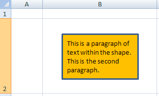

Below is the same shape, but with an additional paragraph of text. When we specify <a:normAutoFit fontScale="75%" lnSpcReduction="20%"/>, the text is scaled to fit within the shape, as shown below.

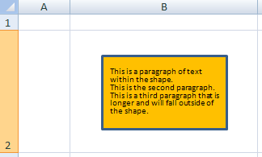

If we turn off scaling by replacing <a:normAutoFit> with <a:noAutoFit />, the text no longer fits within the box, as shown by the two images below.

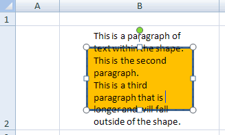
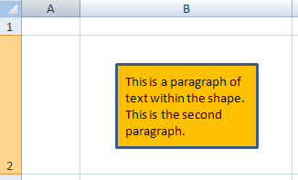

If instead we want the shape itself to scale to the text, then we add <a:spAutoFit />. Below is the shape with the additional third paragraph, but also an additional fourth and fifth paragraphs typed into it. Note that with Word, the resizing does not occur until additional text is added to the shape.

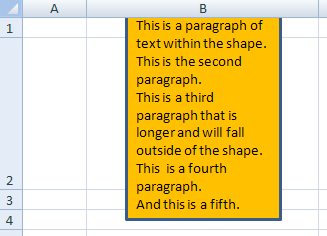

In addition to the above elements which affect overall scaling, there are also two attributes of <a:bodyPr> which affect the fit of text within a shape. They are horzOverflow and vertOverflow. They determiine whether text can flow out of the bounding box horizonally and vertically. Possibly values for horzOverflow are:

* clip (to clip the text at the horizonal overflow)
* overflow (allow horizontal overflow--the default)

Possibly values for vertOverflow are:

* clip (to clip the text at the vertical overflow)
* ellipsis (to use an ellipsis to denote that there is text which is not visible)
* overflow (allow vertical overflow--the default)

Below is a sample shape with excess text, first with the default behaviors. The second example shows the shape with vertical overflow set to clip (<a:bodyPr rtlCol="0" anchor="ctr" vertOverflow="clip"/>). The third example shows the shape with vertical overflow set to ellipsis (<a:bodyPr rtlCol="0" anchor="ctr" vertOverflow="ellipsis"/>).

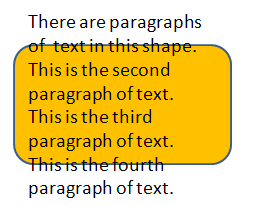

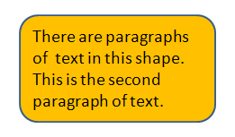
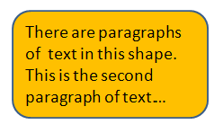

## Text Wrap:

Text wrapping may be turned on or off with the wrap attribute on <a:bodyPr>. Possible values are square and none. By default text is wrapped inside the bounding box (<a:bodyPr . . . wrap="square" />). Below is a shape with wrapping turned off (<a:bodyPr . . . wrap="none" />).

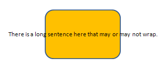

## Text Warp:

A piece of text within a shape can be warped by specifying a preset shape to be applied to the text, thereby warping the text. This is done by including the <a:prstTxWarp> element as a child of <a:bodyPr>. The actual shape to apply as the warping effect is given in the prst attribute of <a:prstTxWarp>. Possible values are given below. Note that a list of shape adjustment values (<a:avLst>) can be specified as a child element of <a:prstTxWarp>. These adjustment values are not covered here.

* textArchDown
* textArchDownPour
* textArchUp
* textArchUpPour
* textButton
* textButtonPour
* textCanDown
* textCanUp
* textCascadeDown
* textCascadeUp
* textChevron
* textChevronInverted
* textCircle
* textCirclePour
* textCurveDown
* textCurveUp
* textDeflate
* textDeflateBottom
* textDeflateInflate
* textDeflateInflateDeflate
* textDeflateTop
* textDoubleWave1
* textFadeLeft
* textFadeRight
* textFadeUp
* textInflate
* textInflateBottom
* textInflateTop
* textNoShape
* textPlain
* textRingInside
* textRingOutside
* textSlantDown
* textSlantUp
* textStop
* textTriangle
* textTriangleInverted
* textWave1
* textWave2
* textWave4

Below is some text with a downward arch (textArchDown) applied to the text.

<xdr:txBody>

<a:bodyPr vertOverflow="clip" rtlCol="0" anchor="ctr">

<a:prstTxWarp prst="textArchDown"/>

<a:avLst/>

</a:prstTxWarp>

</a:bodyPr>

<. . .;

</xdr:txBody>

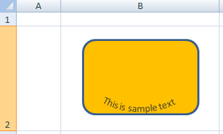

## Line Spacing:

There are a couple of attributes on <a:bodyPr> that affect the spacing of lines of text within a shape. First, spcFirstLastPara determines whether the spacing between paragraphs as specified by the user is respected for the first and last paragraphs within the shape. If the attribute value is set to false (the default), then the paragraph spacing is not respected for the first and last paragraphs. Below is a shape with paragraphs of text with a specified spacing before of 12 points. The first sample respects the paragraph spacing (<a:bodyPr anchor="ctr" rtlCol="0" spcFirstLastPara="1"/>) and the second does not (<a:bodyPr anchor="ctr" rtlCol="0" spcFirstLastPara="0"/>).

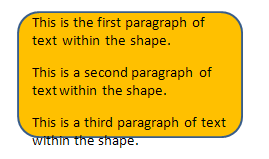
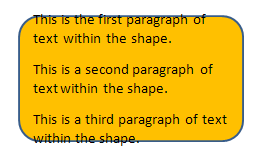

There is also a compatLnSpc attribute which specifies whether line spacing is determined in a simplistic mmaer using the font scene. Values are either trust or false (the default).

## Anti-Aliased Text:

Text within a shape can be forced to be rendered anti-aliased regardless of the font size by specifying the forceAA attribute on <a:bodyPr>. A value of true will force anti-aliasing; the default is false.

## 3D Properties:

As with shapes, it is possible to specify 3D properties for text within shapes. They are specified for text within shapes just as they are with the shapes, except that the containing element is the <a:bodyPr> element rather than the <a:spPr> element. See [3D Shape Properties](drwSp-3dProps.php) for details on extrusion, contours, and bevels. See [3D Scene Properties](drwSp-3dScene.php) for details on camera and light rig. Note that there is also a <a:flatTx> element to indicate that there should be no text in a 3D scene. It is an empty child element of span class="featuredItem"><a:bodyPr>.

Below is a sample shape with text that has 3D properties.

<xdr:txBody>

<a:bodyPr rtlCol="0" anchor="ctr">

<a:scene3d>

<a:camera prst="isometricRightUp"/>

<a:lightRig rig="freezing" dir="t">

<a:rot lat="0" lon="0" rev="15600000"/>

</a:lightRig>

</a:scene3d>

<a:sp3d extrusionH="57150" contourW="31750" prstMaterial="softEdge">

<a:bevelT w="38100" h="38100" prst="relaxedInset"/>

<a:bevelB w="38100" h="38100" prst="coolSlant"/>

<a:extrusionClr>

<a:schemeClr val="accent2">

<a:lumMod val="6000">

<a:lumOff val="4000">

</a:schemeClr>

</a:extrusionClr>

<a:contourClr>

<a:schemeClr val="tx2">

<a:lumMod val="6000">

<a:lumOff val="4000">

</a:schemeClr>

</a:contourClr>

</a:sp3d>

</a:bodyPr>

<. . .;

</xdr:txBody>

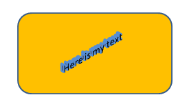

  

[About this site](aboutThisSite.php) | [Contact us](contactUs.php)
  
Copyright © 2023. All Rights Reserved.