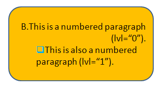

[Home](index.php) | [WordprocessingML (docx)](anatomyofOOXML.php) | [SpreadsheetML (xlsx)](anatomyofOOXML-xlsx.php) | [PresentationML (pptx)](anatomyofOOXML-pptx.php) | [DrawingML](drwOverview.php)

* [Overview](drwOverview.php)
* Pictures
  + [Overview](drwPic.php)
  + Image Properties
    - [Image Data](drwPic-ImageData.php)
    - [Tile or Stretch Image to Fill](drwPic-tile.php)
    - [Effects](drwPic-effects.php)
  + [Non-Visual Properties](drwPic-nvPicPr.php)
  + [Shape Properties](drwSp-SpPr.php)
* Shapes
  + [Overview](drwShape.php)
  + [Non-Visual Properties](drwSp-nvSpPr.php)
  + [Visual Properties](drwSp-SpPr.php)
    - [Size of Bounding Box](drwSp-size.php)
    - [Location of Bounding Box](drwSp-location.php)
    - Geometry
      * [Preset](drwSp-prstGeom.php)
      * [Custom](drwSp-custGeom.php)
    - [Shape Fill](drwSp-shapeFill.php)
      * [Solid Fill](drwSp-SolidFill.php)
      * [Picture Fill](drwSp-PictFill.php)
      * [Gradient Fill](drwSp-GradFill.php)
      * [Pattern Fill](drwSp-PattFill.php)
      * [Group Fill](drwSp-grpFill.php)
    - [Effects](drwSp-effects.php)
    - [Outline Style](drwSp-outline.php)
    - [2D Transforms](drwSp-rotate.php)
    - 3-D
      * [Shape Properties](drwSp-3dProps.php)
      * [Scene Properties](drwSp-3dScene.php)
  + [Styles](drwSp-styles.php)
  + [Text](drwSp-text.php)
    - [Text Body Properties](drwSp-text-bodyPr.php)
      * [Positioning and Insets](drwSp-text-bodyPr-inset.php)
      * [Fit, Wrap, Warp and 3D](drwSp-text-bodyPr-fit.php)
      * [Columns, Vertical Text and Rotation](drwSp-text-bodyPr-columns.php)
    - [Paragraphs](drwSp-text-paragraph.php)
      * [Paragraph Properties](drwSp-text-paraProps.php)
        + [Bullets and Numbering](drwSp-text-paraProps-numbering.php)
        + [Spacing, Indent and Margins](drwSp-text-paraProps-margins.php)
        + [Alignment, Tabs, Other](drwSp-text-paraProps-align.php)
      * [Run Properties](drwSp-text-runProps.php)
    - [List Properties](drwSp-text-lstPr.php)
* [Connectors](drwCxnSp.php)
  + [Non-Visual Properties](drwSp-nvCxnSpPr.php)
* [Text](drwSp-textbox.php)
* Charts
* Diagrams
* [Tables](drwTable.php)
  + [Defining Structure](drwTableGrid.php)
  + [Rows, Cells, Cell Content](drwTableRowAndCell.php)
  + Cell Properties
    - [Alignment, Margins, Direction](drwTableCellProperties-alignment.php)
    - [Borders and Fill](drwTableCellProperties-bordersFills.php)
  + [Table Styles and Properties](drwTableStyles.php)
* Placement within Docs
  + [Overview](drwPicInWord.php)
  + [Inline Objects](drwPicInline.php)
  + [Floating Objects](drwPicFloating.php)
    - [Positioning](drwPicFloating-position.php)
    - [Text Wrapping](drwPicFloating-textWrap.php)
* Placement within Spreadsheets
  + [Overview](drwPicInSpread.php)
  + [Absolute Anchoring](drwPicInSpread-absolute.php)
  + [One Cell Anchoring](drwPicInSpread-oneCell.php)
  + [Two Cell Anchoring](drwPicInSpread-twoCell.php)
* [Placement within Presentations](drwPicInPresentation.php)

# DrawingML Shapes

Text - List Properties and Default Style

## List Properties

A paragraph within a shape can have a level assigned to it. The level is assigned by the lvl attribute on <a:pPr> for the paragraph. The level is specified as a numeric value of between 0 and 8, since there are 9 possible levels For example, <a:pPr lvl="1"/> indicates that the paragraph is a level 2. Each level can have a group of properties assigned to it using a style. So, for example, the paragraphs assigned to level 2 (<a:pPr lvl="1"/>) will use the lvl2pPr list style if such a style is defined. Note that a paragraph can have both a level assigned with an associated list style, as well as additional properties specified within the <a:pPr> for the paragraph. In such a case properties defined at a level closer to the actual text take precedence, and in this example, that means the properties in the <a:pPr> would prevail over conflicting properties defined in the list style.

The various list styles for a <a:txBody> within a shape are contained within a <a:lstStyle>. A <a:lstStyle> can define nine possible styles: <a:lvl1pPr> (level 1), <a:lvl2pPr> (level 2), <a:lvl3pPr> (level 3) . . . <a:lvl9pPr> (level 9). Below is an example of styles assigned to level 1 and level 2, with corresponding paragraphs at those levels.

<a:txBody>

<a:bodyPr rtlCol="0" anchor="ctr"/>

<a:lstStyle>

<a:lvl1pPr algn="r">

<a:buAutoNum type="alphaUcPeriod" startAt="2"/>

</a:lvl1pPr>

<a:lvl2pPr>

<a:buClr>

<a:srgbClr val="00B0F0"/>

</a:buClr>

<a:buFont typeface="Wingdings"/>

<a:buChar char="q"/>

</a:lvl2pPr>

</a:lstStyle>

<a:p>

<a:pPr lvl="0"/>

. . .

</a:p>

<a:p>

<a:pPr lvl="1"/>

. . .

</a:p>

</a:txBody>

The particular properties of each level style are the same that can be applied directly as paragraph properties. However, instead of being child elements or attributes of the <a:pPr> element for the paragraph, they are child elements or attributes of the particular element for the level style--i.e., <a:lvl1pPr>, <a:lvl2pPr>, <a:lvl3pPr>, etc.

For details of the properties, see [Shapes - Text - Paragraph Properties](drwSp-text-paraProps.php) and related pages for [Bullets and Numbering](drwSp-text-paraProps-numbering.php), [Spacing, Indent and Margins](drwSp-text-paraProps-margins.php), and [Alignment, Tabs, Other](drwSp-text-paraProps-align.php).

## Default Paragraph Style

A default paragraph style for paragraphs within a shape that have no other properties assigned can be specified within the <a:lstStyle> with a child element <a:defPPr>. This element is a sibling of the list styles discussed above and is defined in the same way, with the same properties. Note that default run properties can be specified with other default paragraph properties with a <a:defRPr> child element, which itself can contain the properties discussed at [Shapes - Text - Run Properties](drwSp-text-runProps.php). Below is a sample definition of default paragraph properties, with a default run property of bold.

<a:txBody>

<a:bodyPr rtlCol="0" anchor="ctr"/>

<a:lstStyle>

<a:defPPr>

<a:defRPr b="1"/>

</a:defPPr>

</a:lstStyle>

. . .

<a:txBody>

  

[About this site](aboutThisSite.php) | [Contact us](contactUs.php)
  
Copyright © 2023. All Rights Reserved.