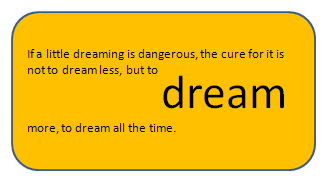
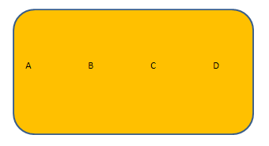
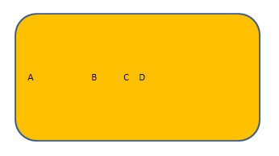
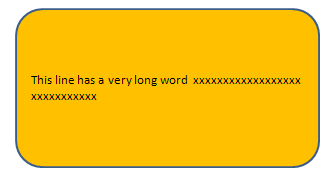
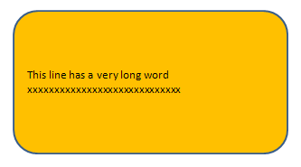

[Home](index.php) | [WordprocessingML (docx)](anatomyofOOXML.php) | [SpreadsheetML (xlsx)](anatomyofOOXML-xlsx.php) | [PresentationML (pptx)](anatomyofOOXML-pptx.php) | [DrawingML](drwOverview.php)

* [Overview](drwOverview.php)
* Pictures
  + [Overview](drwPic.php)
  + Image Properties
    - [Image Data](drwPic-ImageData.php)
    - [Tile or Stretch Image to Fill](drwPic-tile.php)
    - [Effects](drwPic-effects.php)
  + [Non-Visual Properties](drwPic-nvPicPr.php)
  + [Shape Properties](drwSp-SpPr.php)
* Shapes
  + [Overview](drwShape.php)
  + [Non-Visual Properties](drwSp-nvSpPr.php)
  + [Visual Properties](drwSp-SpPr.php)
    - [Size of Bounding Box](drwSp-size.php)
    - [Location of Bounding Box](drwSp-location.php)
    - Geometry
      * [Preset](drwSp-prstGeom.php)
      * [Custom](drwSp-custGeom.php)
    - [Shape Fill](drwSp-shapeFill.php)
      * [Solid Fill](drwSp-SolidFill.php)
      * [Picture Fill](drwSp-PictFill.php)
      * [Gradient Fill](drwSp-GradFill.php)
      * [Pattern Fill](drwSp-PattFill.php)
      * [Group Fill](drwSp-grpFill.php)
    - [Effects](drwSp-effects.php)
    - [Outline Style](drwSp-outline.php)
    - [2D Transforms](drwSp-rotate.php)
    - 3-D
      * [Shape Properties](drwSp-3dProps.php)
      * [Scene Properties](drwSp-3dScene.php)
  + [Styles](drwSp-styles.php)
  + [Text](drwSp-text.php)
    - [Text Body Properties](drwSp-text-bodyPr.php)
      * [Positioning and Insets](drwSp-text-bodyPr-inset.php)
      * [Fit, Wrap, Warp and 3D](drwSp-text-bodyPr-fit.php)
      * [Columns, Vertical Text and Rotation](drwSp-text-bodyPr-columns.php)
    - [Paragraphs](drwSp-text-paragraph.php)
      * [Paragraph Properties](drwSp-text-paraProps.php)
        + [Bullets and Numbering](drwSp-text-paraProps-numbering.php)
        + [Spacing, Indent and Margins](drwSp-text-paraProps-margins.php)
        + [Alignment, Tabs, Other](drwSp-text-paraProps-align.php)
      * [Run Properties](drwSp-text-runProps.php)
    - [List Properties](drwSp-text-lstPr.php)
* [Connectors](drwCxnSp.php)
  + [Non-Visual Properties](drwSp-nvCxnSpPr.php)
* [Text](drwSp-textbox.php)
* Charts
* Diagrams
* [Tables](drwTable.php)
  + [Defining Structure](drwTableGrid.php)
  + [Rows, Cells, Cell Content](drwTableRowAndCell.php)
  + Cell Properties
    - [Alignment, Margins, Direction](drwTableCellProperties-alignment.php)
    - [Borders and Fill](drwTableCellProperties-bordersFills.php)
  + [Table Styles and Properties](drwTableStyles.php)
* Placement within Docs
  + [Overview](drwPicInWord.php)
  + [Inline Objects](drwPicInline.php)
  + [Floating Objects](drwPicFloating.php)
    - [Positioning](drwPicFloating-position.php)
    - [Text Wrapping](drwPicFloating-textWrap.php)
* Placement within Spreadsheets
  + [Overview](drwPicInSpread.php)
  + [Absolute Anchoring](drwPicInSpread-absolute.php)
  + [One Cell Anchoring](drwPicInSpread-oneCell.php)
  + [Two Cell Anchoring](drwPicInSpread-twoCell.php)
* [Placement within Presentations](drwPicInPresentation.php)

# DrawingML Shapes

Text - Alignment, Tabs, Other

## Alignment

Alignment of text within a paragraph in a shape is specified with the algn attribute on the <a:pPr> element for the paragraph. The most common values are:

* l (left, the default value)
* r (right)
* ctr (centered)
* just (justified)
* dist (distributed, which distributes text across the entire line)

Below is a sample shape with alignment on the first paragraph set to justified (algn="just").

<a:pPr algn="just">

<a:spcAft>

<a:spcPts val="1200"/>

</a:spcAft>

</a:pPr>

## Font Alignment

Vertical alignment of words on a line is specified with the fontAlgn attribute on the <a:pPr> element for the paragraph. This is relevant when some words on a line are larger than others. In such a case, should the smaller words be positioned in the middle relative to the larger words, at the bottom or top? Possible values are:

* auto (when the text flow is horizontal, this is the same as base below)
* b (the very bottom of a line, which may be different than base because of letters such as g, q, and y, which hang below the baseline)
* base (the baseline--the default)
* ctr (centered)
* t (top)

Below is a sample with font alignment at the top (fontAlgn="t").

<a:pPr fontAlgn="t"/>

## Tabs

Custom tab stops can be specified for a paragraph within a shape with the <a:tabLst> child element of <a:pPr>. The <a:tabLst> can contain one or more tab stop definitions, each within a <a:tab>. Each such <a:tab> has a pos attribute specifying the stop relative to the left margin (either in EMUs or by a number immediately followed by a unit identifer), with each tab in the order increasing its pos value. Each <a:tab> may also have a algn attribute which specifies the alignment of text. Possible values are ctr, dec (the decimals are lined up, so right-aligned until the decimal and then left aligned after the decimal), l and r.

The default tab size can also be specified with the defTabSz attribute on <a:pPr>. Possible values are specified either in EMUs or as a number immediately followed by a unit identifier. Below is a shape with tabs between text, and the default size is set to 1 inch or 914400 EMUs.

<a:pPr defTabSz="914400"/>

Below is the same shape, but with custom tabs as follows.

<a:pPr>

<a:tabLst>

<a:tab pos="914400" algn="l"/>

<a:tab pos="1371600" algn="l"/>

<a:tab pos="1600200" algn="l"/>

<a:tab pos="1714500" algn="l"/>

<a:tabLst>

</a:pPr>

## Word Breaks

A long Latin word by default can be broken and wrapped onto the next line without a hyphen. However, it is possible to prevent this behavior by specifying the latinLnBrk attribute on <a:pPr>. A value of false or 0 will prevent a line break in such a case. Below is first a sample with latinLnBrk="1".

Below is the same shape and same paragraph, but with latinLnBrk="0".

## Hanging Punctuation

It is possible to prevent punctuation at the end of a run from being carried onto the next line by specifying the hangingPunct attribute on <a:pPr>. A value of true or 1 forces the punctuation to not be carried over and a value of false allows the punctuation to be carried to the next line. The default is false.

  

[About this site](aboutThisSite.php) | [Contact us](contactUs.php)
  
Copyright © 2023. All Rights Reserved.