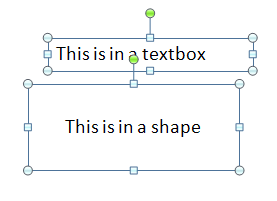

[Home](index.php) | [WordprocessingML (docx)](anatomyofOOXML.php) | [SpreadsheetML (xlsx)](anatomyofOOXML-xlsx.php) | [PresentationML (pptx)](anatomyofOOXML-pptx.php) | [DrawingML](drwOverview.php)

* [Overview](drwOverview.php)
* Pictures
  + [Overview](drwPic.php)
  + Image Properties
    - [Image Data](drwPic-ImageData.php)
    - [Tile or Stretch Image to Fill](drwPic-tile.php)
    - [Effects](drwPic-effects.php)
  + [Non-Visual Properties](drwPic-nvPicPr.php)
  + [Shape Properties](drwSp-SpPr.php)
* Shapes
  + [Overview](drwShape.php)
  + [Non-Visual Properties](drwSp-nvSpPr.php)
  + [Visual Properties](drwSp-SpPr.php)
    - [Size of Bounding Box](drwSp-size.php)
    - [Location of Bounding Box](drwSp-location.php)
    - Geometry
      * [Preset](drwSp-prstGeom.php)
      * [Custom](drwSp-custGeom.php)
    - [Shape Fill](drwSp-shapeFill.php)
      * [Solid Fill](drwSp-SolidFill.php)
      * [Picture Fill](drwSp-PictFill.php)
      * [Gradient Fill](drwSp-GradFill.php)
      * [Pattern Fill](drwSp-PattFill.php)
      * [Group Fill](drwSp-grpFill.php)
    - [Effects](drwSp-effects.php)
    - [Outline Style](drwSp-outline.php)
    - [2D Transforms](drwSp-rotate.php)
    - 3-D
      * [Shape Properties](drwSp-3dProps.php)
      * [Scene Properties](drwSp-3dScene.php)
  + [Styles](drwSp-styles.php)
  + [Text](drwSp-text.php)
    - [Text Body Properties](drwSp-text-bodyPr.php)
      * [Positioning and Insets](drwSp-text-bodyPr-inset.php)
      * [Fit, Wrap, Warp and 3D](drwSp-text-bodyPr-fit.php)
      * [Columns, Vertical Text and Rotation](drwSp-text-bodyPr-columns.php)
    - [Paragraphs](drwSp-text-paragraph.php)
      * [Paragraph Properties](drwSp-text-paraProps.php)
        + [Bullets and Numbering](drwSp-text-paraProps-numbering.php)
        + [Spacing, Indent and Margins](drwSp-text-paraProps-margins.php)
        + [Alignment, Tabs, Other](drwSp-text-paraProps-align.php)
      * [Run Properties](drwSp-text-runProps.php)
    - [List Properties](drwSp-text-lstPr.php)
* [Connectors](drwCxnSp.php)
  + [Non-Visual Properties](drwSp-nvCxnSpPr.php)
* [Text](drwSp-textbox.php)
* Charts
* Diagrams
* [Tables](drwTable.php)
  + [Defining Structure](drwTableGrid.php)
  + [Rows, Cells, Cell Content](drwTableRowAndCell.php)
  + Cell Properties
    - [Alignment, Margins, Direction](drwTableCellProperties-alignment.php)
    - [Borders and Fill](drwTableCellProperties-bordersFills.php)
  + [Table Styles and Properties](drwTableStyles.php)
* Placement within Docs
  + [Overview](drwPicInWord.php)
  + [Inline Objects](drwPicInline.php)
  + [Floating Objects](drwPicFloating.php)
    - [Positioning](drwPicFloating-position.php)
    - [Text Wrapping](drwPicFloating-textWrap.php)
* Placement within Spreadsheets
  + [Overview](drwPicInSpread.php)
  + [Absolute Anchoring](drwPicInSpread-absolute.php)
  + [One Cell Anchoring](drwPicInSpread-oneCell.php)
  + [Two Cell Anchoring](drwPicInSpread-twoCell.php)
* [Placement within Presentations](drwPicInPresentation.php)

# DrawingML Text

Text and Text Boxes

Wordprocessing and spreadsheet documents contain text as a fundamental characteristic of their structure. Create a document and begin entering text, and the text will flow in a familiar and well-defined manner. Each of these document types can also contain text of a more graphic, specialized nature, inserted into a text box or shape. The text box or shape can be located and styled apart from the other text in the document. For each of these document types, the graphical text is inserted as a drawing is inserted, in a specialized namespace covering drawingML for that document type. See [Positioning within a Spreadsheet Document](drwPicInSpread.php) and [Positioning within a Word Processing Document](drwPicInWord.php). A presentation document is not so fundamentally text-oriented, and all text within a presentation must be within a text box or shape. Its placement is defined within the main drawingML specification and namespace.

Although the way in which the text is placed within the document varies from document type to document type, the definition of the text itself remains the same. Text within a text box is really just a specialized shape containing text. See [Shapes - Text](drwSp-text.php). Every shape contains a set of non-visual properties for the canvas within the <nvSpPr> element. Within the <nvSpPr> element is <cNvSpPr>, containing a set of non-visual properties for the shape. That element has an attribute txBox, which can be either true or false. If true, then the shape is a text box. If false, or if the attrubute is not present, then the shape is not specifically a text box. In fact, though, there is little difference between a text box and a shape with text. For presentations and spreadsheets the [geometry (<a:prstGeom>)](drwSp-prstGeom.php) can be omitted. But it can and often is set with a value of rectangle (<a:prstGeom prst="rect">).

Below is a sample containing first a text box and then a shape with text. Both are shapes within a <p:sp> element. The text box has the attribute txBox="1". It also has no <p:style> element, though it could. For the shape, the style information within the <p:style> element is overridden by the lack of line and fill as specified in the <a:prstGeom> element.

<p:sp>

  

<p:nvSpPr>

<p:cNvPr id="4" name="TextBox 3"/>

<p:cNvSpPr txBox="1"/>

<p:nvPr/>

</p:nvSpPr>

  

<p:spPr>

<a:xfrm>

<a:off x="2362200" y="1066800"/>

<a:ext cx="2362200" cy="369332"/>

</a:xfrm>

<a:prstGeom prst="rect">

<a:avLst/>

</a:prstGeom>

<a:noFill/>

</p:spPr>

  

<p:txBody>

<a:bodyPr wrap="square" rtlCol="0">

<a:spAutoFit/>

</a:bodyPr>

<a:lstStyle/>

<a:p>

<a:r>

<a:rPr lang="en-US" dirty="0" smtClean="0"/>

<a:t>This is a textbox</a:t>

</a:r>

<a:endParaRPr lang="en-US" dirty="0"/>

</a:p>

</p:txBody>

  

</p:sp>

  
  

<p:sp>

  

<p:nvSpPr>

<p:cNvPr id="5" name="Rectangle 4"/>

<p:cNvSpPr/>

<p:nvPr/>

</p:nvSpPr>

  

<p:spPr>

<a:xfrm>

<a:off x="2133600" y="1600200"/>

<a:ext cx="2438400" cy="990600"/>

</a:xfrm>

<a:prstGeom prst="rect">

<a:avLst/>

</a:prstGeom>

<a:noFill/>

<a:ln/>

<a:noFill/>

</a:ln/>

</p:spPr>

  

<p:style>

<a:lnRef idx="2">

<a:schemeClr val="accent1">

<a:shade val="50000"/>

</a:schemeClr>

</a:lnRef>

<a:fillRef idx="1">

<a:schemeClr val="accent1"/>

</a:fillRef>

<a:effectRef idx="0">

<a:schemeClr val="accent1"/>

</a:effectRef>

<a:fontRef idx="minor">

<a:schemeClr val="lt1"/>

</a:fontRef>

</p:style>

  

<p:txBody>

<a:bodyPr rtlCol="0" anchor="ctr"/>

<a:lstStyle/>

<a:p>

<a:pPr algn="ctr"/>

<a:r>

<a:rPr lang="en-US" dirty="0" smtClean="0">

<a:solidFill>

<a:schemeClr val="tx1"/>

</a:solidFill>

</a:rPr>

<a:t>This is in a shape</a:t>

</a:r>

<a:endParaRPr lang="en-US" dirty="0"/>

<a:solidFill>

<a:schemeClr val="tx1"/>

</a:solidFill>

</a:endParaRPr>

</a:p>

</p:txBody>

  

</p:sp>

  

[About this site](aboutThisSite.php) | [Contact us](contactUs.php)
  
Copyright © 2023. All Rights Reserved.