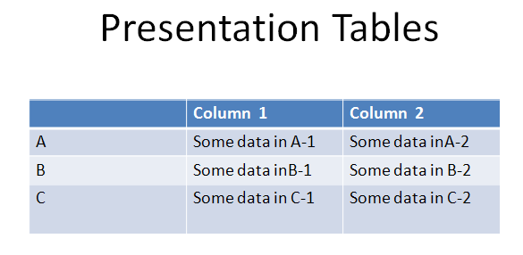

[Home](index.php) | [WordprocessingML (docx)](anatomyofOOXML.php) | [SpreadsheetML (xlsx)](anatomyofOOXML-xlsx.php) | [PresentationML (pptx)](anatomyofOOXML-pptx.php) | [DrawingML](drwOverview.php)

* [Overview](drwOverview.php)
* Pictures
  + [Overview](drwPic.php)
  + Image Properties
    - [Image Data](drwPic-ImageData.php)
    - [Tile or Stretch Image to Fill](drwPic-tile.php)
    - [Effects](drwPic-effects.php)
  + [Non-Visual Properties](drwPic-nvPicPr.php)
  + [Shape Properties](drwSp-SpPr.php)
* Shapes
  + [Overview](drwShape.php)
  + [Non-Visual Properties](drwSp-nvSpPr.php)
  + [Visual Properties](drwSp-SpPr.php)
    - [Size of Bounding Box](drwSp-size.php)
    - [Location of Bounding Box](drwSp-location.php)
    - Geometry
      * [Preset](drwSp-prstGeom.php)
      * [Custom](drwSp-custGeom.php)
    - [Shape Fill](drwSp-shapeFill.php)
      * [Solid Fill](drwSp-SolidFill.php)
      * [Picture Fill](drwSp-PictFill.php)
      * [Gradient Fill](drwSp-GradFill.php)
      * [Pattern Fill](drwSp-PattFill.php)
      * [Group Fill](drwSp-grpFill.php)
    - [Effects](drwSp-effects.php)
    - [Outline Style](drwSp-outline.php)
    - [2D Transforms](drwSp-rotate.php)
    - 3-D
      * [Shape Properties](drwSp-3dProps.php)
      * [Scene Properties](drwSp-3dScene.php)
  + [Styles](drwSp-styles.php)
  + [Text](drwSp-text.php)
    - [Text Body Properties](drwSp-text-bodyPr.php)
      * [Positioning and Insets](drwSp-text-bodyPr-inset.php)
      * [Fit, Wrap, Warp and 3D](drwSp-text-bodyPr-fit.php)
      * [Columns, Vertical Text and Rotation](drwSp-text-bodyPr-columns.php)
    - [Paragraphs](drwSp-text-paragraph.php)
      * [Paragraph Properties](drwSp-text-paraProps.php)
        + [Bullets and Numbering](drwSp-text-paraProps-numbering.php)
        + [Spacing, Indent and Margins](drwSp-text-paraProps-margins.php)
        + [Alignment, Tabs, Other](drwSp-text-paraProps-align.php)
      * [Run Properties](drwSp-text-runProps.php)
    - [List Properties](drwSp-text-lstPr.php)
* [Connectors](drwCxnSp.php)
  + [Non-Visual Properties](drwSp-nvCxnSpPr.php)
* [Text](drwSp-textbox.php)
* Charts
* Diagrams
* [Tables](drwTable.php)
  + [Defining Structure](drwTableGrid.php)
  + [Rows, Cells, Cell Content](drwTableRowAndCell.php)
  + Cell Properties
    - [Alignment, Margins, Direction](drwTableCellProperties-alignment.php)
    - [Borders and Fill](drwTableCellProperties-bordersFills.php)
  + [Table Styles and Properties](drwTableStyles.php)
* Placement within Docs
  + [Overview](drwPicInWord.php)
  + [Inline Objects](drwPicInline.php)
  + [Floating Objects](drwPicFloating.php)
    - [Positioning](drwPicFloating-position.php)
    - [Text Wrapping](drwPicFloating-textWrap.php)
* Placement within Spreadsheets
  + [Overview](drwPicInSpread.php)
  + [Absolute Anchoring](drwPicInSpread-absolute.php)
  + [One Cell Anchoring](drwPicInSpread-oneCell.php)
  + [Two Cell Anchoring](drwPicInSpread-twoCell.php)
* [Placement within Presentations](drwPicInPresentation.php)

# DrawingML Tables

Tables in DrawingML are found mostly within presentations. The core table model is defined within the main drawingML namespace (xmlns:a="http://schemas.openxmlformats.org/drawingml/2006/main) at section 21.1 of the ECMA OOXML specification (3rd edition). As noted at the [overview of DrawingML](drwOverview.php), OOXML has three different table models--one for wordprocessing, one for spreadsheets, and one for drawingML (used mostly in presentationML documents). The drawingML table model is similar to the wordprocessing model, but it allows for the application of drawingML effects on the tables or cells.

A table is added to a presentation slide within a <p:graphicFrame> container, within the main presentationML namespace (prefix 'p'). Within the<p:graphicFrame> container is a <a:graphic> element in the drawingML namespace. And within that element is the <p:graphicData> element with its uri attribute that declares the type of data as table data: uri="http://schemas.openxmlformats.org/drawingml/2006/table".

The <p:graphicFrame> container is within the shape tree for the slide (<p:spTree>), along with other shapes and pictures found on the slide. The shape tree element is itself contained within the slide's common slide data container element <p:cSld>. See the [DrawingML Overview](drwOverview.php) and [Drawing Object Placement](drwPicInPresentation.php) for details of placement of tables. Below is a sample presentation slide with one shape and one table.

<p:sld . . . >

. . .

<p:cSld>

<p:spTree>

  

<p:sp>

. . .

</p:sp>

  

<p:graphicFrame>

. . .

<a:graphic>

<a:graphicData uri="http://schemas.openxmlformats.org/drawingml/2006/table">

<a:tbl>

<. . .

</a:tbl>

</a:graphicData>

</a:graphic>

</p:graphicFrame>

  

</p:spTree>

</p:cSld>

. . .

</p:sld>

The table itself is defined within the <a:tbl> element,
which itself contains a definition of the table structure (within a
<a:tblGrid> element), table properties
(within a <a:tblPr> element), and content
(within one or more <a:tr> table row elements).
A drawingML table can contain only text.

  

[About this site](aboutThisSite.php) | [Contact us](contactUs.php)
  
Copyright © 2023. All Rights Reserved.