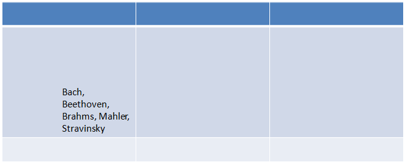

[Home](index.php) | [WordprocessingML (docx)](anatomyofOOXML.php) | [SpreadsheetML (xlsx)](anatomyofOOXML-xlsx.php) | [PresentationML (pptx)](anatomyofOOXML-pptx.php) | [DrawingML](drwOverview.php)

* [Overview](drwOverview.php)
* Pictures
  + [Overview](drwPic.php)
  + Image Properties
    - [Image Data](drwPic-ImageData.php)
    - [Tile or Stretch Image to Fill](drwPic-tile.php)
    - [Effects](drwPic-effects.php)
  + [Non-Visual Properties](drwPic-nvPicPr.php)
  + [Shape Properties](drwSp-SpPr.php)
* Shapes
  + [Overview](drwShape.php)
  + [Non-Visual Properties](drwSp-nvSpPr.php)
  + [Visual Properties](drwSp-SpPr.php)
    - [Size of Bounding Box](drwSp-size.php)
    - [Location of Bounding Box](drwSp-location.php)
    - Geometry
      * [Preset](drwSp-prstGeom.php)
      * [Custom](drwSp-custGeom.php)
    - [Shape Fill](drwSp-shapeFill.php)
      * [Solid Fill](drwSp-SolidFill.php)
      * [Picture Fill](drwSp-PictFill.php)
      * [Gradient Fill](drwSp-GradFill.php)
      * [Pattern Fill](drwSp-PattFill.php)
      * [Group Fill](drwSp-grpFill.php)
    - [Effects](drwSp-effects.php)
    - [Outline Style](drwSp-outline.php)
    - [2D Transforms](drwSp-rotate.php)
    - 3-D
      * [Shape Properties](drwSp-3dProps.php)
      * [Scene Properties](drwSp-3dScene.php)
  + [Styles](drwSp-styles.php)
  + [Text](drwSp-text.php)
    - [Text Body Properties](drwSp-text-bodyPr.php)
      * [Positioning and Insets](drwSp-text-bodyPr-inset.php)
      * [Fit, Wrap, Warp and 3D](drwSp-text-bodyPr-fit.php)
      * [Columns, Vertical Text and Rotation](drwSp-text-bodyPr-columns.php)
    - [Paragraphs](drwSp-text-paragraph.php)
      * [Paragraph Properties](drwSp-text-paraProps.php)
        + [Bullets and Numbering](drwSp-text-paraProps-numbering.php)
        + [Spacing, Indent and Margins](drwSp-text-paraProps-margins.php)
        + [Alignment, Tabs, Other](drwSp-text-paraProps-align.php)
      * [Run Properties](drwSp-text-runProps.php)
    - [List Properties](drwSp-text-lstPr.php)
* [Connectors](drwCxnSp.php)
  + [Non-Visual Properties](drwSp-nvCxnSpPr.php)
* [Text](drwSp-textbox.php)
* Charts
* Diagrams
* [Tables](drwTable.php)
  + [Defining Structure](drwTableGrid.php)
  + [Rows, Cells, Cell Content](drwTableRowAndCell.php)
  + Cell Properties
    - [Alignment, Margins, Direction](drwTableCellProperties-alignment.php)
    - [Borders and Fill](drwTableCellProperties-bordersFills.php)
  + [Table Styles and Properties](drwTableStyles.php)
* Placement within Docs
  + [Overview](drwPicInWord.php)
  + [Inline Objects](drwPicInline.php)
  + [Floating Objects](drwPicFloating.php)
    - [Positioning](drwPicFloating-position.php)
    - [Text Wrapping](drwPicFloating-textWrap.php)
* Placement within Spreadsheets
  + [Overview](drwPicInSpread.php)
  + [Absolute Anchoring](drwPicInSpread-absolute.php)
  + [One Cell Anchoring](drwPicInSpread-oneCell.php)
  + [Two Cell Anchoring](drwPicInSpread-twoCell.php)
* [Placement within Presentations](drwPicInPresentation.php)

# DrawingML Tables - Cell Properties - Text Alignment, Margins and Direction

Each cell may have a set of properties specified within a <a:tcPr>
element, which is a child of the <a:tc> element.

Properties related to horizontal and vertical alignment, margins, content direction,
and text overflow are determined by attributes of the <a:tcPr>
element. Below are the permitted attributes.

| Attribute | Description |
| --- | --- |
| anchor | Defines the alignment of text vertically within a cell. E.g., <a:tcPr anchor="ctr">. Possible values are:   * b - bottom * ctr - center * dist - distributed vertically. When text is horizontal the lines are spaced out much the same as when the value is just. When text is vertical, the letters are distributed, which is different from just because it always forces distribution even if there are only one or two words. * just - distributed vertically. When text is horizontal, this spaces out the lines and is nearly identical to when the value is dist. When text is vertical, it justifies the letters vertically. * t - top |

| anchorCtr | Values are booleans. When true, it modifies the anchor attribute and centers the text box itself so that, for example, the text can be left-aligned along the center of the cell. |

| horzOverflow | Specifies the clipping behavior of the cell. When the value is overflow (<a:tcPr horzOverflow="overflow">), text in the cell freely flows outside the cell boundaries and is visible. When the value is clip, the text is clipped and does not appear outside of the cell boundaries. |
| marB | Specifies the bottom margin of the cell. E.g., <a:tcPr marB="45720" anchor="ctr">. Values can be in EMUs or as a number followed by a unit identifier. |
| marL | Specifies the left margin of the cell. Values can be in EMUs or as a number followed by a unit identifier. |
| marR | Specifies the right margin of the cell. Values can be in EMUs or as a number followed by a unit identifier. |
| marT | Specifies the top margin of the cell. Values can be in EMUs or as a number followed by a unit identifier. |
| vert | Defines the text direction for the cell. Possible values include (omitting the East Asian options):   * horz - horizontal (the default) * vert - vertical, with each line rotated 90 degrees clockwise so that each next line is to the left of the previous * vert270 - vertical, with each line rotated 270 degrees clockwise so it goes from bottom to top, with each next line to the right of the previous * wordArtVert - determines if all of the text is vertical ("one letter on top of another") * wordArtVertRtl - specifies that vertical WordArt should be shown from right to left rather than left to right |

## Text Alignment

Below is a sample of a cell that has its content centered vertically--i.e., the anchor attribute has a
value of ctr.

<a:tr h="370840">

<a:tc>

. . .

<a:t>Bach</a:t>

. . .

<a:tcPr/>

</a:tc>

  

<a:tc>

<a:txBody>

<a:bodyPr/>

<a:lstStyle/>

<a:p>

<a:r>

<a:rPr lang="en-US" dirty="0" smtClean="0"/>

<a:t>Beethoven</a:t>

</a:r>

<a:endParaRPr lang="en-US" dirty="0"/>

</a:p>

</a:txBody>

<a:tcPr anchor="ctr"/>

</a:tc>

  

<a:tc>

. . .

<a:t>Brahms</a:t>

. . .

<a:tcPr/>

</a:tc>

  

</a:tr>

If we change the above xml to add the anchorCtr to true (<a:tcPr anchor="ctr" anchorCtr="1"/>),
the text centers as shown below:

## Cell Margins

Margins for text within a cell are set by attribute values on the <a:tcPr>
element. For example, below is a sample of a cell with left and top margins set to one inch or 914400 EMUs (<a:tcPr marL="914400" marT="914400"/>):

## Text Direction

The direction of text within a table cell is determined by the vert attribute on the <a:tcPr>
element. Below is an example of the direction set to vert
(<a:tcPr vert="vert"/>).

Below is an example of the direction set to vert270
(<a:tcPr vert="vert270"/>).

## Text Overflow

Whether text flows outside of the cell or is clipped is determined by the horzOverflow attribute on the <a:tcPr>
element. Below is an example of the overflow set to overflow
(<a:tcPr vert="wordArtVert" horzOverflow="overflow"/>).

To clip the text, set the overflow to clip
(<a:tcPr vert="wordArtVert" horzOverflow="clip"/>).

  

[About this site](aboutThisSite.php) | [Contact us](contactUs.php)
  
Copyright © 2023. All Rights Reserved.