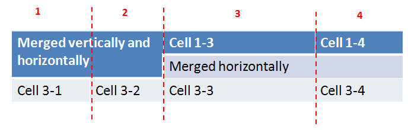
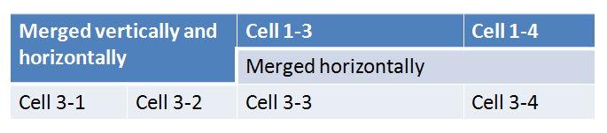

[Home](index.php) | [WordprocessingML (docx)](anatomyofOOXML.php) | [SpreadsheetML (xlsx)](anatomyofOOXML-xlsx.php) | [PresentationML (pptx)](anatomyofOOXML-pptx.php) | [DrawingML](drwOverview.php)

* [Overview](drwOverview.php)
* Pictures
  + [Overview](drwPic.php)
  + Image Properties
    - [Image Data](drwPic-ImageData.php)
    - [Tile or Stretch Image to Fill](drwPic-tile.php)
    - [Effects](drwPic-effects.php)
  + [Non-Visual Properties](drwPic-nvPicPr.php)
  + [Shape Properties](drwSp-SpPr.php)
* Shapes
  + [Overview](drwShape.php)
  + [Non-Visual Properties](drwSp-nvSpPr.php)
  + [Visual Properties](drwSp-SpPr.php)
    - [Size of Bounding Box](drwSp-size.php)
    - [Location of Bounding Box](drwSp-location.php)
    - Geometry
      * [Preset](drwSp-prstGeom.php)
      * [Custom](drwSp-custGeom.php)
    - [Shape Fill](drwSp-shapeFill.php)
      * [Solid Fill](drwSp-SolidFill.php)
      * [Picture Fill](drwSp-PictFill.php)
      * [Gradient Fill](drwSp-GradFill.php)
      * [Pattern Fill](drwSp-PattFill.php)
      * [Group Fill](drwSp-grpFill.php)
    - [Effects](drwSp-effects.php)
    - [Outline Style](drwSp-outline.php)
    - [2D Transforms](drwSp-rotate.php)
    - 3-D
      * [Shape Properties](drwSp-3dProps.php)
      * [Scene Properties](drwSp-3dScene.php)
  + [Styles](drwSp-styles.php)
  + [Text](drwSp-text.php)
    - [Text Body Properties](drwSp-text-bodyPr.php)
      * [Positioning and Insets](drwSp-text-bodyPr-inset.php)
      * [Fit, Wrap, Warp and 3D](drwSp-text-bodyPr-fit.php)
      * [Columns, Vertical Text and Rotation](drwSp-text-bodyPr-columns.php)
    - [Paragraphs](drwSp-text-paragraph.php)
      * [Paragraph Properties](drwSp-text-paraProps.php)
        + [Bullets and Numbering](drwSp-text-paraProps-numbering.php)
        + [Spacing, Indent and Margins](drwSp-text-paraProps-margins.php)
        + [Alignment, Tabs, Other](drwSp-text-paraProps-align.php)
      * [Run Properties](drwSp-text-runProps.php)
    - [List Properties](drwSp-text-lstPr.php)
* [Connectors](drwCxnSp.php)
  + [Non-Visual Properties](drwSp-nvCxnSpPr.php)
* [Text](drwSp-textbox.php)
* Charts
* Diagrams
* [Tables](drwTable.php)
  + [Defining Structure](drwTableGrid.php)
  + [Rows, Cells, Cell Content](drwTableRowAndCell.php)
  + Cell Properties
    - [Alignment, Margins, Direction](drwTableCellProperties-alignment.php)
    - [Borders and Fill](drwTableCellProperties-bordersFills.php)
  + [Table Styles and Properties](drwTableStyles.php)
* Placement within Docs
  + [Overview](drwPicInWord.php)
  + [Inline Objects](drwPicInline.php)
  + [Floating Objects](drwPicFloating.php)
    - [Positioning](drwPicFloating-position.php)
    - [Text Wrapping](drwPicFloating-textWrap.php)
* Placement within Spreadsheets
  + [Overview](drwPicInSpread.php)
  + [Absolute Anchoring](drwPicInSpread-absolute.php)
  + [One Cell Anchoring](drwPicInSpread-oneCell.php)
  + [Two Cell Anchoring](drwPicInSpread-twoCell.php)
* [Placement within Presentations](drwPicInPresentation.php)

# DrawingML Tables - Structure

A table is defined within a <a:tbl> element,
which itself contains a definition of the table structure (within a
<a:tblGrid> element), table properties
(within a <a:tblPr> element), and content
(within one or more <a:tr> table row elements).

The columns of a table are defined by the <a:tblGrid> element. The <a:tblGrid> contains an element <a:gridCol> for each possible cell size (sometimes called logical columns) in the table. The number of <a:gridCol> elements needed for the table's <a:tblGrid> is determined by extending each cell's vertical borders and counting the total number of columns defined by the lines. For example, a table which has three columns with no cells that are merged needs 3 <a:gridCol> elements in its <a:tblGrid>.

Things become more complicated when cells are not of equal length from row to row. For example, the table below has four possible or logical columns and so needs 4 <a:gridCol> elements in its <a:tblGrid> element.

The <a:tblGrid> for this table is below.

<a:tbl>

. . .

<a:tblGrid>

<a:gridCol w="1219200"/>

<a:gridCol w="1143000"/>

<a:gridCol w="2362200"/>

<a:gridCol w="1371600"/>

</a:tblGrid>

The <a:tblGrid> element contains one or more <a:gridCol> elements -- one for each column.
The <a:gridCol> element has one attribute
w which specifies the width of the column in EMUs.

### Cell Spanning

The table shown above contains examples of cells that span both vertically and horizontally.
For example, cells 1-1, 1-2, 2-1, and 2-2 have been merged and contain the text "Merged vertically and horizontally.
Cell spanning in drawingML tables is indicated differently that it is in WordprocesingML tables.
First, in wordprocessingML tables cells that have been merged do not appear in the XML for the row.
That is, there are only as many cell elements in the row as there are cells that appear visually.
In drawingML tables, every row contains as many <a:tc>
elements as there are logical columns or <a:gridCol> elements.
Second, cell spanning in wordprocessingML is indicated with elements
(<w:gridSpan> and <w:vMerge>).
However, in drawingML cell spanning is indicated with attributes of <a:tc>.

Tables contains rows or <a:tr> elements.
Each <a:tr> element contains the same number of
<a:tc> elements are there are <a:gridCol> elements.
If two or more cells are merged horizontally, then the first cell contains a gridSpan
attribute specifying the number of cells that are merged. Subsequent cells that are merged contain a
hMerge attribute set to true (hMerge="1").
If two or more cells are merged vertically, then the first cell (that is, the cell containing the content) contains a rowSpan
attribute specifying the number of rows that a cell spans. Corresponding cells in rows below that cell (that is, the cells that have been merged with the cell above) contain a
vMerge attribute set to true (vMerge="1").

The sample below shows the XML for the table above. The cells that are spanned vertically or
horizontally have matching colors for their related attributes (gridSpan and hMerge="1",
or rowSpan and vMerge).

<a:tbl>

. . .

<a:tblGrid>

<a:gridCol w="1219200"/>

<a:gridCol w="1143000"/>

<a:gridCol w="2362200"/>

<a:gridCol w="1371600"/>

</a:tblGrid>

  

<a:tr h="370840">

<a:tc rowSpan="2" gridSpan="2">

. . .

<a:t>Merged vertically and horizontally</a:t>

. . .

</a:tc>

<a:tc rowSpan="2" hMerge="1">

. . .

</a:tc>

<a:tc>

. . .

<a:t>Cell 1-3</a:t>

. . .

</a:tc>

<a:tc>

. . .

<a:t>Cell 1-4</a:t>

. . .

</a:tc>

</a:tr>

<a:tr h="370840">

<a:tc gridSpan="2" vMerge="1">

. . .

</a:tc>

<a:tc hMerge="1" vMerge="1">

. . .

</a:tc>

<a:tc gridSpan="2">

. . .

<a:t>Merged horizontally</a:t>

. . .

</a:tc>

<a:tc hMerge="1">

. . .

</a:tc>

</a:tr>

<a:tr h="370840">

<a:tc>

. . .

<a:t>Cell 3-1</a:t>

. . .

</a:tc>

<a:tc>

. . .

<a:t>Cell 3-2</a:t>

. . .

</a:tc>

<a:tc>

. . .

<a:t>Cell 3-3</a:t>

. . .

</a:tc>

<a:tc>

. . .

<a:t>Cell 3-4</a:t>

. . .

</a:tc>

</a:tr>

. . .

</a:tbl>

  

[About this site](aboutThisSite.php) | [Contact us](contactUs.php)
  
Copyright © 2023. All Rights Reserved.