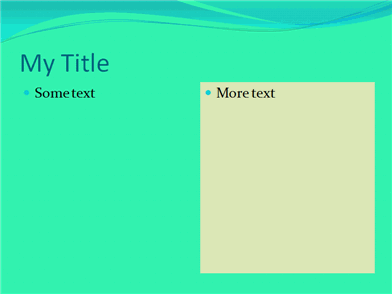
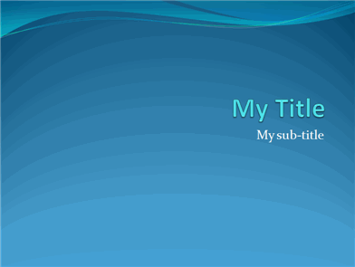
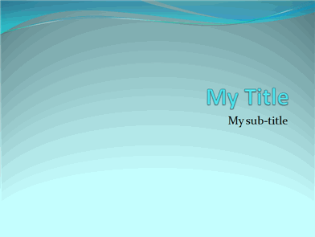

[Home](index.php) | [WordprocessingML (docx)](anatomyofOOXML.php) | [SpreadsheetML (xlsx)](anatomyofOOXML-xlsx.php)
| [DrawingML](drwOverview.php) | [PresentationML (pptx)](anatomyofOOXML-pptx.php)

* [Presentation](prPresentation.php)
* Shows
  + [Transitions](prSlide-transitions.php)
  + Animation and Timing
  + Custom Shows
* Presentation Properties
* View Properties
* Slides
  + [Overview](prSlide.php)
  + [Content (Common Slide Data)](prCommonSlideData.php)
    - [Shapes](prSlide-shapeTree.php)
    - [Tables](drwTable.php)
    - [Audio and Video](prSlide-multiMedia.php)
  + [Slide Master](prSlideMaster.php)
  + [Slide Layout](prSlideLayout.php)
  + [Slide](prPresentationSlide.php)
  + [Notes Master](prNotesMaster.php)
  + [Notes Slide](prNotesSlide.php)
  + Handout Master
* Slide Properties
  + [Size](prSlide-size.php)
  + [Background](prSlide-background.php)
  + [Headers and Footers](prSlide-footer.php)
  + Styles and Formatting
    - [Fill, Fonts, Outines, Effects](prSlide-styles-themes.php)
    - [Text Styles](prSlide-styles-textStyles.php)
  + [Color Scheme](prSlide-color.php)
  + Slide Number

# PresentationML Slides - Properties - Color Scheme

The colors used on a slide begin with the theme part for the presentation. Within the <a:themeElements> element of the theme part is a <a:clrScheme> element. The color scheme of a theme defines 12 colors: 2 dark colors (<a:dk1> and <a:dk2>), 2 light colors (<a:lt1> and <a:lt2>), 6 accent colors (<a:accent1 through accent6>), and a color for hyperlinks (<a:hlink>) and a color for followed hyperlinks (<a:folHlink>). Each of the colors may be defined by any of the methods for specifying color. See [Defining Colors](#defineClr), below. The color scheme may also have a name attribute (<a:clrScheme name="Flow">) which shows up on the user interface, typically corresponding to the name of the theme.

The colors defined in this theme color scheme are then mapped to the colors to be used for background, text, and accents in slides. This mapping first occurs at the slide, handout, or notes master level using the <p:clrMap>, an empty element, which is a child of the root master element (e.g., <p:sldMaster> element). The color scheme is mappped using attributes of <p:clrMap> corresponding to the 12 colors. For example, below is a color scheme defined in the theme part, followed by a mapping in a master slide.

<a:clrScheme name="Flow">

<a:dk1>

<a:sysClr val="windowText" lastClr="000000"/>

</a:dk1>

<a:lt1>

<a:sysClr val="window" lastClr="FFFFFF"/>

</a:lt1>

<a:dk2>

<a:srgbClr val="04617B"/>

</a:dk2>

<a:lt2>

<a:srgbClr val="DBF5F9"/>

</a:lt2>

<a:accent1>

<a:srgbClr val="0F6FC6"/>

</a:accent1>

<a:accent2>

<a:srgbClr val="009DD9"/>

</a:accent2>

<a:accent3>

<a:srgbClr val="0BD0D9"/>

</a:accent3>

<a:accent4>

<a:srgbClr val="10CF9B"/>

</a:accent4>

<a:accent5>

<a:srgbClr val="7CCA62"/>

</a:accent5>

<a:accent6>

<a:srgbClr val="A5C249"/>

</a:accent6>

<a:hlink>

<a:srgbClr val="E2D700"/>

</a:hlink>

<a:folHlink>

<a:srgbClr val="85DFD0"/>

</a:folHlink>

</a:clrScheme>

The color map within the master slide is below. For example, the first text color is mapped to dk1 in the theme, or <a:sysClr val="windowText" lastClr="000000"/>; the second background color is mapped to lt2 in the theme, or <a:srgbClr val="DBF5F9"/>.

<p:clrMap bg1="lt1" tx1="dk1" bg2="lt2" tx2="dk2" accent1="accent1" accent2="accent2" accent3="accent3" accent4="accent4" accent5="accent5" accent6="accent6" hlink="hlink" folHlink="folHlink"/>

If we alter the mapping in the master slide so that the first background color is mapped to accent4 instead of lt1 (i.e., bg1="accent4"), we get the slide as shown below. The background is now changed to the accent4 color because the background color in the master slide was set to <a:schemeClr val="bg1"/>

These color mappings found within the master slides can be overridden withing a slide layout or a slide using <p:clrMapOvr>, which is a child of <p:sld>, <p:sldLayout>, or <p:notes>. The <p:clrMapOvr> element can have one of two children: <a:masterClrMapping> or <a:overrideClrMapping>. (Note the different namespace for the children - in the main drawingML namespace.) When <a:masterClrMapping /> (an empty element without attributes) is specified, the color scheme defined in the master slide is used. Alternatively, the <a:overrideClrMapping> can be specified just as the <a:clrMap>, mapping text, background, and accent colors to theme colors using attributes. For example, suppose we start with a title slide in the Flow theme using the following color map in the master slide:

<p:clrMap bg1="lt1" tx1="dk1" bg2="lt2" tx2="dk2" accent1="accent1" accent2="accent2" accent3="accent3" accent4="accent4" accent5="accent5" accent6="accent6" hlink="hlink" folHlink="folHlink"/>

If we specify <a:masterClrMapping /> within the <p:clrMapOvr> of the slide, we get the following slide:

Now, specify an override in the slide reversing the bg1 and accent1 colors so that accent1 is assigned to the bg1 color and lt1 to the accent1 color:

<p:clrMapOvr>

<a:overrideClrMapping bg1="accent1" tx1="dk1" bg2="lt2" tx2="dk2" accent1="lt1" accent2="accent2" accent3="accent3" accent4="accent4" accent5="accent5" accent6="accent6" hlink="hlink" folHlink="folHlink"/>

</p:clrMapOvr>

This change yields the following result to the slide:

## Defining Colors

Colors are specified at potentially many points within an OOXML document. Within wordprocessingML documents, colors are specified as an RGB value or as a theme color value. For example, the color of a run of text can be specified as an RBG value with a <w:color w:val="FFFF00"/> within the run properties, or as a theme color with a <w:color w:themeColor="accent2"/>. The border of a table is specified as an attribute of the border: E.g., <w:top w:val="single" w:sz="12" w:space="0" w:color="FF0000"/> or <w:top w:val="single" w:sz="12" w:space="0" w:color="accent2"/>.

Colors are specified in a spreadsheetML document as they are in wordprocessingML documents; either as an rbg value or by referencing a theme color. For example, the foreground color of a cell can be specifed with a <fgColor rgb="FFFFFF00"/> within a <patternFill> element, or text within a cell can be assigned a theme color with a <color theme="1"/> within the run properties element, which uses an index into the <clrScheme/> of the theme part.

In drawingML (which includes themes), and consequently in presentationML documents, there are 6 different ways to specify color, and they correspond to 6 different elements.

* as a preset color (<a:prstClr val="black"/>). See ECMA-376, 3rd Edition (June, 2011), Fundamentals and Markup Language Reference at 20.1.10.47 for the complete list of enumerated values.
* using hue, saturation and luminance (<a:hslClr hue="14400000" sat="100%" lum="50%"/>)* scheme (or theme) colors (<a:schemeClr val="lt1"/>)* system colors (<a:sysClr val="windowText"/>)* as RGB percentages (<a:scrgbClr r="50%" g="50%" b="50%"/>* as RGB hex numbers<a:srgbClr val="BCBCBC"/>)

These elements corresponding to color specification methods can also have child elements which transform the base color. So, for example, in the sample below, a scheme or theme color is specified as accent6, but a luminance modulation is applied to that base color.

<a:schemeClr val="accent6">

<a:lumMod val="75000"/>

</a:schemeClr>

## Color Placeholders within Themes

Note how placeholders for colors are used within themes. For example, a theme may define a solid fill as shown below, using a "phClr" or placeholder for the value. This means that the fill will use the color specified as supplied when the theme fill style is referenced. Assume the following appears in the theme.

<a:fillStyleLst>

<a:solidFill>

<a:schemeClr val="phClr"/>

</a:solidFill>

. . .

</a:fillStyleLst>

This fill may be referenced in a shape with the <p:style> element, using the idx attribute of the <a:fillRef> element within the style. The <a:fillRef> specifies a theme color with a child <a:schemeClr> element. Below the accent2 color is specified as the color to be used in place of the placeholder in the theme.

<p:style>

. . .

<a:fillRef idx="1">

<a:schemeClr val="accent2"/>

</a:fillRef>

. . .

</p:style>

This seems needlessly obtuse in this example. However, recall that the specification of the <a:schemeClr> element within the theme may specify many different effects and alterations to the color (as child elements), so the color may be only one component of the overall fill appearance.

  

Footer