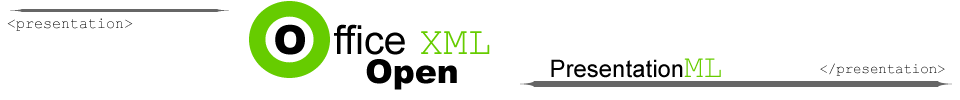
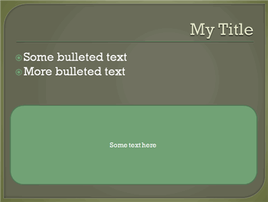
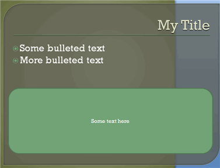

[Home](index.php) | [WordprocessingML (docx)](anatomyofOOXML.php) | [SpreadsheetML (xlsx)](anatomyofOOXML-xlsx.php)
| [DrawingML](drwOverview.php) | [PresentationML (pptx)](anatomyofOOXML-pptx.php)

* [Presentation](prPresentation.php)
* Shows
  + [Transitions](prSlide-transitions.php)
  + Animation and Timing
  + Custom Shows
* Presentation Properties
* View Properties
* Slides
  + [Overview](prSlide.php)
  + [Content (Common Slide Data)](prCommonSlideData.php)
    - [Shapes](prSlide-shapeTree.php)
    - [Tables](drwTable.php)
    - [Audio and Video](prSlide-multiMedia.php)
  + [Slide Master](prSlideMaster.php)
  + [Slide Layout](prSlideLayout.php)
  + [Slide](prPresentationSlide.php)
  + [Notes Master](prNotesMaster.php)
  + [Notes Slide](prNotesSlide.php)
  + Handout Master
* Slide Properties
  + [Size](prSlide-size.php)
  + [Background](prSlide-background.php)
  + [Headers and Footers](prSlide-footer.php)
  + Styles and Formatting
    - [Fill, Fonts, Outines, Effects](prSlide-styles-themes.php)
    - [Text Styles](prSlide-styles-textStyles.php)
  + [Color Scheme](prSlide-color.php)
  + Slide Number

# PresentationML Slides - Properties - Size

The size of slides in a presentation is set for the entire presentation with the <p:sldSZ> element within the presentation root element, and by the <p:notesSz> within the presentation root element for notes slides. The <p:sldSz> and <p:notesSz> are empty elements with three attributes. The cx and cy attributes specify the length and width, respectively, of the rectangle of the slide (in EMUs). Note that objects can be specified outside of the rectangle; the size specifies the background surface that is shown when the presentation is presented or printed. There is a third attribute type for <p:sldSz>, which specifies the kind of size that should be used, anticipating the delivery platform for the presentation. Possible values are listed below.

* 35mm
* A3
* A4
* B4ISO
* B4JIS
* B5ISO
* B5JIS
* banner
* custom
* hagakiCard
* ledger
* letter
* overhead
* screen16x10
* screen16x9
* screen4x3

Below is a sample slide and notes size.

<p:presentation>

. . .

<p:sldSz cx="9144000" cy="6858000" type="screen4x3"/>

<p:notesSz cx="6858000" cy="9144000"/>

. . .

</p:presentation>

Below is the same slide, but with the slide size reduced in length to cx="7144000".

  

Footer