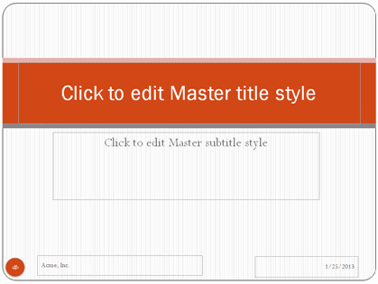
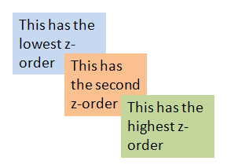
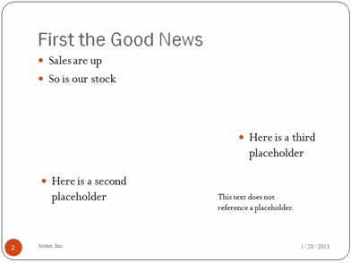

[Home](index.php) | [WordprocessingML (docx)](anatomyofOOXML.php) | [SpreadsheetML (xlsx)](anatomyofOOXML-xlsx.php)
| [DrawingML](drwOverview.php) | [PresentationML (pptx)](anatomyofOOXML-pptx.php)

* [Presentation](prPresentation.php)
* Shows
  + [Transitions](prSlide-transitions.php)
  + Animation and Timing
  + Custom Shows
* Presentation Properties
* View Properties
* Slides
  + [Overview](prSlide.php)
  + [Content (Common Slide Data)](prCommonSlideData.php)
    - [Shapes](prSlide-shapeTree.php)
    - [Tables](drwTable.php)
    - [Audio and Video](prSlide-multiMedia.php)
  + [Slide Master](prSlideMaster.php)
  + [Slide Layout](prSlideLayout.php)
  + [Slide](prPresentationSlide.php)
  + [Notes Master](prNotesMaster.php)
  + [Notes Slide](prNotesSlide.php)
  + Handout Master
* Slide Properties
  + [Size](prSlide-size.php)
  + [Background](prSlide-background.php)
  + [Headers and Footers](prSlide-footer.php)
  + Styles and Formatting
    - [Fill, Fonts, Outines, Effects](prSlide-styles-themes.php)
    - [Text Styles](prSlide-styles-textStyles.php)
  + [Color Scheme](prSlide-color.php)
  + Slide Number

# PresentationML Slides - Overview

A slide as it appears in a presentation results from the combination of three components forming a hierarchy: (1) at the bottom is what is specified for the master slide upon which the slide is based, (2) in the middle is the layout that is applied to the slide, and (3) at the top is the actual slide content.

The master slide is the template upon which the slide is built; it specifies such properties as the font styles for the title, body, and footer, placeholder positions for text and objects, bullets styles, and background. The layout is a second layer of design which may augment or override what is specified in the master slide. Finally, the slide itself will specify content and formatting that is not already specified by the master slide and slide layout. Properties and content defined in a slide layout will override similar properties and content specified in the master slide, and properties and conetent specified in the slide will override similar properties and content defines in the layout.

Each of these three components is a separate part (e.g., slideMaster1.xml, slideLayout1.xml, and slide1.xml), with different root elements (<p:sldMaster>, <p:sldLayout>, and <p:sld>). They each have slightly different content models, but they share some common elements. Below is a table showing the slide types and the elements that they can contain.

|  | Slide Master | Slide Layout | Slide | Notes Master | Notes | Handout Master |
| --- | --- | --- | --- | --- | --- | --- |
| <p:clrMap> | X |  |  | X |  | X |
| <p:cSld> | X | X | X | X | X | X |
| <p:hf> | X | X |  | X |  | X |
| <p:notesStyle> |  |  |  | X |  |  |
| <p:clrMapOvr> |  | X | X |  | X |  |
| <p:sldLayoutLst> | X |  |  |  |  |  |
| <p:timing> | X | X | X |  |  |  |
| <p:transition> | X | X | X |  |  |  |
| <p:txStyles> | X |  |  |  |  |  |

## Placeholders, Slide/Layout/Master Hierarchy, and Overriding Properties and Content

To understand how the slide hierarchy works, one must understand the use of placeholders. Placeholders link the three layers together so that overriding is possible. Slides, layouts, and masters are all similiarly constructed out of shapes. Note from the table above that each slide type has a <p:cSld> or common slide data element. Within that element is a group of one or more shapes, whether they be geometric shapes, text boxes, slide number fields, date fields, footers, etc.--they are all within shapes (<p:sp> elements). Each shape element contains a set of non-visual properties (<p:nvSpPr>). Within that element is a <p:nvPr> for non-visual properties, and that element can contain a <p:ph> element for a placeholder. The placeholder element is empty but does have several possible attributes. It is using the idx and type attributes that the shapes are linked across the three slide types.

Placeholders are created at the master and layout levels. That is, they can be added and deleted at those levels but not at the slide level. At the slide level they are only referenced or linked to the lower layout layer. That is, a slide can reference a placeholder at the layout level but not at the master level. Similarly a layout can reference a placeholder at the master slide level.

The <p:ph> element has the following possible attributes. There are no child elements.

| Attribute | Description |
| --- | --- |
| hasCustomPrompt | Indicates whether the placeholder should have a customer prompt. Values are booleans. |
| idx | Specifies the index of the placeholder. This is used when applying templates or changing layouts to match a placeholder on one template or master to another. |
| sz | Specifies the size of the placeholder. Possible values are full, half, and quarter. |
| type | Specifies what content type the placeholder is to contain. Possible values are   * body (contains body text and is allowed in slides, layouts, slide masters, notes and notes masters; can be horizontal or vertical) * chart (contains a chart or graph and is allowed in slides and layouts) * clipArt (contains a single clip art image and is allowed in slides and layouts) * ctrTitle (contains a title intended to be centered on the slide and is allowed in slides and layouts) * dgm (contains a diagram and is allowed in slides and layouts) * dt (contains the date and time and is allowed in slides, layouts, slide masters, notes, notes masters, and handout masters) * ftr (contains text used as a footer and is allowed in slides, layouts, slide masters, notes, notes masters and handout masters) * hdr (contains text used as a header and is allowed in notes, notes masters, and handout masters) * media (contains multimedia content such as audio or a movie and is allowed in slides and layouts) * obj (contains any content type and is allowed in slides and layouts) * pic (contains a picture and is allowed in slides and layouts) * sldImg (contains an image of the slide and is allowed in notes and notes masters) * sldNum (contains the number of the slide and is allowed in slides, layouts, slide masters, notes, notes masters and handout masters) * subTitle (contains a subtitle and is allowed in slides and layouts) * tbl (contains a table and is allowed in slides and layouts) * title (contains a slide title and is allowed in slides, layouts, aand slide masters; can be horizontal or vertical) |

Below are examples of a master slide, layout, and presentation slide, with corresponding placeholders in the same color.

### Slide Master

The sample master slide below specifies five shapes that are placeholders for a title, content, date, footer, and slide number. The master can specify formatting for the content of the placeholder, or it can be omitted and specified at the layout slide or at the slide level.

<p:sldMaster . . . >

<p:cSld>

. . .

<p:spTree>

. . .

<p:sp>

<p:nvSpPr>

<p:cNvPr id="22" name="Title Placeholder 21"/>

. . .

<p:nvPr>

<p:ph type="title"/>

</p:nvPr>

</p:nvSpPr>

. . .

</p:sp>

  

<p:sp>

<p:nvSpPr>

<p:cNvPr id="13" name="Text Placeholder 12"/>

. . .

<p:nvPr>

<p:ph type="body" idx="1"/>

</p:nvPr>

</p:nvSpPr>

. . .

</p:sp>

  

<p:sp>

<p:nvSpPr>

<p:cNvPr id="14" name="Date Placeholder 13"/>

. . .

<p:nvPr>

<p:ph type="dt" sz="half" idx="2"/>

</p:nvPr>

</p:nvSpPr>

. . .

</p:sp>

  

<p:sp>

<p:nvSpPr>

<p:cNvPr id="3" name="Footer Placeholder 2"/>

. . .

<p:nvPr>

<p:ph type="ftr" sz="quarter" idx="3"/>

</p:nvPr>

</p:nvSpPr>

. . .

</p:sp>

  

<p:sp>

<p:nvSpPr>

<p:cNvPr id="23" name="Slide Number Placeholder 22"/>

. . .

<p:nvPr>

<p:ph type="sldNum" sz="quarter" idx="4"/>

</p:nvPr>

</p:nvSpPr>

. . .

</p:sp>

</p:spTree>

</p:cSld>

</p:sldMaster>

### Slide Layout

The slide layout to be used for a given slide is specified in the .rels part for the slide. Below is the layout for the second slide in the presentation. In the slide2.xml.rels file is the following relationship: <Relationship Id="rId1" Type="http://schemas.openxmlformats.org/officeDocument/2006/relationships/slideLayout"
Target="../slideLayouts/slideLayout2.xml"/>. Below is one possible layout for the above master slide.

<p:sldLayout . . . >

<p:cSld>

<p:spTree>

. . .

<p:sp>

<p:nvSpPr>

<p:cNvPr id="2" name="Title 1"/>

. . .

<p:nvPr>

<p:ph type="title"/>

</p:nvPr>

</p:nvSpPr>

. . .

</p:sp>

  

<p:sp>

<p:nvSpPr>

<p:cNvPr id="4" name="Date Placeholder 3"/>

. . .

<p:nvPr>

<p:ph type="dt" sz="half" idx="10"/>

</p:nvPr>

</p:nvSpPr>

. . .

</p:sp>

  

<p:sp>

<p:nvSpPr>

<p:cNvPr id="5" name="Footer Placeholder 4"/>

. . .

<p:nvPr>

<p:ph type="ftr" sz="quarter" idx="11"/>

</p:nvPr>

</p:nvSpPr>

. . .

</p:sp>

  

<p:sp>

<p:nvSpPr>

<p:cNvPr id="6" name="Slide Number Placeholder 5"/>

. . .

<p:nvPr>

<p:ph type="sldNum" sz="quarter" idx="12"/>

</p:nvPr>

</p:nvSpPr>

. . .

</p:sp>

  

<p:sp>

<p:nvSpPr>

<p:cNvPr id="8" name="Content Placeholder 7"/>

. . .

<p:nvPr>

<p:ph sz="quarter" idx="1"/>

</p:nvPr>

</p:nvSpPr>

. . .

</p:sp>

</p:spTree>

</p:cSld>

</p:sldLayout>

### Presentation Slide

Presentation slide content may be linked to layout placeholders with the idx and type attributes of the <p:ph> element. If more than one placeholder of a given type is specified in a layout, then each placeholder must use a unique idx value matching the corressponding placeholder of the layout that is applied. Of course content on a presentation slide need not be based on a placeholder; in that case no <p:ph> element is specified for the shape that contains the content. Below is a sample slide using the layout from above.

<p:sld . . . >

<p:cSld>

<p:spTree>

. . .

<p:sp>

<p:nvSpPr>

<p:cNvPr id="2" name="Title 1"/>

. . .

<p:nvPr>

<p:ph type="title"/>

</p:nvPr>

</p:nvSpPr>

. . .

</p:sp>

  

<p:sp>

<p:nvSpPr>

<p:cNvPr id="3" name="Content Placeholder 2"/>

. . .

<p:nvPr>

<p:ph sz="quarter" idx="1"/>

</p:nvPr>

</p:nvSpPr>

. . .

</p:sp>

  

<p:sp>

<p:nvSpPr>

<p:cNvPr id="4" name="Date Placeholder 3"/>

. . .

<p:nvPr>

<p:ph type="dt" sz="half" idx="10"/>

</p:nvPr>

</p:nvSpPr>

. . .

</p:sp>

  

<p:sp>

<p:nvSpPr>

<p:cNvPr id="5" name="Slide Number Placeholder 4"/>

. . .

<p:nvPr>

<p:ph type="sldNum" sz="quarter" idx="12"/>

</p:nvPr>

</p:nvSpPr>

. . .

</p:sp>

  

<p:sp>

<p:nvSpPr>

<p:cNvPr id="6" name="Footer Placeholder 5"/>

. . .

<p:nvPr>

<p:ph type="ftr" sz="quarter" idx="11"/>

</p:nvPr>

</p:nvSpPr>

. . .

</p:sp>

</p:spTree>

</p:cSld>

</p:sld>

We could take the layout from above and add two more content placeholders, as shown below.

<p:sldLayout . . . >

<p:cSld>

<p:spTree>

. . .

<p:sp>

<p:nvSpPr>

<p:cNvPr id="2" name="Title 1"/>

. . .

<p:nvPr>

<p:ph type="title"/>

</p:nvPr>

</p:nvSpPr>

. . .

</p:sp>

  

<p:sp>

<p:nvSpPr>

<p:cNvPr id="4" name="Date Placeholder 3"/>

. . .

<p:nvPr>

<p:ph type="dt" sz="half" idx="10"/>

</p:nvPr>

</p:nvSpPr>

. . .

</p:sp>

  

<p:sp>

<p:nvSpPr>

<p:cNvPr id="5" name="Footer Placeholder 4"/>

. . .

<p:nvPr>

<p:ph type="ftr" sz="quarter" idx="11"/>

</p:nvPr>

</p:nvSpPr>

. . .

</p:sp>

  

<p:sp>

<p:nvSpPr>

<p:cNvPr id="6" name="Slide Number Placeholder 5"/>

. . .

<p:nvPr>

<p:ph type="sldNum" sz="quarter" idx="12"/>

</p:nvPr>

</p:nvSpPr>

. . .

</p:sp>

  

<p:sp>

<p:nvSpPr>

<p:cNvPr id="8" name="Content Placeholder 7"/>

. . .

<p:nvPr>

<p:ph sz="quarter" idx="1"/>

</p:nvPr>

</p:nvSpPr>

. . .

</p:sp>

  

<p:sp>

<p:nvSpPr>

<p:cNvPr id="19" name="Content Placeholder 18"/>

. . .

<p:nvPr>

<p:ph sz="quarter" idx="13"/>

</p:nvPr>

</p:nvSpPr>

. . .

</p:sp>

  

<p:sp>

<p:nvSpPr>

<p:cNvPr id="21" name="Text Placeholder 20"/>

. . .

<p:nvPr>

<p:ph type="body" sz="quarter" idx="14"/>

</p:nvPr>

</p:nvSpPr>

. . .

</p:sp>

</p:spTree>

</p:cSld>

</p:sldLayout>

Below is a presentation slide based on the above edited layout, plus an additional text box that is not based on a placeholder.

<p:sld . . . >

<p:cSld>

<p:spTree>

. . .

<p:sp>

<p:nvSpPr>

<p:cNvPr id="2" name="Title 1"/>

. . .

<p:nvPr>

<p:ph type="title"/>

</p:nvPr>

</p:nvSpPr>

. . .

</p:sp>

  

<p:sp>

<p:nvSpPr>

<p:cNvPr id="4" name="Date Placeholder 3"/>

. . .

<p:nvPr>

<p:ph type="dt" sz="half" idx="10"/>

</p:nvPr>

</p:nvSpPr>

. . .

</p:sp>

  

<p:sp>

<p:nvSpPr>

<p:cNvPr id="6" name="Footer Placeholder 5"/>

. . .

<p:nvPr>

<p:ph type="ftr" sz="quarter" idx="11"/>

</p:nvPr>

</p:nvSpPr>

. . .

</p:sp>

  

<p:sp>

<p:nvSpPr>

<p:cNvPr id="5" name="Slide Number Placeholder 4"/>

. . .

<p:nvPr>

<p:ph type="sldNum" sz="quarter" idx="12"/>

</p:nvPr>

</p:nvSpPr>

. . .

</p:sp>

  

<p:sp>

<p:nvSpPr>

<p:cNvPr id="3" name="Content Placeholder 2"/>

. . .

<p:nvPr>

<p:ph sz="quarter" idx="1"/>

</p:nvPr>

</p:nvSpPr>

. . .

</p:sp>

  

<p:sp>

<p:nvSpPr>

<p:cNvPr id="11" name="Content Placeholder 10"/>

. . .

<p:nvPr>

<p:ph sz="quarter" idx="13"/>

</p:nvPr>

</p:nvSpPr>

. . .

</p:sp>

  

<p:sp>

<p:nvSpPr>

<p:cNvPr id="12" name="Text Placeholder 11"/>

. . .

<p:nvPr>

<p:ph type="body" sz="quarter" idx="14"/>

</p:nvPr>

</p:nvSpPr>

. . .

</p:sp>

  

<p:sp>

<p:nvSpPr>

<p:cNvPr id="9" name="TextBox 8"/>

. . .

<p:nvPr/>

</p:nvSpPr>

. . .

</p:sp>

</p:spTree>

</p:cSld>

</p:sld>

  

Footer