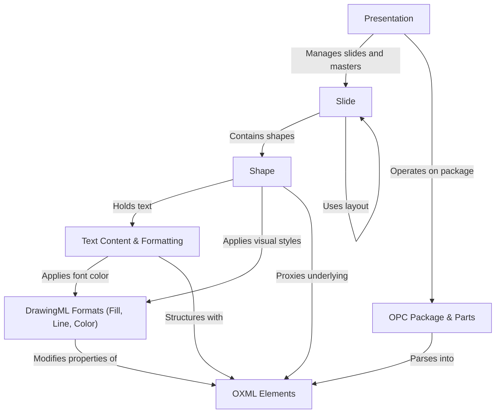
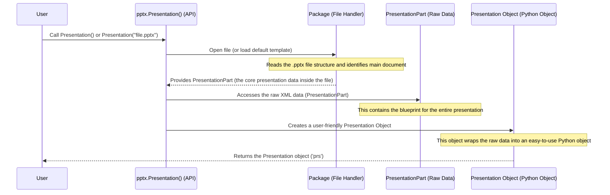
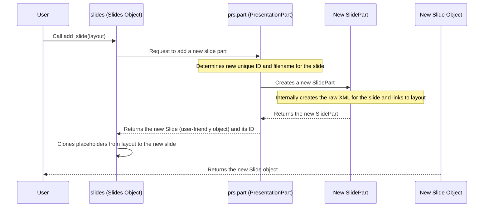
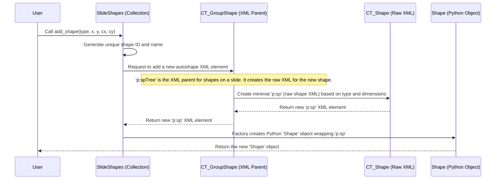
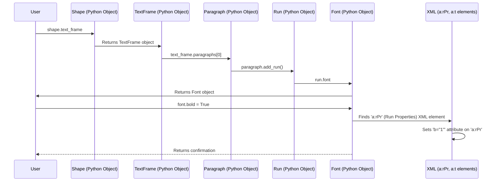
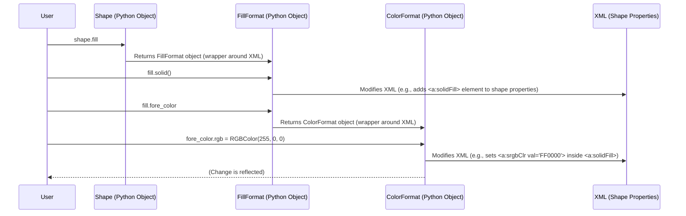
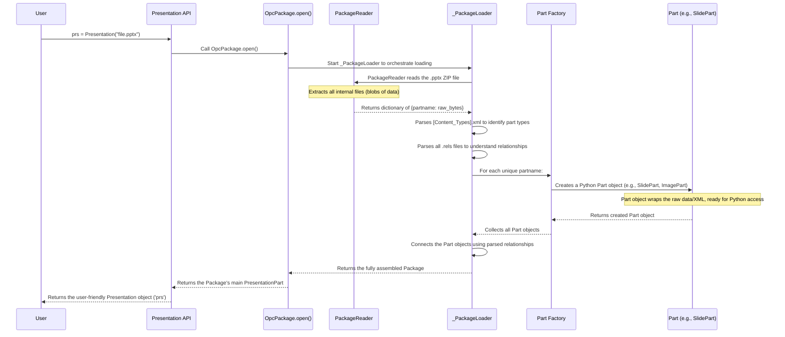
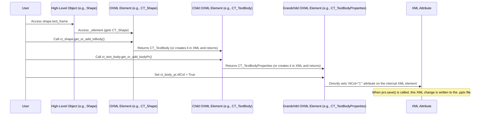

# Tutorial: python-pptx

`python-pptx` is a powerful Python library that allows you to **create and modify PowerPoint (.pptx) files** programmatically. It provides an *intuitive object model* to work with presentations, slides, shapes, and text, abstracting away the complexities of the underlying Open XML file format. You can easily add, update, and arrange content on your slides, and then *save the resulting presentation*.


## Visual Overview



## Chapters

1. [Presentation
](01_presentation_.md)
2. [Slide
](02_slide_.md)
3. [Shape
](03_shape_.md)
4. [Text Content & Formatting
](04_text_content___formatting_.md)
5. [DrawingML Formats (Fill, Line, Color)
](05_drawingml_formats__fill__line__color__.md)
6. [OPC Package & Parts
](06_opc_package___parts_.md)
7. [OXML Elements
](07_oxml_elements_.md)

---

<sub><sup>Generated by [AI Codebase Knowledge Builder](https://github.com/The-Pocket/Tutorial-Codebase-Knowledge).</sup></sub>

# Chapter 1: Presentation

Welcome to `python-pptx`! This library is your digital toolkit for creating and modifying Microsoft PowerPoint `.pptx` files directly from your Python code. Have you ever wished you could automatically fill out a report, generate custom presentations for different clients, or even just fix a typo across many slides without opening PowerPoint itself? `python-pptx` makes that possible!

Every PowerPoint file is essentially a container for your slides, images, text, and other elements. In `python-pptx`, this entire file is represented by a special object called `Presentation`.

## What is the `Presentation` Object?

Think of the `Presentation` object as the **digital binder** that holds all your slides and everything else that makes up your PowerPoint file. It's the top-level object you interact with when you start using `python-pptx`. When you want to work with a PowerPoint file, whether it's creating a brand new one or changing an existing one, your first step will always be to get a `Presentation` object.

This object gives you access to all the features of your PowerPoint file, like:
*   Adding new slides.
*   Accessing existing slides to change their content.
*   Setting the overall size of your slides.
*   Saving your changes back to a `.pptx` file.

It's your starting point, your command center for all PowerPoint automation tasks!

## Your First Step: Getting a `Presentation` Object

Let's see how easy it is to get this essential `Presentation` object.

### Creating a Brand New Presentation

The simplest way to start is to create an empty presentation from scratch. This is like opening PowerPoint and choosing "Blank Presentation."

```python
from pptx import Presentation

# Create a brand new, empty presentation
prs = Presentation()

# Now, 'prs' is your digital binder, ready for slides!
# You'll learn how to add slides in the next chapter.

# Let's save this empty presentation to a file
prs.save("my_first_presentation.pptx")
print("Empty presentation saved as my_first_presentation.pptx")
```
After running this code, you'll find a new file named `my_first_presentation.pptx` in the same folder. If you open it, it will be a completely blank PowerPoint file with no slides yet.

### Opening an Existing Presentation

What if you want to modify a presentation you already have? `python-pptx` can load existing `.pptx` files too.

Let's imagine you have a file named `existing_report.pptx` in the same directory as your Python script.

```python
from pptx import Presentation

# To load an existing presentation, just provide its filename
# Make sure 'existing_report.pptx' is in the same folder or provide the full path
try:
    prs = Presentation("existing_report.pptx")
    print("Existing presentation loaded successfully!")

    # You could now add/modify slides, change text, etc.
    # For now, let's just save it with a new name (no changes made yet)
    prs.save("modified_report.pptx")
    print("Modified presentation saved as modified_report.pptx")

except FileNotFoundError:
    print("Error: 'existing_report.pptx' not found. Please create it or use a valid path.")
```
If `existing_report.pptx` exists, this code will load it into the `prs` object and then save a *copy* as `modified_report.pptx`. The original file remains untouched. This is a safe way to work!

## Under the Hood: How `Presentation()` Works

When you call `Presentation()`, a lot happens behind the scenes to give you that powerful object. Let's take a simplified look.

### The Journey of a `Presentation` Object

When you call `Presentation()` or `Presentation("some_file.pptx")`, here's a high-level sequence of what `python-pptx` does:



### Diving into the Code (Simplified)

Let's look at the actual code in `python-pptx` that makes this happen.

The `Presentation` function you call is defined in `src/pptx/api.py`. It acts as a convenient gateway:

```python
# --- File: src/pptx/api.py (Simplified) ---
from pptx.package import Package
# ... (other imports) ...

def Presentation(pptx: str | None = None):
    """
    Return a |Presentation| object loaded from *pptx*.
    If *pptx* is None, the built-in default template is loaded.
    """
    if pptx is None:
        # If no file is given, figure out where the default template is
        pptx = _default_pptx_path()

    # The 'Package' class handles opening the .pptx file (which is actually a ZIP file!)
    # It then finds the 'main_document_part', which is the core presentation data.
    presentation_part = Package.open(pptx).main_document_part

    # Finally, the 'presentation_part' has a property that returns
    # the actual user-friendly Presentation object.
    return presentation_part.presentation

# ... (helper functions like _default_pptx_path) ...
```
As you can see, the `Presentation` function doesn't *do* much itself. Its main job is to:
1.  Decide if it needs to load a default template or a specific file.
2.  Use the `Package.open()` method to handle the complexities of opening the `.pptx` file. (We'll learn more about `Package` later in [OPC Package & Parts](06_opc_package___parts_.md)).
3.  Extract the `main_document_part` (which is a `PresentationPart`) from the opened package. This `PresentationPart` contains the raw data for your presentation.
4.  Finally, it gets the actual `Presentation` *object* from this `PresentationPart` and returns it to you.

The `Presentation` object itself (the one returned to you) is defined in `src/pptx/presentation.py`. This is where all the useful methods and properties of your `prs` object (like `save()`, `slides`, `slide_width`, etc.) are defined:

```python
# --- File: src/pptx/presentation.py (Simplified) ---
# ... (imports) ...

class Presentation:
    """PresentationML (PML) presentation."""

    # This is the actual Python object you get when you call pptx.Presentation()
    # It acts as a user-friendly wrapper around the raw 'PresentationPart' data.

    def save(self, file: str):
        """Writes this presentation to `file`."""
        # The actual saving is handled by the underlying 'part' object
        self.part.save(file)

    @property
    def slide_width(self):
        """Width of slides in this presentation."""
        # This property lets you read/write the slide width
        # It interacts with the raw XML structure to get/set this value.
        return self._element.sldSz.cx

    # ... (many other properties and methods like slides, slide_masters) ...
```
This class (`pptx.presentation.Presentation`) is the actual "digital binder" object that you interact with directly in your code (e.g., `prs.save(...)`, `prs.slides`). It provides a clean, Pythonic way to work with the complex structure of a PowerPoint file, hiding all the low-level details from you.

## Conclusion

You've just learned about the most fundamental concept in `python-pptx`: the `Presentation` object. It's your starting point for any task, acting as the digital representation of an entire `.pptx` file. You now know how to create a new, empty presentation and how to load an existing one, saving them back to disk.

But what's inside this "digital binder"? Slides, of course! In the next chapter, we'll open our `Presentation` and start exploring its contents: the [Slide](02_slide_.md) object.

---

<sub><sup>Generated by [AI Codebase Knowledge Builder](https://github.com/The-Pocket/Tutorial-Codebase-Knowledge).</sup></sub> <sub><sup>**References**: [[1]](https://github.com/scanny/python-pptx/blob/278b47b1dedd5b46ee84c286e77cdfb0bf4594be/src/pptx/__init__.py), [[2]](https://github.com/scanny/python-pptx/blob/278b47b1dedd5b46ee84c286e77cdfb0bf4594be/src/pptx/api.py), [[3]](https://github.com/scanny/python-pptx/blob/278b47b1dedd5b46ee84c286e77cdfb0bf4594be/src/pptx/presentation.py), [[4]](https://github.com/scanny/python-pptx/blob/278b47b1dedd5b46ee84c286e77cdfb0bf4594be/tests/test_api.py)</sup></sub>

# Chapter 2: Slide

In [Chapter 1: Presentation](01_presentation_.md), you learned that a `Presentation` object is your "digital binder" for an entire PowerPoint file. But what's inside that binder? Pages, of course! In `python-pptx`, these pages are called **Slides**.

## What is a `Slide` Object?

Imagine each `Slide` object as a **single blank canvas** (or a templated page) within your presentation. This is where you'll arrange all your content: text, pictures, charts, tables, and shapes. Each `Slide` is a self-contained unit that represents one view of your presentation.

The `Slide` object is incredibly important because it gives you access to add, modify, or remove:
*   **Shapes:** Boxes, lines, arrows, and more.
*   **Text Boxes:** Areas where you type your words.
*   **Pictures:** Images you want to display.
*   **Placeholders:** Special shapes that automatically adapt to your content (like a "Title" placeholder).

Our main goal in this chapter is to understand how to **add new slides** to our presentation, as this is the first step before we can add any content.

## Getting Started: Accessing Slides

Once you have a `Presentation` object, you can access its collection of slides using the `.slides` property. This property gives you a `Slides` object, which behaves much like a Python list of `Slide` objects.

Let's start by creating a new presentation and seeing how many slides it has:

```python
from pptx import Presentation

# 1. Create a brand new, empty presentation
prs = Presentation()

# 2. Access the collection of slides
slides = prs.slides

# 3. Check how many slides are in our new presentation
print(f"Number of slides initially: {len(slides)}")
```

**Output:**
```
Number of slides initially: 0
```
As expected, a brand new presentation starts with no slides.

## Understanding Slide Layouts

Before we can add a slide, there's a crucial concept to grasp: **Slide Layouts**.

Think of a `SlideLayout` as a **pre-designed blueprint or template** for a slide. When you open PowerPoint and choose "New Slide," you're often presented with options like "Title Slide," "Title and Content," "Blank," etc. These are slide layouts! They define:
*   The number and type of placeholders (e.g., a spot for a title, a spot for text).
*   Their default positions and sizes.
*   Sometimes, even basic background styles.

Using slide layouts helps maintain a consistent look across your presentation. In `python-pptx`, you always add a new slide *based on a specific slide layout*.

You can access the available slide layouts from your `Presentation` object using `prs.slide_layouts`. Like `prs.slides`, this also behaves like a list:

```python
# Access the collection of available slide layouts
slide_layouts = prs.slide_layouts

# Let's see how many layouts are available in the default template
print(f"Number of available slide layouts: {len(slide_layouts)}")

# We can also print the names of these layouts to see what's there
print("Available Layouts:")
for i, layout in enumerate(slide_layouts):
    print(f"  {i}: {layout.name}")
```

**Output (will vary slightly based on `python-pptx` version and default template, but typically looks like this):**
```
Number of available slide layouts: 11
Available Layouts:
  0: Title Slide
  1: Title and Content
  2: Section Header
  3: Two Content
  4: Comparison
  5: Title Only
  6: Blank
  7: Content with Caption
  8: Picture with Caption
  9: Title and Vertical Text
  10: Vertical Title and Text
```
This output shows you the different blueprints you have to choose from. For example, layout `6` is usually the "Blank" layout, and layout `0` is often the "Title Slide".

## Your First Slide: Adding a Slide

Now that we know about `SlideLayouts`, adding a slide is straightforward. You select a layout and pass it to the `add_slide()` method of your `slides` collection.

Let's add a "Title and Content" slide and a "Blank" slide:

```python
# Assuming 'prs' (Presentation object) is already created from previous steps

# 1. Access the slides collection
slides = prs.slides

# 2. Access the slide layouts collection
slide_layouts = prs.slide_layouts

# 3. Choose a specific layout (e.g., 'Title and Content' is often index 1)
#    It's safer to find layouts by name, as index can change with different templates.
title_and_content_layout = None
for layout in slide_layouts:
    if layout.name == "Title and Content":
        title_and_content_layout = layout
        break

# Handle case where layout might not be found (e.g., if template changed)
if title_and_content_layout is None:
    print("Warning: 'Title and Content' layout not found. Using the first available layout.")
    title_and_content_layout = slide_layouts[0] # Fallback to first layout

# 4. Add the first slide using the chosen layout
slide1 = slides.add_slide(title_and_content_layout)
print(f"Added first slide. Total slides: {len(slides)}")

# 5. Add a second slide, this time a 'Blank' one (often index 6)
blank_layout = None
for layout in slide_layouts:
    if layout.name == "Blank":
        blank_layout = layout
        break

if blank_layout is None:
    print("Warning: 'Blank' layout not found. Using the first available layout for second slide.")
    blank_layout = slide_layouts[0] # Fallback

slide2 = slides.add_slide(blank_layout)
print(f"Added second slide. Total slides: {len(slides)}")

# 6. Save the presentation to see the changes
prs.save("my_presentation_with_slides.pptx")
print("Presentation saved as my_presentation_with_slides.pptx")
```

**Output:**
```
Added first slide. Total slides: 1
Added second slide. Total slides: 2
Presentation saved as my_presentation_with_slides.pptx
```
If you open `my_presentation_with_slides.pptx` in PowerPoint, you'll now see two slides! The first will have a title area and a content area, and the second will be completely empty.

## Under the Hood: How `add_slide()` Works

When you call `slides.add_slide(layout)`, quite a few things happen behind the scenes to create that new page in your presentation.

### The Journey of a New Slide

Let's look at the simplified sequence of events:



### Diving into the Code (Simplified)

The `slides` object you call `add_slide()` on is an instance of the `Slides` class, defined in `src/pptx/slide.py`. This class manages the collection of slides for a `Presentation`.

```python
# --- File: src/pptx/slide.py (Simplified) ---
# ... (imports) ...

class Slides(ParentedElementProxy):
    """Sequence of slides belonging to an instance of |Presentation|."""

    def add_slide(self, slide_layout: SlideLayout) -> Slide:
        """Return a newly added slide that inherits layout from `slide_layout`."""
        # This line asks the 'parent' of the slides collection (the PresentationPart)
        # to handle the low-level creation of the slide and its associated data.
        # It returns a relationship ID (rId) and the new Slide object itself.
        rId, slide = self.part.add_slide(slide_layout)

        # After the slide is created, we "clone" the placeholders from the chosen
        # layout onto our new slide. This makes sure the title, content box, etc.,
        # appear in the correct spots.
        slide.shapes.clone_layout_placeholders(slide_layout)

        # Finally, we update the presentation's internal list of slides
        # with the new slide's ID.
        self._sldIdLst.add_sldId(rId)
        return slide
```
As you can see, `Slides.add_slide` delegates the heavy lifting of creating the slide's underlying data to `self.part.add_slide()`. `self.part` in this context refers to the `PresentationPart` (the component that handles the core data of the entire presentation).

The `PresentationPart` (which is not directly shown here, but exists within `src/pptx/parts/presentation.py`) is responsible for creating a new `SlidePart`. A `SlidePart` is where the actual raw XML data for a single slide lives within the `.pptx` file.

The `SlidePart` class itself (from `src/pptx/parts/slide.py`) has a `new` method that does the initial creation:

```python
# --- File: src/pptx/parts/slide.py (Simplified) ---
# ... (imports) ...

class SlidePart(BaseSlidePart):
    """Slide part. Corresponds to package files ppt/slides/slide[1-9][0-9]*.xml."""

    @classmethod
    def new(cls, partname, package, slide_layout_part):
        """Return newly-created blank slide part.

        The new slide-part has `partname` and a relationship to `slide_layout_part`.
        """
        # This is where the core XML element (CT_Slide) for the new slide is created.
        # CT_Slide.new() provides a minimal, empty XML structure for a slide.
        slide_part = cls(partname, CT.PML_SLIDE, package, CT_Slide.new())

        # The new slide part is then linked (related) to its chosen slide layout part.
        slide_part.relate_to(slide_layout_part, RT.SLIDE_LAYOUT)
        return slide_part
```
And finally, `CT_Slide.new()` (from `src/pptx/oxml/slide.py`) is what generates the barebones XML structure for a new slide:

```python
# --- File: src/pptx/oxml/slide.py (Simplified) ---
# ... (imports) ...

class CT_Slide(_BaseSlideElement):
    """`p:sld` element, root element of a slide part (XML document)."""

    @classmethod
    def new(cls) -> CT_Slide:
        """Return new `p:sld` element configured as base slide shape."""
        # This returns a minimal XML string representing an empty slide,
        # which is then parsed into a CT_Slide object.
        return cast(CT_Slide, parse_xml(cls._sld_xml()))

    @staticmethod
    def _sld_xml():
        # This is the actual XML blueprint for a new, empty slide
        return (
            "<p:sld %s>\n"
            "  <p:cSld>\n"
            "    <p:spTree>\n"
            "      <p:nvGrpSpPr>\n"
            '        <p:cNvPr id="1" name=""/>\n'
            "        <p:cNvGrpSpPr/>\n"
            "        <p:nvPr/>\n"
            "      </p:nvGrpSpPr>\n"
            "      <p:grpSpPr/>\n"
            "    </p:spTree>\n"
            "  </p:cSld>\n"
            "  <p:clrMapOvr>\n"
            "    <a:masterClrMapping/>\n"
            "  </p:clrMapOvr>\n"
            "</p:sld>" % nsdecls("a", "p", "r")
        )
```
This deep dive shows you that the user-friendly `Slide` object is built upon a layered structure, starting from raw XML (`CT_Slide`), wrapped by a file-handling part (`SlidePart`), and then managed by collections (`Slides`) to give you a simple Python object to interact with.

## Conclusion

You've now mastered the concept of the `Slide` object in `python-pptx`! You know it's the individual page of your presentation, and, crucially, you understand how to add new slides by selecting a `SlideLayout`. This is a fundamental skill, as every piece of content you add to your presentation will live on a specific `Slide`.

But a blank slide isn't very exciting, is it? In the next chapter, we'll learn how to add actual content to your slides by exploring the concept of **Shapes** and how to manipulate them.

[Chapter 3: Shape](03_shape.md)

---

<sub><sup>Generated by [AI Codebase Knowledge Builder](https://github.com/The-Pocket/Tutorial-Codebase-Knowledge).</sup></sub> <sub><sup>**References**: [[1]](https://github.com/scanny/python-pptx/blob/278b47b1dedd5b46ee84c286e77cdfb0bf4594be/src/pptx/oxml/slide.py), [[2]](https://github.com/scanny/python-pptx/blob/278b47b1dedd5b46ee84c286e77cdfb0bf4594be/src/pptx/parts/slide.py), [[3]](https://github.com/scanny/python-pptx/blob/278b47b1dedd5b46ee84c286e77cdfb0bf4594be/src/pptx/slide.py)</sup></sub>

# Chapter 3: Shape

In [Chapter 1: Presentation](01_presentation_.md), we learned that a `Presentation` is like your "digital binder." In [Chapter 2: Slide](02_slide_.md), we opened that binder to find "pages," which are `Slide` objects, ready to be filled. But a blank page isn't very useful on its own, is it?

This is where the concept of **Shape** comes in!

## What is a `Shape` Object?

Imagine a PowerPoint slide as a blank canvas. When you add anything to that canvas – a text box, a picture, a rectangle, an arrow, a chart, or even a group of these items – you're adding a **Shape**.

A `Shape` is the fundamental building block for content on your slide. It's like any individual element you can drag, drop, resize, or rotate in PowerPoint itself.

Here are some common things a `Shape` can represent:
*   **Text Box:** An area specifically for typing text.
*   **AutoShape:** Pre-defined geometric shapes like rectangles, circles, arrows, stars, etc.
*   **Picture:** An image inserted onto the slide.
*   **Connector:** A line that links two shapes together.
*   **Group Shape:** A collection of other shapes treated as a single unit.
*   **Placeholder:** Special shapes (like the "Click to add title" box) that come from the slide layout.

Every shape, regardless of its specific type, shares some common properties. Think of these as its basic "physical" attributes:
*   **Position:** Where it is located on the slide (its `left` and `top` edges).
*   **Size:** How wide (`width`) and tall (`height`) it is.
*   **Rotation:** How much it's spun around.
*   **Name:** A unique identifier string for the shape (like "Rectangle 1").

## Your First Shape: Adding a Rectangle

Our goal for this chapter is to add a simple blue rectangle to a blank slide.

First, let's set up our presentation and add a blank slide, just like we did in the previous chapter:

```python
from pptx import Presentation
from pptx.util import Inches # We'll need this for sizing and positioning!
from pptx.enum.shapes import MSO_SHAPE # Needed to pick a shape type

# 1. Create a brand new presentation
prs = Presentation()

# 2. Add a blank slide (usually layout index 6)
blank_slide_layout = prs.slide_layouts[6]
slide = prs.slides.add_slide(blank_slide_layout)

print("Presentation and blank slide created.")
```
This code gives us a `slide` object, our blank canvas, ready for shapes.

Now, let's add a rectangle. To do this, we'll access the `shapes` collection on our `slide` object. This collection allows us to add new shapes to the slide. We'll use the `add_shape()` method.

The `add_shape()` method needs a few things:
*   `autoshape_type_id`: Which kind of shape you want (e.g., a rectangle). We use `MSO_SHAPE.RECTANGLE` for this.
*   `left`: The distance from the left edge of the slide to the left edge of the shape.
*   `top`: The distance from the top edge of the slide to the top edge of the shape.
*   `width`: The width of the shape.
*   `height`: The height of the shape.

**Important Note on Units:** PowerPoint measures distances and sizes in very tiny units called **EMUs** (English Metric Units). One inch is 914,400 EMUs! Don't worry, `python-pptx` provides helper functions in `pptx.util` like `Inches()`, `Cm()`, and `Pt()` to convert real-world measurements into EMUs for you. Always use these helpers when specifying `left`, `top`, `width`, or `height`.

Let's add our rectangle:

```python
# Assuming 'slide' object is from the previous code block

# Define position and size using Inches helper
left = Inches(1)   # 1 inch from the left edge
top = Inches(1)    # 1 inch from the top edge
width = Inches(6)  # 6 inches wide
height = Inches(4) # 4 inches tall

# Add the rectangle shape to the slide
# MSO_SHAPE.RECTANGLE specifies it's a rectangle autoshape
shape = slide.shapes.add_shape(MSO_SHAPE.RECTANGLE, left, top, width, height)

print("Rectangle shape added to the slide!")

# Save the presentation to see the results
prs.save("presentation_with_rectangle.pptx")
print("Presentation saved as presentation_with_rectangle.pptx")
```
If you open `presentation_with_rectangle.pptx`, you'll see a new slide with a default blue rectangle placed exactly where you specified!

## Working with Shape Properties

Once you have a `Shape` object, you can read and change its properties just like any other Python object's attributes.

Let's modify the rectangle we just created:

```python
# Assuming 'shape' object is the rectangle we just added

print(f"Original shape name: {shape.name}")
print(f"Original position: ({shape.left.inches:.2f} in, {shape.top.inches:.2f} in)")
print(f"Original size: ({shape.width.inches:.2f} in, {shape.height.inches:.2f} in)")
print(f"Original rotation: {shape.rotation} degrees")

# Let's change some properties
shape.name = "My Awesome Rectangle"
shape.left = Inches(2)      # Move it further to the right
shape.top = Inches(1.5)     # Move it slightly down
shape.width = Inches(3)     # Make it narrower
shape.height = Inches(5)    # Make it taller
shape.rotation = 45.0       # Rotate it 45 degrees clockwise

print(f"\nNew shape name: {shape.name}")
print(f"New position: ({shape.left.inches:.2f} in, {shape.top.inches:.2f} in)")
print(f"New size: ({shape.width.inches:.2f} in, {shape.height.inches:.2f} in)")
print(f"New rotation: {shape.rotation} degrees")

# Save again to see the changes
prs.save("presentation_modified_rectangle.pptx")
print("\nRectangle properties modified and saved.")
```

**Output (approximate):**
```
Original shape name: Rectangle 2
Original position: (1.00 in, 1.00 in)
Original size: (6.00 in, 4.00 in)
Original rotation: 0.0 degrees

New shape name: My Awesome Rectangle
New position: (2.00 in, 1.50 in)
New size: (3.00 in, 5.00 in)
New rotation: 45.0 degrees

Rectangle properties modified and saved.
```
Notice how `shape.left`, `shape.top`, `shape.width`, and `shape.height` return `Length` objects (like `Inches`), allowing you to easily convert them back to inches, centimeters, or points for display. When setting them, you must provide a `Length` object created using `Inches()`, `Cm()`, or `Pt()`.

## Accessing Existing Shapes

Once shapes are on a slide, you can iterate over them using `slide.shapes`. This allows you to inspect or modify existing shapes:

```python
# Iterate through all shapes on the slide
print("\nShapes on this slide:")
for i, existing_shape in enumerate(slide.shapes):
    print(f"  Shape {i}:")
    print(f"    Name: {existing_shape.name}")
    print(f"    Type: {existing_shape.shape_type}") # This tells you if it's a TEXT_BOX, PICTURE, etc.
    print(f"    Left: {existing_shape.left.inches:.2f} in")
    print(f"    Top: {existing_shape.top.inches:.2f} in")
```

**Output (approximate):**
```
Shapes on this slide:
  Shape 0:
    Name: My Awesome Rectangle
    Type: <MSO_SHAPE_TYPE.AUTO_SHAPE: 1>
    Left: 2.00 in
    Top: 1.50 in
```
This loop confirms our "My Awesome Rectangle" is there. The `shape_type` property is very useful for figuring out what kind of shape you're dealing with.

## Other Ways to Add Shapes

While `add_shape()` is versatile, `slide.shapes` also provides convenient methods for common shape types:

*   `add_textbox(left, top, width, height)`: Adds a text box.
*   `add_picture(image_file, left, top, width, height)`: Adds an image.

You'll explore adding text content to shapes in the next chapter!

## Under the Hood: How `add_shape()` Works

When you call `slide.shapes.add_shape()`, `python-pptx` performs several steps behind the scenes to create the shape in the `.pptx` file.

### The Journey of a New Shape

Let's look at the simplified sequence of events:



### Diving into the Code (Simplified)

The `slide.shapes` object is an instance of the `SlideShapes` class, found in `src/pptx/shapes/shapetree.py`. This class manages the collection of shapes on a slide.

Here's a simplified look at the `add_shape` method in `SlideShapes`:

```python
# --- File: src/pptx/shapes/shapetree.py (Simplified) ---
# ... (imports) ...
from pptx.shapes.autoshape import AutoShapeType, Shape
# ...

class SlideShapes(...): # inherits from _BaseGroupShapes
    # ...

    def add_shape(
        self, autoshape_type_id: MSO_SHAPE, left: Length, top: Length, width: Length, height: Length
    ) -> Shape:
        """Return new |Shape| object appended to this shape tree."""
        # 1. Look up details for the autoshape type (like its base name)
        autoshape_type = AutoShapeType(autoshape_type_id)

        # 2. Ask a helper method to create the underlying XML element (p:sp)
        #    This is where the actual XML for the shape is generated and added to the document.
        sp = self._add_sp(autoshape_type, left, top, width, height)

        # 3. Recalculate group extents if this were a group shape (not applicable directly here)
        # self._recalculate_extents() # Often overridden in GroupShapes

        # 4. Wrap the newly created XML element in a user-friendly Python object
        return cast(Shape, self._shape_factory(sp))

    def _add_sp(
        self, autoshape_type: AutoShapeType, x: Length, y: Length, cx: Length, cy: Length
    ) -> CT_Shape:
        """Return newly-added `p:sp` element as specified."""
        # Get a unique ID for the new shape
        id_ = self._next_shape_id
        # Generate a default name for the shape (e.g., "Rectangle 2")
        name = "%s %d" % (autoshape_type.basename, id_ - 1)

        # Ask the underlying XML element for the shape tree (p:spTree) to add the shape
        # This is where the lxml.etree.Element for 'p:sp' is actually created and inserted.
        sp = self._grpSp.add_autoshape(id_, name, autoshape_type.prst, x, y, cx, cy)
        return sp
```
As you can see, `SlideShapes.add_shape()` is quite high-level. It calls `_add_sp`, which then uses `self._grpSp` (which is the raw XML element for the shape tree, `CT_GroupShape`) to physically add the new shape's XML (`p:sp`) into the document.

The `Shape` class itself, found in `src/pptx/shapes/autoshape.py`, is built on top of `BaseShape` (`src/pptx/shapes/base.py`). `BaseShape` is where many of the common properties like `left`, `top`, `width`, `height`, `name`, and `rotation` are defined. These properties interact directly with the underlying XML element (`self._element`) that the `Shape` object wraps.

For example, here's how `BaseShape` handles the `left` property:

```python
# --- File: src/pptx/shapes/base.py (Simplified) ---
# ... (imports) ...

class BaseShape(object):
    """Base class for shape objects."""

    def __init__(self, shape_elm: ShapeElement, parent: ProvidesPart):
        super().__init__()
        self._element = shape_elm # This is the raw XML element (e.g., p:sp)
        self._parent = parent

    @property
    def left(self) -> Length:
        """Integer distance of the left edge of this shape from the left edge of the slide."""
        # Reads the 'x' attribute from the underlying XML element
        return self._element.x

    @left.setter
    def left(self, value: Length):
        # Sets the 'x' attribute on the underlying XML element
        self._element.x = value

    # Similar properties exist for top, width, height, rotation, etc.
    # ...
```
This layered approach means that when you change `shape.left` in your Python code, `python-pptx` directly updates the corresponding `x` attribute in the XML of your `.pptx` file. This is how your high-level Python commands translate into changes in the actual PowerPoint document!

## Conclusion

You've now learned about the essential `Shape` object in `python-pptx`. You understand it's the core component for all visual elements on a slide, and you've mastered how to add simple shapes like rectangles and how to manipulate their basic properties like position, size, and rotation.

A shape is great, but often it needs content! In the next chapter, we'll dive into how to add and format [Text Content & Formatting](04_text_content___formatting_.md) within your shapes.

---

<sub><sup>Generated by [AI Codebase Knowledge Builder](https://github.com/The-Pocket/Tutorial-Codebase-Knowledge).</sup></sub> <sub><sup>**References**: [[1]](https://github.com/scanny/python-pptx/blob/278b47b1dedd5b46ee84c286e77cdfb0bf4594be/src/pptx/oxml/shapes/__init__.py), [[2]](https://github.com/scanny/python-pptx/blob/278b47b1dedd5b46ee84c286e77cdfb0bf4594be/src/pptx/shapes/autoshape.py), [[3]](https://github.com/scanny/python-pptx/blob/278b47b1dedd5b46ee84c286e77cdfb0bf4594be/src/pptx/shapes/base.py), [[4]](https://github.com/scanny/python-pptx/blob/278b47b1dedd5b46ee84c286e77cdfb0bf4594be/src/pptx/shapes/connector.py), [[5]](https://github.com/scanny/python-pptx/blob/278b47b1dedd5b46ee84c286e77cdfb0bf4594be/src/pptx/shapes/group.py), [[6]](https://github.com/scanny/python-pptx/blob/278b47b1dedd5b46ee84c286e77cdfb0bf4594be/src/pptx/shapes/picture.py), [[7]](https://github.com/scanny/python-pptx/blob/278b47b1dedd5b46ee84c286e77cdfb0bf4594be/src/pptx/shapes/shapetree.py)</sup></sub>

# Chapter 4: Text Content & Formatting

In [Chapter 3: Shape](03_shape.md), you learned how to add basic building blocks like rectangles and other visual elements to your slides. But what about words? Most presentations are filled with text! This chapter will teach you how to put text inside your shapes and, more importantly, how to make that text look exactly how you want it – bold, italic, a specific size, or a different color.

## What is Text Content & Formatting?

Imagine you have a text box in PowerPoint. You can type words into it, create new paragraphs, and then select individual words or phrases to make them bold, italic, or change their color. `python-pptx` uses a structured way to represent this:

*   **`TextFrame`**: Think of this as the entire **text area** within a shape. If your shape can hold text (like a rectangle or a text box), it will have a `TextFrame` object attached to it. It's the overall container for all the text in that shape.
*   **`Paragraph`**: Inside a `TextFrame`, text is organized into one or more `Paragraph` objects. Just like in a word processor, each `Paragraph` represents a block of text, usually ending with a "hard return" (when you press Enter).
*   **`Run`**: A `Paragraph` is made up of one or more `Run` objects. A `Run` is a sequence of characters that all share the **exact same formatting**. For example, in the sentence "This is **important** text.", "This is ", "**important**", and " text." would likely be three separate runs because "important" has bold formatting while the rest does not.
*   **`Font`**: Each `Run` has a `Font` object. This `Font` object is where you control the actual appearance of the characters in that run: their typeface (like Arial or Calibri), size, whether they are bold, italic, or underlined, and their color.

It's a hierarchy, much like the structure of a book:

| Analogy      | `python-pptx` Object  | Description                                 |
| :----------- | :-------------------- | :------------------------------------------ |
| The Page     | `Shape`               | The container for all text and other elements. |
| Text Area    | `TextFrame`           | The specific region on the shape where text lives. |
| A Paragraph  | `Paragraph`           | A block of text, separated by line breaks.  |
| A Word/Phrase | `Run`                 | Characters with consistent formatting.      |
| The Font Style | `Font` (on a `Run`) | Controls the typeface, size, bold, italic, color of text within a Run. |

Our goal for this chapter is to take a shape, add some text, and then apply different formatting to parts of that text.

## Your First Text: Adding Text to a Shape

Let's start by creating a presentation and adding a blank slide with a rectangle, just as we did in the previous chapter.

```python
from pptx import Presentation
from pptx.util import Inches, Pt # Pt is for Font Size
from pptx.enum.shapes import MSO_SHAPE # For rectangle type
from pptx.dml.color import RGBColor # For Font Color

# 1. Create a brand new presentation
prs = Presentation()

# 2. Add a blank slide (usually layout index 6)
blank_slide_layout = prs.slide_layouts[6]
slide = prs.slides.add_slide(blank_slide_layout)

# 3. Add a rectangle shape
left = Inches(1)
top = Inches(1)
width = Inches(8)
height = Inches(2.5)
shape = slide.shapes.add_shape(MSO_SHAPE.RECTANGLE, left, top, width, height)

print("Presentation, blank slide, and rectangle created.")
```

Now, let's add some simple text to our `shape`. Every shape that can contain text has a `text_frame` property.

```python
# Assuming 'shape' object from the previous code block

# Get the TextFrame object from the shape
text_frame = shape.text_frame

# Assign text to the text_frame.text property
# This is the simplest way to put text into a shape.
text_frame.text = "Hello, python-pptx! This is my first text."

print(f"Text added to shape: '{text_frame.text}'")

# Save the presentation
prs.save("presentation_with_text.pptx")
print("Presentation saved as presentation_with_text.pptx")
```
If you open `presentation_with_text.pptx`, you'll see your rectangle now contains the text! `text_frame.text` is a very convenient way to set all the text at once. When you assign to `text_frame.text`, `python-pptx` automatically clears any existing content and creates a single paragraph with a single run to hold your new text.

## Formatting Text: The `Font` Object

While `text_frame.text` is easy, it doesn't give you control over individual words. For that, we need to work with `Paragraph` and `Run` objects, and then their `Font` properties.

Let's modify our text to have multiple parts with different formatting.

```python
# Assuming 'text_frame' object from the previous code block

# Clear existing text content (optional, but good for a fresh start)
text_frame.clear()

# Add a first paragraph
p1 = text_frame.paragraphs[0] # TextFrame always starts with one empty paragraph
p1.text = "This is some normal text. "

# Add a Run to the first paragraph and make it bold
run1 = p1.add_run()
run1.text = "This part is BOLD!"
run1.font.bold = True

# Add another Run to the same paragraph and make it italic and a different color
run2 = p1.add_run()
run2.text = " And this is ITALIC and RED."
run2.font.italic = True
run2.font.color.rgb = RGBColor(255, 0, 0) # Red color

# Add a second paragraph and make its entire text larger and a different font
p2 = text_frame.add_paragraph()
p2.text = "This is a new paragraph with a larger font and Arial typeface."
p2.font.size = Pt(28) # Set font size to 28 points
p2.font.name = "Arial" # Set typeface to Arial

print("Text and formatting applied to shape.")

# Save the presentation
prs.save("presentation_with_formatted_text.pptx")
print("Presentation saved as presentation_with_formatted_text.pptx")
```
Now, if you open `presentation_with_formatted_text.pptx`, you'll see much more dynamic text!

Let's break down some important points from the code above:
*   `text_frame.clear()`: This removes all paragraphs and runs, leaving just one empty paragraph.
*   `text_frame.paragraphs[0]`: A `TextFrame` always has at least one `Paragraph`. You can access it like an item in a list.
*   `p1.add_run()`: This creates a new `Run` object at the end of the `Paragraph`.
*   `run1.font.bold = True`: This is how you change a specific formatting property. `run.font` gives you the `Font` object for that run, and then you can set `bold`, `italic`, `size`, `name`, or `color`.
*   `run2.font.color.rgb = RGBColor(255, 0, 0)`: For colors, you use `RGBColor` from `pptx.dml.color` and provide Red, Green, and Blue values (0-255).
*   `Pt(28)`: `pptx.util.Pt` is a helper to specify font sizes in "points," which is a common unit for fonts. `python-pptx` converts this to EMUs internally.
*   `text_frame.add_paragraph()`: This adds a completely new paragraph to your text frame.

### Paragraph Alignment

You can also control the alignment of a paragraph:

```python
from pptx.enum.text import PP_PARAGRAPH_ALIGNMENT as PP_ALIGN

# Assuming 'p1' and 'p2' objects from the previous code block

# Set the first paragraph to be centered
p1.alignment = PP_ALIGN.CENTER

# Set the second paragraph to be right-aligned
p2.alignment = PP_ALIGN.RIGHT

print("Paragraph alignments set.")

# Save the presentation
prs.save("presentation_with_aligned_text.pptx")
print("Presentation saved as presentation_with_aligned_text.pptx")
```
`PP_PARAGRAPH_ALIGNMENT` provides options like `LEFT`, `CENTER`, `RIGHT`, `JUSTIFY`, etc.

## Under the Hood: Text Content & Formatting

How do these Python objects (`TextFrame`, `Paragraph`, `Run`, `Font`) translate into the actual `.pptx` file structure? It all comes down to **XML elements** within the shape's data.

### The Journey of Text Formatting

When you set `run.font.bold = True`, `python-pptx` finds the corresponding XML element and modifies an attribute on it.

Let's trace a simplified path:



### Diving into the Code (Simplified)

The core XML elements for text are defined in `src/pptx/oxml/text.py`.
*   `CT_TextBody`: The raw XML for a `TextFrame`. It contains `CT_TextParagraph` elements.
*   `CT_TextParagraph`: The raw XML for a `Paragraph`. It contains `CT_RegularTextRun` elements.
*   `CT_RegularTextRun`: The raw XML for a `Run`. It contains `a:t` (text) and `a:rPr` (run properties) child elements.
*   `CT_TextCharacterProperties`: The raw XML for `a:rPr`. This is where attributes like `b` (bold), `i` (italic), `sz` (size), and `u` (underline) live, along with font fills.

Let's look at how the Python objects interact with these XML elements.

1.  **`TextFrame` and `CT_TextBody`:**
    The `TextFrame` object (`src/pptx/text/text.py`) wraps a `CT_TextBody` element.
    When you set `text_frame.text = "..."`, the `TextFrame` object splits your string by newline characters (`\n`) to create separate paragraphs.

    ```python
    # --- File: src/pptx/text/text.py (Simplified) ---
    class TextFrame(Subshape):
        def __init__(self, txBody: CT_TextBody, parent: ProvidesPart):
            super(TextFrame, self).__init__(parent)
            self._element = self._txBody = txBody # _txBody is the CT_TextBody XML element
            self._parent = parent

        @property
        def text(self) -> str:
            # Gathers text from all paragraphs
            return "\n".join(paragraph.text for paragraph in self.paragraphs)

        @text.setter
        def text(self, text: str):
            self._txBody.clear_content() # Remove all existing a:p elements
            for p_text in text.split("\n"): # Split by newline for new paragraphs
                p = self._txBody.add_p() # Add a new a:p (CT_TextParagraph) XML element
                p.append_text(p_text) # Append text to that paragraph, creating runs as needed
    ```
    The `_txBody.add_p()` method adds a new `<a:p>` (paragraph) XML element inside the `<p:txBody>` element.

2.  **`Paragraph` and `CT_TextParagraph`:**
    The `Paragraph` object also wraps its corresponding XML element, `CT_TextParagraph`. Its `add_run()` method creates a new `CT_RegularTextRun` (`<a:r>`) element:

    ```python
    # --- File: src/pptx/text/text.py (Simplified) ---
    class _Paragraph(Subshape):
        def __init__(self, p: CT_TextParagraph, parent: ProvidesPart):
            super(_Paragraph, self).__init__(parent)
            self._element = self._p = p # _p is the CT_TextParagraph XML element

        def add_run(self) -> _Run:
            r = self._p.add_r() # This adds a new <a:r> (CT_RegularTextRun) XML element
            return _Run(r, self)

        @property
        def alignment(self) -> PP_PARAGRAPH_ALIGNMENT | None:
            # Reads the 'algn' attribute from the underlying a:pPr XML element
            return self._pPr.algn

        @alignment.setter
        def alignment(self, value: PP_PARAGRAPH_ALIGNMENT | None):
            # Sets the 'algn' attribute on the underlying a:pPr XML element
            self._pPr.algn = value
    ```
    The `_p.add_r()` method internally creates an XML structure like `<a:r><a:t/></a:r>` and adds it to the paragraph's XML.

3.  **`Run` and `CT_RegularTextRun`:**
    The `_Run` object then wraps the `CT_RegularTextRun` element. Its key role is to provide access to the `Font` object for formatting.

    ```python
    # --- File: src/pptx/text/text.py (Simplified) ---
    class _Run(Subshape):
        def __init__(self, r: CT_RegularTextRun, parent: ProvidesPart):
            super(_Run, self).__init__(parent)
            self._r = r # _r is the CT_RegularTextRun XML element

        @property
        def font(self):
            # Gets or adds the a:rPr (CT_TextCharacterProperties) XML element
            rPr = self._r.get_or_add_rPr()
            return Font(rPr) # Wraps it in a Font Python object

        @property
        def text(self):
            return self._r.text # Accesses the text of the a:t child XML element

        @text.setter
        def text(self, text: str):
            self._r.text = text # Sets the text of the a:t child XML element
    ```
    When you call `run.font`, `python-pptx` makes sure there's an `<a:rPr>` (run properties) XML element associated with that run, and then wraps it in a user-friendly `Font` object.

4.  **`Font` and `CT_TextCharacterProperties`:**
    Finally, the `Font` object (`src/pptx/text/text.py`) provides direct Pythonic access to the attributes of the `CT_TextCharacterProperties` element (`<a:rPr>`).

    ```python
    # --- File: src/pptx/text/text.py (Simplified) ---
    class Font(object):
        def __init__(self, rPr: CT_TextCharacterProperties):
            super(Font, self).__init__()
            self._element = self._rPr = rPr # _rPr is the CT_TextCharacterProperties XML element

        @property
        def bold(self) -> bool | None:
            return self._rPr.b # Reads the 'b' attribute from the XML

        @bold.setter
        def bold(self, value: bool | None):
            self._rPr.b = value # Sets the 'b' attribute on the XML

        @property
        def size(self) -> Length | None:
            # Reads 'sz' attribute (in centipoints) and converts to Length
            sz = self._rPr.sz
            return Centipoints(sz) if sz is not None else None

        @size.setter
        def size(self, emu: Length | None):
            # Converts Length to centipoints and sets 'sz' attribute
            self._rPr.sz = Emu(emu).centipoints if emu is not None else None

        # Similar properties exist for italic, underline, name, and color.
        # Color uses a FillFormat object (covered in the next chapter) which then manipulates XML.
    ```
    This shows how a simple Python assignment like `font.bold = True` directly translates into setting an attribute (`b="1"`) on the underlying XML element (`<a:rPr>`). This low-level manipulation is what ultimately changes how PowerPoint renders the text.

## Conclusion

You've now learned about the fundamental objects involved in managing text content and its formatting in `python-pptx`: `TextFrame`, `Paragraph`, `Run`, and `Font`. You understand their hierarchical relationship and how to use them to add and format text within any text-holding shape. This knowledge is crucial for creating dynamic and well-styled presentations.

While you can control text content and font characteristics, there's more to the visual appearance of shapes. In the next chapter, we'll dive into the broader topic of [DrawingML Formats (Fill, Line, Color)](05_drawingml_formats__fill__line__color__.md), which includes the background fill and outline of shapes, as well as the underlying color system for all elements.

---

<sub><sup>Generated by [AI Codebase Knowledge Builder](https://github.com/The-Pocket/Tutorial-Codebase-Knowledge).</sup></sub> <sub><sup>**References**: [[1]](https://github.com/scanny/python-pptx/blob/278b47b1dedd5b46ee84c286e77cdfb0bf4594be/src/pptx/oxml/text.py), [[2]](https://github.com/scanny/python-pptx/blob/278b47b1dedd5b46ee84c286e77cdfb0bf4594be/src/pptx/text/fonts.py), [[3]](https://github.com/scanny/python-pptx/blob/278b47b1dedd5b46ee84c286e77cdfb0bf4594be/src/pptx/text/text.py)</sup></sub>

# Chapter 5: DrawingML Formats (Fill, Line, Color)

In [Chapter 4: Text Content & Formatting](04_text_content___formatting_.md), you mastered putting words into shapes and styling those words. But shapes aren't just about text; they're also about how they look visually – their background color, border thickness, and border style. Imagine a plain grey rectangle; how do you make it a vibrant red rectangle with a thick green border?

This is where **Drawing Markup Language (DML) Formats** come in. DML is the language PowerPoint uses internally to describe how shapes and other visual objects should look. `python-pptx` gives us Python objects that let us control these DML properties easily.

Our goal for this chapter is to understand and use these "styling palettes" to change the appearance of our shapes, making them stand out!

## What are DrawingML Formats?

Think of DrawingML as the "design language" of PowerPoint. It's how PowerPoint knows to draw a shape with a certain color, line style, or even a fancy gradient. `python-pptx` simplifies this complex language into three main objects you'll work with:

*   **`FillFormat`**: Controls how the *inside* of a shape is colored. Is it a solid color, transparent, a gradient, or a pattern?
*   **`LineFormat`**: Controls the properties of a shape's *border* or *outline*. This includes its color, thickness, and whether it's a solid line, dashed, or dotted.
*   **`ColorFormat`**: This is the actual color definition. It specifies *what color* to use, whether it's a specific RGB value (like `(255, 0, 0)` for red) or a theme color from your presentation's design.

These objects work together. For example, to set the fill color, you first access the `FillFormat` object, then its `ColorFormat` property. To set the line color, you do the same with the `LineFormat` object.

Here's a quick analogy:

| Concept         | `python-pptx` Object | Analogy                                   |
| :-------------- | :------------------- | :---------------------------------------- |
| Whole shape     | `Shape`              | The item itself (e.g., a paper cutout)    |
| Inside color    | `FillFormat`         | The paint for the cutout's surface        |
| Border/Outline  | `LineFormat`         | The marker used to draw the edge          |
| Specific Color  | `ColorFormat`        | The actual color of the paint or marker   |

## Your First Styled Shape: Fill and Line

Let's start by creating a simple rectangle and then changing its fill and line properties.

First, the setup we're familiar with:

```python
from pptx import Presentation
from pptx.util import Inches, Pt # Inches for size/position, Pt for line width
from pptx.enum.shapes import MSO_SHAPE # For rectangle type
from pptx.dml.color import RGBColor # To define specific colors
from pptx.enum.dml import MSO_THEME_COLOR # To use theme colors
from pptx.enum.dml import MSO_LINE_DASH_STYLE # For dashed lines

# 1. Create a brand new presentation
prs = Presentation()

# 2. Add a blank slide (usually layout index 6)
blank_slide_layout = prs.slide_layouts[6]
slide = prs.slides.add_slide(blank_slide_layout)

# 3. Add a rectangle shape
left = Inches(1)
top = Inches(1)
width = Inches(4)
height = Inches(3)
shape = slide.shapes.add_shape(MSO_SHAPE.RECTANGLE, left, top, width, height)

print("Presentation, blank slide, and rectangle created.")
```

Now, let's make that rectangle look good!

### Changing the Fill (Inside Color)

Every shape that can have a fill (which is most of them) has a `.fill` property. This gives you a `FillFormat` object.

To set a solid color fill:
1.  Call `fill.solid()`. This tells PowerPoint you want a solid color.
2.  Access `fill.fore_color`. This gives you a `ColorFormat` object, which represents the color of the *foreground* of the fill (i.e., the color itself for solid fills).
3.  Set the `.rgb` property of the `ColorFormat` to an `RGBColor` object.

```python
# Assuming 'shape' object from the previous code block

# Get the FillFormat object for the shape
fill = shape.fill

# Set the fill type to solid
fill.solid()

# Set the foreground color (the fill color) to a specific RGB value (e.g., bright red)
fill.fore_color.rgb = RGBColor(255, 0, 0) # R=255, G=0, B=0 (Red)

print("Shape fill set to solid red.")

# Save the presentation to see the changes
prs.save("presentation_with_red_fill.pptx")
print("Presentation saved as presentation_with_red_fill.pptx")
```
If you open `presentation_with_red_fill.pptx`, you'll see a red rectangle!

### Changing the Line (Border)

Just like `fill`, shapes also have a `.line` property, which gives you a `LineFormat` object.

Let's make our rectangle's border thick and green:

```python
# Assuming 'shape' object from the previous code block

# Get the LineFormat object for the shape
line = shape.line

# Set the line width to 3 points
line.width = Pt(3) # Pt() helper from pptx.util

# Set the line color to green
line.fore_color.rgb = RGBColor(0, 255, 0) # Green

# You can also use theme colors, e.g., line.fore_color.theme_color = MSO_THEME_COLOR.ACCENT_2

print("Shape line set to thick green.")

# Save the presentation
prs.save("presentation_with_red_fill_green_line.pptx")
print("Presentation saved as presentation_with_red_fill_green_line.pptx")
```
Now your rectangle is red with a thick green border!

What if you want to remove the line entirely?

```python
# Assuming 'shape' object from the previous code block

# Get the LineFormat object
line = shape.line

# Set the line's fill to 'background', which essentially makes it transparent/invisible.
# Alternatively, you could use 'line.fill.background()' or 'line.fill.type = MSO_FILL.BACKGROUND'
line.fill.background()

print("Shape line removed (set to transparent).")

# Save the presentation
prs.save("presentation_no_line.pptx")
print("Presentation saved as presentation_no_line.pptx")
```
Your rectangle will now have a red fill, but no visible border.

### Other Line Properties: Dash Style

`LineFormat` also allows you to control the `dash_style`.

```python
# Assuming 'shape' object is the red rectangle with no line from above

# Re-enable the line and set its width and color
line = shape.line
line.width = Pt(2)
line.fore_color.rgb = RGBColor(0, 0, 255) # Blue

# Set the dash style to a dash-dot line
line.dash_style = MSO_LINE_DASH_STYLE.DASH_DOT # Or DOT, SOLID, LONG_DASH etc.

print("Shape line set to blue dash-dot.")

# Save the presentation
prs.save("presentation_with_dash_line.pptx")
print("Presentation saved as presentation_with_dash_line.pptx")
```
Now your rectangle has a blue dash-dot border!

## Under the Hood: DrawingML Format Objects

So, how do `FillFormat`, `LineFormat`, and `ColorFormat` objects actually change your PowerPoint file? Like everything else in `python-pptx`, it involves modifying the underlying XML data.

### The Journey of a Color Change

When you set something like `fill.fore_color.rgb = RGBColor(255, 0, 0)`, here's a simplified sequence of what happens:


This sequence shows that your Python objects are just convenient wrappers around the actual XML elements and attributes that PowerPoint uses.

### Diving into the Code (Simplified)

The `Shape` object (from `src/pptx/shapes/base.py`) has properties like `fill` and `line` that return the format objects:

```python
# --- File: src/pptx/shapes/base.py (Simplified) ---
from pptx.dml.fill import FillFormat
from pptx.dml.line import LineFormat
# ...

class BaseShape(object):
    # ...
    @lazyproperty
    def fill(self) -> FillFormat:
        """|FillFormat| instance for this shape."""
        # This gets the underlying XML for shape properties ('a:spPr')
        # and then initializes a FillFormat object from it.
        return FillFormat.from_fill_parent(self._element.spPr)

    @lazyproperty
    def line(self) -> LineFormat:
        """|LineFormat| instance for this shape's border."""
        # This gets the underlying XML for shape properties ('a:spPr')
        # and then initializes a LineFormat object from it.
        return LineFormat(self._element.spPr)
    # ...
```
So, when you access `shape.fill` or `shape.line`, `python-pptx` creates a `FillFormat` or `LineFormat` object that "knows" which part of the shape's XML to modify.

1.  **`FillFormat` and its XML (`a:solidFill`, `a:noFill`, etc.)**:
    The `FillFormat` object (`src/pptx/dml/fill.py`) itself has methods like `solid()` and properties like `fore_color` that manipulate the underlying XML.

    ```python
    # --- File: src/pptx/dml/fill.py (Simplified) ---
    from pptx.dml.color import ColorFormat
    from pptx.enum.dml import MSO_FILL # For fill types
    # ...

    class FillFormat(object):
        def __init__(self, eg_fill_properties_parent, fill_obj):
            self._xPr = eg_fill_properties_parent # This is often the <a:spPr> XML element
            self._fill = fill_obj # This holds the specific fill type object (e.g., _SolidFill)

        def solid(self):
            """Sets the fill type to solid."""
            # This calls a method on the XML parent to ensure a <a:solidFill> XML element is present.
            solidFill_elm = self._xPr.get_or_change_to_solidFill()
            # Then, it wraps that XML element in a Python object.
            self._fill = _SolidFill(solidFill_elm)

        @property
        def fore_color(self):
            """Return |ColorFormat| instance for the foreground color."""
            # The _SolidFill object (representing the <a:solidFill> XML) is passed to ColorFormat.
            return self._fill.fore_color

        @property
        def type(self) -> MSO_FILL_TYPE:
            return self._fill.type
    ```
    When `fill.solid()` is called, `self._xPr.get_or_change_to_solidFill()` handles the low-level XML work of adding or changing to a `<a:solidFill>` element within the shape properties.

2.  **`LineFormat` and its XML (`a:ln`)**:
    The `LineFormat` object (`src/pptx/dml/line.py`) handles the `<a:ln>` (line) XML element within the shape properties.

    ```python
    # --- File: src/pptx/dml/line.py (Simplified) ---
    from pptx.dml.fill import FillFormat
    from pptx.util import Emu # For width unit
    # ...

    class LineFormat(object):
        def __init__(self, parent):
            self._parent = parent # This is often the <a:spPr> XML element

        @lazyproperty
        def color(self):
            """The |ColorFormat| instance for this line's color."""
            # Accessing .color ensures the line fill type is solid
            if self.fill.type != MSO_FILL.SOLID:
                self.fill.solid()
            return self.fill.fore_color

        @property
        def width(self):
            """The width of the line in EMUs."""
            # _ln is the <a:ln> XML element
            ln = self._ln
            return ln.w if ln is not None else Emu(0)

        @width.setter
        def width(self, emu):
            ln = self._get_or_add_ln() # Gets or adds the <a:ln> XML element
            ln.w = emu # Sets the 'w' attribute (width) on the XML

        @property
        def dash_style(self):
            ln = self._ln
            return ln.prstDash_val if ln is not None else None

        @dash_style.setter
        def dash_style(self, dash_style):
            ln = self._get_or_add_ln()
            ln.prstDash_val = dash_style

        @lazyproperty
        def fill(self):
            """|FillFormat| instance for this line."""
            ln = self._get_or_add_ln() # Gets or adds the <a:ln> XML element
            return FillFormat.from_fill_parent(ln) # Line has its own fill properties!
    ```
    Notice that a `LineFormat` object *itself* has a `.fill` property! This means a line can have a solid color, a gradient, or even be patterned. When you use `line.color.rgb = ...`, it's actually setting the solid fill color *of the line*. This is how PowerPoint defines line colors internally.

3.  **`ColorFormat` and its XML (`a:srgbClr`, `a:schemeClr`)**:
    The `ColorFormat` object (`src/pptx/dml/color.py`) is the most low-level of these, interacting directly with color definition XML elements.

    ```python
    # --- File: src/pptx/dml/color.py (Simplified) ---
    from pptx.enum.dml import MSO_COLOR_TYPE # For color types
    from pptx.oxml.dml.color import CT_SRgbColor # For <a:srgbClr> XML element
    # ...

    class ColorFormat(object):
        def __init__(self, eg_colorChoice_parent, color):
            self._xFill = eg_colorChoice_parent # Parent XML (e.g., solidFill, or line fill)
            self._color = color # An internal helper object specific to color type

        @property
        def rgb(self):
            return self._color.rgb # Gets the RGB value from the internal color helper

        @rgb.setter
        def rgb(self, rgb):
            # If the current color isn't an RGB type, change it in the XML.
            if not isinstance(self._color, _SRgbColor):
                srgbClr = self._xFill.get_or_change_to_srgbClr() # Get/add <a:srgbClr> XML
                self._color = _SRgbColor(srgbClr) # Update internal helper
            self._color.rgb = rgb # Set the RGB value on the XML element
    ```
    When `color.rgb = RGBColor(...)` is called, it might first convert the underlying XML to use an `<a:srgbClr>` element if it wasn't already an RGB color. Then, it sets the `val` attribute of that `<a:srgbClr>` element to the hexadecimal representation of your `RGBColor` (e.g., `FF0000` for red).

This layered structure means `python-pptx` handles all the complexity of the DrawingML XML, allowing you to use simple Python objects and properties to achieve sophisticated visual styling.

## Conclusion

You've now successfully learned about `FillFormat`, `LineFormat`, and `ColorFormat` in `python-pptx`, which are your tools for controlling the visual appearance of shapes. You can now set solid colors, manage borders, change their width and style, and even make them disappear! This knowledge is key to creating visually appealing and professional presentations.

But how do all these parts (presentations, slides, shapes, text, and formatting) fit together into a single `.pptx` file? In the next chapter, we'll peel back another layer to understand the **OPC Package & Parts**, which is how PowerPoint files are structured internally.

[Chapter 6: OPC Package & Parts](06_opc_package___parts_.md)

---

<sub><sup>Generated by [AI Codebase Knowledge Builder](https://github.com/The-Pocket/Tutorial-Codebase-Knowledge).</sup></sub> <sub><sup>**References**: [[1]](https://github.com/scanny/python-pptx/blob/278b47b1dedd5b46ee84c286e77cdfb0bf4594be/src/pptx/dml/chtfmt.py), [[2]](https://github.com/scanny/python-pptx/blob/278b47b1dedd5b46ee84c286e77cdfb0bf4594be/src/pptx/dml/color.py), [[3]](https://github.com/scanny/python-pptx/blob/278b47b1dedd5b46ee84c286e77cdfb0bf4594be/src/pptx/dml/fill.py), [[4]](https://github.com/scanny/python-pptx/blob/278b47b1dedd5b46ee84c286e77cdfb0bf4594be/src/pptx/dml/line.py), [[5]](https://github.com/scanny/python-pptx/blob/278b47b1dedd5b46ee84c286e77cdfb0bf4594be/src/pptx/oxml/dml/__init__.py), [[6]](https://github.com/scanny/python-pptx/blob/278b47b1dedd5b46ee84c286e77cdfb0bf4594be/src/pptx/oxml/dml/color.py), [[7]](https://github.com/scanny/python-pptx/blob/278b47b1dedd5b46ee84c286e77cdfb0bf4594be/src/pptx/oxml/dml/fill.py), [[8]](https://github.com/scanny/python-pptx/blob/278b47b1dedd5b46ee84c286e77cdfb0bf4594be/src/pptx/oxml/dml/line.py)</sup></sub>

# Chapter 6: OPC Package & Parts

In [Chapter 5: DrawingML Formats (Fill, Line, Color)](05_drawingml_formats__fill__line__color__.md), you learned how to make your shapes look great with custom fills and lines. Throughout the previous chapters, we've been working with high-level `python-pptx` objects like `Presentation`, `Slide`, and `Shape`. These objects make it really easy to create and modify presentations without getting lost in complex details.

But have you ever wondered what a `.pptx` file actually *is* under the hood? It's not just one big file! It's actually a collection of many smaller files, all zipped together. This chapter is about understanding that underlying structure, known as **OPC Package & Parts**.

## What is an OPC Package?

Imagine your `.pptx` file as a special kind of **ZIP archive** or a **digital folder**. When you open a `.pptx` file (even when `python-pptx` does it for you), it's really unzipping this folder. Inside, you'll find many individual "files" or "documents."

This standard way of packaging files together is called **Open Packaging Conventions (OPC)**. It's the standard that Microsoft Office uses for `.docx`, `.xlsx`, and `.pptx` files.

In `python-pptx`, this ZIP container is represented by the **`Package` object**. Think of the `Package` object as the master directory for everything inside your `.pptx` file.

### What are "Parts"?

Inside this `Package` (or ZIP folder), each individual "file" is called a **`Part`**. These aren't just any files; they are specifically structured XML documents, images, videos, or other media.

Here are some examples of what different `Part` objects represent inside a PowerPoint file:

*   **`PresentationPart`**: This is the most important part. It holds the main data about your entire presentation, like the order of slides and overall settings.
*   **`SlidePart`**: There's one of these for *each* slide in your presentation. It contains all the shapes, text, and other content for that specific slide.
*   **`SlideLayoutPart`**: Contains the blueprint for a slide layout (like "Title and Content").
*   **`SlideMasterPart`**: Contains the design elements for your overall presentation theme.
*   **`ImagePart`**: If you insert a picture, that picture's data is stored in an `ImagePart`.
*   **`ThemePart`**: Defines the colors, fonts, and effects used in your presentation.

Each `Part` has two very important pieces of information:
1.  **`partname`**: This is like the file path inside the ZIP archive (e.g., `/ppt/slides/slide1.xml`).
2.  **`content_type`**: This is like a MIME type, telling you what kind of data the part contains (e.g., `application/vnd.openxmlformats-officedocument.presentationml.slide+xml` for a slide).

### What are "Relationships"?

How do all these `Part`s know about each other? For example, how does the `PresentationPart` know which `SlidePart`s belong to it, and in what order? This is handled by **Relationships**.

Relationships are like **links** or **pointers** between different `Part`s. They tell PowerPoint (and `python-pptx`) how the pieces of the puzzle fit together.

*   A `PresentationPart` has relationships to its `SlidePart`s.
*   A `SlidePart` has relationships to its `ImagePart`s (if it contains images).
*   Even the overall `Package` has relationships, pointing to the main `PresentationPart`.

These relationships are themselves stored in special XML files (ending in `.rels`) within the ZIP archive. Each relationship has:
*   An **`rId`** (relationship ID, like `rId1`, `rId2`): A unique identifier within that part's relationships.
*   A **`reltype`** (relationship type, like `http://.../relationships/slide`): Describes the *kind* of connection.

This system might seem complicated, but `python-pptx` largely manages it for you. However, understanding it helps debug and grasp how your high-level Python commands translate to changes in the `.pptx` file.

## Exploring Package Contents

Let's see how we can peek inside a `.pptx` file to list its `Part`s and `Relationship`s. While `python-pptx` rarely requires you to directly manipulate `Part` objects for everyday tasks, this exercise will help solidify the concept.

We'll start by loading a simple presentation. If you don't have one, we'll create a quick temporary one.

```python
from pptx import Presentation
from pptx.util import Inches
from pptx.opc.constants import CONTENT_TYPE, RELATIONSHIP_TYPE as RT # Important constants

# Create a dummy presentation for demonstration purposes
try:
    prs = Presentation("temp_opc_demo.pptx")
except FileNotFoundError:
    prs = Presentation()
    # Add a blank slide with some text
    slide = prs.slides.add_slide(prs.slide_layouts[1]) # Title and Content layout
    slide.shapes.title.text = "My OPC Demo Title"
    prs.save("temp_opc_demo.pptx")
    prs = Presentation("temp_opc_demo.pptx") # Reload to ensure all parts are loaded

print("Presentation loaded (or created) successfully.")

# To access the underlying Package object, we go through the Presentation object.
# 'prs.part' gives us the PresentationPart, and 'prs.part.package' gives us the Package.
package = prs.part.package

print("\n--- Listing some core Parts and their Content Types ---")
part_count = 0
# The 'package.iter_parts()' method lets us loop through every Part object in the file.
for part in package.iter_parts():
    print(f"- Partname: {part.partname}")
    print(f"  Content Type: {part.content_type}")
    part_count += 1
    if part_count >= 5: # We'll limit the output to the first 5 for brevity
        print("  ... (many more parts exist in a typical presentation)")
        break
```
**Output (approximate):**
```
Presentation loaded (or created) successfully.

--- Listing some core Parts and their Content Types ---
- Partname: /[Content_Types].xml
  Content Type: application/vnd.openxmlformats-package.content-types+xml
- Partname: /_rels/.rels
  Content Type: application/vnd.openxmlformats-package.relationships+xml
- Partname: /docProps/app.xml
  Content Type: application/vnd.openxmlformats-officedocument.extended-properties+xml
- Partname: /docProps/core.xml
  Content Type: application/vnd.openxmlformats-package.core-properties+xml
- Partname: /ppt/presentation.xml
  Content Type: application/vnd.openxmlformats-officedocument.presentationml.presentation.main+xml
  ... (many more parts exist in a typical presentation)
```
This output shows you some of the internal files (parts) that make up your `.pptx` file! You can see the `partname` (its path) and its `content_type` (what kind of data it holds). For instance, `/ppt/presentation.xml` is the main presentation part.

Now, let's specifically find the main `PresentationPart` and examine its relationships. The main `PresentationPart` is like the table of contents for your slides.

```python
# Assuming 'package' object from the previous code block

print("\n--- Examining Relationships from the Main Presentation Part ---")
# The 'package.main_document_part' property directly gives us the PresentationPart.
main_presentation_part = package.main_document_part
print(f"Main Presentation Part found: {main_presentation_part.partname}")

# Each Part object has a '.rels' property, which is a collection of its relationships.
# We can iterate through these relationships to see what this part links to.
for rel in main_presentation_part.rels.values():
    # We're interested in internal relationships (links within the same .pptx file)
    if not rel.is_external:
        print(f"- Relationship ID: {rel.rId}")
        print(f"  Type: {rel.reltype}") # What kind of link is it? (e.g., to a slide, to a theme)
        print(f"  Target Part: {rel.target_partname}") # Where does it point? (another part's path)

    # We'll stop after 5 relationships for brevity, as there can be many
    if len(main_presentation_part.rels) > 5 and len(rel.rId) > 5: # A simple way to limit output
        print("  ... (many more relationships)")
        break
```
**Output (approximate):**
```
--- Examining Relationships from the Main Presentation Part ---
Main Presentation Part found: /ppt/presentation.xml
- Relationship ID: rId1
  Type: http://schemas.openxmlformats.org/officeDocument/2006/relationships/slide
  Target Part: /ppt/slides/slide1.xml
- Relationship ID: rId2
  Type: http://schemas.openxmlformats.org/officeDocument/2006/relationships/slideMaster
  Target Part: /ppt/slideMasters/slideMaster1.xml
- Relationship ID: rId3
  Type: http://schemas.openxmlformats.org/officeDocument/2006/relationships/notesMaster
  Target Part: /ppt/notesMasters/notesMaster1.xml
- Relationship ID: rId4
  Type: http://schemas.openxmlformats.org/officeDocument/2006/relationships/theme
  Target Part: /ppt/theme/theme1.xml
- Relationship ID: rId5
  Type: http://schemas.openxmlformats.org/officeDocument/2006/relationships/presProps
  Target Part: /ppt/presProps.xml
  ... (many more relationships)
```
This output is very insightful! It shows you exactly how your `PresentationPart` (the core of your presentation) is connected to other parts. For example, `rId1` points to `/ppt/slides/slide1.xml`, meaning your presentation has a relationship to its first slide. `rId2` points to `/ppt/slideMasters/slideMaster1.xml`, showing the link to the master slide.

This is the true "file system" of your `.pptx` document!

## Under the Hood: The OPC Journey

When you call `Presentation()` or `prs.save()`, `python-pptx` is constantly working with `Package` and `Part` objects behind the scenes.

### How `python-pptx` Opens and Organizes a `.pptx` File

Think of it like this:


This diagram shows that the `OpcPackage.open()` method is the gateway. It uses helper classes like `_PackageLoader` and `PackageReader` to read the ZIP file, parse its internal structure (`[Content_Types].xml` and `.rels` files), and then create Python `Part` objects for each internal file. These `Part` objects are then linked together based on the relationships.

### Diving into the Code (Simplified)

The core `Package` and `Part` objects are found in `src/pptx/opc/package.py`.

The main `Package` class in `python-pptx` (`src/pptx/package.py`) actually inherits from `OpcPackage` (`src/pptx/opc/package.py`), adding PowerPoint-specific logic on top of the generic OPC handling.

```python
# --- File: src/pptx/package.py (Simplified) ---
from pptx.opc.package import OpcPackage
# ... (other imports) ...

class Package(OpcPackage):
    """An overall .pptx package."""

    # This class extends the general OPC (Open Packaging Convention) Package
    # with PowerPoint-specific behaviors and properties, such as:

    @property
    def presentation_part(self):
        """
        Reference to the |PresentationPart| instance contained in this package.
        This is the main "document" within the .pptx file.
        """
        return self.main_document_part # main_document_part is inherited from OpcPackage

    def next_image_partname(self, ext: str):
        # This method is part of how python-pptx generates unique file paths
        # (partnames) for new images added to the presentation.
        # It ensures new images get names like '/ppt/media/image1.png', '/ppt/media/image2.jpeg'
        # ... (simplified logic) ...
        pass
```
The true core of the OPC handling is in the `OpcPackage` and `Part` classes:

```python
# --- File: src/pptx/opc/package.py (Simplified) ---
from typing import IO, Iterator
from pptx.opc.packuri import PackURI # Handles partnames like /ppt/slides/slide1.xml
# ... (other imports like PackageReader, PackageWriter, _Relationships) ...

class OpcPackage:
    """Main API class for python-opc. It represents the entire ZIP package."""

    @classmethod
    def open(cls, pkg_file: str | IO[bytes]):
        """Load an OpcPackage instance from a .pptx file (which is a ZIP)."""
        # This is where the file is read and all its internal 'parts' are assembled.
        # The _load() method (internal) handles the complex logic of parsing
        # the ZIP structure, content types, and relationships.
        return cls(pkg_file)._load()

    def save(self, pkg_file: str | IO[bytes]):
        """Save this package (all its parts and relationships) to a file."""
        # This method collects all the current data from every 'Part' object
        # (including any changes made by you), and then writes it all back
        # into a new .pptx (ZIP) file.
        PackageWriter.write(pkg_file, self._rels, tuple(self.iter_parts()))

    def iter_parts(self) -> Iterator["Part"]:
        """Generate (yield) each Part object contained in this package."""
        # This allows you to loop through all the individual "files" (Parts)
        # that make up your .pptx document.
        # Each 'part' yielded will be an instance of the 'Part' class or its subclass.
        # ... (simplified iteration logic) ...
        pass

    @property
    def main_document_part(self) -> "PresentationPart":
        """Return the main document part (the PresentationPart) of this package."""
        # This uses the package's relationships to find the primary document part.
        return self.part_related_by(RT.OFFICE_DOCUMENT) # RT.OFFICE_DOCUMENT is a relationship type
```

And here's the base `Part` class, and `XmlPart` which is used for most of the content-holding parts:

```python
# --- File: src/pptx/opc/package.py (Simplified) ---
from pptx.opc.packuri import PackURI
# ... (other imports) ...

class Part:
    """Base class for all individual files (parts) within the OPC package."""

    def __init__(self, partname: PackURI, content_type: str, package: "Package", blob: bytes | None = None):
        self._partname = partname        # The internal path, e.g., /ppt/slides/slide1.xml
        self._content_type = content_type # The MIME type, e.g., application/vnd...slide+xml
        self._package = package          # A reference back to the parent Package
        self._blob = blob              # Raw binary data for non-XML parts (like images)

    @property
    def partname(self) -> PackURI:
        return self._partname

    @property
    def content_type(self) -> str:
        return self._content_type

    @lazyproperty
    def rels(self) -> "_Relationships":
        """Collection of relationships from this part to other parts.
        This is how a SlidePart knows about images on it, or a SlideLayout knows about its master.
        """
        return _Relationships(self._partname.baseURI) # Relationships are tied to the part's base URI

class XmlPart(Part):
    """Base class for package parts that contain an XML payload (most of them)."""

    def __init__(self, partname: PackURI, content_type: str, package: "Package", element: "BaseOxmlElement"):
        super(XmlPart, self).__init__(partname, content_type, package)
        self._element = element # This is the key: it holds the parsed XML structure (e.g., CT_Slide)

    @property
    def blob(self) -> bytes:
        """When saving, this property converts the internal XML element back to bytes."""
        # This is where the magic happens: your changes to Python objects
        # are turned back into the raw XML data that PowerPoint understands.
        return serialize_part_xml(self._element)
```
This layered architecture means that when you've been setting text, changing shape sizes, or adding slides in previous chapters, `python-pptx` has been intelligently updating the correct XML content within the relevant `XmlPart` objects. When you call `prs.save()`, all these updated parts are collected and written back into a new, valid `.pptx` (ZIP) file.

## Conclusion

You've now uncovered the internal structure of a `.pptx` file! You understand that it's a `Package` (a ZIP archive) containing many individual `Part`s (like XML documents, images, and other media), all linked together by `Relationship`s. While `python-pptx` largely hides this complexity, knowing about `Package` and `Part` objects gives you a deeper understanding of how the library works and why your `.pptx` files are structured the way they are.

This understanding is a bridge to the next level of customization. In the upcoming chapter, we'll dive even deeper into those "raw XML structures" that `XmlPart` objects contain. This is where the nitty-gritty details of every PowerPoint element are defined. Get ready to explore the **OXML Elements**!

[Chapter 7: OXML Elements](07_oxml_elements_.md)

---

<sub><sup>Generated by [AI Codebase Knowledge Builder](https://github.com/The-Pocket/Tutorial-Codebase-Knowledge).</sup></sub> <sub><sup>**References**: [[1]](https://github.com/scanny/python-pptx/blob/278b47b1dedd5b46ee84c286e77cdfb0bf4594be/src/pptx/opc/constants.py), [[2]](https://github.com/scanny/python-pptx/blob/278b47b1dedd5b46ee84c286e77cdfb0bf4594be/src/pptx/opc/package.py), [[3]](https://github.com/scanny/python-pptx/blob/278b47b1dedd5b46ee84c286e77cdfb0bf4594be/src/pptx/opc/packuri.py), [[4]](https://github.com/scanny/python-pptx/blob/278b47b1dedd5b46ee84c286e77cdfb0bf4594be/src/pptx/package.py), [[5]](https://github.com/scanny/python-pptx/blob/278b47b1dedd5b46ee84c286e77cdfb0bf4594be/src/pptx/parts/__init__.py), [[6]](https://github.com/scanny/python-pptx/blob/278b47b1dedd5b46ee84c286e77cdfb0bf4594be/src/pptx/parts/presentation.py), [[7]](https://github.com/scanny/python-pptx/blob/278b47b1dedd5b46ee84c286e77cdfb0bf4594be/src/pptx/parts/slide.py)</sup></sub>

# Chapter 7: OXML Elements

In [Chapter 6: OPC Package & Parts](06_opc_package___parts_.md), you peeled back the layers of a `.pptx` file to discover it's a `Package` (a ZIP file) containing many individual `Part`s (XML documents, images, etc.). Each `Part` is like a chapter in a book, holding specific information about your presentation.

But what are these `Part`s *made of*? What are the actual "words and sentences" written on those XML pages? This is where **OXML Elements** come in.

## What are OXML Elements?

Every PowerPoint file is built upon the **Open XML (OXML)** standard, which describes the entire presentation structure using XML. When you save a `.pptx` file, PowerPoint is essentially writing out a complex set of XML instructions.

`python-pptx` doesn't just treat this XML as raw text. Instead, it uses a powerful library called `lxml` to **map these XML elements directly into Python objects**. These Python objects are what we call **OXML Elements**.

*   **Python Classes for XML Tags**: For almost every XML tag defined in the Open XML standard (like `<p:sp>` for a shape, or `<a:p>` for a paragraph), `python-pptx` has a corresponding Python class. These classes are often prefixed with `CT_` (which stands for "Complex Type" in the XML schema world), such as `CT_Shape`, `CT_TextBody`, or `CT_Slide`.
*   **Direct Representation**: A `CT_Shape` object in `python-pptx` is a direct Python representation of an `<p:sp>` XML element in your `.pptx` file. When you change a property on this `CT_Shape` object, you are directly modifying the underlying XML structure.
*   **Building Blocks**: Think of OXML Elements as the **raw ingredients** or **fundamental building blocks** that make up *all* the higher-level objects you've used so far: `Presentation`, `Slide`, `Shape`, `TextFrame`, `FillFormat`, etc. These higher-level objects are essentially user-friendly wrappers around one or more OXML Elements.

## Why Bother with OXML Elements?

For most common tasks, `python-pptx`'s high-level objects are perfectly sufficient and much easier to use. You don't need to know about `CT_Shape` to change a shape's size; you just use `shape.width = Inches(5)`.

*However*, sometimes you encounter a very specific property or behavior in PowerPoint that isn't directly exposed by the high-level `python-pptx` objects. This is when **direct access to OXML Elements becomes invaluable**. It allows for **fine-grained control** over the presentation's structure and properties that might otherwise be impossible.

**Concrete Use Case:**
Let's say you want to explicitly enable "Right-to-Left Columns" for a text box. This is an obscure text property that lives on the `<a:bodyPr>` (text body properties) XML element. The high-level `TextFrame` object doesn't expose a direct `rtl_columns` property. This is a perfect scenario for using OXML elements!

## How to Access and Modify OXML Elements

The good news is that `python-pptx` provides a straightforward way to drop down to the OXML level.

### Step 1: Get the `_element`

Almost every high-level `python-pptx` object (like `Shape`, `TextFrame`, `Paragraph`, etc.) has an `_element` property. This property gives you direct access to the underlying **root OXML Element** that the Python object wraps.

Let's start with our usual setup and add a text box:

```python
from pptx import Presentation
from pptx.util import Inches

# 1. Create a brand new presentation
prs = Presentation()

# 2. Add a blank slide
blank_slide_layout = prs.slide_layouts[6]
slide = prs.slides.add_slide(blank_slide_layout)

# 3. Add a text box shape
left, top, width, height = Inches(1), Inches(1), Inches(8), Inches(2.5)
textbox = slide.shapes.add_textbox(left, top, width, height)
textbox.text = "Hello, world! This text needs some special RTL column property."

print("Presentation, slide, and text box created.")
```

Now, let's get the **root OXML element** for our `textbox`:

```python
# Assuming 'textbox' object from the previous code block

# The '_element' property gives you the core OXML element for the object
# For a text box, this is a CT_Shape object (representing <p:sp>)
ct_shape = textbox._element

print(f"Type of ct_shape: {type(ct_shape)}")
print(f"XML tag of ct_shape: {ct_shape.tag}")
```

**Output:**
```
Type of ct_shape: <class 'pptx.oxml.shapes.autoshape.CT_Shape'>
XML tag of ct_shape: {http://schemas.openxmlformats.org/presentationml/2006/main}sp
```
You can see that `ct_shape` is an instance of `CT_Shape`, and its XML tag is `p:sp` (the `{...}sp` is its "Clark name" indicating its namespace).

### Step 2: Navigate the OXML Tree

Just like files in a folder, OXML Elements are organized in a **tree-like hierarchy**. An element can have child elements. To reach our target (`rtlCol` on `a:bodyPr`), we need to navigate down the tree.

Here's the path from a `Shape` to `a:bodyPr`:
`p:sp` (Shape) -> `p:txBody` (Text Body/Frame) -> `a:bodyPr` (Body Properties)

The `CT_Shape` object (our `ct_shape`) contains a `txBody` property that gives us the `CT_TextBody` element:

```python
# Assuming 'ct_shape' object from the previous code block

# Access the text body OXML element (p:txBody)
# The 'txBody' property on CT_Shape might be None if the shape has no text frame.
# We can use 'get_or_add_txBody()' to ensure it exists.
ct_text_body = ct_shape.get_or_add_txBody()

print(f"Type of ct_text_body: {type(ct_text_body)}")
print(f"XML tag of ct_text_body: {ct_text_body.tag}")
```

**Output:**
```
Type of ct_text_body: <class 'pptx.oxml.text.CT_TextBody'>
XML tag of ct_text_body: {http://schemas.openxmlformats.org/drawingml/2006/main}txBody
```
Now we have `ct_text_body`, which is the OXML element representing the text frame. Inside it, we want to find `a:bodyPr` (text body properties). The `CT_TextBody` class has a `get_or_add_bodyPr()` method for this:

```python
# Assuming 'ct_text_body' object from the previous code block

# Get the text body properties OXML element (a:bodyPr)
ct_body_pr = ct_text_body.get_or_add_bodyPr()

print(f"Type of ct_body_pr: {type(ct_body_pr)}")
print(f"XML tag of ct_body_pr: {ct_body_pr.tag}")
```

**Output:**
```
Type of ct_body_pr: <class 'pptx.oxml.text.CT_TextBodyProperties'>
XML tag of ct_body_pr: {http://schemas.openxmlformats.org/drawingml/2006/main}bodyPr
```
We've successfully navigated down to the specific OXML element we need!

### Step 3: Modify Attributes

Now that we have the `CT_TextBodyProperties` object (`ct_body_pr`), we can directly access and modify its XML attributes as if they were Python properties. For "Right-to-Left Columns," the attribute is `rtlCol`.

```python
# Assuming 'ct_body_pr' object from the previous code block

# Check the current value (it's likely None or False by default)
print(f"Current rtlCol value: {ct_body_pr.rtlCol}")

# Set the 'rtlCol' attribute to True (which will make PowerPoint treat columns as RTL)
ct_body_pr.rtlCol = True

print(f"New rtlCol value: {ct_body_pr.rtlCol}")

# Save the presentation to see the change
prs.save("presentation_with_rtl_columns.pptx")
print("Presentation saved with RTL column property.")
```

**Output:**
```
Current rtlCol value: False
New rtlCol value: True
Presentation saved with RTL column property.
```
If you open `presentation_with_rtl_columns.pptx` in PowerPoint, select the text box, and go to "Format Shape" -> "Text Box" -> "Columns," you might see the "Right-to-left columns" checkbox enabled (depending on your PowerPoint version and language settings, this might not have a direct visual effect unless you actually add columns and RTL text). The key is that we *successfully set the underlying XML attribute*!

## Under the Hood: The OXML Journey

When you interact with these `CT_` objects, `python-pptx` (via `lxml`) is directly manipulating the XML data in memory.

### The Flow of Setting an OXML Attribute



### Diving into the Code (Simplified)

All the `CT_` classes are defined in the `src/pptx/oxml/` directory. For instance, `CT_Shape` is in `src/pptx/oxml/shapes/autoshape.py`, `CT_TextBody` and `CT_TextBodyProperties` are in `src/pptx/oxml/text.py`.

At the heart of how `python-pptx` converts XML tags into these Python objects is the `lxml` library and a clever **metaclass** (`MetaOxmlElement`).

1.  **Registration of OXML Elements**:
    In `src/pptx/oxml/__init__.py`, `python-pptx` registers which Python class should be used for which XML tag. The `register_element_cls` function does this:

    ```python
    # --- File: src/pptx/oxml/__init__.py (Simplified) ---
    # ...
    from pptx.oxml.shapes.autoshape import CT_Shape
    from pptx.oxml.text import CT_TextBody, CT_TextBodyProperties

    # ... (lxml parser configuration) ...

    def register_element_cls(nsptagname: str, cls: Type[BaseOxmlElement]):
        """Register `cls` to be constructed when oxml parser encounters element having `nsptag_name`."""
        # This tells lxml that when it sees a specific XML tag (like 'p:sp'),
        # it should create an instance of the corresponding Python class (like CT_Shape).
        # ... (simplified internal logic) ...

    # Example registrations:
    register_element_cls("p:sp", CT_Shape)
    register_element_cls("a:txBody", CT_TextBody)
    register_element_cls("a:bodyPr", CT_TextBodyProperties)
    # ... many, many more ...
    ```
    This registration is crucial. When `python-pptx` opens your `.pptx` file and `lxml` parses the XML, it knows to instantiate `CT_Shape` objects when it encounters `<p:sp>` tags, and so on.

2.  **Mapping Attributes to Properties**:
    The `CT_` classes inherit from `BaseOxmlElement` (defined in `src/pptx/oxml/xmlchemy.py`), which uses a metaclass (`MetaOxmlElement`) to automatically create Python properties from XML attributes.

    For example, in `src/pptx/oxml/text.py`, the `CT_TextBodyProperties` class defines the `rtlCol` attribute like this:

    ```python
    # --- File: src/pptx/oxml/text.py (Simplified) ---
    # ...
    from pptx.oxml.xmlchemy import BaseOxmlElement, OptionalAttribute # ...

    class CT_TextBodyProperties(BaseOxmlElement):
        # ... other properties like 'wrap', 'anchor', etc. ...

        # This line automatically creates the 'rtlCol' Python property!
        rtlCol: bool | None = OptionalAttribute("rtlCol", XsdBoolean, default=False)
        # ...
    ```
    The `OptionalAttribute` helper tells the `MetaOxmlElement` metaclass to create a `rtlCol` property on `CT_TextBodyProperties`. When you write `ct_body_pr.rtlCol = True`, the setter method (automatically generated by `OptionalAttribute`) takes your Python `True` value, converts it to the XML string `"1"` (because `XsdBoolean` handles this conversion), and sets the `rtlCol="1"` attribute on the underlying `lxml` XML element.

This deep layering ensures that `python-pptx` is both easy to use for common tasks and powerful enough for highly specific customizations by allowing you to work directly with the underlying XML element structure.

## Conclusion

You've now reached the deepest layer of control within `python-pptx`: **OXML Elements**. You understand that these are Python classes (often `CT_` prefixed) that directly represent the raw XML instructions within your `.pptx` file. While most tasks can be done with high-level objects, knowing how to access and modify `_element` and navigate the OXML tree gives you the power to achieve virtually any customization in your presentations.

This concludes our beginner-friendly journey through the core concepts of `python-pptx`. You now have a solid foundation for automating your PowerPoint tasks and even diving deeper into the library's capabilities.

---

<sub><sup>Generated by [AI Codebase Knowledge Builder](https://github.com/The-Pocket/Tutorial-Codebase-Knowledge).</sup></sub> <sub><sup>**References**: [[1]](https://github.com/scanny/python-pptx/blob/278b47b1dedd5b46ee84c286e77cdfb0bf4594be/src/pptx/oxml/__init__.py), [[2]](https://github.com/scanny/python-pptx/blob/278b47b1dedd5b46ee84c286e77cdfb0bf4594be/src/pptx/oxml/ns.py), [[3]](https://github.com/scanny/python-pptx/blob/278b47b1dedd5b46ee84c286e77cdfb0bf4594be/src/pptx/oxml/shapes/autoshape.py), [[4]](https://github.com/scanny/python-pptx/blob/278b47b1dedd5b46ee84c286e77cdfb0bf4594be/src/pptx/oxml/shapes/shared.py), [[5]](https://github.com/scanny/python-pptx/blob/278b47b1dedd5b46ee84c286e77cdfb0bf4594be/src/pptx/oxml/xmlchemy.py)</sup></sub>
